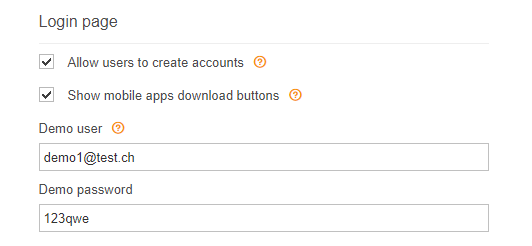
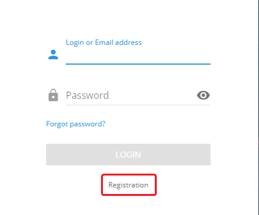
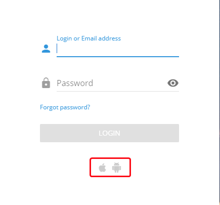

# Login page settings

In addition to the [Branding options](../../settings/branding-options.md) there are other options available for you to customize the login page.

## Enabling user sign-up

If this option is enabled, users can create new accounts from both the UI and mobile apps. A registration button will appear on the UI. If this option is disabled, user creation will only be possible through the Admin Panel or using the Admin Panel API.

## Prompting users to download mobile apps

If this option is enabled, users accessing the web version from a mobile device will be prompted to download the app. An additional button will appear on the login page that leads to a QR code for the app download.

## Demo user account

This option adds the link for easy access of the demo account from the login page. The demo account provides read-only access to visitors. Read more about how to create a [Demo user account](../service-preferences/demo-user-account.md).