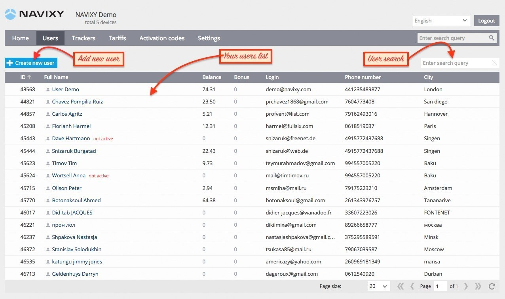
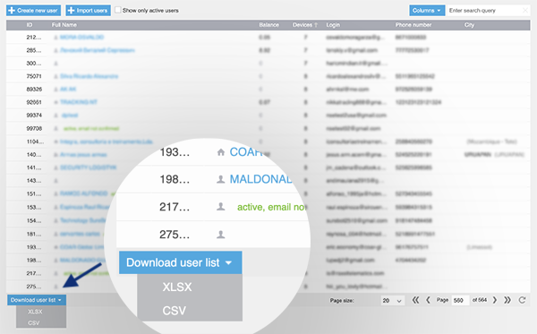

# Users

In the [Users](https://panel.navixy.com/#users) section you can create and manage user accounts. The main screen displays a list of your existing users. You can easily add, delete, or edit accounts. To find a particular user, simply use the search box provided below.

## Export user list

Managing and keeping track of a large number of users on the platform can be challenging. To make this task easier, we have added a function that allows you to download a list of your users in CSV or XLSX format. This feature enables you to quickly obtain a list of all your users, including their email addresses and phone numbers.

The CSV and XLSX formats are convenient for importing the data into CRMs or mailing providers without requiring any additional editing. To export the user list, follow these steps:

1. Go to the Users tab in the admin panel
2. Scroll to the end of the list
3. Click the Download user list button and select the desired format

The download will start automatically, and you can use the exported data as needed.
