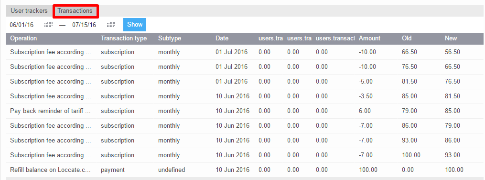
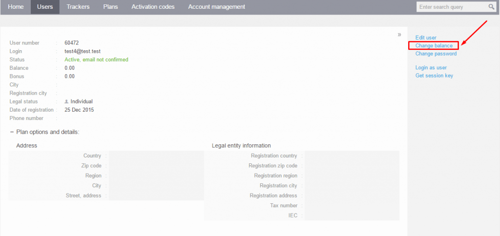
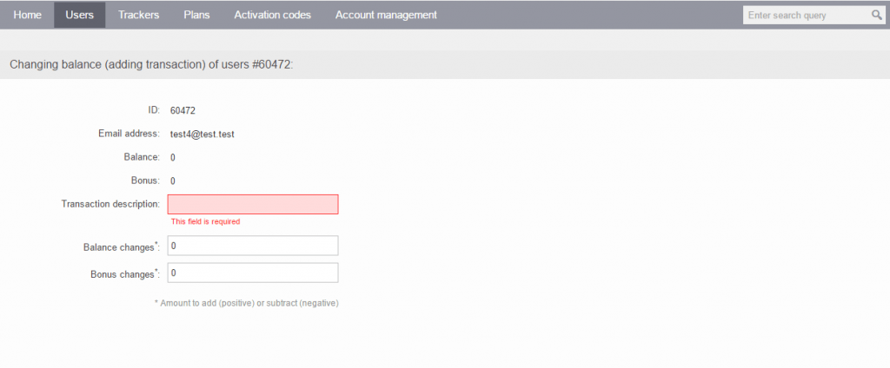

# Billing operations

## List of transactions

The list of transactions allows you to check operations that affect a user's balance. You can access the list of transactions on the "Transactions" tab for a selected user. In this tab, you can see all of the user's billing operations, along with a short description of each transaction, including its type, subtype, date, amount, and old and new balance.

## Changing user balance

To modify users' balances, you can either do it manually from the [Admin Panel](https://panel.navixy.com/#users) or use the Navixy Billing API for automatic updates.

To manually update the balance of a specific user, click on "Change balance" located on the right side of the screen.

You will be redirected to a new page where you can view the current balance of the selected user and enter the following transaction details:

* Transaction description: Although you may use any description, we recommend following a standardized system to avoid confusion.
* Balance changes: The amount of money you wish to add to the current balance.
* Bonus changes: The sum of bonuses to add to the balance of your user.

There are two types of user balances: the real balance and the bonus balance.

* **The real balance** displays the amount of money that a user actually has in their account. The system automatically deducts money from this balance for subscriptions and services as this is set by the user pricing plan.
* **The bonus balance (optional)**, on the other hand, is an additional (optional) balance that allows you to give users gift bonuses that they can use for any services except subscriptions. You may use bonus balance for free SMS (e.g. to send free SMS commands during the IoT device activation) or other services your company provides to customers.

It is worth noting that money is debited from the bonus balance first, followed by the real balance.
