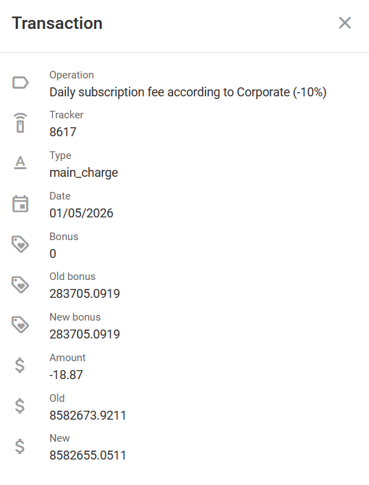
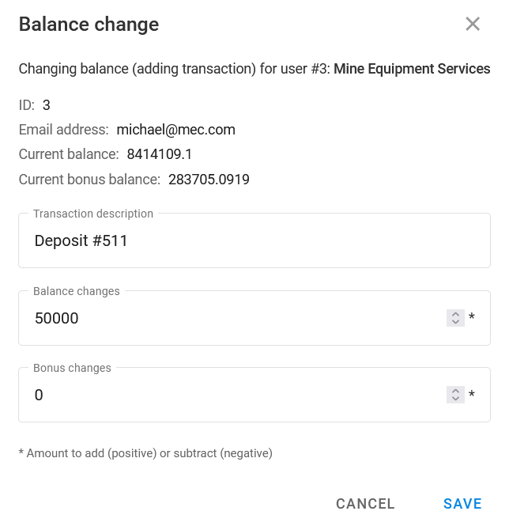

# Billing operations

## User's transactions

The list of transactions allows you to check operations that affect a user's balance. To view it, select a user and click **User's transactions** in the right side panel. This window shows all of the user's billing operations, along with a short description of each transaction.

<figure><figcaption>
User's transactions window
</figcaption></figure>

To access detailed information about a transaction, select it and click  in the rightmost column. This will open the **Transaction** window:

<figure><figcaption>
Transaction details
</figcaption></figure>

## Changing user balance

To manually update the balance of a specific user, click **Change balance** located in [User details](user-details.md).

<figure><figcaption>
Change balance window
</figcaption></figure>

You will be redirected to a new page where you can view the current balance of the selected user and enter the following transaction details:

* **Transaction description**: Although you may use any description, we recommend following a standardized system to avoid confusion.
* **Balance changes**: The amount of money you wish to add to the current balance.
* **Bonus changes**: The sum of bonuses to add to the balance of your user.

There are two types of user balances: the actual balance and the bonus balance.

* The actual balance displays the amount of money that a user actually has in their account. The system automatically deducts money from this balance for subscriptions and services, as this is set by the user's pricing plan.
* The bonus balance is an additional optional balance that allows you to gift users bonuses they can use for any services except subscription, such as SMS (e.g., sending out free SMS commands during the IoT device activation) or other services your company provides to customers.


Money is debited from the bonus balance first, followed by the actual balance.

