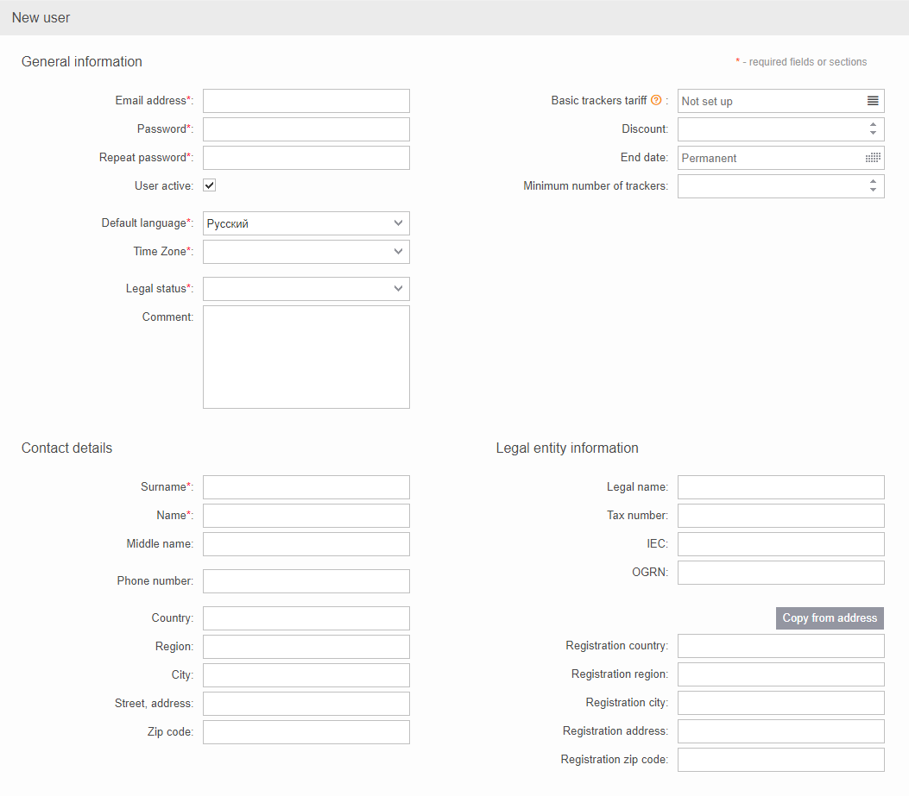
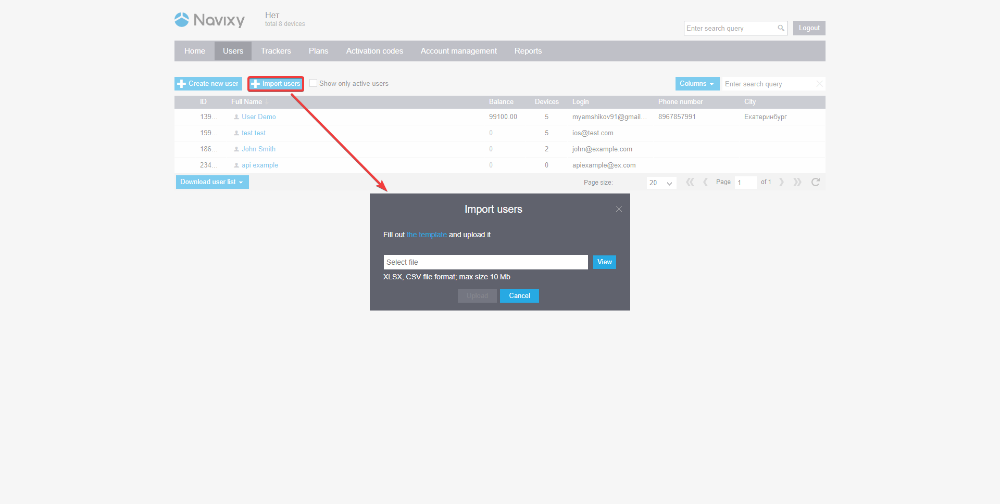

# Create user

## Manually add a user

When adding a new user from the Admin panel, you will need to enter an email address which will be used as their login to the platform and a password. Additionally, you have the option to enter their legal status such as individual, legal entity, sole trader and their contact details, and their legal entity information for business purposes.

## Importing users from Excel file

To add multiple new users at once, you can use the import feature in the [Users](https://panel.navixy.com/#users) tab. Simply click on "Import Users" and upload an Excel file containing the user data. To ensure that the file is properly formatted, you can download a template from the same window or via [this link](https://panel.navixy.com/app/resources/users_import_template_en.xlsx).

