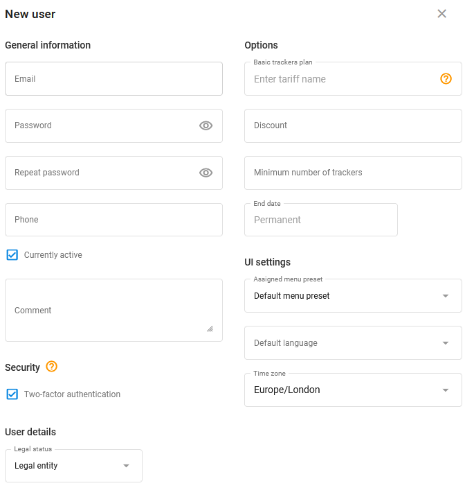

# Creating users

To add a new user to the Admin panel, click  on the Users page. This will open the **New user** window:

<figure><figcaption></figcaption></figure>

<figure><figcaption>
New user window
</figcaption></figure>

Enter an email address that will be used as the user's login to the platform and a password. Depending on the user's legal status (individual, legal entity, or sole trader), the required fields may also include their name, contact details, and legal and postal address.

## How to import user data

To add multiple new users at once, you can use the **Import user data** feature in the [User toolbar](./#user-toolbar). Simply click  and upload an XLSX or CSV file no larger than 10 Mb. To ensure that the file is properly formatted, download a template by clicking the link.

<figure><figcaption>
Importing user data
</figcaption></figure>
