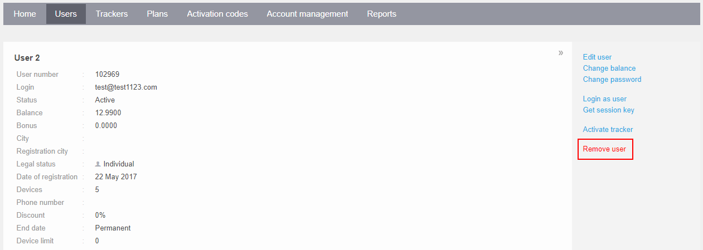

# Delete user

Any user account can be deleted via the Admin Panel by clicking on the "Remove User" button in the user information section.

Please note that this operation is irreversible and will permanently delete the user account and all associated data, including registered devices and sub-users, from the database.

Alternatively, it is possible to delete a user account through the Navixy API by using the [corrupt()](https://app.gitbook.com/s/6dtcPLayxXVB2qaaiuIL/panel-api/resources/user#corrupt) call.
