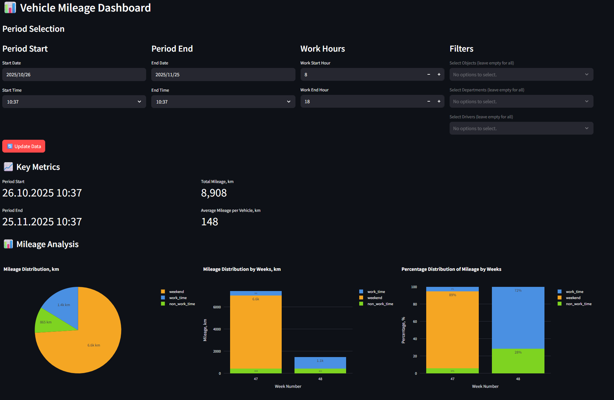

# Data Hub

## Introduction

Navixy's **Data Hub** gives you direct access to your valuable business and telematics data in a unified, SQL-queryable environment. Built on our **Private Telematics Lakehouse (PTL)** database infrastructure, this documentation will help you connect to your data, understand what's available, and start extracting insights right away.

## Your data journey

Every organization collects vast amounts of operational data through the Navixy platform. While the platform's interface provides standard reports and visualizations, your unique business questions often require deeper, more customized analysis.

That's where Data Hub comes in.

We've taken your complete dataset and stored it in our PTL database infrastructure, making it directly accessible through a standard PostgreSQL connection. This opens up new possibilities for analysis, integration, and insight discovery beyond what's possible through standard platform reporting.

### What are the key benefits?

|                                                                                                                             |                                                                                                                                                                                                                                   |                                                                                                                            |
| --------------------------------------------------------------------------------------------------------------------------- | --------------------------------------------------------------------------------------------------------------------------------------------------------------------------------------------------------------------------------- | -------------------------------------------------------------------------------------------------------------------------- |
| 
<strong>Direct SQL access</strong>  Query your data directly via PostgreSQL without API constraints
            | 
<strong>Complete data access</strong>  Work with your full dataset beyond what's available on the Platform
                                                                                                           | 
<strong>Customization</strong>  Build custom analytics, reports, and integrations for your specific scenarios
 |
| 
<strong>Data integration</strong>  Connect with BI and analytics tools for advanced visualization and research
 | 
<strong>Structured data model</strong>  Leverage a well-organized <a href="./#how-your-data-is-organized">multi-layer architecture</a>: <strong>Bronze</strong> → <strong>Silver</strong> → <strong>Gold</strong>
 | 
<strong>Client isolation</strong>  Secure data environment with proper access controls at all levels
          |

### What data is available?

Your **Data Hub** contains two primary types of information:



### **Business data**

Includes approximately 40 tables containing your organization's structural information:

* Users and employees
* Devices and objects
* Vehicles and assignments
* Tasks, zones, and operational records



### **Telematics data**

Contains the continuous stream of information from your tracking devices:

* GPS coordinates and movement data
* Sensor readings
* States



The combination of data types enables both operational reporting and deeper analytical insights.

### How data is organized?


{% column width="58.333333333333336%" %}
We've structured your data using a multi-layered architecture that balances immediate access with analytical performance. Each layer itself is sufficient for different scenarios:

1. [**Bronze layer**](data-hub/schema-overview/bronze-layer.md) (Available now) – A complete dataset , comprising telematics and business data, with minimal transformation, ready for exploration and detailed analysis
2. **Silver layer** (Coming soon) – Cleansed and transformed data optimized for reporting and analytics
3. **Gold layer** (Coming soon) – Business-ready data marts and aggregated metrics for specific use cases


{% column width="41.666666666666664%" %}
<figure><figcaption></figcaption></figure>



### Who can benefit from this platform?

**Data analysts** will appreciate direct SQL access to build custom reports and extract insights that answer specific business questions.

**Data scientists** can leverage the complete dataset for advanced analytics, developing machine learning models and predictive capabilities.

**Developers** gain the ability to create seamless integrations between operational data and other business systems through standard database connections.

## Data Hub demo application

To showcase the analytical potential of your PTL database, we provide a Data Hub Analytics App - a Streamlit-based web interface that illustrates what becomes possible when you have direct access to your complete telematics and business dataset.

This demonstration application serves multiple purposes:

* **Immediate operational value**: Provides real-time dashboards and historical reports for fleet monitoring
* **Analytical showcase**: Demonstrates four levels of capability - real-time operational intelligence, historical pattern analysis, interactive data exploration, and advanced SQL-based analytics
* **Production planning**: Helps you understand your analytical requirements before investing in production BI infrastructure

The application connects directly to your PTL database and shows how organizations can move from standard platform constraints to custom analytics solutions tailored to specific business requirements.


For scalable production analytics, consider integrating dedicated BI tools like Power BI, Apache Superset, or Streamlit directly with your PTL database. If in doubt which solution fits you, see [Selecting BI tools](data-hub/connection-setup/selecting-bi-tools/).


## Support and assistance

For technical support and assistance with Data Hub please contact our support team at [support@navixy.com](mailto:support@navixy.com).
