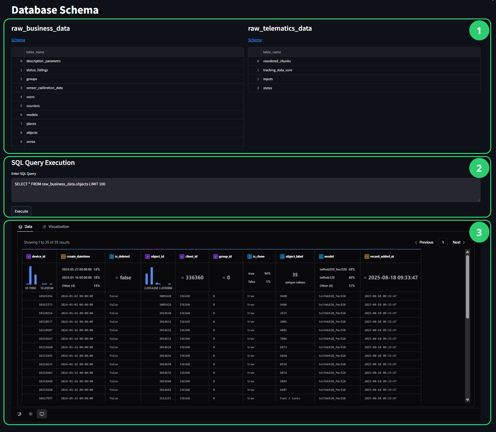

# Custom analysis & SQL Configurator

The **Custom Analysis & SQL Configurator** enables direct database access for custom fleet analysis beyond standard reports. Write SQL queries, explore your complete dataset, and create interactive visualizations in one integrated interface.

## Interface overview

<figure><figcaption></figcaption></figure>

The workspace of **SQL Configurator** consists of 3 main sections:

1. **Database Schema browser** - View table structures and click on schemas for interactive relationship exploration on dbdiagram.io
2. **SQL Query Execution panel** - Write PostgreSQL queries and view results with immediate feedback
3. **Interactive visualization interface** - Transform query results into charts using drag-and-drop functionality

## Your data structure


**Configuration impact**: Your system processes different data categories based on configuration settings. If expected tables seem unavailable, verify your data category settings in [system configuration](../../data-hub/analytic-data-hub-app/settings-and-configuration.md).


Your PTL data appears through two primary schemas organized by source and purpose:

| **raw\_business\_data**                                                                                                                                                                                                                                                                                                                                                                    | **raw\_telematics\_data**                                                                                                                                                                                                                                                                                                           |
| ------------------------------------------------------------------------------------------------------------------------------------------------------------------------------------------------------------------------------------------------------------------------------------------------------------------------------------------------------------------------------------------ | ----------------------------------------------------------------------------------------------------------------------------------------------------------------------------------------------------------------------------------------------------------------------------------------------------------------------------------- |
| <p>Organizational and operational information.<br><br>- <strong>Core entities:</strong> users, devices, objects, vehicles, employees<br>- <strong>Operational data:</strong> tasks, forms, zones, places, garages<br>- <strong>Reference data:</strong> models, entities, status information<br>- <strong>Relationship tables:</strong> vehicle-driver assignments, user-zone mappings</p> | <p>Real-time GPS tracking, sensor readings, and device status<br><br>- <strong>tracking_data_core:</strong> GPS coordinates, speed, altitude, event data<br>- <strong>inputs:</strong> Sensor readings (fuel, temperature, voltage)<br>- <strong>states:</strong> Device status indicators (ignition, doors, operational modes)</p> |


For details on data schemas available in your Data Hub, see [Schema overview](../../data-hub/schema-overview/).


## Creating visualizations from query results

Transform your SQL query results into interactive visualizations through a structured workflow:



Verify data configuration

Check that all required data categories are enabled in your system settings:

1. Navigate to **PTL Configuration** in the left sidebar
2. Verify that needed data categories (**Tracking Data**, **Inputs**, **States**) are enabled for your analysis requirements
3. If changes are needed, update configuration and consider running historical data loading for retroactive application



Develop and execute your query

In the **SQL Query Execution panel**:

1. Write your analysis query using PostgreSQL syntax and the formatting requirements above
2. Include appropriate field names, data conversions, and filtering for your visualization needs
3. Click **Execute** to run your query and generate the dataset
4. Review results to ensure data quality and expected output format



Access visualization interface

Once your query executes successfully:

1. Switch to the **Visualization** tab that appears above your query results
2. Your query results automatically become available as data fields in the visualization interface
3. The interactive chart builder loads with your dataset ready for drag-and-drop visualization creation



Create interactive visualizations

Use the visualization interface to build charts:

1. Drag fields from your query results to chart configuration areas (X-axis, Y-axis, filters, colors)
2. Choose appropriate visualization types based on your data characteristics and analysis objectives
3. Apply filters and styling to refine your visual presentation
4. Export completed visualizations in multiple formats (PNG, SVG, CSV, base64) for sharing and reporting\





**Detailed visualization guide**: Complete step-by-step instructions for chart creation are covered in the [Create custom visualizations](creating-custom-visualizations.md).


## Query development tips

Expand the sections below to discover recommended practices for working with queries in **SQL Configurator**.

<details>

<summary>Data format requirements for telematics analysis</summary>

Your telematics data uses scaled integer storage that requires conversion:

| **Data Type**       | **Storage Format** | **Conversion Required**                                      |
| ------------------- | ------------------ | ------------------------------------------------------------ |
| **GPS coordinates** | Scaled integers    | Divide by 10,000,000 for decimal degrees                     |
| **Speed values**    | Integer format     | Divide by 100 for km/h                                       |
| **Timestamps**      | Two variants       | Use `device_time` for events, `platform_time` for processing |

</details>

<details>

<summary>Performance and data quality optimization</summary>

#### Essential practices for reliable analysis:

* **Apply time-based filtering**: Reduces dataset size and improves response times with `WHERE device_time > now() - INTERVAL '7 days'`
* **Use indexed fields**: Include `device_id` and `device_time` in WHERE clauses for optimal query performance
* **Validate data ranges**: Filter coordinate and speed bounds to identify anomalous readings
* **Verify relationships**: Cross-reference business data relationships to ensure joins produce expected results
* **Manage result sets**: Add appropriate LIMIT clauses for exploratory queries to avoid performance issues
* **Handle data gaps**: Expect normal variations like connectivity gaps during poor signal conditions


**Expected Data Characteristics**: Sensor readings require periodic calibration validation, and recent data may still be processing during real-time analysis.


</details>

<details>

<summary>Cross-schema analysis patterns</summary>

#### Combine organizational and tracking data for comprehensive insights:

* **Business-telematics integration**: Join using `device_id` as primary relationship key between schemas
* **Employee-vehicle correlation**: Connect through objects table relationships for productivity analysis
* **Sensor interpretation**: Use description\_parameters reference table to translate coded values to readable labels
* **Geographic analysis**: Combine tracking coordinates with zone definitions for operational insights

#### **Example: Complete fleet overview with LEFT JOIN**

When analyzing fleet operations, you often need to see all vehicles regardless of their current activity status. This example demonstrates how `LEFT JOIN` preserves complete vehicle records even when tracking data or driver assignments are missing.

```sql
-- Show all vehicles with driver assignments and latest activity
SELECT 
    o.object_label as vehicle_name,
    e.first_name || ' ' || e.last_name as assigned_driver,
    MAX(t.device_time) as last_seen,
    COUNT(t.device_id) as tracking_points_7days
FROM raw_business_data.objects o
LEFT JOIN raw_business_data.employees e ON o.object_id = e.object_id  
LEFT JOIN raw_telematics_data.tracking_data_core t ON o.device_id = t.device_id
    AND t.device_time > CURRENT_DATE - INTERVAL '7 days'
GROUP BY o.object_label, e.first_name, e.last_name
ORDER BY last_seen DESC NULLS LAST;
```

**Key insight**: LEFT JOIN ensures all vehicles appear in results, even without recent tracking or driver assignments.


**Query examples**: Complete use-case-specific patterns are available in the SQL Cookbook\[LINK].


</details>

## Next steps

* [Create custom visualizations](creating-custom-visualizations.md) - Complete process for creating charts and visual analysis
* SQL Cookbook\[LINK] - Advanced query patterns organized by analytical scenario
* [Bronze layer documentation](../../data-hub/schema-overview/bronze-layer.md) - Complete database schema reference and field definitions


**Production analytics**: For enterprise-scale reporting and dashboards, consider dedicated BI tools that connect directly to your PTL instance for enhanced scalability and collaboration features. Learn more in [Selecting BI tools](../../data-hub/connection-setup/selecting-bi-tools/).

