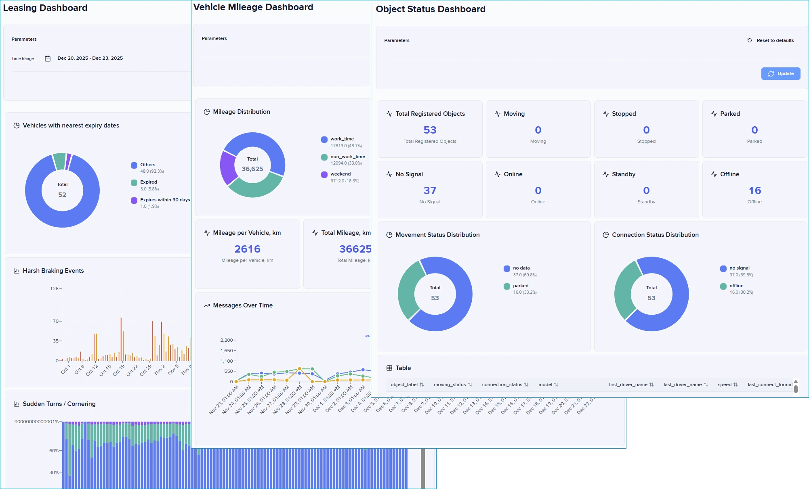

# Dashboard Studio

**IoT Query** gives you direct access to your data. **Dashboard Studio** transforms that access into visual answers through custom dashboards without requiring external business intelligence platforms. Build visualizations that answer your fleet questions directly, with no separate BI tools, no waiting for custom reports, no data exports to spreadsheets.

## What Dashboard Studio offers

Dashboard Studio extends your **IoT Query** access with an advanced analytics layer, delivering fleet-optimized visualizations through a web-based interface. You execute SQL queries against your **IoT Query** database across **Bronze**, **Silver**, and **Gold** layers, and Dashboard Studio renders results as interactive dashboards. The dashboards update automatically as new telemetry data arrives, providing current views of fleet operations without manual data exports.

<figure><figcaption></figcaption></figure>

The visual editor separates dashboard design from SQL knowledge. Advanced users write queries once against the structured data model you already access through SQL clients, while dashboard viewers interact with visualizations without touching code. You arrange panels through drag-and-drop, configure visualizations through form-based interfaces, and organize completed dashboards into logical menu structures.


You can test the Dashboard Studio's functionality on mock data yourselves, <a href="https://demo.tools.iotquery.navixy.com/" class="button primary">Try demo</a>&#x20;


## What are the key benefits?

Dashboard Studio addresses common analytics challenges faced by fleet operations. The platform combines direct database access with visual simplicity, creating an analytics environment that serves both technical and operational users.

* **Self-service analytics:** Build and modify dashboards with minimal SQL knowledge using LLMs and examples from our [Recipe Book](../example-queries/)
* **Fleet-optimized visualizations:** Four chart types designed for telematics and operational workflows
* **Integrated with your data architecture:** Query across Bronze, Silver, and Gold layers based on your analysis needs, from detailed exploration to pre-aggregated metrics
* **No external BI investment:** Analytics layer that uses your existing IoT Query access without a separate BI platform infrastructure

## Core capabilities

Dashboard Studio provides four visualization types designed for fleet analytics workflows:

| Visualization  | Purpose                                            | Key configuration options                                      |
| -------------- | -------------------------------------------------- | -------------------------------------------------------------- |
| **Bar charts** | Categorical comparisons and time-series trends     | Orientation (vertical/horizontal), stacking, grouping, sorting |
| **Pie charts** | Proportional distributions and category breakdowns | Donut style, legend position, colors, labels                   |
| **Tables**     | Detailed data views with full result sets          | Column configuration, pagination, sorting                      |
| **Stat tiles** | Single metric displays for KPIs                    | Number formatting, units, thresholds, color indicators         |

The dashboard editor lets you position panels by dragging them into place. Panels snap to a grid automatically, keeping everything aligned. Group related panels into rows that you can collapse when you need to focus on other parts of your dashboard. Each panel runs its own SQL query against your IoT Query database.

Organize your dashboards into folders and subfolders in the sidebar menu. Group them by team, by topic, or by how often you use them. Rearrange everything by dragging items up and down the list.

## Who is it for

Dashboard Studio addresses the gap between basic reporting and full business intelligence platform investment, providing self-service analytics that scale with team expertise.

* **Data analysts** will find Dashboard Studio effective for creating custom reports that answer business questions without building a separate BI infrastructure. Transform your **IoT Query** SQL access into shareable visual dashboards that update automatically.
* **Operations analysts** can use Dashboard Studio to build dashboards that track indicators across routes, vehicles, and drivers. Create reusable dashboards that update automatically, replacing manual Excel exports and one-off data requests.
* **Fleet managers** get immediate answers about fleet operations through self-service access to visualizations built on your telemetry data, without waiting for scheduled reports or data analyst availability.

<figure><figcaption></figcaption></figure>

## What you need to get started

Dashboard Studio requires active **IoT Query** access to function. The application queries your IoT Query database directly, using the same schemas, tables, and layered architecture you access through SQL clients or other analytics tools.

Contact your service provider to request IoT Query activation if you don't have access yet. The [Getting started with IoT Query](../) guide explains connection requirements and describes available data schemas across the Bronze, Silver, and Gold layers.

### How to access Dashboard Studio

Dashboard Studio operates as a standalone web application that connects to your IoT Query database. Choose between a self-hosted deployment for complete infrastructure control or a Navixy-hosted deployment for integrated platform access.

Both deployment options connect to the same IoT Query database and support identical dashboard functionality.

#### Navixy-hosted

Navixy-hosted deployment embeds Dashboard Studio into your Navixy cabinet through [User Applications](https://app.gitbook.com/s/446mKak1zDrGv70ahuYZ/guide/account/user-applications). Authentication uses the active Navixy session, so you don’t need a separate login.

To begin using the Navixy Dashboard Studio:



**Verify prerequisites**

Ensure that IoT Query is enabled in your environment.



**Add Dashboard Studio as a User Application**

1. In Navixy, go to **Account settings ->**  [**User Applications**](https://app.gitbook.com/s/446mKak1zDrGv70ahuYZ/guide/account/user-applications) and create a new application.
2. Set the application **URL** to [https://dashboard.tools.iotquery.navixy.com/](https://dashboard.tools.iotquery.navixy.com/).
3. Add a descriptive name to your new app.
4. Enable the **session key** authentication parameter.
5. Save.


Dashboard Studio requires IoT Query access to be functional. You can test the integration and the app functionality on mock data by using this link in application URL - [https://demo.tools.iotquery.navixy.com/](https://demo.tools.iotquery.navixy.com/)




**Use Dashboard Studio**

Open the application from the main Navixy sidebar create their own analytics through the visual constructor or [SQL queries](../example-queries/).



Visit the [Dashboard Studio marketplace page](https://marketplace.navixy.com/shop/dashboard-studio/) for access instructions and activation details.


If you need help enabling IoT Query, embedding the dashboard, or configuring curated analytics, our team can support you throughout the setup. Please [contact us](mailto:iotquery@navixy.com) to assist you with the setup process.


#### Open-source

An open-source (self-hosted) approach gives you complete control over the analytics environment. Deploy Dashboard Studio within your own infrastructure, customize authentication integration, and tailor the interface to your operational workflows. This option suits organizations with specific security requirements or custom integration needs.

For details about open-source usage of Dashboard Studio, see [Open-source Studio](open-source-studio.md).\
The application source code and deployment documentation are available through the project repository at [https://github.com/SquareGPS/navixy-iot-query-dashboard](https://github.com/SquareGPS/navixy-iot-query-dashboard).


Use Navixy's [App Connect](https://app.gitbook.com/s/6dtcPLayxXVB2qaaiuIL/user-api/backend-api/resources/commons/user/applications/app-connect) for seamless user authentication!


## Next steps

[Creating dashboards](creating-dashboards.md) - Understand the dashboard editor interface and panel configuration workflow. Learn how to add panels, configure visualizations, and arrange dashboard layouts.

[Writing SQL queries](writing-sql-queries.md) - Review query patterns that work effectively with Dashboard Studio visualizations. Learn query requirements for each visualization type and common data transformations.

[**SQL Recipe Book**](https://claude.ai/chat/764f0b9a-f0fd-4935-b36e-4631e28d74dd) - Explore comprehensive query examples covering frequent fleet analytics tasks, including trips, geofences, events, and vehicle metrics.
