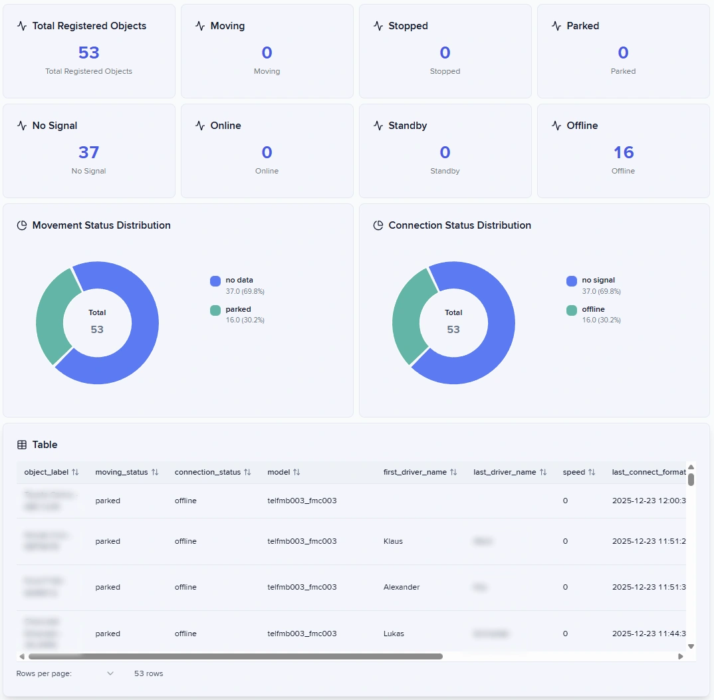

# Creating dashboards

Dashboard Studio transforms IoT Query data into interactive visual reports. You build reports by adding panels to a canvas, writing SQL queries, and organizing the results into a navigable menu structure.

Watch this video to get familiar with the Dashboard Studio app interface and learn how to create your own custom fleet dashboard:


Dashboard Studio app interface, built-in dashboard templates, custom dashboard creation.


### What are reports

Reports contain panels that display data visualizations. Each panel runs a SQL query against your IoT Query database, the same Bronze and Silver layers you access through SQL clients. You arrange panels on a canvas, configure their appearance, and save the complete report to your menu. Dashboard Studio updates panels continuously to reflect current IoT Query data.


### Before you start

Dashboard Studio requires IoT Query access to function. Enable IoT Query before building reports. If you don't have access yet, contact us for activation at [iotquery@navixy.com](mailto:iotquery@navixy.com).&#x20;


### What can you build?

Dashboard Studio provides five visualization types. Each works best for specific analytical questions.

* **Stat tiles** display single key metrics like total distance or vehicle count. Use them to highlight critical numbers at the top of your report.
* **Bar charts** compare values across categories or show trends over time. They work well for comparing fleet utilization across regions or tracking trips per day.
* **Pie charts** show how a total breaks into parts. Use them to display fuel consumption by vehicle type or alert distribution by severity.
* **Tables** present detailed records with multiple attributes. They suit scenarios where users need to see individual records, such as recent alerts with timestamps, vehicle IDs, and messages.
* **Text panels** add explanatory content without querying data. Use them for instructions, section headers, or context using Markdown formatting.

Each visualization type serves specific analytical purposes. Stat tiles work well for KPIs like total fleet size or average utilization. Bar charts help you compare performance across regions or track metrics over time. Pie charts show how totals divide into categories, such as fuel consumption by vehicle type. Tables present detailed records when users need to see multiple attributes together. Text panels add context, instructions, or section headers to your reports.

<figure><figcaption></figcaption></figure>

Query requirements vary by visualization type. Stat tiles need one numeric value. Bar and pie charts require exactly two columns: categories and values. Tables accept any number of columns. Text panels don't query data at all. For complete query requirements and examples, see [Writing SQL queries.](writing-sql-queries.md#how-to-write-sql-for-visualizations)

## Creating reports

Let's walk through the steps from an empty canvas to a structured and informative dashboard.

### How to create your first report



#### Create a new report

<figure><figcaption></figcaption></figure>

* Click  in the lower-left corner of the app and select **New report**.
* Add report **Title**.
* Click **Create report**, a **Get Started** message appears.
* Select **Start with Blank Dashboard** to open an empty canvas.



#### Add a panel

<figure><figcaption></figcaption></figure>

Now you can add your first panel by selecting a visualization type.&#x20;

1. Select  on the editing toolbar.&#x20;
2. Choose **Panel Type** and click **Add panel**. The new panel appears on the canvas.



#### Configure the visual

<figure><figcaption></figcaption></figure>

Now it's time to add the diagramsettings:

1. Hover your mouse over the tile and click .
2. Dashboard Studio opens a panel editor with three tabs:
   1. **Panel Properties** controls the title and type
   2. **SQL Query** defines what data to display
   3. **Visualization Settings** adjust how that data appears
3. Name your panel in **Panel Properties**.
4. Write a **SQL query** that fetches data from IoT Query tables, and test it to verify the results.
5. Adjust the **Visualization Settings**.
6. When satisfied, save the panel to add it to your canvas.



### How to write effective SQL queries

Now that you understand the basic workflow, let's explore SQL queries in detail. Write PostgreSQL queries that reference IoT Query tables in the SQL Query tab. All Bronze and Silver layer tables are available. Test queries before applying them to verify results match your visualization requirements.

<figure><figcaption></figcaption></figure>

Query results must match visualization requirements. The SQL Query tab includes a "Dataset Requirements" section explaining what your chosen visualization expects. Use Common Table Expressions (CTEs) to define parameters at the query start for flexibility. This approach keeps your queries maintainable and allows you to adjust parameters without rewriting complex logic.

For detailed query patterns, examples, and best practices, see [Writing SQL queries](writing-sql-queries.md).

### How to arrange panels on the canvas

Drag panels to reposition them on the canvas. Panels snap to a grid that keeps everything aligned. Resize panels by dragging their corners. The canvas uses a 24-column grid, so panels can occupy 1 to 24 columns in width.

Group related panels into rows for organization. Drag a panel to the canvas edge until a blue line appears, then release to create a new row. Add more panels to the row by dragging them beside existing ones. Collapse rows using the arrow icon at the row's left edge.

### How to customize visualization appearance

Configure visualization-specific options in the **Visualization Settings** tab:

* **Bar charts:** horizontal or vertical orientation
* **Pie charts:** standard or donut modes
* **Tables:** sortable columns, pagination, row highlighting

These settings control how data appears visually but don't change what data is displayed. The available options depend on your panel type.

<figure><figcaption>
Table Visualization Settings example
</figcaption></figure>

### How to organize reports in sections

Dashboard Studio uses a hierarchical menu in the left sidebar. Create sections to group related reports. For example, create a "Fleet Management" section containing reports for vehicle status, utilization, and maintenance.


{% column width="41.66666666666667%" %}
Use the menu editing mode to create sections, drag reports between them, and reorder items. Sections cannot be nested. You have one organizational level: sections contain reports, reports contain panels.


{% column width="58.33333333333333%" %}
<figure><figcaption></figcaption></figure>



### How to save and share reports

Save your report to store it in your menu. Dashboard Studio prompts for a name and section location. Reports save automatically as you work.

Export reports to share them with other users or create backups.&#x20;

To do it:

1. Click  to enter edit mode.
2. Click  to open the Full Schema window.
3. Select **Export**.

Dashboard Studio downloads a JSON file containing the complete report structure, including panels, queries, and visualization settings. You can import an existing schema as well.

<figure><figcaption></figcaption></figure>

## How data refresh works

Reports display current data from IoT Query. Dashboard Studio queries the database each time you open a report. Data freshness matches your IoT Query updates, which happen continuously as devices send readings.

You can refresh reports manually using the **Refresh** button in the top toolbar.&#x20;


Dashboard Studio does not cache results. Each panel runs its query independently when the report loads or refreshes.

