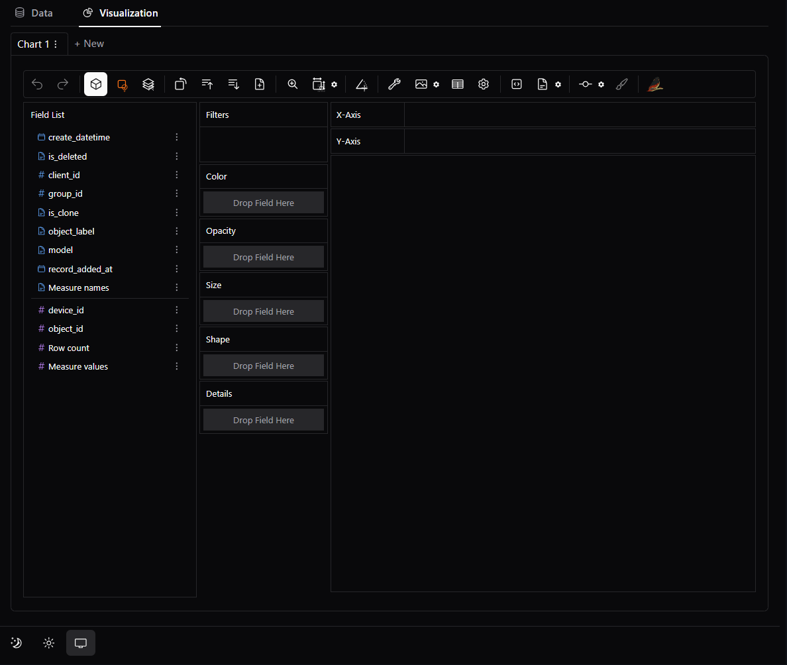

# Creating custom visualizations

Transform SQL query results into interactive charts through drag-and-drop operations. The visualization interface converts raw data into visual insights without coding requirements.

## Accessing the visualization interface

After executing SQL queries, two tabs appear above your results:

| **Tab** | **Purpose** |
| --- | --- |
| **Data** | Review query results in table format |
| **Visualization** | Create interactive charts |

Click **Visualization** to access the chart builder immediately after query execution.

## Interface overview

The visualization workspace consists of three coordinated areas:

**Field List** (left panel):

- **Dimensions** - categorical data with document-style icons
- **Measures** - numerical data with hashtag icons
- **Time** - temporal fields for trend analysis

**Configuration Shelves** (center):

- **X-Axis/Y-Axis** - primary chart structure
- **Rows/Columns** - multi-panel comparisons
- **Filters** - data subsetting
- **Color/Size/Opacity** - visual encoding

**Canvas** (right):

- Real-time chart display with immediate updates
- Interactive zoom, pan, and exploration capabilities

## Essential controls

Expand the section below to see key toolbar buttons that accelerate chart creation.

See main cotrols description

| **Control** | **Function** | **Usage** |
| --- | --- | --- |
| **Aggregation**   | Raw vs. aggregated data display | Turn OFF to see individual records; keep ON to see totals/averages |
| **Mark Types**   | Chart type selection (Bar, Line, etc.) | Switch between bar charts, line graphs, scatter plots based on your analysis needs |
| **Stack Mode**   | Create a Stack chart or Normalize a chart | Stack bars to show totals; normalize to compare percentages across categories |
| **Transpose**   | Switch the x-axis and y-axis of the chart | Flip chart orientation when categories are hard to read or compare |
| **Sort Order**   | Sort in Ascending or Descending Order | Arrange data from highest to lowest values (or vice versa) to identify top performers |
| **Axis Resizing**   | Resize the axes | Zoom into specific value ranges to examine data in more detail |
| **Layout Mode**   | Resize the chart or use the auto-sized chart | Switch to manual sizing when you need larger charts for presentations |
| **Exploration Mode**   | Explore data. You can choose either point mode or brush mode | Select individual data points or drag to select multiple points for detailed analysis |
| **Export**   | Save visualizations (PNG or SVG) | Download chart images for reports, presentations, or documentation |
| **Export as CSV**   | Export visualized data in CSV format | Download the underlying data to analyze in Excel or other spreadsheet programs |
| **Export code**   | Export visualization as code in Python or JSON (Graphic Walker) | Get code to recreate this exact chart in your own Python scripts |

## Building visualizations: sample workflow

**Example scenario**: Analyzing operational data with fields like `category_field`, `performance_metric`, `timestamp`, `region`.

### 1\. Create foundation chart

- Drag categorical field (e.g., `category_field`) → **X-Axis**
- Drag numerical field (e.g., `performance_metric`) → **Y-Axis**
- Interface creates aggregated bar chart automatically

### 2\. Refine visualization type

Click **Mark Types** button for alternatives:

- **Bar charts**: category comparisons
- **Line charts**: trend analysis over time
- **Scatter plots**: correlation analysis (turn off aggregation)

### 3\. Add analytical depth

- Drag additional categorical field → **Color** shelf = visual differentiation
- Drag numerical field → **Size** shelf = proportional representation
- Multiple dimensions reveal hidden relationships

\[SCREENSHOT: Progressive chart building showing basic bar chart evolving into multi-dimensional analysis\]

## Advanced techniques

### Multi-panel analysis

Create comparative views using **Rows/Columns** shelves:

- Drag categorical field → **Rows** = separate panels for each category
- Consistent scales enable direct cross-comparisons
- Reveals patterns obscured in aggregated views

### Filtering and focus

Use **Filters** shelf for targeted analysis:

- Drag categorical fields for subset selection
- Drag numerical fields for range-based filtering
- Multiple filters combine for precise data exploration

### Interactive exploration

- Manual chart resizing using **Resize** button options
- Zoom and pan capabilities for detailed examination
- Export capabilities for sharing and integration

> [!NOTE]
> **Performance tip**: Apply filters before complex visualizations to maintain responsiveness with large datasets.

## Evaluating your results

After creating custom visualizations, assess whether this approach meets your analytical needs:

**Visualization complexity**: Can you create the charts and insights required for your operational decisions?

**Data exploration depth**: Do the interactive capabilities provide sufficient analytical flexibility?

**Sharing and integration**: Do export options support your reporting and collaboration workflows?

**Performance and scalability**: Does the interface handle your data volume and complexity requirements effectively?

## Next steps

Based on your custom visualization experience, you may need more advanced capabilities. For comprehensive guidance on selecting appropriate business intelligence tools that match your specific requirements and organizational needs, see [Selecting BI tools](https://documentation-test-environment.scrollhelp.site/cloud-data-warehouse/Working-version/selecting-bi-tools).