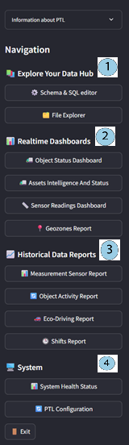

# Getting started with the app

This guide helps you set up access and begin using **Data Hub App** effectively. Follow these steps to connect to your data and start exploring analytical capabilities.

## User Applications setup

Access **Data Hub App** through the **Navixy User Applications** feature for seamless authentication and appropriate access to your organization's **PTL** instance.

Setup process:

1. Navigate to **User Applications** in your Navixy platform
2. Follow the [User Applications documentation](https://docs.navixy.com/user-guide/creating-new-user-applications)
3. The application automatically inherits your session credentials

> [!INFO]
> Multiple users can share access to the same **PTL** instance for collaborative analysis.

Once access is configured, you can proceed to explore the application interface.

## Interface navigation

After successful connection, you'll see the main **Data Hub App** interface with your connection details displayed prominently. The interface is organized into distinct areas that support different analytical workflows.

The **Information about Data Hub** panel displays your connection details, while four main functional areas provide access to different analytical capabilities:

1. **Information about Data Hub panel:** Displays database connection details, credentials, and instance status for reference during analysis sessions
2. **Explore Your Data Hub:** Contains custom analysis tools including Schema & SQL editor for direct database queries and File Explorer for data management tasks
3. **Realtime Dashboards:** Provides pre-built monitoring interfaces for immediate operational insights without requiring technical configuration
4. **Historical Data Reports:** Offers time-based analysis tools with configurable periods for trend identification and strategic planning
5. **System:** Houses monitoring and configuration controls including System Health Status indicators and PTL Configuration management tools

With the interface layout understood, you can now begin your initial setup verification.

## First login checklist

Try thhese steps to ensure that your **Data Hub App** environment is properly configured and ready for analytical work:

1. **Verify connection:** Check **System Health Status** for database and streaming indicators
2. **Check data availability:** Confirm your **PTL** instance has completed initial data loading
3. **Test basic functionality:** Open any dashboard to verify data displays correctly

## Getting immediate value

Following these practices will help you achieve productive results from your first analytical sessions:

- **View live operations:** Open any **Realtime Dashboard** to see your fleet status instantly
- **Focus your analysis:** Use 7-day time filters when exploring historical data
- **Verify system performance:** Check **System Health Status** before starting analysis sessions
- **Work with your team:** Share insights using collaborative access to the same instance

## Where to go next

Based on your specific analytical needs, choose the appropriate section to continue your **Data Hub App** journey:

**For immediate operational needs:** Start with [Real-time Dashboards](https://squaregps.atlassian.net/wiki/spaces/DTP/pages/3358163026/Real-time+dashboards?atlOrigin=eyJpIjoiZjhjOGRhZDVmMDYzNDE5MmIwYTM4OTc3MzYwNTliMTciLCJwIjoiYyJ9) for live fleet monitoring

**For trend analysis:** Explore [Historical Reports](https://squaregps.atlassian.net/wiki/spaces/DTP/pages/3358163039/Historical+reports?atlOrigin=eyJpIjoiNmIyOTc4MjU1ZjE5NDdlOGJlMmJjOThkMWUzMmE2OTIiLCJwIjoiYyJ9) for pattern identification

**For specialized analysis:** Use [Custom Analysis & SQL Configurator](https://squaregps.atlassian.net/wiki/spaces/DTP/pages/3358163065/Custom+analysis+SQL+Configurator?atlOrigin=eyJpIjoiYzkzNTIyZWIzMjYzNDRkZWE3YWVmMmFkZDFkMDc4ZjIiLCJwIjoiYyJ9) when standard reports don't meet your requirements

**For business applications:** Review [Use Cases and Business Applications](https://squaregps.atlassian.net/wiki/spaces/DTP/pages/3358163180/Use+cases+and+business+applications?atlOrigin=eyJpIjoiNjhkN2U4NjQwOTY0NDM2N2JjM2RkMTMzMjU2NzdkNzAiLCJwIjoiYyJ9) to discover analytical opportunities