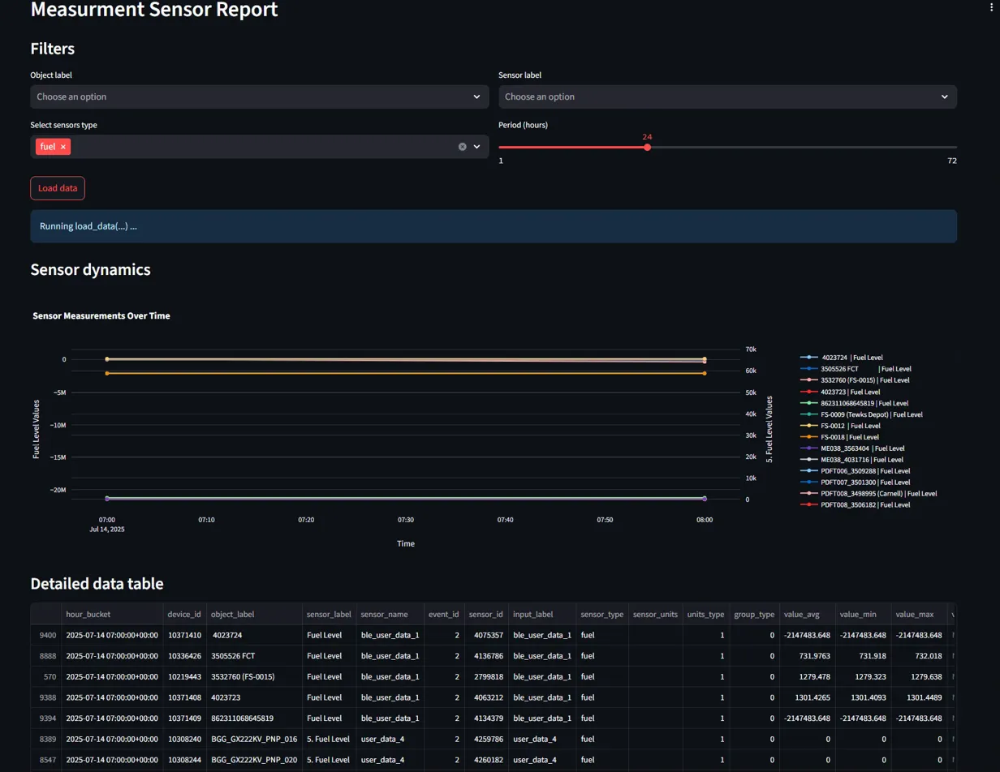
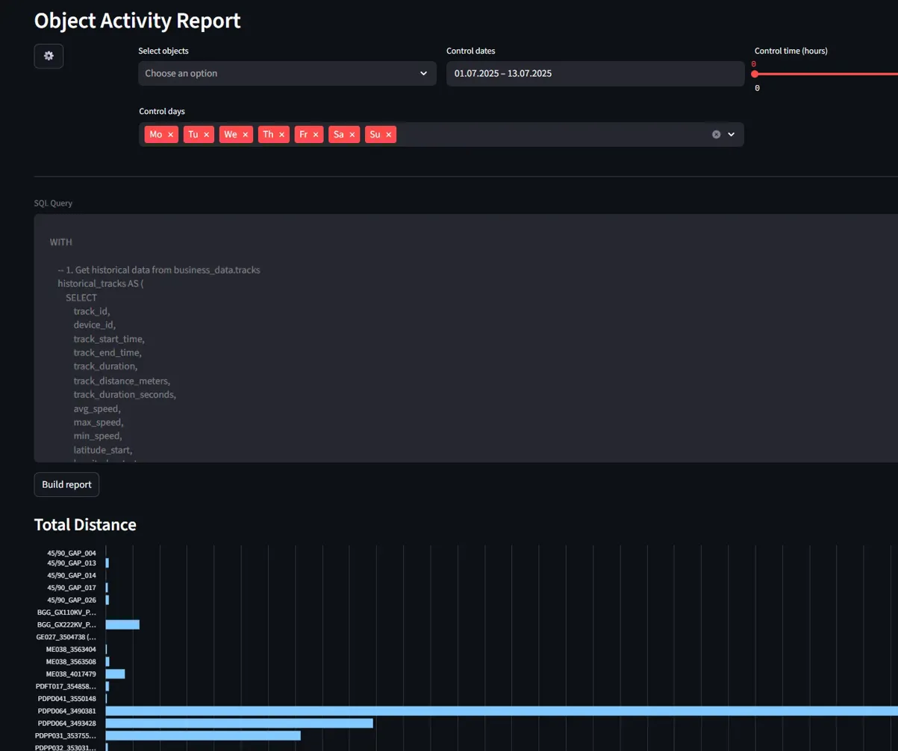
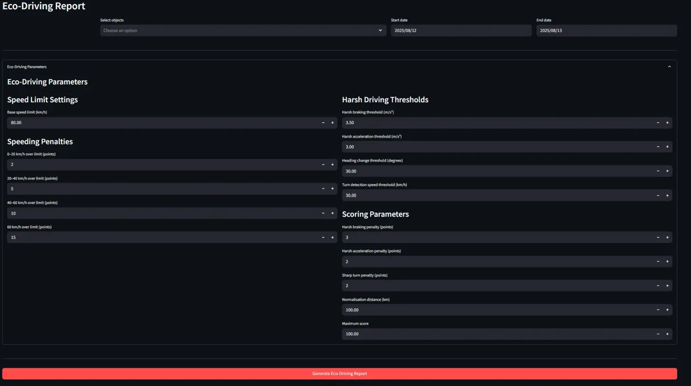
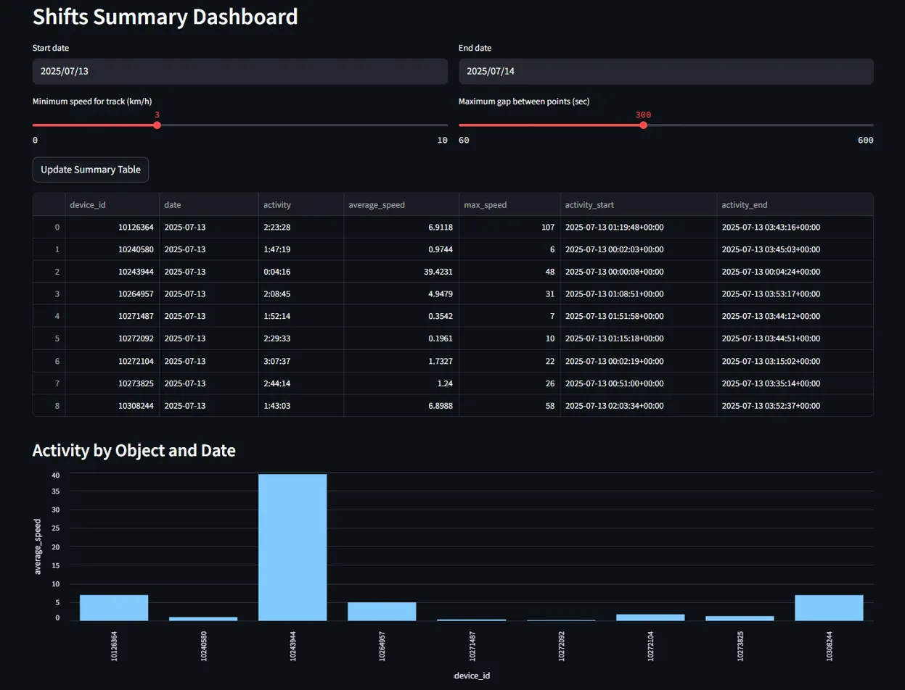

# Historical reports

Historical reports transform your operational data into strategic insights by analyzing patterns, trends, and performance metrics across time periods you define, enabling data-driven decisions for fleet optimization and resource planning.

## Measurement sensor report

**When to use**: Fuel management planning, predictive maintenance scheduling, and identifying equipment performance patterns across multiple vehicles and time periods.

**What data you see**: Time-series sensor measurements aggregated into statistical summaries, showing average, minimum, and maximum values for each sensor across your selected timeframe.

Data processing logic

The system processes sensor data through sophisticated time-series analysis:

* **Time bucketing aggregation**: Raw sensor readings undergo grouping into 15-second intervals using PostgreSQL's `time_bucket` function, creating manageable data points from continuous sensor streams. This approach balances analytical precision with processing efficiency.
* **Multi-sensor correlation**: The query joins `business_data.sensors_data_by_hours` with `raw_business_data.objects` to combine sensor measurements with vehicle context. Each sensor reading includes calibration data when available, converting raw values into meaningful units (liters for fuel, degrees for temperature).
* **Statistical calculation**: For each time bucket, the system calculates average, minimum, and maximum values across all readings. When sensor calibration data is missing or invalid, raw values display without modification to maintain data transparency.
* **Quality filtering**: GPS quality validation ensures only reliable location data (satellites > 3, non-zero coordinates) contributes to sensor context, while invalid readings are excluded from statistical calculations.

All timestamps convert to UTC for consistent analysis regardless of vehicle geographic location, enabling accurate trend identification across different operational zones.

## Object activity report

**When to use**: Route optimization analysis, vehicle utilization assessment, and operational efficiency measurement across defined time periods and fleet segments.

**What data you see**: Comprehensive activity metrics including total distance traveled, trip duration, average speeds, and route patterns for each vehicle in your selected fleet subset.

Data processing logic

This report combines historical and real-time data through complex track generation:

* **Hybrid data sourcing**: The system intelligently selects between `business_data.tracks` for historical analysis and `raw_telematics_data.tracking_data_core` for fresh data, depending on your time range. Periods longer than 12 hours use pre-processed tracks for optimal performance, while recent periods generate tracks from raw telematics data.
* **Track reconstruction**: For real-time analysis, the system applies movement detection algorithms using speed thresholds (≥3 km/h) and time gaps (>300 seconds) to identify distinct trips. Raw coordinate data (stored as integers) converts to decimal degrees through division by 10,000,000 for geographic calculations.
* **Distance calculation**: Geographic distance uses PostGIS functions for precise measurements between consecutive GPS points, while duration calculations derive from timestamp differences between track start and end points.
* **Zone integration**: Geographic analysis cross-references vehicle positions with defined zones using `ST_DWithin` calculations, providing operational context for trip start and end locations.

The underlying query structure adapts based on your selected parameters, optimizing between historical data retrieval and real-time track generation to deliver comprehensive activity analysis.

## Eco-driving report

**When to use**: Driver safety analysis, insurance compliance reporting, and fleet risk management assessment for developing targeted training programs and reducing operational costs.

**What data you see**: Comprehensive driving behavior analysis including speeding violations, harsh driving events, and calculated safety scores for each vehicle, with precise GPS coordinates and timestamps for each incident.

Data processing logic

The eco-driving analysis processes telematics data through sophisticated behavioral pattern detection:

* **Speed violation detection**: The system continuously monitors vehicle speeds against configurable limits, applying grace periods and severity-based penalty structures. Speeding events require sustained violations (>60 seconds) to avoid penalizing brief speed spikes, while penalty points scale from light infractions (0-20 km/h over) to severe violations (>60 km/h over).
* **Harsh driving analysis**: Real-time acceleration calculations analyze speed changes over time intervals to detect harsh braking (>3.5 m/s² deceleration), harsh acceleration (>3.0 m/s²), and sharp turns using heading change thresholds (>30° at speeds >30 km/h). Each event includes GPS coordinates for location-specific pattern analysis.
* **Dynamic scoring system**: Safety scores derive from penalty point accumulation normalized per distance traveled, enabling fair comparison across different route lengths and operational patterns. The system uses configurable maximum scores with distance-based normalization to ensure consistent evaluation.
* **Violation documentation**: Each detected event captures precise GPS coordinates, timestamps, and severity measurements, creating comprehensive incident logs for driver coaching and compliance reporting.

The underlying algorithm processes 15-second aggregated GPS data from `raw_telematics_data.tracking_data_core`, applying haversine distance calculations for accurate geographic analysis and timestamp-based acceleration computations for behavioral assessment.

## Shifts report

**When to use**: Workforce productivity analysis, operational pattern identification, and shift efficiency measurement for fleet scheduling optimization.

**What data you see**: Daily activity summaries showing total operational time, average speeds, maximum speeds, and activity periods for each vehicle, grouped by date and operational shifts.

Data processing logic

The shifts analysis processes raw tracking data through operational pattern detection:

* **Movement classification**: The system analyzes speed readings and time intervals to distinguish between active movement (≥3 km/h), temporary stops, and parked periods. Time gaps exceeding 300 seconds trigger new activity period detection.
* **Shift boundary detection**: Track segmentation uses configurable speed thresholds and time gap analysis to identify distinct operational periods. Each shift period includes precise start and end timestamps with duration calculations.
* **Activity aggregation**: Daily summaries combine all operational periods for each vehicle, calculating total activity duration, average operational speeds, and maximum speeds achieved during active periods.
* **Performance metrics**: The system generates utilization statistics by comparing active operational time against total elapsed time, providing efficiency insights for fleet management decisions.

GPS coordinate validation ensures only quality positioning data contributes to distance and speed calculations, while timestamp standardization to UTC enables consistent shift analysis across different geographic locations.

## Next steps

When historical analysis reveals optimization opportunities or raises specific operational questions, progress to [Custom Analysis & SQL Configurator](../../analytic-data-hub-app/custom-analysis-sql-configurator/) to create tailored investigations that address your unique fleet management requirements and develop custom analytical solutions.
