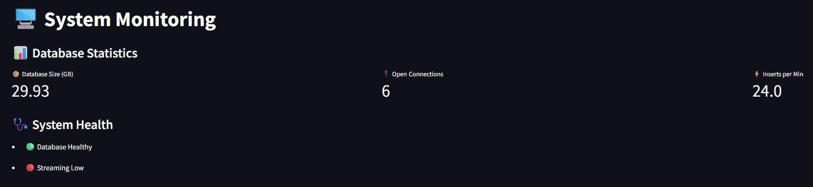

# Settings and configuration

Your **Data Hub App** instance requires management to deliver optimal performance. Configuration controls what data flows into your system and how efficiently your queries perform - like tuning a system to get the clearest analytical signal.

## Understanding your system's health

The **System Health** dashboard shows your instance's current operational status. Check these indicators before making configuration changes.

- **Database Healthy** confirms your data storage systems are responding properly.
- **Streaming Low** indicates current real-time data ingestion rates - this varies naturally based on fleet activity and operational hours.

### Performance metrics explained

- **Database Size** shows current storage utilization and grows as your fleet operates over time.
- **Open Connections** indicates active users or queries accessing your data - higher numbers during business hours are normal.
- **Inserts per Minute** reflects real-time data ingestion from active vehicles - rates vary based on fleet operational patterns.

## Configuring data processing

Your **PTL Configuration** panel shows your **Dealer ID** and **Client ID**, confirming your **Navixy** account context.

### Historical data loading

Use **Run History Load** when automatic synchronization encounters issues or after changing data processing settings. The slider ranges from 7 to 62 days - choose timeframes that represent meaningful operational patterns for your analysis.

Larger timeframes provide more historical context but require more processing time and storage. Processing runs in the background with progress shown in the upper-right corner.

### Optimizing data categories

Control which telematics data types your system processes to balance performance with analytical capabilities.

### Data category selection

- **Tracking Data** (always enabled) provides GPS coordinates, speed, and movement events - the foundation for all fleet analysis.
- **Inputs** captures sensor readings like fuel levels and temperature - enable for maintenance analysis and operational monitoring.
- **States** records device status including ignition and operational modes - useful for detailed activity analysis.

### Choosing your configuration

| **Configuration** | **Query esponse** | **Storage cost** | **Use case** |
| --- | --- | --- | --- |
| Tracking only | Fast (1-2s) | Low | Basic fleet monitoring |
| Tracking + Inputs | Medium (2-5s) | Medium | Maintenance analysis |
| All Categories | Slower (5-10s) | High | Comprehensive analysis |

### Applying changes

Click **Update** to apply data category selections immediately. Changes affect future data processing - consider running historical data loading to apply new settings retroactively across your analytical timeframe.