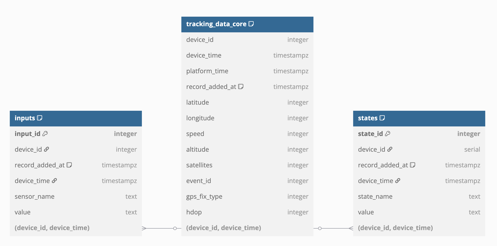
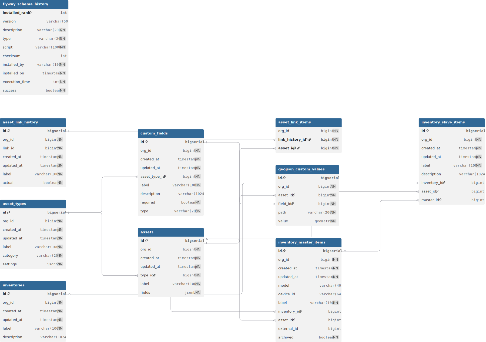

# Bronze layer

The Bronze layer contains three distinct data schemas, each serving different aspects of the telematics and business intelligence platform:

* [**raw\_business\_data**](bronze-layer.md#raw_business_data-structure) - containing tables, attributes and values related to business information, such as vehicles, employees, geofences added by users, etc.
* [**raw\_telematics\_data**](bronze-layer.md#raw_telematics_data-structure) - containing tables, attributes and values related to the telematics data transmitting from devices under monitoring, such as locations, inputs, outputs, events.
* [**repo**](bronze-layer.md#repo-data-structure) - containing tables for asset and inventory management, including configurable asset types, custom fields, asset relationships, and geospatial data for organizational resource tracking.

Each schema is optimized for its specific data domain and access patterns, providing comprehensive coverage of operational, telematic, and asset management needs.

## `raw_business_data` structure

This schema contains 40+ carefully selected tables to cover many business aspects and use cases. These tables represent your core business entities, organizational structure, and operational data.

<figure><figcaption></figcaption></figure>


The interactive diagram of raw\_business\_data schema is available on **dbdiagram.io** - [https://dbdiagram.io/d/V2-business-bronze-67c1961c263d6cf9a0cb4e97](https://dbdiagram.io/d/V2-business-bronze-67c1961c263d6cf9a0cb4e97)


Find raw business data schema details below.

<details>

<summary>raw_business_data schema</summary>

```sql
Table "vehicle_service_tasks" {
  "record_added_at" timestamp [not null]
  "start_mileage" numeric
  "comment" "character varying(255)"
  "status" "character varying(10)" [not null]
  "completion_date" timestamp
  "start_engine_hours" numeric
  "service_task_id" integer [not null]
  "is_notification_push_enabled" boolean [not null]
  "date_notification_interval" interval
  "predicted_datetime" timestamp
  "cost" numeric [not null]
  "mileage_limit" numeric
  "notification_emails" text
  "is_unplanned" boolean [not null]
  "is_repeat" boolean [not null]
  "completion_engine_hours" integer
  "engine_hours_limit" numeric
  "mileage_repeat_interval" integer
  "vehicle_id" integer [not null]
  "engine_hours_notification_interval" integer
  "start_date" timestamp
  "mileage_notification_interval" integer
  "date_repeat_interval" interval
  "description" "character varying(255)"
  "notification_sms_phone_numbers" text
  "end_date" timestamp
  "engine_hours_repeat_interval" integer
  "completion_mileage" integer
}

Table "garages" {
  "record_added_at" timestamp [not null]
  "garage_id" integer [not null]
  "longitude" numeric
  "mechanic_name" "character varying(255)"
  "radius" integer [not null]
  "latitude" numeric
  "organization_label" "character varying(255)"
  "user_id" integer [not null]
  "dispatcher_name" "character varying(255)"
  "address" "character varying(255)"
}

Table "driver_history" {
  "server_datetime" timestamp [not null]
  "address" "character varying(255)"
  "updated_by" integer [not null]
  "object_id" integer
  "longitude" numeric
  "latitude" numeric
  "driver_history_id" integer [not null]
  "hardware_key" "character varying(64)"
  "new_employee_id" integer
  "changed_datetime" timestamp
  "record_added_at" timestamp [not null]
  "old_employee_id" integer
}

Table "departments" {
  "record_added_at" timestamp [not null]
  "department_label" "character varying(255)" [not null]
  "latitude" numeric
  "department_id" integer [not null]
  "address" "character varying(255)"
  "radius" integer [not null]
  "longitude" numeric
  "user_id" integer [not null]
}

Table "checkins" {
  "radius" integer [not null]
  "latitude" numeric [not null]
  "employee_id" integer [not null]
  "longitude" numeric [not null]
  "record_added_at" timestamp [not null]
  "actual_datetime" timestamp [not null]
  "user_id" integer [not null]
  "form_id" integer [not null]
  "address" "character varying(255)"
  "planned_datetime" timestamp [not null]
  "object_id" integer [not null]
  "checkin_id" integer [not null]
  "comment" text
}

Table "statuses" {
  "order_sort" integer [not null]
  "listing_id" integer [not null]
  "color" "character varying(6)" [not null]
  "status_id" integer [not null]
  "status_label" "character varying(200)" [not null]
  "record_added_at" timestamp [not null]
  "is_deleted" boolean [not null]
}

Table "places_linked_entity_fields" {
  "value" bigint [not null]
  "record_added_at" timestamp [not null]
  "place_id" integer [not null]
  "field_id" integer [not null]
}

Table "places_text_fields" {
  "place_id" integer [not null]
  "record_added_at" timestamp [not null]
  "value" text [not null]
  "field_id" integer [not null]
}

Table "users2zones" {
  "zone_id" integer [not null]
  "record_added_at" timestamp [not null]
  "user_id" integer [not null]
}

Table "objects" {
  "record_added_at" timestamp [not null]
  "create_datetime" timestamp [not null]
  "client_id" integer [not null]
  "group_id" integer
  "object_label" "character varying(100)"
  "model" "character varying(64)"
  "is_clone" boolean [not null]
  "is_deleted" boolean [not null]
  "device_id" integer [not null]
  "object_id" integer [not null]
}

Table "device_output_name" {
  "device_id" integer [not null]
  "record_added_at" timestamp [not null]
  "label" "character varying(100)" [not null]
  "number" integer [not null]
}

Table "subusers2trackers" {
  "record_id" integer [not null]
  "record_added_at" timestamp [not null]
  "object_id" integer [not null]
  "subuser_id" integer [not null]
}

Table "geofence_points" {
  "longitude" numeric [not null]
  "number" integer [not null]
  "zone_id" integer [not null]
  "record_added_at" timestamp [not null]
  "latitude" numeric [not null]
}

Table "custom_fields" {
  "record_added_at" timestamp [not null]
  "entity_id" integer [not null]
  "is_required" boolean [not null]
  "custom_field_label" text [not null]
  "parameters" jsonb
  "custom_field_type" integer [not null]
  "description" text
  "custom_field_id" integer [not null]
}

Table "places_decimal_fields" {
  "field_id" integer [not null]
  "record_added_at" timestamp [not null]
  "place_id" integer [not null]
  "value" numeric [not null]
}

Table "task_history" {
  "task_id" integer [not null]
  "activity" integer [not null]
  "task_history_id" integer [not null]
  "record_added_at" timestamp [not null]
  "user_id" integer [not null]
  "event_datetime" timestamp [not null]
  "payload" text
}

Table "tags" {
  "tag_label" "character varying(64)" [not null]
  "color" "character varying(6)"
  "user_id" integer [not null]
  "record_added_at" timestamp [not null]
  "tag_id" integer [not null]
}

Table "places" {
  "description" text
  "custom_fields" jsonb
  "place_id" integer [not null]
  "external_id" "character varying(32)"
  "record_added_at" timestamp [not null]
  "user_id" integer
  "latitude" numeric
  "radius" integer
  "place_label" "character varying(256)"
  "assigned_datetime" timestamp
  "address" "character varying(256)"
  "longitude" numeric
}

Table "status_listings" {
  "user_id" integer [not null]
  "is_supervisor_controlled" boolean [not null]
  "is_deleted" boolean [not null]
  "status_listing_id" integer [not null]
  "is_employee_controlled" boolean [not null]
  "record_added_at" timestamp [not null]
  "status_listing_label" "character varying(200)" [not null]
}

Table "models" {
  "record_added_at" timestamp [not null]
  "model_id" integer [not null]
  "has_battery_level" boolean [not null]
  "alternative_label" "character varying(50)" [not null]
  "vendor" "character varying(30)" [not null]
  "is_clone" boolean
  "has_altitude" boolean [not null]
  "has_phone" boolean [not null]
  "type_output_control" "character varying(30)" [not null]
  "has_gsm_roaming" boolean [not null]
  "has_gsm_level" boolean [not null]
  "model" "character varying(255)" [not null]
  "type_special_control" "character varying(255)" [not null]
  "digital_amount" integer [not null]
  "has_detach_button" boolean [not null]
  "has_gsm_name" boolean [not null]
  "analog_amount" integer [not null]
  "outputs_amount" integer [not null]
}

Table "vehicle_trackers_history" {
  "vehicle_id" integer [not null]
  "record_added_at" timestamp [not null]
  "object_id" integer [not null]
  "changed_datetime" timestamp [not null]
  "vehicle_tracker_history_id" integer [not null]
}

Table "groups" {
  "group_id" integer [not null]
  "group_color" "character varying(6)" [not null]
  "group_label" "character varying(255)" [not null]
  "client_id" integer [not null]
  "record_added_at" timestamp [not null]
}

Table "sensor_description" {
  "record_added_at" timestamp [not null]
  "parameters" jsonb
  "input_id" integer [not null]
  "accuracy" numeric [not null]
  "sensor_units" "character varying(10)"
  "multiplier" doubleprecision [not null]
  "input_label" "character varying(64)"
  "sensor_label" "character varying(100)"
  "units_type" integer [not null]
  "divider" doubleprecision [not null]
  "group_id" integer [not null]
  "sensor_id" integer [not null]
  "device_id" integer [not null]
  "sensor_type" "character varying(45)" [not null]
  "group_type" integer [not null]
}

Table "entities" {
  "entity_label" jsonb
  "record_added_at" timestamp [not null]
  "entity_id" integer [not null]
  "builtin_type" integer [not null]
  "user_id" integer [not null]
}

Table "zones" {
  "address" "character varying(255)"
  "radius" integer [not null]
  "zone_id" integer [not null]
  "circle_center_latitude" numeric [not null]
  "client_id" integer [not null]
  "zone_label" "character varying(100)"
  "color" "character varying(6)" [not null]
  "zone_type" "character varying(20)" [not null]
  "circle_center_longitude" numeric [not null]
  "latitude" numeric [not null]
  "record_added_at" timestamp [not null]
  "longitude" numeric [not null]
}

Table "vehicles" {
  "vehicle_id" integer [not null]
  "payload_length" numeric
  "vin" "character varying(20)"
  "free_insurance_policy_number" "character varying(50)"
  "vehicle_label" "character varying(100)"
  "payload_width" numeric
  "color" "character varying(6)"
  "trailer" "character varying(255)"
  "object_id" integer
  "vehicle_status_id" integer
  "liability_insurance_valid_till" timestamp
  "manufacture_year" integer
  "fuel_grade" "character varying(16)"
  "fuel_cost" numeric
  "fuel_tank_volume" numeric
  "model" "character varying(100)"
  "garage_id" integer
  "payload_height" numeric
  "max_speed" numeric
  "registration_number" "character varying(32)"
  "tyre_size" "character varying(50)"
  "passenger_capacity" integer
  "record_added_at" timestamp [not null]
  "trailer_reg_number" "character varying(32)"
  "free_insurance_valid_till_date" timestamp
  "gross_weight" numeric
  "standard_fuel_consumption" numeric
  "fuel_type" integer
  "payload_weight" numeric
  "additional_info" text
  "vehicle_subtype" "character varying(32)"
  "liability_insurance_policy_number" "character varying(50)"
  "frame_number" "character varying(32)"
  "user_id" integer [not null]
  "vehicle_type" integer [not null]
  "chassis_number" "character varying(32)"
  "tyres_number" integer
  "wheel_arrangement" "character varying(16)"
}

Table "tag_links" {
  "entity_id" integer [not null]
  "record_added_at" timestamp [not null]
  "entity_type" integer [not null]
  "ordinal" integer [not null]
  "tag_id" integer [not null]
}

Table "rules" {
  "rule_id" integer [not null]
  "object_id" integer [not null]
  "parameters" jsonb
  "alert_phone" "character varying(210)" [not null]
  "event_type" "character varying(100)" [not null]
  "client_id" integer [not null]
  "is_push_enabled" boolean [not null]
  "event_comment1" "character varying(255)" [not null]
  "event_label" "character varying(255)" [not null]
  "description" "character varying(255)" [not null]
  "record_added_at" timestamp [not null]
  "alert_sms" text [not null]
  "event_group" integer [not null]
  "created_at" timestamp [not null]
  "maximum" integer [not null]
  "is_deleted" boolean [not null]
  "alert_email" text [not null]
  "event_comment2" "character varying(255)" [not null]
}

Table "status_history" {
  "longitude" numeric
  "new_status_id" integer
  "status_history_id" integer [not null]
  "device_id" integer [not null]
  "updated_by" integer [not null]
  "address" "character varying(255)"
  "latitude" numeric
  "record_added_at" timestamp [not null]
  "server_datetime" timestamp [not null]
  "changed_datetime" timestamp
  "old_status_id" integer
}

Table "rules2zones" {
  "zone_id" integer [not null]
  "record_added_at" timestamp [not null]
  "rule_id" integer [not null]
}

Table "forms" {
  "object_id" integer [not null]
  "description" text
  "form_label" "character varying(255)" [not null]
  "fields" text
  "created_at" timestamp [not null]
  "submission_address" "character varying(255)"
  "submission_latitude" numeric
  "form_id" integer [not null]
  "submission_longitude" numeric
  "is_submission_in_zone" boolean [not null]
  "values" text
  "record_added_at" timestamp [not null]
  "task_id" integer
  "submitted_at" timestamp
}

Table "sensor_calibration_data" {
  "value" numeric [not null]
  "sensor_id" integer [not null]
  "record_added_at" timestamp [not null]
  "volume" numeric [not null]
  "device_id" integer [not null]
  "sensor_calibration_id" bigint [not null]
}

Table "rules2objects" {
  "object_params" jsonb
  "param_group_number" integer [not null]
  "object_id" integer [not null]
  "record_added_at" timestamp [not null]
  "rule_id" integer [not null]
}

Table "tasks" {
  "time_from" timestamp
  "stay_duration_minutes" interval
  "external_id" "character varying(100)"
  "object_id" integer
  "task_type" integer
  "arrival_duration_minutes" interval
  "status" integer
  "arrival_datetime" timestamp
  "record_added_at" timestamp [not null]
  "task_id" integer [not null]
  "user_id" integer
  "status_change_datetime" timestamp
  "order_sort" integer
  "time_to" timestamp
  "max_delay_minuts" integer
  "is_stay_control_enabled" boolean
  "address" "character varying(255)"
  "task_label" "character varying(200)" [not null]
  "longitude" numeric
  "created_by" integer
  "description" text [not null]
  "radius" integer
  "latitude" numeric
  "stay_duration" integer
  "created_at" timestamp [not null]
  "custom_fields" jsonb
  "parent_task_id" integer
}

Table "places_bigint_fields" {
  "field_id" integer [not null]
  "value" bigint [not null]
  "place_id" integer [not null]
  "record_added_at" timestamp [not null]
}

Table "devices" {
  "is_sim_blocked" boolean [not null]
  "device_id" integer [not null]
  "device_imei" "character varying(64)" [not null]
  "network_label" "character varying(50)" [not null]
  "status_listing_id" integer [not null]
  "signal_level" numeric [not null]
  "phone" "character varying(32)" [not null]
  "has_roaming" boolean [not null]
  "created_at" timestamp [not null]
  "owner_id" integer [not null]
  "record_added_at" timestamp [not null]
}

Table "description_parametrs" {
  "description" "character varying(150)"
  "record_added_at" timestamp [not null]
  "type" "character varying(100)" [not null]
  "key" integer [not null]
}

Table "users" {
  "company_label" "character varying(255)" [not null]
  "registration_datetime" timestamp
  "first_name" "character varying(100)" [not null]
  "master_id" integer
  "last_name" "character varying(100)" [not null]
  "birth_date" timestamp
  "timezone_label" "character varying(30)"
  "middle_name" "character varying(100)" [not null]
  "user_id" integer [not null]
  "locale" "character varying(10)" [not null]
  "record_added_at" timestamp [not null]
}

Table "counters" {
  "sensor_id" integer
  "multiplier" numeric [not null]
  "counter_id" integer [not null]
  "device_id" integer [not null]
  "counter_type" integer [not null]
  "record_added_at" timestamp [not null]
}

Table "employees" {
  "driver_license_valid_till" timestamp
  "record_added_at" timestamp [not null]
  "last_name" "character varying(100)"
  "department_id" integer
  "citizen_id_number" "character varying(32)"
  "first_name" "character varying(100)"
  "driver_license_categories" "character varying(32)"
  "user_id" integer [not null]
  "phone_number" "character varying(32)"
  "object_id" integer
  "is_deleted" boolean [not null]
  "driver_license_issue_date" boolean
  "hardware_key" "character varying(64)"
  "middle_name" "character varying(100)"
  "address" "character varying(255)"
  "latitude" numeric
  "employee_id" integer [not null]
  "personnel_number" "character varying(15)"
  "fuel_cost" doubleprecision
  "driver_license_number" "character varying(32)"
  "email" "character varying(100)"
  "fuel_consumption" doubleprecision
  "radius" integer [not null]
  "longitude" numeric
}

Table "places_longtext_fields" {
  "field_id" integer [not null]
  "value" text [not null]
  "record_added_at" timestamp [not null]
  "place_id" integer [not null]
}


Table "raw_device_data" {
  "device_id" integer 
  "device_time" timestamp 
  "created_at" timestamp 
  "gps_fix_type" integer 
  "longitude" integer 
  "latitude" integer 
  "altitude" integer 
  "speed" integer 
  "satellites" integer 
  "hdop" integer [default:"'-1'::integer"]
  "event_id" integer 
  "inputs" jsonb 
  "states" jsonb 
}

// Relationships

Ref: checkins.employee_id > employees.employee_id
Ref: checkins.object_id > objects.object_id
Ref: checkins.form_id > forms.form_id
Ref: counters.sensor_id > sensor_description.sensor_id
Ref: counters.device_id > devices.device_id
Ref: custom_fields.entity_id > entities.entity_id
Ref: departments.department_id < employees.department_id
Ref: departments.user_id > users.user_id
Ref: description_parametrs.key < counters.counter_type
Ref: description_parametrs.key < custom_fields.custom_field_type
Ref: description_parametrs.key < driver_history.updated_by
Ref: description_parametrs.key < entities.builtin_type
Ref: description_parametrs.key < sensor_description.units_type
Ref: description_parametrs.key < status_history.updated_by
Ref: description_parametrs.key < tasks.status
Ref: description_parametrs.key < tasks.created_at
Ref: description_parametrs.key < tasks.task_type
Ref: description_parametrs.key < vehicles.fuel_type
Ref: description_parametrs.key < task_history.activity
Ref: description_parametrs.key < sensor_description.group_type
Ref: device_output_name.device_id > devices.device_id
Ref: devices.status_listing_id > status_listings.status_listing_id
Ref: driver_history.new_employee_id > employees.employee_id
Ref: driver_history.old_employee_id > employees.employee_id
Ref: driver_history.object_id > objects.object_id
Ref: employees.object_id > objects.object_id
Ref: employees.user_id > users.user_id
Ref: entities.user_id > users.user_id
Ref: forms.task_id > tasks.task_id
Ref: forms.object_id > objects.object_id
Ref: tasks.object_id > objects.object_id
Ref: garages.user_id > users.user_id
Ref: groups.client_id <> objects.client_id
Ref: models.model < objects.model
Ref: objects.device_id > devices.device_id
Ref: places.user_id > users.user_id
Ref: places_bigint_fields.field_id > custom_fields.custom_field_id
Ref: places_bigint_fields.place_id > places.place_id
Ref: places_decimal_fields.field_id > custom_fields.custom_field_id
Ref: places_decimal_fields.place_id > places.place_id
Ref: places_linked_entity_fields.field_id > custom_fields.custom_field_id
Ref: places_linked_entity_fields.place_id > places.place_id
Ref: places_longtext_fields.field_id > custom_fields.custom_field_id
Ref: places_longtext_fields.place_id > places.place_id
Ref: places_text_fields.field_id > custom_fields.custom_field_id
Ref: places_text_fields.place_id > places.place_id
Ref: rules.rule_id < rules2zones.rule_id
Ref: rules2objects.object_id > objects.object_id
Ref: rules2objects.object_id > rules.rule_id
Ref: rules2zones.zone_id > zones.zone_id
Ref: sensor_calibration_data.device_id > sensor_description.sensor_id
Ref: sensor_calibration_data.sensor_id > sensor_description.device_id
Ref: sensor_description.device_id > devices.device_id
Ref: status_history.new_status_id > statuses.status_id
Ref: status_history.old_status_id > statuses.status_id
Ref: status_history.device_id > devices.device_id
Ref: status_listings.user_id > users.user_id
Ref: statuses.listing_id > status_listings.status_listing_id
Ref: subusers2trackers.object_id > objects.object_id
Ref: subusers2trackers.subuser_id > users.user_id
Ref: tag_links.tag_id > tags.tag_id
Ref: tags.user_id > users.user_id
Ref: task_history.task_id > tasks.task_id
Ref: task_history.user_id > users.user_id
Ref: tasks.parent_task_id < tasks.task_id
Ref: tasks.user_id > users.user_id
Ref: users.master_id < users.user_id
Ref: users2zones.user_id > users.user_id
Ref: users2zones.zone_id > zones.zone_id
Ref: vehicle_service_tasks.vehicle_id > vehicles.vehicle_id
Ref: vehicle_trackers_history.object_id > objects.object_id
Ref: vehicle_trackers_history.vehicle_id > vehicles.vehicle_id
Ref: vehicles.garage_id > garages.garage_id
Ref: vehicles.object_id > objects.object_id
Ref: vehicles.user_id > users.user_id
Ref: geofence_points.zone_id > zones.zone_id
Ref: "sensor_calibration_data"."value" < "sensor_calibration_data"."device_id"
Ref: "devices"."device_id"	<	"raw_device_data"."device_id"
Ref: users.user_id < devices.owner_id
Ref: users.user_id < objects.client_id
```

</details>

### Update frequency

Data in this schema is synchronized with the core DB. Updates occur incrementally as changes happen in the source MySQL database, typically less than 5 minutes of the source change.

### `description_parametrs`

The system includes reference data to standardize values across the database:

<table><thead><tr><th width="167.1817626953125">Reference type</th><th width="173.9090576171875">Description</th><th>Example values</th></tr></thead><tbody><tr><td>Type definitions</td><td>Standard entity types</td><td><code>vehicle_type: car, truck, bus</code></td></tr><tr><td>Status codes</td><td>Task and system status values</td><td><code>tasks_status: unassigned, assigned, done</code></td></tr><tr><td>Unit definitions</td><td>Measurement units for sensors</td><td><code>units_type: liter, gallon, celsius</code></td></tr><tr><td>Entity classifications</td><td>Business entity categories</td><td><code>entities_type: place, task, customer</code></td></tr></tbody></table>

### Key tables by category

The tables in the `raw_business_data` schema are organized into functional categories for easier navigation. The table below summarizes key tables by their business purpose:

### Database Schema Overview

<table><thead><tr><th width="154.4544677734375">Category</th><th width="211.45458984375">Table name</th><th>Description</th></tr></thead><tbody><tr><td><strong>Organizational structure</strong></td><td><ol><li>users</li><li>departments</li><li>employees</li><li>groups</li></ol></td><td><ol><li>User accounts with profile information</li><li>Departments with geolocation data</li><li>Employee and driver details</li><li>Tracker organization groups</li></ol></td></tr><tr><td><strong>Objects and devices</strong></td><td><ol><li>devices</li><li>models</li><li>bjects</li><li>vehicles</li><li>sensor_description</li></ol></td><td><ol><li>Physical tracking devices</li><li>Device model specifications</li><li>Monitored objects</li><li>Vehicle details and specifications</li><li>Sensor configuration details</li></ol></td></tr><tr><td><strong>Places and zones</strong></td><td><ol><li>places</li><li>zones</li><li>garages</li><li>tags</li></ol></td><td><ol><li>Points of interest with geolocation</li><li>Geofenced monitoring areas</li><li>Vehicle service locations</li><li>Organizational labels</li></ol></td></tr><tr><td><strong>Operational data</strong></td><td><ol><li>tasks</li><li>forms</li><li>checkins</li><li>events</li><li>statuses</li><li>vehicle_service_tasks</li></ol></td><td><ol><li>Task assignments and tracking </li><li>Data collection forms</li><li>Location-based attendance records</li><li>System events and notifications</li><li>Status definitions</li><li>Vehicle maintenance records</li></ol></td></tr></tbody></table>

## `raw_telematics_data` structure

The `raw_telematics_data` schema contains three primary table types that work together to provide comprehensive device data.




The interactive diagram of raw\_telematics\_data schema is available on **dbdiagram.io** - [https://dbdiagram.io/d/v1-schema-telematik-bd-67a0acef263d6cf9a0d8e750](https://dbdiagram.io/d/v1-schema-telematik-bd-67a0acef263d6cf9a0d8e750)


Find raw telematics data schema details below.

<details>

<summary>raw_telematics_data schema</summary>

```sql
Table tracking_data_core {
  device_id integer
  device_time timestampz
  platform_time timestampz
  record_added_at timestampz [default: `now()`]
  latitude integer
  longitude integer
  speed integer
  altitude integer
  satellites integer
  event_id integer
  gps_fix_type integer
  hdop integer

  indexes {(device_id, device_time)}
}

Table inputs {
  input_id integer [primary key]
  device_id integer
  record_added_at timestampz [default: `now()`]
  device_time timestampz 
  sensor_name text
  value text
  
  indexes {(device_id, device_time)}
}

Table states {
  state_id integer [primary key]
  device_id serial
  record_added_at timestampz [default: `now()`]
  device_time timestampz 
  state_name text
  value text
  
  indexes {(device_id, device_time)}
}

Ref: inputs.(device_id, device_time) > tracking_data_core.(device_id, device_time)
Ref: states.(device_id, device_time) > tracking_data_core.(device_id, device_time)

```

</details>

### Key tables by category

Each table serves a specific purpose in capturing different aspects of device information:

#### `tracking_data_core`

**Purpose**: Core location and motion data

| Attribute         | Details                                                                                                                                                                                            |
| ----------------- | -------------------------------------------------------------------------------------------------------------------------------------------------------------------------------------------------- |
| **Key fields**    | `device_id`, `device_time`, `platform_time`, `latitude`, `longitude`, `speed`, `altitude`, `satellites`, `hdop`, `event_id`                                                                        |
| **Indexing**      | Optimized with index on (`device_id`, `device_time`)                                                                                                                                               |
| **Special notes** | <p>Location data (latitude and longitude) uses integer format with 10⁷ precision for optimal TimescaleDB performance<br><br>Speed is also stored in integer, so you need to divide it with 100</p> |

#### `inputs`

**Purpose**: Sensor readings from devices

| Attribute         | Details                                                                            |
| ----------------- | ---------------------------------------------------------------------------------- |
| **Key fields**    | `input_id`, `device_id`, `device_time`, `sensor_name`, `value`                     |
| **Content**       | Analog readings (fuel level, temperature, voltage), calculated values (engine RPM) |
| **Relationships** | Linked to `tracking_data_core` via `device_id` and `device_time`                   |

#### `states`

**Purpose**: Device status indicators and operational modes

| Attribute        | Details                                                                              |
| ---------------- | ------------------------------------------------------------------------------------ |
| **Key Fields**   | `state_id`, `device_id`, `device_time`, `state_name`, `value`                        |
| **Content**      | Operating mode indicators (working, idle, off), component statuses (ignition, doors) |
| **Value Format** | Boolean values (1/0) or specific status codes                                        |

Data in this schema is ingested directly from devices, with minimal latency (typically seconds) . The schema is optimized for time-series data using TimescaleDB for efficient storage and retrieval.

## `repo` data structure

The `repo` schema provides a comprehensive asset management system that enables organizations to define, track, and manage various types of assets with customizable properties and relationships.

<figure><figcaption></figcaption></figure>


The interactive diagram of repo schema is available on **dbdiagram.io** - [https://dbdiagram.io/d/Navixy-Repo-data-schema-68ad788c1e7a611967a0930e](https://dbdiagram.io/d/Navixy-Repo-data-schema-68ad788c1e7a611967a0930e)


Find raw asset data schema details below.

<details>

<summary>repo schema</summary>

```sql
Table asset_types {
  id bigserial [primary key]
  org_id bigint [not null]
  created_at timestamp [not null, default: `CURRENT_TIMESTAMP`]
  updated_at timestamp [not null, default: `CURRENT_TIMESTAMP`]
  label varchar(100) [not null]
  category varchar(20) [not null]
  settings jsonb [not null]
  
  indexes {
    (org_id, id) [unique, name: 'asset_type_idx']
  }
}

Table custom_fields {
  id bigserial [primary key]
  org_id bigint [not null]
  created_at timestamp [not null, default: `CURRENT_TIMESTAMP`]
  updated_at timestamp [not null, default: `CURRENT_TIMESTAMP`]
  asset_type_id bigint [not null]
  label varchar(100) [not null]
  description varchar(1024)
  required boolean [not null]
  type varchar(20) [not null]
  
  indexes {
    (org_id, asset_type_id) [name: 'custom_fields_org_asset_type_idx']
  }
}

Table assets {
  id bigserial [primary key]
  org_id bigint [not null]
  created_at timestamp [not null, default: `CURRENT_TIMESTAMP`]
  updated_at timestamp [not null, default: `CURRENT_TIMESTAMP`]
  type_id bigint [not null]
  label varchar(100) [not null]
  fields jsonb [not null]
  
  indexes {
    (org_id, type_id) [name: 'assets_org_type_idx']
  }
}

Table asset_link_history {
  id bigserial [primary key]
  org_id bigint [not null]
  link_id bigint [not null]
  created_at timestamp [not null, default: `CURRENT_TIMESTAMP`]
  updated_at timestamp [not null, default: `CURRENT_TIMESTAMP`]
  label varchar(100) [not null]
  actual boolean [not null]
  
  indexes {
    (org_id, link_id) [name: 'asset_link_org_link_id_idx']
  }
}

Table asset_link_items {
  org_id bigint [not null]
  link_history_id bigint [not null, pk]
  asset_id bigint [not null, pk]
  
  Note: 'Composite primary key on (link_history_id, asset_id)'
}

Table geojson_custom_values {
  id bigserial [primary key]
  org_id bigint [not null]
  asset_id bigint [not null]
  field_id bigint [not null]
  path varchar(200) [not null, note: 'path to geometry in GeoJSON']
  value geometry [not null, note: 'GEOMETRY(GEOMETRY, 4326)']
  
  indexes {
    (asset_id) [name: 'geojson_values_asset_idx']
    (value) [type: gist, name: 'geojson_values_spatial_idx']
  }
}

Table inventories {
  id bigserial [primary key]
  org_id bigint [not null]
  created_at timestamp [not null, default: `CURRENT_TIMESTAMP`]
  updated_at timestamp [not null, default: `CURRENT_TIMESTAMP`]
  label varchar(100) [not null]
  description varchar(1024)
  
  indexes {
    (org_id) [name: 'inventories_org_idx']
  }
}

Table inventory_master_items {
  id bigserial [primary key]
  org_id bigint [not null]
  created_at timestamp [not null, default: `CURRENT_TIMESTAMP`]
  updated_at timestamp [not null, default: `CURRENT_TIMESTAMP`]
  model varchar(40)
  device_id varchar(64) [unique]
  label varchar(100) [not null]
  inventory_id bigint
  asset_id bigint
  external_id bigint
  archived boolean [not null]
  
  indexes {
    (org_id, inventory_id) [name: 'master_items_org_inventory_idx']
  }
}

Table inventory_slave_items {
  id bigserial [primary key]
  org_id bigint [not null]
  created_at timestamp [not null, default: `CURRENT_TIMESTAMP`]
  updated_at timestamp [not null, default: `CURRENT_TIMESTAMP`]
  label varchar(100) [not null]
  description varchar(1024)
  inventory_id bigint
  asset_id bigint
  master_id bigint
  
  indexes {
    (org_id, inventory_id) [name: 'slave_items_org_inventory_idx']
  }
}

Table flyway_schema_history {
  installed_rank int [primary key]
  version varchar(50)
  description varchar(200) [not null]
  type varchar(20) [not null]
  script varchar(1000) [not null]
  checksum int
  installed_by varchar(100) [not null]
  installed_on timestamp [not null, default: `now()`]
  execution_time int [not null]
  success boolean [not null]
  
  indexes {
    (success) [name: 'flyway_schema_history_s_idx']
  }
}

// Relationships
Ref: custom_fields.asset_type_id > asset_types.id
Ref: assets.type_id > asset_types.id
Ref: asset_link_items.link_history_id > asset_link_history.id
Ref: asset_link_items.asset_id > assets.id
Ref: geojson_custom_values.asset_id > assets.id
Ref: geojson_custom_values.field_id > custom_fields.id
Ref: inventory_master_items.inventory_id > inventories.id
Ref: inventory_master_items.asset_id > assets.id
Ref: inventory_slave_items.inventory_id > inventories.id
Ref: inventory_slave_items.asset_id > assets.id
Ref: inventory_slave_items.master_id > inventory_master_items.id
```

</details>

### Update frequency

Data in this schema is synchronized with operational asset management systems. Updates occur as asset configurations change, new assets are registered, or relationships are modified, typically within minutes of source changes.

### Key tables by category

The tables in the `repo` schema are organized into functional categories for managing different aspects of asset operations:

<table><thead><tr><th width="203.54541015625">Category</th><th width="230.1817626953125">Table name</th><th>Description</th></tr></thead><tbody><tr><td><strong>Asset dDefinition</strong></td><td><ol><li>asset_types</li><li>custom_fields</li><li>assets</li></ol></td><td><ol><li>Configurable asset categories and types</li><li>Field definitions for each asset type</li><li>Individual asset instances with properties</li></ol></td></tr><tr><td><strong>Asset relationships</strong></td><td><ol><li>asset_link_history</li><li>asset_link_items</li></ol></td><td><ol><li>Historical record of asset relationships</li><li>Junction table linking assets together</li></ol></td></tr><tr><td><strong>Geospatial data</strong></td><td>geojson_custom_values</td><td>Geographic information for asset locations</td></tr><tr><td><strong>Inventory management</strong></td><td><ol><li>inventories</li><li>inventory_master_items</li><li>inventory_slave_items</li></ol></td><td><ol><li>Logical groupings of inventory items</li><li>Primary inventory items with device integration</li><li>Sub-components and related inventory items</li></ol></td></tr><tr><td><strong>System management</strong></td><td>flyway_schema_history</td><td>Database migration tracking</td></tr></tbody></table>

Each table serves a specific purpose in the asset management ecosystem:

**`asset_types` and `custom_fields`**

**Purpose**: Define flexible asset schemas

<table><thead><tr><th width="200.36376953125">Attribute</th><th>Details</th></tr></thead><tbody><tr><td><strong>Key fields</strong></td><td><ul><li><code>asset_types</code>: <code>id</code>, <code>org_id</code>, <code>label</code>, <code>category</code>, <code>settings</code></li><li><code>custom_fields</code>: <code>asset_type_id</code>, <code>label</code>, <code>type</code>, <code>required</code></li></ul></td></tr><tr><td><strong>Flexibility</strong></td><td>Organizations can define custom asset types with configurable field schemas</td></tr><tr><td><strong>Data storage</strong></td><td>Asset type settings stored as JSONB for maximum configurability</td></tr></tbody></table>

**`assets`**

**Purpose**: Store actual asset instances

<table><thead><tr><th width="200.3636474609375">Attribute</th><th>Details</th></tr></thead><tbody><tr><td><strong>Key Fields</strong></td><td><code>id</code>, <code>org_id</code>, <code>type_id</code>, <code>label</code>, <code>fields</code></td></tr><tr><td><strong>Data Model</strong></td><td>Asset-specific data stored in JSONB <code>fields</code> column based on custom field definitions</td></tr><tr><td><strong>Relationships</strong></td><td>Links to asset types for schema validation and field interpretation</td></tr></tbody></table>

**`asset_link_history` and `asset_link_items`**

**Purpose**: Track relationships between assets over time

<table><thead><tr><th width="200.3636474609375">Attribute</th><th>Details</th></tr></thead><tbody><tr><td><strong>Versioning</strong></td><td>Historical tracking of asset relationship changes</td></tr><tr><td><strong>Junction model</strong></td><td>Many-to-many relationships through <code>asset_link_items</code></td></tr><tr><td><strong>Audit trail</strong></td><td>Complete history of when relationships were created, modified, or dissolved</td></tr></tbody></table>

**`geojson_custom_values`**

**Purpose**: Geographic asset data management

<table><thead><tr><th width="200.3636474609375">Attribute</th><th>Details</th></tr></thead><tbody><tr><td><strong>Spatial support</strong></td><td>PostGIS geometry storage with SRID 4326 (WGS84)</td></tr><tr><td><strong>GeoJSON integration</strong></td><td>Path-based reference to specific geometry within GeoJSON structures</td></tr><tr><td><strong>Indexing</strong></td><td>Spatial indexing for efficient geographic queries</td></tr></tbody></table>

**`inventory_master_items` and `inventory_slave_items`**

**Purpose**: Hierarchical inventory organization

<table><thead><tr><th width="200.3636474609375">Attribute</th><th>Details</th></tr></thead><tbody><tr><td><strong>Device Integration</strong></td><td>Master items can reference physical devices via <code>device_id</code></td></tr><tr><td><strong>Hierarchical Structure</strong></td><td>Slave items can belong to master items creating parent-child relationships</td></tr><tr><td><strong>Asset Linkage</strong></td><td>Both item types can reference assets for additional metadata</td></tr></tbody></table>

### Schema-specific tips

#### Data validation

The schema enforces organizational data integrity through:

* **Multi-tenancy**: All core tables include `org_id` for data isolation
* **Referential integrity**: Foreign key constraints maintain relationship consistency
* **Temporal tracking**: Created/updated timestamps on all operational tables
* **Flexible validation**: JSONB storage allows for schema evolution while maintaining structure

#### Query optimization

Tables are optimized for asset management operations:

* **Composite indexes** on (`org_id`, related\_id) for tenant-specific queries
* **Spatial indexing** on geographic data for location-based searches
* **Time-based indexes** for audit trail and change tracking queries
* **Unique constraints** where business logic requires data uniqueness

## Additional information

### Data validation

The database enforces data integrity through multiple mechanisms:

* **CHECK constraints** validate that values fall within acceptable ranges
* **Foreign keys** ensure relationships between tables remain consistent
* **NOT NULL constraints** guarantee that required fields always have values
* **DEFAULT values** provide fallback when data isn't explicitly provided

### Query optimization

Tables are organized with specific indexing strategies:

* All tables include **time-based indexes** on `record_added_at`
* Foreign key columns have dedicated indexes for join performance
* Frequently used column combinations have **composite indexes**
* TimescaleDB provides specialized indexes for time-series queries
