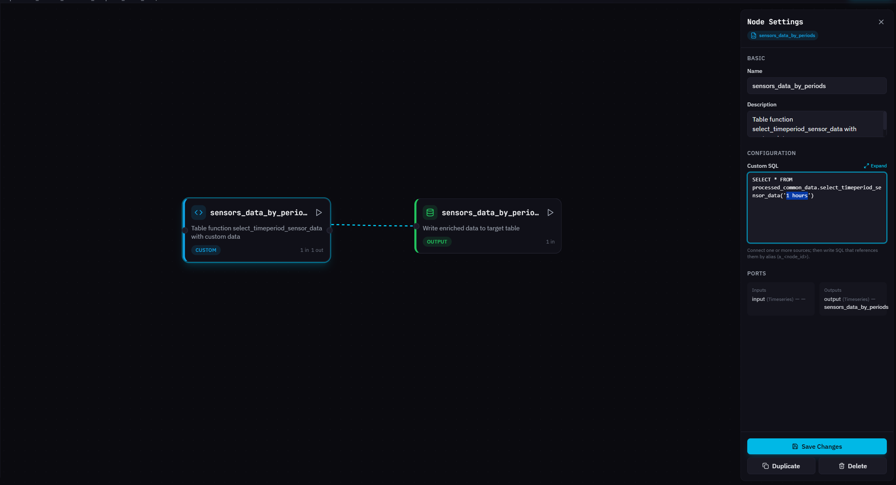

# Sensor data aggregation

The Sensor data aggregation transformation resamples raw sensor readings into time-bucketed summary records. Each row in `processed_common_data.sensors_data_by_hours` represents one sensor on one device for one bucket: the average, minimum, and maximum decoded value, and, for fuel sensors, the calibrated volume at each of those points.

The built-in transformation runs every hour and aggregates the last hour of raw sensor data from `raw_telematics_data.inputs` into one-hour buckets. Each run appends a fresh set of hourly records to the table.


Data in this table may be up to 1 hour old, reflecting the most recently completed run.\
All timestamps are stored in UTC.\
Only numeric sensor values participate in aggregation. Text states, negative numbers, and scientific notation are filtered out at the source.


### Output table: processed\_common\_data.sensors\_data\_by\_hours

Each row represents one bucket of aggregated readings for one sensor on one device. In the built-in transformation, every bucket spans one hour. The natural key is `hour_bucket`, `device_id`, `sensor_name`, and `event_id`.

<table><thead><tr><th width="245">Field</th><th width="115">Type</th><th>Description</th></tr></thead><tbody><tr><td><code>hour_bucket</code></td><td>timestamp</td><td>Start of the time bucket the row aggregates. In the built-in transformation, always aligned to the hour boundary in UTC. In custom transformations with a different bucket size, this is the start of the bucket at the chosen granularity (for example, the start of a 5-minute window).</td></tr><tr><td><code>device_id</code></td><td>integer</td><td>Device identifier. To get the object label without row multiplication, join to <code>raw_business_data.objects</code> on <code>device_id</code> where <code>is_deleted = false</code>.</td></tr><tr><td><code>sensor_name</code></td><td>text</td><td>Raw input identifier from <code>raw_telematics_data.inputs</code>. Matches <code>sensor_description.input_label</code> when a sensor is configured.</td></tr><tr><td><code>event_id</code></td><td>integer</td><td>Event type identifier for the sensor reading.</td></tr><tr><td><code>sensor_id</code></td><td>integer</td><td>Sensor entity identifier from <code>raw_business_data.sensor_description</code>. Null if the sensor is not configured.</td></tr><tr><td><code>input_label</code></td><td>text</td><td>Configured input label from <code>sensor_description</code>. Matches <code>sensor_name</code> when present.</td></tr><tr><td><code>sensor_label</code></td><td>text</td><td>Human-readable sensor name set by the user.</td></tr><tr><td><code>sensor_type</code></td><td>text</td><td>Sensor type, for example <code>fuel_level</code>, <code>temperature</code>, <code>ignition</code>.</td></tr><tr><td><code>sensor_units</code></td><td>text</td><td>User-entered unit string when <code>units_type</code> is set to custom. Empty otherwise.</td></tr><tr><td><code>units_type</code></td><td>integer</td><td>Numeric code for the unit category. Resolved to a human-readable string in <code>sensor_description_units_type</code>.</td></tr><tr><td><code>group_type</code></td><td>integer</td><td>Aggregation rule code for grouped sensors: 0 for sum, 1 for average. Resolved in <code>sensor_description_group_type</code>.</td></tr><tr><td><code>value_avg</code></td><td>float</td><td>Average of the decoded sensor value across all readings in the bucket.</td></tr><tr><td><code>value_min</code></td><td>float</td><td>Minimum decoded value in the bucket.</td></tr><tr><td><code>value_max</code></td><td>float</td><td>Maximum decoded value in the bucket.</td></tr><tr><td><code>val_low_avg</code>, <code>val_high_avg</code>, <code>vol_low_avg</code>, <code>vol_high_avg</code></td><td>numeric</td><td>Calibration breakpoints used when interpolating <code>calibrated_volume_avg</code>. Fuel sensors only; null otherwise.</td></tr><tr><td><code>calibrated_volume_avg</code></td><td>numeric</td><td>Calibrated volume corresponding to <code>value_avg</code>, computed by linear interpolation between the breakpoints. For non-fuel sensors, this equals <code>value_avg</code>.</td></tr><tr><td><code>val_low_min</code>, <code>val_high_min</code>, <code>vol_low_min</code>, <code>vol_high_min</code>, <code>calibrated_volume_min</code></td><td>numeric</td><td>Calibration breakpoints and interpolated volume for <code>value_min</code>.</td></tr><tr><td><code>val_low_max</code>, <code>val_high_max</code>, <code>vol_low_max</code>, <code>vol_high_max</code>, <code>calibrated_volume_max</code></td><td>numeric</td><td>Calibration breakpoints and interpolated volume for <code>value_max</code>.</td></tr><tr><td><code>object_label</code></td><td>text</td><td>Object label from <code>raw_business_data.objects</code>. May appear multiple times for the same bucket if a device was reassigned between objects historically.</td></tr><tr><td><code>sensor_description_units_type</code></td><td>text</td><td>Human-readable unit category resolved from <code>units_type</code>.</td></tr><tr><td><code>sensor_description_group_type</code></td><td>text</td><td>Human-readable grouping rule resolved from <code>group_type</code>.</td></tr><tr><td><code>sensor_units_final</code></td><td>text</td><td>The unit string to display. Equals <code>sensor_units</code> when set, otherwise falls back to <code>sensor_description_units_type</code>.</td></tr><tr><td><code>value_title</code></td><td>text</td><td>Human-readable label for discrete sensors, looked up from <code>parameters.value_titles</code> using <code>value_max</code> as the key. Null for measuring sensors.</td></tr></tbody></table>

The examples below show common query patterns. The first returns hourly aggregates for the last 7 days. The second joins to `raw_business_data.objects` to include the object label without row multiplication. The third focuses on fuel sensors and uses the calibrated volume columns.




```sql
SELECT
    device_id,
    hour_bucket,
    sensor_label,
    sensor_type,
    value_avg,
    value_min,
    value_max,
    sensor_units_final
FROM processed_common_data.sensors_data_by_hours
WHERE hour_bucket >= CURRENT_DATE - INTERVAL '7 days'
ORDER BY device_id, hour_bucket, sensor_label;
```





```sql
SELECT
    s.device_id,
    o.object_label,
    s.hour_bucket,
    s.sensor_label,
    s.value_avg,
    s.sensor_units_final
FROM processed_common_data.sensors_data_by_hours s
LEFT JOIN raw_business_data.objects o
    ON o.device_id = s.device_id
   AND o.is_deleted = false
WHERE s.hour_bucket >= CURRENT_DATE - INTERVAL '7 days'
ORDER BY s.device_id, s.hour_bucket, s.sensor_label;
```





```sql
SELECT
    device_id,
    hour_bucket,
    sensor_label,
    value_avg AS raw_avg,
    calibrated_volume_avg AS volume_avg_litres,
    calibrated_volume_min AS volume_min_litres,
    calibrated_volume_max AS volume_max_litres
FROM processed_common_data.sensors_data_by_hours
WHERE sensor_type = 'fuel_level'
  AND hour_bucket >= CURRENT_DATE - INTERVAL '24 hours'
ORDER BY device_id, hour_bucket;
```




### How sensor aggregates are built

A row in this table is not a raw device reading, it is a derived entity assembled from many individual sensor readings. The transformation works through the raw data in stages: deciding which readings are usable, joining sensor configuration, decoding the value, bucketing into time windows, aggregating, applying fuel calibration, and finally enriching with human-readable labels. Understanding this process helps you interpret results correctly and recognize when the default behavior needs adjusting for your use case.

Here are the steps of the algorithm that forms a sensor aggregate row:



### **Reading and filtering raw inputs**

The transformation reads the most recent slice of data from `raw_telematics_data.inputs`. The slice length matches the configured interval: the built-in run reads the last hour; a custom run with a 5-minute interval reads the last 5 minutes. Readings are filtered before any further processing:

* Only values matching the regular expression `^[0-9]+\.?[0-9]*$` pass through. This accepts non-negative integers and decimals.
* Text states, negative numbers, scientific notation, and null values are excluded.
* Sensors that emit only non-numeric data do not appear in the output table.

The filter operates on the raw `value` column in `inputs`, before any decoding is applied.



### **Joining sensor configuration**

Each remaining reading is matched against `raw_business_data.sensor_description` using a `LEFT JOIN` on `device_id` and `input_label = sensor_name`. The join brings in `sensor_id`, `sensor_label`, `sensor_type`, `units_type`, `group_type`, `divider`, `multiplier`, `calibration_data`, and `parameters`. Because the join is left-sided, readings from unconfigured sensors still pass through with sensor metadata as null.&#x20;



### **Decoding the raw value**

Each reading is converted from its stored representation to a usable numeric value. The decoding rule comes from `sensor_description.parameters.calc_method`:

* `bit_index` extracts a single bit from the integer value using bit-shift and mask: `((raw_value::bigint >> bit_index) & 1)`. Used for status flags packed into integers.
* `identity` uses the raw numeric value unchanged.
* Otherwise, the function applies `(raw_value / divider) * multiplier`, which is the standard formula for measuring sensors. A null divider triggers a `COALESCE` fallback to the raw value.&#x20;



### **Bucketing and aggregating**

Decoded values are grouped into time buckets by truncating `device_time` to the bucket boundary. Within each bucket, the function computes `AVG`, `MIN`, and `MAX` of the decoded value. Grouping also includes sensor metadata columns, so aggregates are calculated per sensor per device per bucket.

In the built-in transformation, the bucket is one hour. Custom transformations can use any positive interval. See [Customizing the transformation](https://claude.ai/chat/32cacafe-fe34-476d-b7d0-c93b4ce82da6#customizing-the-transformation) below.&#x20;



### **Calibration for fuel sensors**

Sensors with a populated `calibration_data` array (typically fuel level sensors) get linear interpolation applied to each aggregate. For `value_avg`, `value_min`, and `value_max` separately, the function finds the calibration breakpoints just below and just above the value, then interpolates linearly to produce `calibrated_volume_avg`, `calibrated_volume_min`, and `calibrated_volume_max`. For sensors without calibration data, the calibrated volumes equal the raw aggregates.

The breakpoint columns (`val_low_*`, `val_high_*`, `vol_low_*`, `vol_high_*`) are preserved in the output for transparency.



### **Enrichment with labels**

The aggregated rows are joined with `raw_business_data.objects` on `device_id` to add `object_label`, and with `raw_business_data.description_parameters` twice to resolve `units_type` and `group_type` into human-readable description strings. The function also computes `sensor_units_final`, which prefers the user-entered `sensor_units` and falls back to the description string.

For discrete sensors with a `parameters.value_titles` mapping, the function looks up the human-readable title corresponding to `value_max` and returns it as `value_title`. Measuring sensors have `value_title` set to null.&#x20;



The following two reference sections contain the configurable interval parameter and the decoding rules that the transformation applies internally.

<details>

<summary>Interval parameter</summary>

The transformation is driven by a single parameter, `p_interval`, that controls both the bucket size and the lookback window. The two are always equal: a run with `p_interval = '5 minutes'` reads the last 5 minutes of raw data and produces 5-minute buckets.

| Setting          | Built-in transformation                 | Custom transformation                                                |
| ---------------- | --------------------------------------- | -------------------------------------------------------------------- |
| Bucket size      | 1 hour                                  | Any positive interval set in the Custom SQL node                     |
| Lookback window  | 1 hour                                  | Equal to the bucket size                                             |
| Schedule cadence | Every hour (matched to the bucket size) | Match to the chosen bucket size for continuous coverage without gaps |

See [Customizing the transformation](sensor-data-aggregation.md#customizing-the-transformation) for instructions on how to change the interval.

</details>

<details>

<summary>Value decoding rules</summary>

Raw sensor values arrive as text in `raw_telematics_data.inputs.value`. The transformation applies a decoding rule based on each sensor's configuration before aggregating.

| `calc_method`    | Decoding behavior                                                                                             |
| ---------------- | ------------------------------------------------------------------------------------------------------------- |
| `bit_index`      | Extracts a single bit: `((value::bigint >> bit_index) & 1)`. The `bit_index` is read from `parameters`.       |
| `identity`       | Uses the raw value as a float, unchanged.                                                                     |
| (default / none) | Applies `(raw_value / divider) * multiplier`. A null divider triggers a `COALESCE` fallback to the raw value. |

Calibration interpolation, applied after aggregation for sensors with calibration data, works by finding the breakpoints in `calibration_data` (a JSONB array of `{in, out}` entries) closest to the aggregate value and interpolating linearly between them. The result is stored in the `calibrated_volume_*` columns.

</details>

### Customizing the transformation

The default Sensor data aggregation reflects Navixy's general-purpose hourly aggregation. If your operational scenario requires different granularity, such as finer resolution for diagnostics dashboards or coarser intervals for long-term reporting, you can build a custom transformation that calls `select_timeperiod_sensor_data` with a different interval and writes the result to your own table in `processed_custom_data`.

Customization is a one-line change inside a Custom SQL node:

```sql
SELECT * FROM processed_common_data.select_timeperiod_sensor_data('5 minutes')
```

Change the interval literal to control both the bucket size and the lookback window. The function returns the same column shape regardless of the interval, so downstream Output node configuration stays simple.


The interval value controls bucket size and lookback together. They cannot be set independently. The workflow schedule must run at least as frequently as the interval, otherwise some readings will not be aggregated.


#### Workflow shape

The minimal workflow is two nodes:

<figure><figcaption></figcaption></figure>

No `Raw data: Telematics` source node is needed. The function reads from `raw_telematics_data.inputs` and `raw_business_data` tables internally. The Custom SQL node contains the entire pipeline, and the Output node materializes the result to your target table.

#### Customization examples

Expand the sections below to see case-based customization examples.

<details>

<summary>Changing the bucket size</summary>

Use this when hourly granularity is too coarse for your reporting needs. Common cases include dashboards that show fuel trends in 5-minute resolution, second-by-second diagnostics for short test drives, and daily rollups for long-horizon reporting.

To change the bucket size, edit the interval literal in the Custom SQL node and update the schedule to match.

* **5-minute buckets**, with schedule `*/5 * * * *` (every 5 minutes):

```sql
SELECT * FROM processed_common_data.select_timeperiod_sensor_data('5 minutes')
```

* **15-minute buckets**, with schedule `*/15 * * * *` (every 15 minutes):

```sql
SELECT * FROM processed_common_data.select_timeperiod_sensor_data('15 minutes')
```

* **Daily buckets**, with schedule `5 0 * * *` (every day at 00:05 UTC):

```sql
SELECT * FROM processed_common_data.select_timeperiod_sensor_data('1 day')
```

The output column is still called `hour_bucket` regardless of the interval. If you want a clearer name in your custom table, alias it in the Custom SQL:

```sql
SELECT
    hour_bucket AS bucket_time,
    device_id, sensor_name, event_id,
    sensor_id, input_label, sensor_label,
    sensor_type, sensor_units, units_type, group_type,
    value_avg, value_min, value_max,
    object_label, sensor_units_final
FROM processed_common_data.select_timeperiod_sensor_data('5 minutes')
```

Set the Output node's **Time column** to `bucket_time` if you alias, or to `hour_bucket` if you keep the original name.

</details>

<details>

<summary>Restricting to specific sensors</summary>

Use this when you only need aggregates for a subset of sensors, for example fuel level and engine temperature only, to reduce table size and query cost.

Wrap the function call in a filtering `SELECT` inside the Custom SQL node:

```sql
SELECT *
FROM processed_common_data.select_timeperiod_sensor_data('15 minutes')
WHERE sensor_type IN ('fuel_level', 'temperature')
```

You can filter on any column the function returns, including `sensor_label`, `sensor_name`, or `sensor_id`. To find the values available in your data, query the source table:

```sql
SELECT DISTINCT sensor_name FROM raw_telematics_data.inputs LIMIT 100;
```

</details>

<details>

<summary>Reducing the output to essential columns</summary>

Use this when you do not need the calibration breakpoints or the discrete-sensor `value_title` column, and want a slimmer output table. This is especially useful when your fleet has no fuel sensors, in which case the 15 calibration-related columns are all null or duplicates of the raw aggregates.

Project only the columns you need:

```sql
SELECT
    hour_bucket,
    device_id,
    sensor_name,
    event_id,
    sensor_label,
    sensor_type,
    value_avg,
    value_min,
    value_max,
    object_label,
    sensor_units_final
FROM processed_common_data.select_timeperiod_sensor_data('15 minutes')
```

The Output node configuration stays the same; the target table will simply have fewer columns.

</details>

#### Output node configuration

Once the Custom SQL node is set up, connect it to an Output node and configure the target table.

<table><thead><tr><th width="180">Parameter</th><th>Value</th></tr></thead><tbody><tr><td><strong>Table name</strong></td><td>A descriptive name, for example <code>sensors_data_by_5min</code></td></tr><tr><td><strong>Time column</strong></td><td><code>hour_bucket</code> (or your alias if you renamed it)</td></tr><tr><td><strong>Primary key</strong></td><td><code>device_id</code>, <code>hour_bucket</code>, <code>sensor_name</code>, <code>event_id</code></td></tr><tr><td><strong>Partition by</strong></td><td><code>DATE(hour_bucket)</code></td></tr><tr><td><strong>Write mode</strong></td><td><code>append</code></td></tr></tbody></table>

The primary key must include all four columns of the function's natural key. Using only `device_id` and `hour_bucket` will cause primary key violations, because each device has multiple sensors emitting in the same bucket. `append` is the correct write mode when the schedule matches the bucket size, because each run produces new buckets that have never been written before. Use `upsert` only if your runs overlap (for example, a 15-minute interval scheduled every 5 minutes).

#### Scheduling

The schedule cadence should equal the interval value. Each run then reads exactly one bucket's worth of data with no overlap and no gap.

| Bucket size | Schedule expression | Meaning                 |
| ----------- | ------------------- | ----------------------- |
| 1 minute    | `* * * * *`         | Every minute            |
| 5 minutes   | `*/5 * * * *`       | Every 5 minutes         |
| 15 minutes  | `*/15 * * * *`      | Every 15 minutes        |
| 1 hour      | `0 * * * *`         | Every hour at minute 00 |
| 1 day       | `5 0 * * *`         | Every day at 00:05 UTC  |

Times are UTC. Match the cron cadence to your interval; running less often than the interval will leave gaps in the output table, and running more often will cause duplicate primary-key conflicts in `append` mode.

#### Using the workflow template

Navixy provides a ready-made workflow template you can load into Transformation Builder as a starting point. The template ships with the Custom SQL node pre-configured for 5-minute buckets.

See the [Templates](../transformation-builder/templates.md) page for the download, import instructions, and the Output node configuration for this transformation.

### Next steps

* [**Common transformations**](./): Back to the transformation index.
* [**Templates**](../transformation-builder/templates.md): Download the Sensor data aggregation workflow template and import it into Transformation Builder.
* [**Transformation Builder**](../transformation-builder/): Learn how to work with the visual workflow editor, add nodes, and preview results.
* [**Raw data layer**](../../bronze-layer.md): Explore the source tables that feed into the Sensor data aggregation: `raw_telematics_data.inputs`, `raw_business_data.sensor_description`, and `raw_business_data.objects`.
* [**Trips**](trips.md): A sibling transformation that produces vehicle trip records from raw telematics data.
