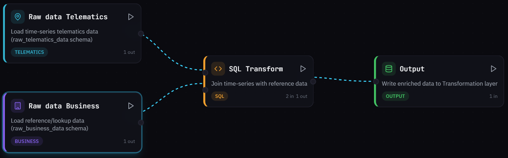
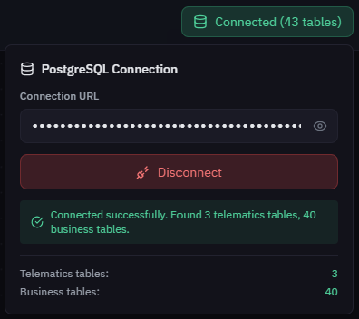
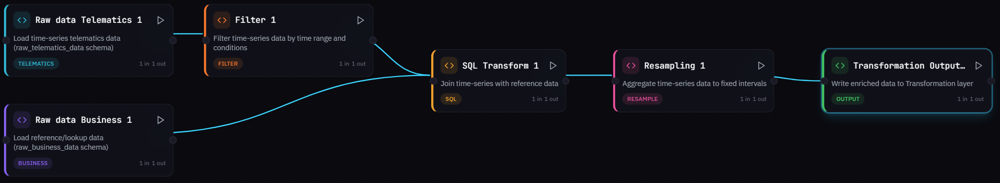
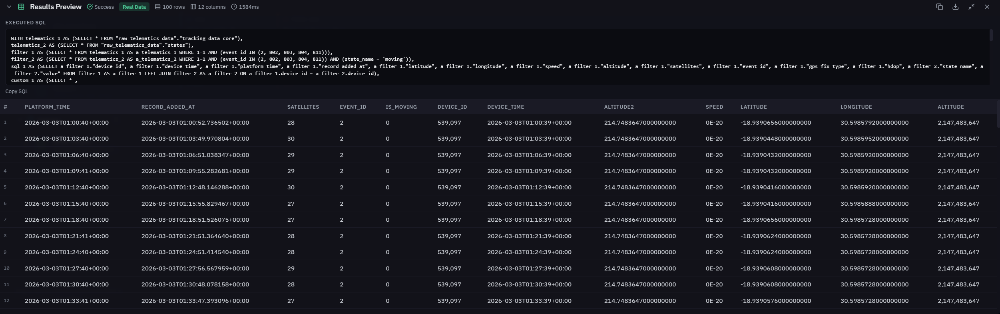

# Transformation Builder


### Coming soon!&#x20;

Transformation Builder is currently under development. The feature description on this page reflects the planned functionality. Implementation details may evolve before final release. If you are interested in early access or have questions, contact [iotquery@navixy.com](mailto:iotquery@navixy.com).


## What Transformation Builder is

**Transformation Builder** is a visual tool for designing data transformation workflows without the need to develop and maintain complex data pipelines. You assemble processing logic as a graph where each step is represented by a separate block (node), and the tool compiles your graph into executable SQL.

Transformation Builder is designed for analysts, BI specialists, and anyone with basic SQL knowledge who wants to control data preparation logic independently. It helps you answer the key questions of data preparation: where the data comes from, how it is joined, which filters and transformations are applied, how time series are aggregated, and in what form the data should appear in the [Transformation layer](./).

Transformation Builder is not a full ETL orchestrator or a data platform. It is a focused workflow designer that generates configuration and SQL for external runtime execution.

## How it works

A workflow in Transformation Builder is a directed graph of nodes arranged from data sources to output:

<figure><figcaption>
<strong>Raw data sources → Transformation nodes → Output</strong>
</figcaption></figure>

Each node corresponds to one logical processing step. You can combine multiple sources into one transformation node, and the result of one node can feed into several downstream nodes. The graph gives you a clear visual representation of the entire data path from source tables to the target analytical entity.

The Builder compiles your graph into a single SQL query using Common Table Expressions (CTEs). Each node becomes a CTE in the final query. This compilation approach means the Builder does not write data to the database directly. Instead, it generates configuration that executes the actual data processing based on a schedule.


Data in the graph must flow in one direction only. Cycles are not allowed. If the Builder detects a cycle, it returns a validation error.


### Connecting to the database

Before you start building a workflow, you need to connect to your PostgreSQL database. Without an active connection, data preview and table discovery are unavailable.

The connection panel allows you to specify your [Connection URL](../../connection-setup/#connection-string-format), connect or disconnect, and see the number of tables found in each category. The Builder uses two schemas in your database:

* `raw_telematics_data` for telematics and device sensor data
* `raw_business_data` for business reference data (vehicles, employees, geofences, and similar entities)

Once connected, the Builder automatically discovers available tables and columns, which you can then select when configuring data source nodes.

<figure><figcaption></figcaption></figure>

### Data source nodes

Data source nodes define where your workflow reads data from. Each source node corresponds to one table in the Raw data layer.

Raw data: Telematics

This node loads time-series data from the `raw_telematics_data` schema.

| Parameter               | Description                                                                                        |
| ----------------------- | -------------------------------------------------------------------------------------------------- |
| **Table name**          | Select from the list of tables discovered when you connected to the database.                      |
| **Time column**         | The timestamp column used for sorting and time-based filters. Defaults to `device_time`.           |
| **Columns**             | List of specific columns to include, or `*` to select all columns.                                 |
| **Filter condition**    | Optional SQL `WHERE` condition applied directly to the source query.                               |
| **Time window minutes** | Optional time limit (in minutes) for restricting the data window in SQL. Leave empty for no limit. |

Each Raw data: Telematics node reads from exactly one table. To use data from multiple tables, add a separate node for each table.

Raw data: Business

This node loads reference data from the `raw_business_data` schema. Typical tables include `objects`, `vehicles`, `devices`, and `sensor_description`.

| Parameter      | Description                                                              |
| -------------- | ------------------------------------------------------------------------ |
| **Table name** | Select from the list of discovered business tables.                      |
| **Key column** | The key column for this table (for example, `object_id` or `sensor_id`). |
| **Columns**    | List of specific columns to include, or `*` to select all columns.       |

Raw data: Business nodes are primarily used as the second input for the SQL Transform node, allowing you to join reference data with telematics time series.

### Transformation nodes

Transformation nodes define what happens to your data after it is loaded from sources. Each transformation type handles a specific processing pattern.

SQL Transform

Combines data from exactly two source nodes using a SQL `JOIN` operation.

| Parameter          | Description                                                                                                                     |
| ------------------ | ------------------------------------------------------------------------------------------------------------------------------- |
| **Join type**      | The type of join: `INNER`, `LEFT`, `RIGHT`, or `FULL` (full outer join).                                                        |
| **Join condition** | The condition for matching rows between the two inputs (for example, matching on `device_id`).                                  |
| **Select columns** | List of columns to include in the output. Supports prefix notation like `source.*` to select all columns from a specific input. |

SQL Transform requires exactly two inputs. The inputs can be any combination of data source nodes or outputs from other transformation nodes.

Filter

Filters data by time range and custom conditions. All conditions are executed in the database as part of the `WHERE` clause (pushdown filtering).

| Parameter                  | Description                                                                                             |
| -------------------------- | ------------------------------------------------------------------------------------------------------- |
| **Time column**            | The timestamp column to use for time-based filtering. Defaults to `device_time`.                        |
| **Time range start / end** | Start and end boundaries for the time filter.                                                           |
| **Dynamic conditions**     | A list of SQL conditions combined with `AND`. Use these for additional filtering beyond the time range. |

Resampling

Aggregates time-series data into fixed time intervals. This is useful for converting high-frequency data points into summary statistics over regular periods.

| Parameter        | Description                                                                                                                                    |
| ---------------- | ---------------------------------------------------------------------------------------------------------------------------------------------- |
| **Time column**  | The timestamp column to use for interval grouping. Defaults to `device_time`.                                                                  |
| **Interval**     | The aggregation interval: `1min`, `5min`, `15min`, `1hour`, or `1day`.                                                                         |
| **Group by**     | Additional columns to group by (besides the time interval).                                                                                    |
| **Aggregations** | A list of column-method pairs defining how each column is aggregated. Available methods: `avg`, `sum`, `min`, `max`, `first`, `last`, `count`. |

Arithmetic

Adds or replaces columns using SQL expressions. Use this node to create computed columns based on existing data.

| Parameter       | Description                                                                                                                     |
| --------------- | ------------------------------------------------------------------------------------------------------------------------------- |
| **Expressions** | A list of expression definitions. Each entry includes an optional source column, a SQL expression, and a required output alias. |

For example, to convert a speed value, you could set the source column to `speed`, the expression to `speed * 1.2`, and the alias to `speed_adjusted`. The alias is mandatory for every expression.

Custom SQL

Provides a free-form SQL input for complex logic that the other node types cannot express. Use this when you need full control over the query.

| Parameter      | Description                                                                |
| -------------- | -------------------------------------------------------------------------- |
| **Custom SQL** | A `SELECT` query where upstream nodes are accessible by their CTE aliases. |

Source node aliases follow the pattern `a_<node_id>` (for example, `a_node_1`, `a_filter_1`). Node identifiers are sanitized to valid SQL identifiers, with spaces and special characters replaced by underscores.

Custom SQL nodes accept one or two inputs. Your query can reference the corresponding CTEs by their aliases.

### Output configuration

Output

The **Output** node defines how your transformation results should be written to the Transformation layer. It specifies the target table metadata that the external runtime uses to store the processed data.

| Parameter        | Description                                                                                                                                                 |
| ---------------- | ----------------------------------------------------------------------------------------------------------------------------------------------------------- |
| **Table name**   | The name of the target table in the `processed_custom_data` schema.                                                                                         |
| **Time column**  | The timestamp column in the output data (for example, `device_time`).                                                                                       |
| **Partition by** | A partitioning expression for organizing stored data (for example, `DATE(device_time)`).                                                                    |
| **Primary key**  | A list of columns that uniquely identify each row (for example, `[device_id, device_time]`).                                                                |
| **Write mode**   | How data is written to the target table: `append` (add new rows), `overwrite` (replace existing data), or `upsert` (update existing rows, insert new ones). |

## Building a workflow

A typical workflow follows these steps:



#### Open Transformation Builder

Launch the Transformation Builder interface.



#### Connect to your database

Enter your PostgreSQL connection URL and establish the connection. The Builder discovers available tables and columns automatically.



#### Add data source nodes

Add a [**Raw data: Telematics**](transformation-builder.md#raw-data-telematics) node and select the table and columns you want to work with. If you need reference data (for example, vehicle details or sensor descriptions), add a [**Raw data: Business**](transformation-builder.md#raw-data-business) node as well.



#### Add transformation nodes

Insert the transformation nodes your workflow requires:&#x20;

* [**SQL Transform**](transformation-builder.md#sql-transform) to join data
* [**Filter**](transformation-builder.md#filter) to narrow results
* [**Resampling**](transformation-builder.md#resampling) to aggregate time series
* [**Arithmetic**](transformation-builder.md#arithmetic) to add computed columns
* [**Custom SQL**](transformation-builder.md#custom-sql) for complex logic.



#### Configure the Output node

Add [Output](transformation-builder.md#output) node and set the target table name, primary key columns, and write mode for your analytical entity.



#### Connect nodes

Draw edges between nodes to define the data flow. Connect source nodes to transformation nodes, and transformation nodes to the Output node. Data flows from left to right, from sources to output.



#### Review and fix errors

Check validation hints for any configuration issues. Fix errors in node parameters or graph structure as needed.



#### Preview results

Click **Execute** to run a preview of your workflow. The Builder compiles the graph into SQL and executes it against your database, returning up to 100 rows so you can verify the output.&#x20;


#### Export

You can export your completed workflow as a YAML file for runtime execution or sharing with colleagues. See [Workflow YAML reference](workflow-yaml-reference.md) for format details.




### Schedule execution

Click **Schedule** to open the configuration dialog, where you can determine exact time and frequency of the workflow execution. At the set time, a function in database will trigger the workflow and save its result to the Transformation layer.&#x20;



<figure><figcaption>
Complete transformation flow example
</figcaption></figure>

### Results preview

After you click **Execute** in the toolbar, the Builder compiles your workflow graph into a single SQL query with CTEs and runs it against the connected PostgreSQL database. The results appear in the bottom panel.

**On successful execution**, the panel displays:

* A result table showing up to 100 rows of output data
* The executed SQL query (the full CTE query generated by the compiler)
* Row count, column count, and execution time
* Option to export the result to CSV

**On execution error**, the panel displays:

* An error message describing what went wrong
* The executed SQL query (if compilation succeeded)
* Database error details (if the error occurred during query execution)


Results preview requires an active PostgreSQL connection. Without a connection, the preview returns an empty result with no SQL executed. The preview always uses real data from your database, not mock data.


<figure><figcaption>
Executed flow result
</figcaption></figure>

## Validation and compilation

The Builder validates your workflow at two levels.

1. **Graph validation** checks the overall structure of your workflow. The graph must be a valid directed acyclic graph (DAG), meaning data flows in one direction with no cycles. If the Builder detects a cycle, it returns an error and highlights the affected nodes.
2. **Node validation** checks each node's configuration individually. The Builder verifies that required fields are filled, that referenced columns exist in the upstream node's output, and that the node's parameters are consistent with its type (for example, SQL Transform must have exactly two inputs).

During compilation, the Builder converts your graph into a single SQL query. Each node becomes a CTE with the alias `a_<node_id>`. The nodes are arranged in topological order so that each CTE can reference the outputs of its predecessor nodes. If compilation fails due to a configuration error or an invalid graph structure, the Builder returns the error details along with any partial SQL it was able to generate.

## Exporting

### YAML export and import

You can export a completed workflow as a YAML file using the **Export** button in the toolbar. The exported file contains the full workflow definition in version 2 format, including all node configurations, graph edges, and layout positions.

To load a previously saved workflow, use the **Import** function and select a `.yaml` or `.yml` file. For complete format documentation, see the [Workflow YAML reference](workflow-yaml-reference.md).

## Current limitations

Transformation Builder is currently in its initial release, and several constraints apply:

* **Preview requires an active PostgreSQL connection.** Without a connection, you cannot preview results. The preview is limited to 100 rows.
* **The graph must be cycle-free.** Data flows in one direction only, from sources to output.
* **No built-in execution engine.** The Builder generates configuration and SQL for external runtime execution. It does not process or store data itself.
* **Batch processing only.** Streaming data processing is not supported.

## Next steps

* [**Transformation layer**](./): Learn how the Transformation layer organizes processed data into schemas and how to query it.
* [**Workflow YAML reference**](workflow-yaml-reference.md): Review the full specification for the YAML export and import format.
* [**Raw data layer**](../bronze-layer.md): Explore the source schemas (`raw_telematics_data` and `raw_business_data`) that provide input data for your workflows.
