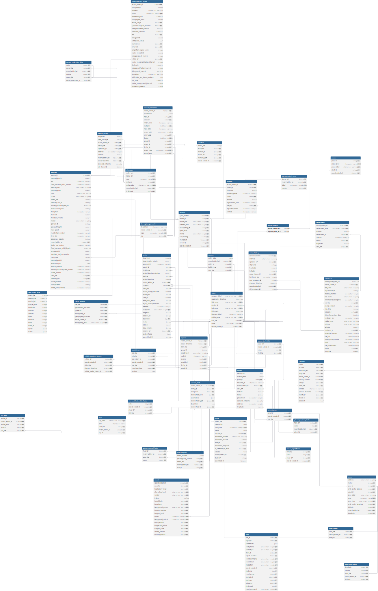

# Bronze layer

The Bronze layer contains two distinct data schemas, each serving different aspects of the telematics and business intelligence platform:

* [**raw\_business\_data**](bronze-layer.md#raw_business_data-structure) - containing tables, attributes, and values related to business information, such as vehicles, employees, geofences added by users, etc.
* [**raw\_telematics\_data**](bronze-layer.md#raw_telematics_data-structure) - containing tables, attributes, and values related to the telematics data transmitting from devices under monitoring, such as locations, inputs, outputs, and events.

Each schema is optimized for its specific data domain and access patterns, providing comprehensive coverage of operational, telematic, and asset management needs.

## `raw_business_data` structure

This schema contains 40+ carefully selected tables to cover various business aspects and use cases. These tables represent your core business entities, organizational structure, and operational data.

<figure><figcaption></figcaption></figure>


The interactive diagram of raw\_business\_data schema is available on **dbdiagram.io**: [https://dbdiagram.io/d/V3-bronze-layer-68ecfd1c2e68d21b4131089a](https://dbdiagram.io/d/V3-bronze-layer-68ecfd1c2e68d21b4131089a)


Find raw business data schema details below.

<details>

<summary>raw_business_data schema</summary>

```sql
Table "vehicle_service_tasks" {
  "record_added_at" timestamp [not null]
  "start_mileage" numeric
  "comment" "character varying(255)"
  "status" "character varying(10)" [not null]
  "completion_date" timestamp
  "start_engine_hours" numeric
  "service_task_id" integer [not null]
  "is_notification_push_enabled" boolean [not null]
  "date_notification_interval" interval
  "predicted_datetime" timestamp
  "cost" numeric [not null]
  "mileage_limit" numeric
  "notification_emails" text
  "is_unplanned" boolean [not null]
  "is_repeat" boolean [not null]
  "completion_engine_hours" integer
  "engine_hours_limit" numeric
  "mileage_repeat_interval" integer
  "vehicle_id" integer [not null]
  "engine_hours_notification_interval" integer
  "start_date" timestamp
  "mileage_notification_interval" integer
  "date_repeat_interval" interval
  "description" "character varying(255)"
  "notification_sms_phone_numbers" text
  "end_date" timestamp
  "engine_hours_repeat_interval" integer
  "completion_mileage" integer
}

Table "garages" {
  "record_added_at" timestamp [not null]
  "garage_id" integer [not null]
  "longitude" numeric
  "mechanic_name" "character varying(255)"
  "radius" integer [not null]
  "latitude" numeric
  "organization_label" "character varying(255)"
  "user_id" integer [not null]
  "dispatcher_name" "character varying(255)"
  "address" "character varying(255)"
}

Table "driver_history" {
  "server_datetime" timestamp [not null]
  "address" "character varying(255)"
  "updated_by" integer [not null]
  "object_id" integer
  "longitude" numeric
  "latitude" numeric
  "driver_history_id" integer [not null]
  "hardware_key" "character varying(64)"
  "new_employee_id" integer
  "changed_datetime" timestamp
  "record_added_at" timestamp [not null]
  "old_employee_id" integer
}

Table "departments" {
  "record_added_at" timestamp [not null]
  "department_label" "character varying(255)" [not null]
  "latitude" numeric
  "department_id" integer [not null]
  "address" "character varying(255)"
  "radius" integer [not null]
  "longitude" numeric
  "user_id" integer [not null]
}

Table "checkins" {
  "radius" integer [not null]
  "latitude" numeric [not null]
  "employee_id" integer [not null]
  "longitude" numeric [not null]
  "record_added_at" timestamp [not null]
  "actual_datetime" timestamp [not null]
  "user_id" integer [not null]
  "form_id" integer [not null]
  "address" "character varying(255)"
  "planned_datetime" timestamp [not null]
  "object_id" integer [not null]
  "checkin_id" integer [not null]
  "comment" text
}

Table "statuses" {
  "order_sort" integer [not null]
  "listing_id" integer [not null]
  "color" "character varying(6)" [not null]
  "status_id" integer [not null]
  "status_label" "character varying(200)" [not null]
  "record_added_at" timestamp [not null]
  "is_deleted" boolean [not null]
}

Table "places_linked_entity_fields" {
  "value" bigint [not null]
  "record_added_at" timestamp [not null]
  "place_id" integer [not null]
  "field_id" integer [not null]
}

Table "places_text_fields" {
  "place_id" integer [not null]
  "record_added_at" timestamp [not null]
  "value" text [not null]
  "field_id" integer [not null]
}

Table "users2zones" {
  "zone_id" integer [not null]
  "record_added_at" timestamp [not null]
  "user_id" integer [not null]
}

Table "objects" {
  "record_added_at" timestamp [not null]
  "create_datetime" timestamp [not null]
  "client_id" integer [not null]
  "group_id" integer
  "object_label" "character varying(100)"
  "model" "character varying(64)"
  "is_clone" boolean [not null]
  "is_deleted" boolean [not null]
  "device_id" integer [not null]
  "object_id" integer [not null]
}

Table "device_output_name" {
  "device_id" integer [not null]
  "record_added_at" timestamp [not null]
  "label" "character varying(100)" [not null]
  "number" integer [not null]
}

Table "geofence_points" {
  "longitude" numeric [not null]
  "number" integer [not null]
  "zone_id" integer [not null]
  "record_added_at" timestamp [not null]
  "latitude" numeric [not null]
}

Table "custom_fields" {
  "record_added_at" timestamp [not null]
  "entity_id" integer [not null]
  "is_required" boolean [not null]
  "custom_field_label" text [not null]
  "parameters" jsonb
  "custom_field_type" integer [not null]
  "description" text
  "custom_field_id" integer [not null]
}

Table "places_decimal_fields" {
  "field_id" integer [not null]
  "record_added_at" timestamp [not null]
  "place_id" integer [not null]
  "value" numeric [not null]
}

Table "task_history" {
  "task_id" integer [not null]
  "activity" integer [not null]
  "task_history_id" integer [not null]
  "record_added_at" timestamp [not null]
  "user_id" integer [not null]
  "event_datetime" timestamp [not null]
  "payload" text
}

Table "tags" {
  "tag_label" "character varying(64)" [not null]
  "color" "character varying(6)"
  "user_id" integer [not null]
  "record_added_at" timestamp [not null]
  "tag_id" integer [not null]
}

Table "places" {
  "description" text
  "custom_fields" jsonb
  "place_id" integer [not null]
  "external_id" "character varying(32)"
  "record_added_at" timestamp [not null]
  "user_id" integer
  "latitude" numeric
  "radius" integer
  "place_label" "character varying(256)"
  "assigned_datetime" timestamp
  "address" "character varying(256)"
  "longitude" numeric
}

Table "status_listings" {
  "user_id" integer [not null]
  "is_supervisor_controlled" boolean [not null]
  "is_deleted" boolean [not null]
  "status_listing_id" integer [not null]
  "is_employee_controlled" boolean [not null]
  "record_added_at" timestamp [not null]
  "status_listing_label" "character varying(200)" [not null]
}

Table "models" {
  "record_added_at" timestamp [not null]
  "model_id" integer [not null]
  "has_battery_level" boolean [not null]
  "alternative_label" "character varying(50)" [not null]
  "vendor" "character varying(30)" [not null]
  "is_clone" boolean
  "has_altitude" boolean [not null]
  "has_phone" boolean [not null]
  "type_output_control" "character varying(30)" [not null]
  "has_gsm_roaming" boolean [not null]
  "has_gsm_level" boolean [not null]
  "model" "character varying(255)" [not null]
  "type_special_control" "character varying(255)" [not null]
  "digital_amount" integer [not null]
  "has_detach_button" boolean [not null]
  "has_gsm_name" boolean [not null]
  "analog_amount" integer [not null]
  "outputs_amount" integer [not null]
}

Table "vehicle_trackers_history" {
  "vehicle_id" integer [not null]
  "record_added_at" timestamp [not null]
  "object_id" integer [not null]
  "changed_datetime" timestamp [not null]
  "vehicle_tracker_history_id" integer [not null]
}

Table "groups" {
  "group_id" integer [not null]
  "group_color" "character varying(6)" [not null]
  "group_label" "character varying(255)" [not null]
  "client_id" integer [not null]
  "record_added_at" timestamp [not null]
}

Table "sensor_description" {
  "record_added_at" timestamp [not null]
  "parameters" jsonb
  "input_id" integer [not null]
  "accuracy" numeric [not null]
  "sensor_units" "character varying(10)"
  "multiplier" doubleprecision [not null]
  "input_label" "character varying(64)"
  "sensor_label" "character varying(100)"
  "units_type" integer [not null]
  "divider" doubleprecision [not null]
  "group_id" integer [not null]
  "sensor_id" integer [not null]
  "device_id" integer [not null]
  "sensor_type" "character varying(45)" [not null]
  "group_type" integer [not null]
  "calibration_data" jsonb
}

Table "entities" {
  "entity_label" jsonb
  "record_added_at" timestamp [not null]
  "entity_id" integer [not null]
  "builtin_type" integer [not null]
  "user_id" integer [not null]
}

Table "zones" {
  "address" "character varying(255)"
  "radius" integer [not null]
  "zone_id" integer [not null]
  "circle_center_latitude" numeric [not null]
  "client_id" integer [not null]
  "zone_label" "character varying(100)"
  "color" "character varying(6)" [not null]
  "zone_type" "character varying(20)" [not null]
  "circle_center_longitude" numeric [not null]
  "latitude" numeric [not null]
  "record_added_at" timestamp [not null]
  "longitude" numeric [not null]
}

Table "vehicles" {
  "vehicle_id" integer [not null]
  "payload_length" numeric
  "vin" "character varying(20)"
  "free_insurance_policy_number" "character varying(50)"
  "vehicle_label" "character varying(100)"
  "payload_width" numeric
  "color" "character varying(6)"
  "trailer" "character varying(255)"
  "object_id" integer
  "vehicle_status_id" integer
  "liability_insurance_valid_till" timestamp
  "manufacture_year" integer
  "fuel_grade" "character varying(16)"
  "fuel_cost" numeric
  "fuel_tank_volume" numeric
  "model" "character varying(100)"
  "garage_id" integer
  "payload_height" numeric
  "max_speed" numeric
  "registration_number" "character varying(32)"
  "tyre_size" "character varying(50)"
  "passenger_capacity" integer
  "record_added_at" timestamp [not null]
  "trailer_reg_number" "character varying(32)"
  "free_insurance_valid_till_date" timestamp
  "gross_weight" numeric
  "standard_fuel_consumption" numeric
  "fuel_type" integer
  "payload_weight" numeric
  "additional_info" text
  "vehicle_subtype" "character varying(32)"
  "liability_insurance_policy_number" "character varying(50)"
  "frame_number" "character varying(32)"
  "user_id" integer [not null]
  "vehicle_type" integer [not null]
  "chassis_number" "character varying(32)"
  "tyres_number" integer
  "wheel_arrangement" "character varying(16)"
}

Table "tag_links" {
  "entity_id" integer [not null]
  "record_added_at" timestamp [not null]
  "entity_type" integer [not null]
  "ordinal" integer [not null]
  "tag_id" integer [not null]
}

Table "rules" {
  "rule_id" integer [not null]
  "object_id" integer [not null]
  "parameters" jsonb
  "alert_phone" "character varying(210)" [not null]
  "event_type" "character varying(100)" [not null]
  "client_id" integer [not null]
  "is_push_enabled" boolean [not null]
  "event_comment1" "character varying(255)" [not null]
  "event_label" "character varying(255)" [not null]
  "description" "character varying(255)" [not null]
  "record_added_at" timestamp [not null]
  "alert_sms" text [not null]
  "event_group" integer [not null]
  "created_at" timestamp [not null]
  "maximum" integer [not null]
  "is_deleted" boolean [not null]
  "alert_email" text [not null]
  "event_comment2" "character varying(255)" [not null]
}

Table "status_history" {
  "longitude" numeric
  "new_status_id" integer
  "status_history_id" integer [not null]
  "device_id" integer [not null]
  "updated_by" integer [not null]
  "address" "character varying(255)"
  "latitude" numeric
  "record_added_at" timestamp [not null]
  "server_datetime" timestamp [not null]
  "changed_datetime" timestamp
  "old_status_id" integer
}

Table "rules2zones" {
  "zone_id" integer [not null]
  "record_added_at" timestamp [not null]
  "rule_id" integer [not null]
}

Table "forms" {
  "object_id" integer [not null]
  "description" text
  "form_label" "character varying(255)" [not null]
  "fields" text
  "created_at" timestamp [not null]
  "submission_address" "character varying(255)"
  "submission_latitude" numeric
  "form_id" integer [not null]
  "submission_longitude" numeric
  "is_submission_in_zone" boolean [not null]
  "values" text
  "record_added_at" timestamp [not null]
  "task_id" integer
  "submitted_at" timestamp
}


Table "rules2objects" {
  "object_params" jsonb
  "param_group_number" integer [not null]
  "object_id" integer [not null]
  "record_added_at" timestamp [not null]
  "rule_id" integer [not null]
}

Table "tasks" {
  "time_from" timestamp
  "stay_duration_minutes" interval
  "external_id" "character varying(100)"
  "object_id" integer
  "task_type" integer
  "arrival_duration_minutes" interval
  "status" integer
  "arrival_datetime" timestamp
  "record_added_at" timestamp [not null]
  "task_id" integer [not null]
  "user_id" integer
  "status_change_datetime" timestamp
  "order_sort" integer
  "time_to" timestamp
  "max_delay_minuts" integer
  "is_stay_control_enabled" boolean
  "address" "character varying(255)"
  "task_label" "character varying(200)" [not null]
  "longitude" numeric
  "created_by" integer
  "description" text [not null]
  "radius" integer
  "latitude" numeric
  "stay_duration" integer
  "created_at" timestamp [not null]
  "custom_fields" jsonb
  "parent_task_id" integer
}

Table "places_bigint_fields" {
  "field_id" integer [not null]
  "value" bigint [not null]
  "place_id" integer [not null]
  "record_added_at" timestamp [not null]
}

Table "devices" {
  "is_sim_blocked" boolean [not null]
  "device_id" integer [not null]
  "device_imei" "character varying(64)" [not null]
  "network_label" "character varying(50)" [not null]
  "status_listing_id" integer [not null]
  "signal_level" numeric [not null]
  "phone" "character varying(32)" [not null]
  "has_roaming" boolean [not null]
  "created_at" timestamp [not null]
  "owner_id" integer [not null]
  "record_added_at" timestamp [not null]
}

Table "description_parametrs" {
  "description" "character varying(150)"
  "record_added_at" timestamp [not null]
  "type" "character varying(100)" [not null]
  "key" integer [not null]
}

Table "users" {
  "company_label" "character varying(255)" [not null]
  "registration_datetime" timestamp
  "first_name" "character varying(100)" [not null]
  "master_id" integer
  "last_name" "character varying(100)" [not null]
  "birth_date" timestamp
  "timezone_label" "character varying(30)"
  "middle_name" "character varying(100)" [not null]
  "user_id" integer [not null]
  "locale" "character varying(10)" [not null]
  "record_added_at" timestamp [not null]
}

Table "counters" {
  "sensor_id" integer
  "multiplier" numeric [not null]
  "counter_id" integer [not null]
  "device_id" integer [not null]
  "counter_type" integer [not null]
  "record_added_at" timestamp [not null]
}

Table "employees" {
  "driver_license_valid_till" timestamp
  "record_added_at" timestamp [not null]
  "last_name" "character varying(100)"
  "department_id" integer
  "citizen_id_number" "character varying(32)"
  "first_name" "character varying(100)"
  "driver_license_categories" "character varying(32)"
  "user_id" integer [not null]
  "phone_number" "character varying(32)"
  "object_id" integer
  "is_deleted" boolean [not null]
  "driver_license_issue_date" boolean
  "hardware_key" "character varying(64)"
  "middle_name" "character varying(100)"
  "address" "character varying(255)"
  "latitude" numeric
  "employee_id" integer [not null]
  "personnel_number" "character varying(15)"
  "fuel_cost" doubleprecision
  "driver_license_number" "character varying(32)"
  "email" "character varying(100)"
  "fuel_consumption" doubleprecision
  "radius" integer [not null]
  "longitude" numeric
}

Table "places_longtext_fields" {
  "field_id" integer [not null]
  "value" text [not null]
  "record_added_at" timestamp [not null]
  "place_id" integer [not null]
}

Table "raw_device_data" {
  "device_id" integer
  "device_time" timestamp
  "created_at" timestamp
  "gps_fix_type" integer
  "longitude" integer
  "latitude" integer
  "altitude" integer
  "speed" integer
  "satellites" integer
  "hdop" integer
  "event_id" integer
  "inputs" jsonb
  "states" jsonb
}

Table "groups_objects" {
  "groups_client_id" integer
  "objects_client_id" integer

  Indexes {
    (groups_client_id, objects_client_id) [pk]
  }
}

Ref:"employees"."employee_id" < "checkins"."employee_id"

Ref:"objects"."object_id" < "checkins"."object_id"

Ref:"forms"."form_id" < "checkins"."form_id"

Ref:"sensor_description"."sensor_id" < "counters"."sensor_id"

Ref:"devices"."device_id" < "counters"."device_id"

Ref:"entities"."entity_id" < "custom_fields"."entity_id"

Ref:"departments"."department_id" < "employees"."department_id"

Ref:"users"."user_id" < "departments"."user_id"

Ref:"description_parametrs"."key" < "counters"."counter_type"

Ref:"description_parametrs"."key" < "custom_fields"."custom_field_type"

Ref:"description_parametrs"."key" < "driver_history"."updated_by"

Ref:"description_parametrs"."key" < "entities"."builtin_type"

Ref:"description_parametrs"."key" < "sensor_description"."units_type"

Ref:"description_parametrs"."key" < "status_history"."updated_by"

Ref:"description_parametrs"."key" < "tasks"."status"

Ref:"description_parametrs"."key" < "tasks"."created_at"

Ref:"description_parametrs"."key" < "tasks"."task_type"

Ref:"description_parametrs"."key" < "vehicles"."fuel_type"

Ref:"description_parametrs"."key" < "task_history"."activity"

Ref:"description_parametrs"."key" < "sensor_description"."group_type"

Ref:"devices"."device_id" < "device_output_name"."device_id"

Ref:"status_listings"."status_listing_id" < "devices"."status_listing_id"

Ref:"employees"."employee_id" < "driver_history"."new_employee_id"

Ref:"employees"."employee_id" < "driver_history"."old_employee_id"

Ref:"objects"."object_id" < "driver_history"."object_id"

Ref:"objects"."object_id" < "employees"."object_id"

Ref:"users"."user_id" < "employees"."user_id"

Ref:"users"."user_id" < "entities"."user_id"

Ref:"tasks"."task_id" < "forms"."task_id"

Ref:"objects"."object_id" < "forms"."object_id"

Ref:"objects"."object_id" < "tasks"."object_id"

Ref:"users"."user_id" < "garages"."user_id"

Ref:"groups"."client_id" < "groups_objects"."groups_client_id"

Ref:"objects"."client_id" < "groups_objects"."objects_client_id"

Ref:"models"."model" < "objects"."model"

Ref:"devices"."device_id" < "objects"."device_id"

Ref:"users"."user_id" < "places"."user_id"

Ref:"custom_fields"."custom_field_id" < "places_bigint_fields"."field_id"

Ref:"places"."place_id" < "places_bigint_fields"."place_id"

Ref:"custom_fields"."custom_field_id" < "places_decimal_fields"."field_id"

Ref:"places"."place_id" < "places_decimal_fields"."place_id"

Ref:"custom_fields"."custom_field_id" < "places_linked_entity_fields"."field_id"

Ref:"places"."place_id" < "places_linked_entity_fields"."place_id"

Ref:"custom_fields"."custom_field_id" < "places_longtext_fields"."field_id"

Ref:"places"."place_id" < "places_longtext_fields"."place_id"

Ref:"custom_fields"."custom_field_id" < "places_text_fields"."field_id"

Ref:"places"."place_id" < "places_text_fields"."place_id"

Ref:"rules"."rule_id" < "rules2zones"."rule_id"

Ref:"objects"."object_id" < "rules2objects"."object_id"

Ref:"rules"."rule_id" < "rules2objects"."object_id"

Ref:"zones"."zone_id" < "rules2zones"."zone_id"

Ref:"devices"."device_id" < "sensor_description"."device_id"

Ref:"statuses"."status_id" < "status_history"."new_status_id"

Ref:"statuses"."status_id" < "status_history"."old_status_id"

Ref:"devices"."device_id" < "status_history"."device_id"

Ref:"users"."user_id" < "status_listings"."user_id"

Ref:"status_listings"."status_listing_id" < "statuses"."listing_id"

Ref:"tags"."tag_id" < "tag_links"."tag_id"

Ref:"users"."user_id" < "tags"."user_id"

Ref:"tasks"."task_id" < "task_history"."task_id"

Ref:"users"."user_id" < "task_history"."user_id"

Ref:"tasks"."parent_task_id" < "tasks"."task_id"

Ref:"users"."user_id" < "tasks"."user_id"

Ref:"users"."master_id" < "users"."user_id"

Ref:"users"."user_id" < "users2zones"."user_id"

Ref:"zones"."zone_id" < "users2zones"."zone_id"

Ref:"vehicles"."vehicle_id" < "vehicle_service_tasks"."vehicle_id"

Ref:"objects"."object_id" < "vehicle_trackers_history"."object_id"

Ref:"vehicles"."vehicle_id" < "vehicle_trackers_history"."vehicle_id"

Ref:"garages"."garage_id" < "vehicles"."garage_id"

Ref:"objects"."object_id" < "vehicles"."object_id"

Ref:"users"."user_id" < "vehicles"."user_id"

Ref:"zones"."zone_id" < "geofence_points"."zone_id"

Ref:"devices"."device_id" < "raw_device_data"."device_id"

Ref:"users"."user_id" < "devices"."owner_id"

Ref:"users"."user_id" < "objects"."client_id"

```

</details>

### Update frequency

Data in this schema is synchronized with the core DB. Updates occur incrementally as changes happen in the source MySQL database, typically less than 5 minutes of the source change.

### `description_parameters`

The system includes reference data to standardize values across the database:

<table><thead><tr><th width="167.1817626953125">Reference type</th><th width="173.9090576171875">Description</th><th>Example values</th></tr></thead><tbody><tr><td>Type definitions</td><td>Standard entity types</td><td><code>vehicle_type: car, truck, bus</code></td></tr><tr><td>Status codes</td><td>Task and system status values</td><td><code>tasks_status: unassigned, assigned, done</code></td></tr><tr><td>Unit definitions</td><td>Measurement units for sensors</td><td><code>units_type: liter, gallon, celsius</code></td></tr><tr><td>Entity classifications</td><td>Business entity categories</td><td><code>entities_type: place, task, customer</code></td></tr></tbody></table>

### Key tables by category

The tables in the **`raw_business_data`** schema are organized into functional categories for easier navigation. The table below summarizes key tables by their business purpose:

Core business entities

<details>

<summary><strong><code>users</code></strong></summary>

**Description**: User accounts containing profile information, company affiliation, localization settings (timezone, locale), and hierarchical relationships via master\_id for multi-level account structures

<table><thead><tr><th width="145">Attribute</th><th>Details</th></tr></thead><tbody><tr><td><strong>Key fields</strong></td><td>- <code>user_id</code> - Unique user identifier<br>- <code>company_label</code> - Name of the company associated with the user<br>- <code>first_name</code> - Username<br>- <code>last_name</code> - User's last name<br>- <code>middle_name</code> - User's patronymic<br>- <code>locale</code> - User language settings<br>- <code>timezone_label</code> - Time zone in IANA format<br>- <code>master_id</code> - Primary user ID (if the current one is a subordinate)<br>- <code>registration_datetime</code> - Date of registration in the system<br>- <code>birth_date</code> - User's date of birth</td></tr><tr><td><strong>Relationships</strong></td><td>Parent user via <code>master_id</code>, linked to <code>employees</code>, <code>departments</code>, <code>places</code>, <code>tasks</code> through <code>user_id</code></td></tr><tr><td><strong>Special notes</strong></td><td>Central entity connecting organizational data; <code>master_id</code> enables user hierarchies for multi-level account structures</td></tr></tbody></table>

</details>

<details>

<summary><strong><code>employees</code></strong></summary>

**Description**: Employee and driver records used to represent people working for the organization, including personal information, licensing details, department assignments, hardware keys for iButton/RFID identification, and location data with geofencing support

<table><thead><tr><th width="143">Attribute</th><th>Details</th></tr></thead><tbody><tr><td><strong>Key fields</strong></td><td>- <code>employee_id</code> - Employee entity identifier<br>- <code>user_id</code> - User entity identifier<br>- <code>object_id</code> - Entity identifier object<br>- <code>department_id</code> - An ID of the department to which employee assigned<br>- <code>first_name</code> - The first_name attribute of the employees table<br>- <code>last_name</code> - The last_name attribute of the employees table<br>- <code>middle_name</code> - The middle_name attribute of the employees table<br>- <code>driver_license_number</code> - Driver's license number<br>- <code>driver_license_categories</code> - Driver license categories<br>- <code>driver_license_issue_date</code> - Issue date of a driver license<br>- <code>driver_license_valid_till</code> - Date till a driver license valid<br>- <code>hardware_key</code> - A hardware key<br>- <code>email</code> - Employee's email<br>- <code>phone_number</code> - Employee's phone without "+" sign<br>- <code>address</code> - Address of the location<br>- <code>personnel_number</code> - Employee/driver personnel number<br>- <code>citizen_id_number</code> - Social Security number<br>- <code>latitude</code> - Location associated with this employee<br>- <code>longitude</code> - Location associated with this employee<br>- <code>radius</code> - Location associated with this employee in meters<br>- <code>fuel_consumption</code> - The fuel_consumption attribute of the employees table<br>- <code>fuel_cost</code> - The fuel_cost attribute of the employees table<br>- <code>is_deleted</code> - The is_deleted attribute of the employees table</td></tr><tr><td><strong>Relationships</strong></td><td>Links to <code>users</code>, <code>departments</code>, <code>objects</code> (assigned tracker), tracked in <code>driver_history</code> and <code>checkins</code></td></tr><tr><td><strong>Special notes</strong></td><td>Hardware key enables driver identification via iButton or RFID; supports geofencing with <code>latitude</code>, <code>longitude</code>, <code>radius</code> fields</td></tr></tbody></table>

</details>

<details>

<summary><strong><code>departments</code></strong></summary>

**Description**: Organizational units with geographic location data (latitude, longitude, radius) enabling geofence-based analytics for department-level reporting and employee location association

<table><thead><tr><th width="156">Attribute</th><th>Details</th></tr></thead><tbody><tr><td><strong>Key fields</strong></td><td>- <code>department_id</code> - Department entity identifier<br>- <code>user_id</code> - User entity identifier<br>- <code>department_label</code> - The department_label attribute of the departments table<br>- <code>latitude</code> - Location associated with this departments<br>- <code>longitude</code> - Location associated with this departments<br>- <code>radius</code> - Geolocation size in meters<br>- <code>address</code> - The address attribute of the departments table</td></tr><tr><td><strong>Relationships</strong></td><td>Links employees to organizational structure through <code>department_id</code></td></tr><tr><td><strong>Special notes</strong></td><td>Location fields support geofence-based analytics for department-level reporting</td></tr></tbody></table>

</details>

Tracking and monitoring

<details>

<summary><strong><code>devices</code></strong></summary>

**Description**: Physical tracking device registry with hardware identifiers (IMEI), SIM card information, network connectivity status (signal strength, roaming, operator), and status listing assignments for device lifecycle management

<table><thead><tr><th width="138">Attribute</th><th>Details</th></tr></thead><tbody><tr><td><strong>Key fields</strong></td><td>- <code>device_id</code> - Device ID<br>- <code>owner_id</code> - ID of the device owner in whose account the beacon was added<br>- <code>device_imei</code> - Device IMEI<br>- <code>phone</code> - The device's SIM card number<br>- <code>status_listing_id</code> - Device Status ID<br>- <code>network_label</code> - The name of the network to which the SIM card is connected<br>- <code>signal_level</code> - Device signal strength<br>- <code>has_roaming</code> - Roaming availability flag<br>- <code>is_sim_blocked</code> - SIM card lock flag<br>- <code>created_at</code> - Date and time the entry was created</td></tr><tr><td><strong>Relationships</strong></td><td>Core entity linking to <code>objects</code>, <code>models</code>, <code>sensor_description</code>, <code>counters</code>; <code>owner_id</code> references <code>users.user_id</code></td></tr><tr><td><strong>Special notes</strong></td><td>All telematic data in <code>raw_telematics_data</code> schema references this table via <code>device_id</code></td></tr></tbody></table>

</details>

<details>

<summary><strong><code>objects</code></strong></summary>

**Description**: Central registry of monitored entities (vehicles, assets, personnel) linking physical devices to organizational structure through client\_id and group\_id, representing the "trackable unit" with one active object per device

<table><thead><tr><th width="148">Attribute</th><th>Details</th></tr></thead><tbody><tr><td><strong>Key fields</strong></td><td>- <code>object_id</code> - Entity identifier object<br>- <code>client_id</code> - Client entity identifier<br>- <code>device_id</code> - Device entity identifier<br>- <code>object_label</code> - Name of the object<br>- <code>model</code> - Device model<br>- <code>group_id</code> - Entity ID group<br>- <code>create_datetime</code> - Date and time of creation of a new row on the server<br>- <code>is_deleted</code> - The is_deleted attribute of the objects table<br>- <code>is_clone</code> - Clone sign</td></tr><tr><td><strong>Relationships</strong></td><td>Central hub connecting devices to users (<code>client_id</code>), vehicle details, tracking history, tasks, and rules</td></tr><tr><td><strong>Special notes</strong></td><td>Represents the "trackable unit" in the system; one object per device in active use</td></tr></tbody></table>

</details>

<details>

<summary><strong><code>models</code></strong></summary>

**Description**: Central registry of monitored entities (vehicles, assets, personnel) linking physical devices to organizational structure through client\_id and group\_id, representing the "trackable unit" with one active object per device

<table><thead><tr><th width="135">Attribute</th><th>Details</th></tr></thead><tbody><tr><td><strong>Key fields</strong></td><td>- <code>model_id</code> - Entity model identifier<br>- <code>model</code> - The model attribute of the models table<br>- <code>vendor</code> - The name of the company that released the tracker<br>- <code>alternative_label</code> - The alternative_label attribute of the models table<br>- <code>analog_amount</code> - Number of analog inputs of the tracker<br>- <code>digital_amount</code> - Number of discrete inputs of the tracker<br>- <code>outputs_amount</code> - Number of discrete tracker outputs<br>- <code>has_battery_level</code> - Determines whether the tracker transmits battery charge readings<br>- <code>has_altitude</code> - Determines whether the tracker transmits altitude<br>- <code>has_phone</code> - Is there a SIM card?<br>- <code>has_gsm_level</code> - Can a tracker transmit GSM signal strength?<br>- <code>has_gsm_name</code> - Can the tracker transmit the GSM network name or operator code (MCC + MNC)?<br>- <code>has_gsm_roaming</code> - Can the tracker transmit roaming status?<br>- <code>has_detach_button</code> - Does the tracker have a detachment sensor?<br>- <code>type_output_control</code> - Tracker Output Control Profile<br>- <code>type_special_control</code> - Contains specialized settings and functional modules for individual device models, such as the dangerous driving mode (hbm_telfm) for Teltonika equipment<br>- <code>is_clone</code> - Is the model a clone of another model?</td></tr><tr><td><strong>Content</strong></td><td>Boolean capability flags indicate which data fields are available from this device type</td></tr><tr><td><strong>Special notes</strong></td><td>Use capability flags to determine valid sensors and inputs when querying telematic data</td></tr></tbody></table>

</details>

<details>

<summary><strong><code>sensor_description</code></strong></summary>

**Description**: Comprehensive sensor configuration linking device inputs to business logic, including input mappings, measurement units, conversion factors (multiplier/divider), calibration tables for fuel sensors, accuracy thresholds, and grouping logic for aggregated sensor readings

<table><thead><tr><th width="142">Attribute</th><th>Details</th></tr></thead><tbody><tr><td><strong>Key fields</strong></td><td>- <code>sensor_id</code> - Sensor entity identifier<br>- <code>device_id</code> - Device entity identifier<br>- <code>sensor_label</code> - Sensor name for UI<br>- <code>input_label</code> - The name of the message field (attribute) from which the sensor data is taken. If equal to "input_status," it is a discrete sensor<br>- <code>sensor_type</code> - Sensor type<br>- <code>units_type</code> - Units of measurement<br>- <code>multiplier</code> - Multiplier - the number by which to multiply the field value. For measuring sensors only<br>- <code>divider</code> - Divisor - the number by which to divide the field value. For measuring sensors only<br>- <code>accuracy</code> - A specified percentage for calculating the absolute error of the tank volume. This error is used to determine when refills or drains are occurring. This is used only for fuel sensors<br>- <code>calibration_data</code> - The calibration_data attribute of the sensor_description table<br>- <code>input_id</code> - Input number for discrete sensor<br>- <code>group_id</code> - Sensors of the same type with the same group_id and source_id are considered to belong to the same group. Their data is summed or averaged, depending on the group_type value. This is required for aggregated sensors. It is used in measurement sensors<br>- <code>group_type</code> - 0 - sum up the values of sensors within a group, 1 - average<br>- <code>sensor_units</code> - User-entered unit name if units_type=0 (custom)<br>- <code>parameters</code> - Optional object with additional parameters parent_ids - optional array of parent_ids for composite sensor. volume - double. Optional. Volume for composite sensor. parent_ids - optional. int array. Array of parent_ids for composite sensor. volume - optional. Double. Volume for composite sensor. min - optional. Double. Min acceptable raw value for a sensor. max - optional. Double. Max acceptable raw value for a sensor. max_lowering_by_time - optional. Double. Maximum legal value lowering per hour. max_lowering_by_mileage - optional. Double. Maximum legal value lowering per 100 km. ignore_drains_in_move - optional. Boolean. Default is false. If true, the fuel drains will not be detected during movement. ignore_refuels_in_move - optional. Boolean. Default is false. If true, the refuels will not be detected during movement. refuel_gap_minutes - optional. Integer. Default is 5. The time in minutes after the start of the movement, refuels will be detected during movement. custom_field_name - optional. Boolean. Default false. The parameter determines whether the input_name field is a custom value was entered by user. This makes sense only if the tracker model has the feature has_custom_fields</td></tr><tr><td><strong>Relationships</strong></td><td>Links device inputs (from <code>raw_telematics_data.inputs</code>) to business logic through <code>device_id</code> and <code>input_label</code> matching</td></tr><tr><td><strong>Special notes</strong></td><td><code>calibration_data</code> (JSONB) stores sensor-specific calibration tables for fuel level sensors; <code>multiplier</code> and <code>divider</code> convert raw values to units</td></tr></tbody></table>

</details>

Asset management

<details>

<summary><strong><code>vehicles</code></strong></summary>

**Description**: Comprehensive vehicle registry containing specifications (dimensions, weight, capacity), documentation (VIN, registration, insurance), operational parameters (fuel consumption, tank volume), and current tracker assignment via object\_id for fleet management and compliance tracking

<table><thead><tr><th width="144">Attribute</th><th>Details</th></tr></thead><tbody><tr><td><strong>Key fields</strong></td><td>- <code>vehicle_id</code> - Vehicle entity identifier<br>- <code>user_id</code> - User entity identifier<br>- <code>object_id</code> - Entity identifier object<br>- <code>garage_id</code> - Garage entity identifier<br>- <code>vehicle_label</code> - The vehicle_label attribute of the vehicles table<br>- <code>registration_number</code> - Reg number/ license plate of a vehicle<br>- <code>vin</code> - The vin attribute of the vehicles table<br>- <code>manufacture_year</code> - The manufacture_year attribute of the vehicles table<br>- <code>fuel_type</code> - The fuel_type attribute of the vehicles table<br>- <code>fuel_cost</code> - The fuel_cost attribute of the vehicles table<br>- <code>fuel_tank_volume</code> - The fuel_tank_volume attribute of the vehicles table<br>- <code>max_speed</code> - The max_speed attribute of the vehicles table<br>- <code>model</code> - The model attribute of the vehicles table<br>- <code>color</code> - The color attribute of the vehicles table<br>- <code>trailer</code> - The trailer attribute of the vehicles table<br>- <code>additional_info</code> - The additional_info attribute of the vehicles table<br>- <code>vehicle_type</code> - The vehicle_type attribute of the vehicles table<br>- <code>vehicle_subtype</code> - The vehicle_subtype attribute of the vehicles table<br>- <code>vehicle_status_id</code> - Entity identifier vehicle status<br>- <code>chassis_number</code> - The chassis_number attribute of the vehicles table<br>- <code>frame_number</code> - The frame_number attribute of the vehicles table<br>- <code>trailer_reg_number</code> - The trailer_reg_number attribute of the vehicles table<br>- <code>payload_weight</code> - The payload_weight attribute of the vehicles table<br>- <code>payload_height</code> - The payload_height attribute of the vehicles table<br>- <code>payload_length</code> - The payload_length attribute of the vehicles table<br>- <code>payload_width</code> - The payload_width attribute of the vehicles table<br>- <code>passenger_capacity</code> - A maximum number of passengers<br>- <code>gross_weight</code> - The gross_weight attribute of the vehicles table<br>- <code>standard_fuel_consumption</code> - Normal average fuel consumption in liters per 100 km<br>- <code>fuel_grade</code> - The fuel_grade attribute of the vehicles table<br>- <code>wheel_arrangement</code> - The wheel_arrangement attribute of the vehicles table<br>- <code>tyre_size</code> - Vehicle size: dimensions and wheel size<br>- <code>tyres_number</code> - Number of wheels<br>- <code>liability_insurance_policy_number</code> - The liability_insurance_policy_number attribute of the vehicles table<br>- <code>liability_insurance_valid_till</code> - The date till liability insurance valid<br>- <code>free_insurance_policy_number</code> - The free_insurance_policy_number attribute of the vehicles table<br>- <code>free_insurance_valid_till_date</code> - The date till free insurance valid</td></tr><tr><td><strong>Relationships</strong></td><td>Links to <code>objects</code> (current tracker), <code>garages</code> (service location), <code>vehicle_service_tasks</code>; tracked in <code>vehicle_trackers_history</code></td></tr><tr><td><strong>Special notes</strong></td><td>Physical dimension fields (<code>payload_length</code>, <code>payload_width</code>, <code>payload_height</code>, <code>gross_weight</code>) support load planning analytics; insurance dates enable compliance tracking</td></tr></tbody></table>

</details>

<details>

<summary><strong><code>garages</code></strong></summary>

**Description**: Service and maintenance facility locations with geographic coordinates (latitude, longitude, radius), contact information for mechanics and dispatchers, enabling geofence-based service visit detection and proximity analysis

<table><thead><tr><th width="135">Attribute</th><th>Details</th></tr></thead><tbody><tr><td><strong>Key fields</strong></td><td>- <code>garage_id</code> - Garage entity identifier<br>- <code>user_id</code> - User entity identifier<br>- <code>latitude</code> - Location object<br>- <code>longitude</code> - Location object<br>- <code>radius</code> - Geolocation size in meters<br>- <code>address</code> - Location object<br>- <code>organization_label</code> - Depot ID<br>- <code>mechanic_name</code> - Mechanic name<br>- <code>dispatcher_name</code> - Dispatcher name</td></tr><tr><td><strong>Relationships</strong></td><td>Referenced by <code>vehicles.garage_id</code> for service location assignment</td></tr><tr><td><strong>Special notes</strong></td><td>Location fields enable geofence-based service visit detection and proximity analysis</td></tr></tbody></table>

</details>

<details>

<summary><strong><code>vehicle_service_tasks</code></strong></summary>

**Description**: Maintenance schedule and service history tracking with multiple trigger types (date-based, mileage-based, engine-hours-based), recurring task intervals, multi-channel notifications (email, SMS, push), and distinction between planned (is\_repeat) and unplanned maintenance events

<table><thead><tr><th width="132">Attribute</th><th>Details</th></tr></thead><tbody><tr><td><strong>Key fields</strong></td><td>- <code>service_task_id</code> - Service task entity identifier<br>- <code>vehicle_id</code> - Vehicle entity identifier<br>- <code>description</code> - The description attribute of the vehicle_service_tasks table<br>- <code>status</code> - The status value of the status attribute<br>- <code>cost</code> - The cost attribute of the vehicle_service_tasks table<br>- <code>start_date</code> - The date and time associated with the start_date attribute<br>- <code>end_date</code> - The date and time associated with the end_date attribute<br>- <code>completion_date</code> - The date and time associated with the completion_date attribute<br>- <code>predicted_datetime</code> - The date and time associated with the predicted_datetime attribute<br>- <code>mileage_limit</code> - The mileage_limit attribute of the vehicle_service_tasks table<br>- <code>engine_hours_limit</code> - The engine_hours_limit attribute of the vehicle_service_tasks table<br>- <code>start_mileage</code> - The start_mileage attribute of the vehicle_service_tasks table<br>- <code>start_engine_hours</code> - The start_engine_hours attribute of the vehicle_service_tasks table<br>- <code>mileage_notification_interval</code> - The mileage_notification_interval attribute of the vehicle_service_tasks table<br>- <code>engine_hours_notification_interval</code> - The engine_hours_notification_interval attribute of the vehicle_service_tasks table<br>- <code>date_notification_interval</code> - Converting an integer N to N days<br>- <code>mileage_repeat_interval</code> - The mileage_repeat_interval attribute of the vehicle_service_tasks table<br>- <code>engine_hours_repeat_interval</code> - The engine_hours_repeat_interval attribute of the vehicle_service_tasks table<br>- <code>date_repeat_interval</code> - Converting an integer N to N days<br>- <code>notification_emails</code> - The notification_emails attribute of the vehicle_service_tasks table<br>- <code>notification_sms_phone_numbers</code> - The notification_sms_phone_numbers attribute of the vehicle_service_tasks table<br>- <code>is_notification_push_enabled</code> - The is_notification_push_enabled attribute of the vehicle_service_tasks table<br>- <code>completion_mileage</code> - The completion_mileage attribute of the vehicle_service_tasks table<br>- <code>completion_engine_hours</code> - The completion_engine_hours attribute of the vehicle_service_tasks table<br>- <code>is_repeat</code> - The is_repeat attribute of the vehicle_service_tasks table<br>- <code>is_unplanned</code> - The is_unplanned attribute of the vehicle_service_tasks table<br>- <code>comment</code> - The comment attribute of the vehicle_service_tasks table</td></tr><tr><td><strong>Content</strong></td><td>Supports three trigger types: date-based, mileage-based, engine-hours-based; notification settings for email, SMS, push</td></tr><tr><td><strong>Special notes</strong></td><td><code>is_repeat</code> and interval fields enable recurring maintenance schedules; <code>is_unplanned</code> distinguishes scheduled vs. reactive maintenance</td></tr></tbody></table>

</details>

Location and routing

<details>

<summary><strong><code>zones</code></strong></summary>

**Description**: Geofenced areas defining virtual perimeters using circles or polygons for monitoring vehicle/asset entry and exit events, supporting rule-based automation and location analytics with color coding for visual differentiation

<table><thead><tr><th width="150">Attribute</th><th>Details</th></tr></thead><tbody><tr><td><strong>Key fields</strong></td><td>- <code>zone_id</code> - Zone entity identifier<br>- <code>client_id</code> - Client entity identifier<br>- <code>zone_label</code> - The zone_label attribute of the zones table<br>- <code>zone_type</code> - The zone_type attribute of the zones table<br>- <code>latitude</code> - Optional object, the bounding box which can fully contain the returned result<br>- <code>longitude</code> - Optional object, the bounding box which can fully contain the returned result<br>- <code>circle_center_latitude</code> - The circle_center_latitude attribute of the zones table<br>- <code>circle_center_longitude</code> - The circle_center_longitude attribute of the zones table<br>- <code>radius</code> - Geolocation size in meters<br>- <code>address</code> - The address attribute of the zones table<br>- <code>color</code> - The color attribute of the zones table</td></tr><tr><td><strong>Content</strong></td><td>Zone types include circle, polygon (defined via <code>geofence_points</code>), and special area classifications</td></tr><tr><td><strong>Relationships</strong></td><td>Referenced by <code>rules2zones</code>, <code>users2zones</code>; polygon vertices stored in <code>geofence_points</code></td></tr><tr><td><strong>Special notes</strong></td><td>PostGIS functions can be used to check point-in-polygon for complex geofence analysis</td></tr></tbody></table>

</details>

<details>

<summary><strong><code>places</code></strong></summary>

**Description**: Points of interest with geographic coordinates, radius definitions, and extensible custom field support for storing customer contact information and business-specific data, enabling CRM/ERP integration via external\_id and location-based reporting

<table><thead><tr><th width="129">Attribute</th><th>Details</th></tr></thead><tbody><tr><td><strong>Key fields</strong></td><td>- <code>place_id</code> - Place entity identifier<br>- <code>user_id</code> - User entity identifier<br>- <code>place_label</code> - The place_label attribute of the places table<br>- <code>latitude</code> - Location object<br>- <code>longitude</code> - Location object<br>- <code>radius</code> - Geolocation size in meters<br>- <code>address</code> - The address attribute of the places table<br>- <code>description</code> - The description attribute of the places table<br>- <code>external_id</code> - ID for integration with external systems (CRM)<br>- <code>custom_fields</code> - Additional fields<br>- <code>assigned_datetime</code> - Date and time of assignment of the point of interest to the user</td></tr><tr><td><strong>Relationships</strong></td><td>Extended with custom field values through <code>places_text_fields</code>, <code>places_decimal_fields</code>, <code>places_bigint_fields</code>, <code>places_longtext_fields</code>, <code>places_linked_entity_fields</code></td></tr><tr><td><strong>Special notes</strong></td><td><code>custom_fields</code> JSONB provides quick access; related tables enable filtering and sorting on custom attributes</td></tr></tbody></table>

</details>

<details>

<summary><strong><code>geofence_points</code></strong></summary>

**Description**: Ordered vertex coordinates (number field determines sequence) defining polygon boundaries for complex geofence shapes, enabling precise geographic perimeters beyond simple circular zones, used with PostGIS ST\_MakePolygon for geometric operations

<table><thead><tr><th width="133">Attribute</th><th>Details</th></tr></thead><tbody><tr><td><strong>Key fields</strong></td><td>- <code>zone_id</code> - An ID of the zone to which this form is attached<br>- <code>number</code> - Serial number<br>- <code>latitude</code> - Location<br>- <code>longitude</code> - Location</td></tr><tr><td><strong>Relationships</strong></td><td>Multiple records per <code>zone_id</code> define polygon boundaries; <code>number</code> field determines vertex order</td></tr><tr><td><strong>Special notes</strong></td><td>Query with <code>ORDER BY number</code> to reconstruct polygon path; use with PostGIS ST_MakePolygon for geometric operations</td></tr></tbody></table>

</details>

Task and workflow management

<details>

<summary><strong><code>tasks</code></strong></summary>

**Description**: Work order assignments with location validation (latitude, longitude, radius), time windows (time\_from, time\_to), visit duration requirements (stay\_duration\_minutes, arrival\_duration\_minutes), hierarchical structure via parent\_task\_id, and status tracking for field service management and delivery operations

<table><thead><tr><th width="130">Attribute</th><th>Details</th></tr></thead><tbody><tr><td><strong>Key fields</strong></td><td>- <code>task_id</code> - Task entity identifier<br>- <code>user_id</code> - User entity identifier<br>- <code>object_id</code> - Entity identifier object<br>- <code>parent_task_id</code> - Parent task entity identifier<br>- <code>task_label</code> - The task_label attribute of the tasks table<br>- <code>status</code> - The status value of the status attribute<br>- <code>task_type</code> - Task type, task, route or checkpoint<br>- <code>latitude</code> - The latitude attribute of the tasks table<br>- <code>longitude</code> - The longitude attribute of the tasks table<br>- <code>radius</code> - Geolocation size in meters<br>- <code>arrival_datetime</code> - When the tracker arrives in the task area. IGNORED when creating/updating<br>- <code>created_at</code> - The created_at attribute of the tasks table<br>- <code>status_change_datetime</code> - Date and time of task update<br>- <code>time_from</code> - The date and time associated with the time_from attribute<br>- <code>time_to</code> - The date and time associated with the time_to attribute<br>- <code>stay_duration</code> - The stay_duration attribute of the tasks table<br>- <code>stay_duration_minutes</code> - Visit duration. The time a mobile worker must spend at the assignment site to successfully complete the task. Multiple visits are cumulative<br>- <code>arrival_duration_minutes</code> - Ignore random visits shorter than the specified duration. When calculating the minimum duration, visits shorter than the specified duration will be ignored<br>- <code>max_delay_minuts</code> - Acceptable lateness. The maximum amount of time an employee can be late. Any task completed during this time will be marked as "late"<br>- <code>is_stay_control_enabled</code> - The is_stay_control_enabled attribute of the tasks table<br>- <code>address</code> - The address attribute of the tasks table<br>- <code>description</code> - Description attribute of the tasks table<br>- <code>custom_fields</code> - The custom_fields attribute of the tasks table<br>- <code>external_id</code> - External entity identifier<br>- <code>order_sort</code> - The order_sort attribute of the tasks table<br>- <code>created_by</code> - Source of the created task</td></tr><tr><td><strong>Content</strong></td><td>Supports hierarchical tasks via <code>parent_task_id</code>; time windows defined by <code>time_from</code>/<code>time_to</code>; geofence validation with location and radius</td></tr><tr><td><strong>Relationships</strong></td><td>Links to <code>forms</code> (data collection), <code>task_history</code> (status changes), <code>objects</code> (assigned tracker)</td></tr><tr><td><strong>Special notes</strong></td><td><code>stay_duration</code> and <code>arrival_duration_minutes</code> enable compliance monitoring for delivery and service tasks</td></tr></tbody></table>

</details>

<details>

<summary><strong><code>forms</code></strong></summary>

**Description**: Configurable data collection forms for capturing structured information during task completion or mobile app check-ins, with fields and values stored as JSON, optional location validation (is\_submission\_in\_zone), and mandatory submission requirements when attached to tasks

<table><thead><tr><th width="141">Attribute</th><th>Details</th></tr></thead><tbody><tr><td><strong>Key fields</strong></td><td>- <code>form_id</code> - Form entity identifier<br>- <code>task_id</code> - An ID of the task to which this form is attached<br>- <code>object_id</code> - Entity identifier object<br>- <code>form_label</code> - User-defined form label<br>- <code>fields</code> - If true, form can be submitted only in task zone<br>- <code>values</code> - A map with field IDs as keys and field_value objects as values. Key used to link field and its corresponding value<br>- <code>submitted_at</code> - Date when form values last submitted<br>- <code>submission_latitude</code> - Location at which form values last submitted<br>- <code>submission_longitude</code> - Location at which form values last submitted<br>- <code>submission_address</code> - Location at which form values last submitted<br>- <code>is_submission_in_zone</code> - If true, form can be submitted only in task zone<br>- <code>description</code> - Date when this form was created (or attached to the task)<br>- <code>created_at</code> - Date when this form was created (or attached to the task)</td></tr><tr><td><strong>Content</strong></td><td><code>fields</code> defines form structure (JSON); <code>values</code> contains submitted data (JSON)</td></tr><tr><td><strong>Relationships</strong></td><td>Links to <code>tasks</code> (associated work order), <code>objects</code> (submitter), referenced in <code>checkins</code></td></tr><tr><td><strong>Special notes</strong></td><td>Location validation flag <code>is_submission_in_zone</code> enables geofence-based form submission rules</td></tr></tbody></table>

</details>

<details>

<summary><strong><code>checkins</code></strong></summary>

**Description**: Location-based attendance and activity records submitted via mobile application, tracking planned versus actual arrival times (planned\_datetime vs actual\_datetime) with geographic coordinates and location accuracy measurements (radius) for punctuality reporting

<table><thead><tr><th width="129">Attribute</th><th>Details</th></tr></thead><tbody><tr><td><strong>Key fields</strong></td><td>- <code>checkin_id</code> - Checkin entity identifier<br>- <code>employee_id</code> - The identifier of the employee entity is also the identifier for drivers<br>- <code>object_id</code> - Employee device<br>- <code>form_id</code> - Form entity identifier<br>- <code>user_id</code> - Employee user<br>- <code>planned_datetime</code> - Device time when check-in was performed<br>- <code>actual_datetime</code> - Server time when the request/message was processed<br>- <code>latitude</code> - Location at which checkins submitted<br>- <code>longitude</code> - Location at which checkins submitted<br>- <code>radius</code> - Error in positioning at a point in meters<br>- <code>address</code> - Check-in address<br>- <code>comment</code> - The comment attribute of the checkins table</td></tr><tr><td><strong>Relationships</strong></td><td>Connects employees to forms and locations; tracks deviation from planned schedule</td></tr><tr><td><strong>Special notes</strong></td><td>Time variance between <code>planned_datetime</code> and <code>actual_datetime</code> enables punctuality reporting; radius defines acceptable location tolerance</td></tr></tbody></table>

</details>

<details>

<summary><strong><code>task_history</code></strong></summary>

**Description**: Complete audit trail of task lifecycle events capturing all status changes, assignments, updates, and field modifications with timestamps (event\_datetime), user attribution, and activity types (create, update, assign, status\_change) stored in payload field for compliance and workflow analysis

<table><thead><tr><th width="137">Attribute</th><th>Details</th></tr></thead><tbody><tr><td><strong>Key fields</strong></td><td>- <code>task_history_id</code> - Task history entity identifier<br>- <code>task_id</code> - Task entity identifier<br>- <code>user_id</code> - User entity identifier<br>- <code>activity</code> - Operation which happened. Can be "create", "update", "assign" or "status_change"<br>- <code>event_datetime</code> - Date and time of the event<br>- <code>payload</code> - Depends on operation. Typically, contains fields which were changed during operation</td></tr><tr><td><strong>Content</strong></td><td>Activity types defined in <code>description_parametrs</code>; <code>payload</code> stores event-specific details (text)</td></tr><tr><td><strong>Special notes</strong></td><td>Essential for task completion analysis, status transition reporting, and user activity tracking</td></tr></tbody></table>

</details>

Rules and automation

<details>

<summary><strong><code>rules</code></strong></summary>

**Description**: Event detection rules with configurable trigger conditions (speeding, geofence violations, sensor thresholds, idle time) stored in parameters (JSONB), and multi-channel notification settings (alert\_email, alert\_sms, alert\_phone, is\_push\_enabled) for automated monitoring and alerting based on device and server data

<table><thead><tr><th width="131">Attribute</th><th>Details</th></tr></thead><tbody><tr><td><strong>Key fields</strong></td><td>- <code>rule_id</code> - Rule entity identifier<br>- <code>object_id</code> - Entity identifier object<br>- <code>client_id</code> - Client entity identifier<br>- <code>event_type</code> - The event_type attribute of the rules table<br>- <code>event_label</code> - The event_label attribute of the rules table<br>- <code>event_group</code> - The event_group attribute of the rules table<br>- <code>description</code> - Description attribute of the rules table<br>- <code>parameters</code> - Event parameters. More details: https://developers.navixy.com/user-api/backend-api/resources/tracking/tracker/rules/rule_types/<br>- <code>alert_email</code> - Mail for notifications<br>- <code>alert_sms</code> - Phone numbers for SMS notifications<br>- <code>alert_phone</code> - Telephones for voice calls<br>- <code>is_push_enabled</code> - If true, push notifications are available<br>- <code>created_at</code> - The created_at attribute of the rules table<br>- <code>is_deleted</code> - The is_deleted attribute of the rules table<br>- <code>maximum</code> - Limits applied to various rules. For example, for the idle time rule with the engine running in minutes<br>- <code>event_comment1</code> - The event_comment1 attribute of the rules table<br>- <code>event_comment2</code> - The event_comment2 attribute of the rules table</td></tr><tr><td><strong>Content</strong></td><td>Rule parameters (JSONB) define trigger conditions; supports email, SMS, phone, and push notifications</td></tr><tr><td><strong>Relationships</strong></td><td>Links to objects via <code>rules2objects</code>, zones via <code>rules2zones</code></td></tr><tr><td><strong>Special notes</strong></td><td><code>event_type</code> defines specific monitoring scenario (speeding, geofence breach, sensor threshold); <code>maximum</code> field enables event aggregation for threshold-based alerting</td></tr></tbody></table>

</details>

<details>

<summary><strong><code>rules2objects</code></strong></summary>

**Description**: Many-to-many relationship linking rules to monitored objects with per-object parameter customization via object\_params (JSONB), allowing different threshold values (e.g., speed limits) for each vehicle or asset within the same rule

<table><thead><tr><th width="140">Attribute</th><th>Details</th></tr></thead><tbody><tr><td><strong>Key fields</strong></td><td>- <code>rule_id</code> - Rule entity identifier<br>- <code>object_id</code> - Entity identifier object<br>- <code>param_group_number</code> - The param_group_number attribute of the rules2objects table<br>- <code>object_params</code> - The object_params attribute of the rules2objects table</td></tr><tr><td><strong>Content</strong></td><td><code>object_params</code> (JSONB) enables per-object rule customization (e.g., different speed limits per vehicle)</td></tr><tr><td><strong>Special notes</strong></td><td>Many-to-many relationship allows one rule to monitor multiple objects with different parameters</td></tr></tbody></table>

</details>

<details>

<summary><strong><code>rules2zones</code></strong></summary>

**Description**: Many-to-many relationship associating rules with geofenced zones, enabling a single rule to monitor entry/exit events across multiple geographic areas for complex spatial monitoring scenarios

<table><thead><tr><th width="144">Attribute</th><th>Details</th></tr></thead><tbody><tr><td><strong>Key fields</strong></td><td>- <code>rule_id</code> - Rule entity identifier<br>- <code>zone_id</code> - Zone entity identifier</td></tr><tr><td><strong>Special notes</strong></td><td>Many-to-many relationship enables multi-zone monitoring for a single rule (e.g., alert when entering any of several restricted areas)</td></tr></tbody></table>

</details>

Status and categorization

<details>

<summary><strong><code>statuses</code></strong></summary>

**Description**: Custom status definitions within status listings, including display properties (color for website display, order\_sort for positioning) used to represent device or employee work states with soft delete support via is\_deleted flag

<table><thead><tr><th width="128">Attribute</th><th>Details</th></tr></thead><tbody><tr><td><strong>Key fields</strong></td><td>- <code>status_id</code> - Entity identifier status<br>- <code>listing_id</code> - Listing entity identifier<br>- <code>status_label</code> - Status value of the status_label attribute<br>- <code>color</code> - Color used for display on the website<br>- <code>order_sort</code> - Sort position within the listing status<br>- <code>is_deleted</code> - The is_deleted attribute of the statuses table</td></tr><tr><td><strong>Relationships</strong></td><td>Groups of statuses organized by <code>listing_id</code> (references <code>status_listings</code>); used in <code>status_history</code></td></tr><tr><td><strong>Special notes</strong></td><td><code>order_sort</code> defines display sequence; color enables visual differentiation in reporting</td></tr></tbody></table>

</details>

<details>

<summary><strong><code>status_listings</code></strong></summary>

**Description**: Status set definitions controlling which status values are available for devices or employees, with permission flags (is\_supervisor\_controlled, is\_employee\_controlled) determining whether supervisors, employees, or both can change status values

<table><thead><tr><th width="144">Attribute</th><th>Details</th></tr></thead><tbody><tr><td><strong>Key fields</strong></td><td>- <code>status_listing_id</code> - Status listing entity identifier<br>- <code>user_id</code> - User entity identifier<br>- <code>status_listing_label</code> - Status value of the status_listing_label attribute<br>- <code>is_supervisor_controlled</code> - If true supervisors can change working status, eg using mobile monitoring app<br>- <code>is_employee_controlled</code> - If true employees can change their own working status, eg using mobile tracking app<br>- <code>is_deleted</code> - The is_deleted attribute of the status_listings table</td></tr><tr><td><strong>Relationships</strong></td><td>Referenced by <code>devices.status_listing_id</code> and <code>statuses.listing_id</code></td></tr><tr><td><strong>Special notes</strong></td><td>Control flags determine who can change statuses: supervisor-only, employee self-service, or both</td></tr></tbody></table>

</details>

<details>

<summary><strong><code>status_history</code></strong></summary>

**Description**: Audit trail of all device status transitions with timestamps (changed\_datetime on device, server\_datetime on server), user attribution (updated\_by), and location capture (latitude, longitude, address) enabling geographic analysis of status changes and workday start/end location reporting

<table><thead><tr><th width="143">Attribute</th><th>Details</th></tr></thead><tbody><tr><td><strong>Key fields</strong></td><td>- <code>status_history_id</code> - Entity identifier status history<br>- <code>device_id</code> - Device entity identifier<br>- <code>old_status_id</code> - Entity identifier old status<br>- <code>new_status_id</code> - Entity identifier new status<br>- <code>updated_by</code> - The date and time associated with the updated_by attribute<br>- <code>changed_datetime</code> - Date and time of assigning a new status on the device<br>- <code>server_datetime</code> - Date and time of assigning the new server status<br>- <code>latitude</code> - Locating devices during status changes<br>- <code>longitude</code> - Locating devices during status changes<br>- <code>address</code> - Locating devices during status changes</td></tr><tr><td><strong>Relationships</strong></td><td>Links to <code>devices</code>, <code>statuses</code> (old and new), <code>description_parametrs</code> (for <code>updated_by</code> role)</td></tr><tr><td><strong>Special notes</strong></td><td>Location capture enables geographic analysis of status transitions; useful for workday start/end location reporting</td></tr></tbody></table>

</details>

<details>

<summary><strong><code>tags</code></strong></summary>

**Description**: User-defined categorization labels with color coding that enable quick filtering and searching across multiple entity types (places, geofences, employees, tasks, trackers, vehicles) for flexible organization

<table><thead><tr><th width="149">Attribute</th><th>Details</th></tr></thead><tbody><tr><td><strong>Key fields</strong></td><td>- <code>tag_id</code> - Entity ID tag<br>- <code>user_id</code> - User entity identifier<br>- <code>tag_label</code> - The tag_label attribute of the tags table<br>- <code>color</code> - The color attribute of the tags table</td></tr><tr><td><strong>Relationships</strong></td><td>Applied to entities via <code>tag_links</code>; scope defined by user</td></tr><tr><td><strong>Special notes</strong></td><td>Flexible categorization system supporting multiple tags per entity</td></tr></tbody></table>

</details>

<details>

<summary><strong><code>tag_links</code></strong></summary>

**Description**: Polymorphic relationship table associating tags with any entity type via entity\_type and entity\_id, with ordinal field for display order management, enabling flexible multi-entity tagging

<table><thead><tr><th width="127">Attribute</th><th>Details</th></tr></thead><tbody><tr><td><strong>Key fields</strong></td><td>- <code>tag_id</code> - Entity ID tag<br>- <code>entity_type</code> - The entity_type attribute of the tag_links table<br>- <code>entity_id</code> - Entity identifier<br>- <code>ordinal</code> - The ordinal attribute of the tag_links table</td></tr><tr><td><strong>Content</strong></td><td><code>entity_type</code> identifies table (vehicle, employee, task, etc.); <code>ordinal</code> defines display order</td></tr><tr><td><strong>Special notes</strong></td><td>Polymorphic relationship enables tagging across different entity types</td></tr></tbody></table>

</details>

Groups and hierarchy

<details>

<summary><strong><code>groups</code></strong></summary>

**Description**: Organizational grouping structure for trackers enabling visual organization in the user interface with customizable colors (group\_color) and hierarchical folder-like management, currently serving a purely visual function

<table><thead><tr><th width="148">Attribute</th><th>Details</th></tr></thead><tbody><tr><td><strong>Key fields</strong></td><td>- <code>group_id</code> - Tracker group (linked by objects.group_id). The division into groups can be seen in the list of beacons, for example<br>- <code>client_id</code> - Client entity identifier<br>- <code>group_label</code> - User-specified group title, 1 to 60 printable characters, eg "Employees"<br>- <code>group_color</code> - Group color in web format (without #), eg "FF6DDC". Determines the color of tracker markers on the map</td></tr><tr><td><strong>Relationships</strong></td><td>Referenced by <code>objects.group_id</code>; client ownership via <code>client_id</code> (references <code>users</code>)</td></tr><tr><td><strong>Special notes</strong></td><td>Enables folder-like organization of monitoring entities for reporting and permissions</td></tr></tbody></table>

</details>

<details>

<summary><strong><code>groups_objects</code></strong></summary>

**Description**: Many-to-many relationship between groups and objects using composite primary key (groups\_client\_id, objects\_client\_id), enabling objects to belong to multiple groups simultaneously for flexible organizational structures

<table><thead><tr><th width="135">Attribute</th><th>Details</th></tr></thead><tbody><tr><td><strong>Key fields</strong></td><td>- <code>groups_client_id</code> - Client entity identifier for groups<br>- <code>objects_client_id</code> - Client entity identifier for objects</td></tr><tr><td><strong>Special notes</strong></td><td>Enables objects to belong to multiple groups simultaneously; query with both <code>client_id</code> values for group membership</td></tr></tbody></table>

</details>

Custom fields and entities

<details>

<summary><strong><code>entities</code></strong></summary>

**Description**: Entity type registry defining which business entities support custom fields and their field layout structure (sections, field\_order) stored in entity\_label (JSONB), enabling dynamic schema extension across places, tasks, and other entities without database changes

<table><thead><tr><th width="141">Attribute</th><th>Details</th></tr></thead><tbody><tr><td><strong>Key fields</strong></td><td>- <code>entity_id</code> - Entity identifier<br>- <code>user_id</code> - User entity identifier<br>- <code>entity_label</code> - id - int. Entity identifier. type - enum. Currently, only "place" is supported. layout - object describes the layout of fields for entity. sections - array of objects. Each section can contain one or more fields. At least one section must exist in a layout. label - string. Name of section. field_order - string array. Built-in fields and IDs of custom fields (as strings)<br>- <code>builtin_type</code> - The builtin_type attribute of the entities table</td></tr><tr><td><strong>Relationships</strong></td><td>Referenced by <code>custom_fields</code> to define which custom fields apply to which entity types</td></tr><tr><td><strong>Special notes</strong></td><td><code>builtin_type</code> links to <code>description_parametrs</code> for system-defined entity classifications</td></tr></tbody></table>

</details>

<details>

<summary><strong><code>custom_fields</code></strong></summary>

**Description**: Custom field definitions enabling dynamic schema extension for entity types, with configurable field types (custom\_field\_type), validation rules and options in parameters (JSONB), and requirement flags (is\_required) for flexible data capture across places, tasks, and other entities

<table><thead><tr><th width="146">Attribute</th><th>Details</th></tr></thead><tbody><tr><td><strong>Key fields</strong></td><td>- <code>custom_field_id</code> - Custom field entity identifier<br>- <code>entity_id</code> - Entity identifier<br>- <code>custom_field_label</code> - Field name<br>- <code>custom_field_type</code> - Data type in the field<br>- <code>description</code> - Field Description<br>- <code>is_required</code> - Is this required or not?<br>- <code>parameters</code> - Field parameters</td></tr><tr><td><strong>Content</strong></td><td><code>parameters</code> (JSONB) stores field-type-specific configuration (validation rules, dropdown options, etc.)</td></tr><tr><td><strong>Relationships</strong></td><td>Defines available custom attributes for entities; field type links to <code>description_parametrs</code></td></tr><tr><td><strong>Special notes</strong></td><td>Enables dynamic schema extension without database changes; used extensively in <code>places</code> and <code>tasks</code></td></tr></tbody></table>

</details>

Historical tracking

<details>

<summary><strong><code>driver_history</code></strong></summary>

**Description**: Complete audit trail of employee-to-vehicle assignments over time tracking old\_employee\_id to new\_employee\_id transitions with timestamps (changed\_datetime, server\_datetime), location data (latitude, longitude, address), hardware key information, and user attribution (updated\_by) enabling driver-specific analytics when drivers switch between vehicles

<table><thead><tr><th width="146">Attribute</th><th>Details</th></tr></thead><tbody><tr><td><strong>Key fields</strong></td><td>- <code>driver_history_id</code> - Driver history entity identifier<br>- <code>object_id</code> - Entity identifier object<br>- <code>old_employee_id</code> - Old employee entity identifier<br>- <code>new_employee_id</code> - New employee entity identifier<br>- <code>hardware_key</code> - The hardware_key attribute of the driver_history table<br>- <code>changed_datetime</code> - Date and time changes were made to the device<br>- <code>server_datetime</code> - Date and time of changes made on the server<br>- <code>updated_by</code> - The date and time associated with the updated_by attribute<br>- <code>latitude</code> - The latitude attribute of the driver_history table<br>- <code>longitude</code> - The longitude attribute of the driver_history table<br>- <code>address</code> - The address attribute of the driver_history table</td></tr><tr><td><strong>Relationships</strong></td><td>Tracks driver assignments to vehicles over time; links to <code>employees</code> and <code>objects</code></td></tr><tr><td><strong>Special notes</strong></td><td>Essential for driver-specific reporting when drivers switch vehicles; location capture enables assignment change location analysis</td></tr></tbody></table>

</details>

<details>

<summary><strong><code>vehicle_trackers_history</code></strong></summary>

**Description**: Audit trail tracking which GPS devices (object\_id) were installed in which vehicles (vehicle\_id) over time with change timestamps (changed\_datetime), enabling accurate historical data attribution and mileage calculation when trackers are moved between vehicles

<table><thead><tr><th width="144">Attribute</th><th>Details</th></tr></thead><tbody><tr><td><strong>Key fields</strong></td><td>- <code>vehicle_tracker_history_id</code> - Vehicle tracker history entity identifier<br>- <code>vehicle_id</code> - Vehicle entity identifier<br>- <code>object_id</code> - Entity identifier object<br>- <code>changed_datetime</code> - The date and time associated with the changed_datetime attribute</td></tr><tr><td><strong>Relationships</strong></td><td>Tracks which GPS device was installed in which vehicle over time</td></tr><tr><td><strong>Special notes</strong></td><td>Critical for historical data analysis when trackers are moved between vehicles; enables accurate mileage and usage attribution</td></tr></tbody></table>

</details>

Reference and lookup data

<details>

<summary><strong><code>description_parametrs</code></strong></summary>

**Description**: System-wide reference data providing human-readable labels (description) for enumerated integer values (key) used throughout the database, organized by type field (e.g., task\_status, fuel\_type, counter\_type, entity\_classification) for consistent value translation in reporting and UI display

<table><thead><tr><th width="146">Attribute</th><th>Details</th></tr></thead><tbody><tr><td><strong>Key fields</strong></td><td>- <code>key</code> - Possible value in the attribute<br>- <code>type</code> - A composite attribute consisting of the table name followed by an underscore and the name of an attribute in the table<br>- <code>description</code> - Implied value of an attribute</td></tr><tr><td><strong>Content</strong></td><td>Provides human-readable labels for coded values throughout the database (task status, fuel types, counter types, etc.)</td></tr><tr><td><strong>Relationships</strong></td><td>Referenced via foreign keys from multiple tables for standardized categorization</td></tr><tr><td><strong>Special notes</strong></td><td>Essential for translating integer codes to readable values in reporting; <code>type</code> field groups related enumerations</td></tr></tbody></table>

</details>

<details>

<summary><strong><code>counters</code></strong></summary>

**Description**: Odometer and engine-hour counter configurations linking device sensor readings (sensor\_id) to distance or time measurements with multiplier coefficients for unit conversion (km, miles, hours) and counter\_type from description\_parametrs defining measurement type

<table><thead><tr><th width="140">Attribute</th><th>Details</th></tr></thead><tbody><tr><td><strong>Key fields</strong></td><td>- <code>counter_id</code> - Internal ID<br>- <code>device_id</code> - Device entity identifier<br>- <code>counter_type</code> - Counter type<br>- <code>sensor_id</code> - Sensor entity identifier<br>- <code>multiplier</code> - Coefficient for converting values into one of the metrics (km, l, etc.)</td></tr><tr><td><strong>Relationships</strong></td><td>Links devices to sensor readings that represent distance or time counters</td></tr><tr><td><strong>Special notes</strong></td><td><code>multiplier</code> converts sensor pulses to actual units (km, miles, hours); <code>counter_type</code> from <code>description_parametrs</code> defines measurement type</td></tr></tbody></table>

</details>

<details>

<summary><strong><code>device_output_name</code></strong></summary>

**Description**: Custom labels for device output channels mapping numeric output identifiers (number) to user-defined names (label) such as "Door Lock" or "Engine Block" for readable reporting and analysis of device output commands and states

<table><thead><tr><th width="140">Attribute</th><th>Details</th></tr></thead><tbody><tr><td><strong>Key fields</strong></td><td>- <code>device_id</code> - Device entity identifier<br>- <code>number</code> - The number attribute of the device_output_name table<br>- <code>label</code> - The label attribute of the device_output_name table</td></tr><tr><td><strong>Content</strong></td><td>Maps output channel numbers to user-defined names (e.g., "Door Lock", "Engine Block")</td></tr><tr><td><strong>Special notes</strong></td><td>Enables readable reporting when analyzing device output commands and states</td></tr></tbody></table>

</details>

## `raw_telematics_data` structure

The **`raw_telematics_data`** schema contains three primary table types that work together to provide comprehensive device data.

<figure><figcaption><p>Bronze layer raw telematics data ERD</p></figcaption></figure>


The interactive diagram of raw\_telematics\_data schema is available on **dbdiagram.io**: [https://dbdiagram.io/d/v1-schema-telematics-bd-67a0acef263d6cf9a0d8e750](https://dbdiagram.io/d/v1-schema-telematics-bd-67a0acef263d6cf9a0d8e750)


Find raw telematics data schema details below.

<details>

<summary>raw_telematics_data schema</summary>

```sql
Table tracking_data_core {

  device_id integer [primary key]

  device_time timestampz [primary key]

  platform_time timestampz

  record_added_at timestampz [default: `now()`]

  latitude integer

  longitude integer

  speed integer

  altitude integer

  satellites integer

  event_id integer

  gps_fix_type integer

  hdop integer

  

  indexes {(device_id, device_time)}

}

  

Table inputs {

  event_id integer [primary key]

  device_id integer [primary key]

  record_added_at timestampz [default: `now()`]

  device_time timestampz [primary key]

  sensor_name text [primary key]

  value text

  indexes {(device_id, device_time)}

}

  

Table states {

  event_id integer [primary key]

  device_id serial [primary key]

  record_added_at timestampz [default: `now()`]

  device_time timestampz [primary key]

  state_name text [primary key]

  value text

  indexes {(device_id, device_time)}

}

  

Ref: inputs.(device_id, device_time) > tracking_data_core.(device_id, device_time)

Ref: states.(device_id, device_time) > tracking_data_core.(device_id, device_time)
```

</details>

### Key tables by category

Each table serves a specific purpose in capturing different aspects of device information:

<details>

<summary><code>tracking_data_core</code></summary>

**Purpose**: Core location and motion data

<table><thead><tr><th width="181.20001220703125">Attribute</th><th>Details</th></tr></thead><tbody><tr><td><strong>Key fields</strong></td><td><code>device_id</code>, <code>device_time</code>, <code>platform_time</code>, <code>latitude</code>, <code>longitude</code>, <code>speed</code>, <code>altitude</code>, <code>satellites</code>, <code>hdop</code>, <code>event_id</code></td></tr><tr><td><strong>Indexing</strong></td><td>Optimized with index on (<code>device_id</code>, <code>device_time</code>)</td></tr><tr><td><strong>Special notes</strong></td><td>Location data (latitude and longitude) uses integer format with 10⁷ precision for optimal TimescaleDB performance<br><br>Speed is also stored in integer, so you need to divide it with 100</td></tr></tbody></table>

</details>

<details>

<summary><code>inputs</code></summary>

**Purpose**: Sensor readings from devices

<table><thead><tr><th width="182">Attribute</th><th>Details</th></tr></thead><tbody><tr><td><strong>Key fields</strong></td><td><code>input_id</code>, <code>device_id</code>, <code>device_time</code>, <code>sensor_name</code>, <code>value</code></td></tr><tr><td><strong>Content</strong></td><td>Analog readings (fuel level, temperature, voltage), calculated values (engine RPM)</td></tr><tr><td><strong>Relationships</strong></td><td><pre data-overflow="wrap"><code>FROM raw_telematics_data.inputs AS i
JOIN raw_business_data.sensor_description AS sd
    ON i.device_id = sd.device_id AND i.sensor_name = sd.input_label
JOIN raw_telematics_data.tacking_data_core AS tdc
    ON i.device_id = tdc.device_id AND i.device_time = tdc.device_time
</code></pre></td></tr></tbody></table>

</details>

<details>

<summary><code>states</code></summary>

**Purpose**: Device status indicators and operational modes

<table><thead><tr><th width="174.800048828125">Attribute</th><th>Details</th></tr></thead><tbody><tr><td><strong>Key Fields</strong></td><td><code>state_id</code>, <code>device_id</code>, <code>device_time</code>, <code>state_name</code>, <code>value</code></td></tr><tr><td><strong>Content</strong></td><td>Operating mode indicators (working, idle, off), component statuses (ignition, doors)</td></tr><tr><td><strong>Value Format</strong></td><td>Boolean values (1/0) or specific status codes</td></tr></tbody></table>

</details>

Data in this schema is ingested directly from devices, with minimal latency (typically seconds). The schema is optimized for time-series data using TimescaleDB for efficient storage and retrieval.

## Additional information

### Data validation

The database enforces data integrity through multiple mechanisms:

* **CHECK constraints** validate that values fall within acceptable ranges
* **Foreign keys** ensure relationships between tables remain consistent
* **NOT NULL constraints** guarantee that required fields always have values
* **DEFAULT values** provide fallback when data isn't explicitly provided

### Query optimization

Tables are organized with specific indexing strategies:

* All tables include **time-based indexes** on `record_added_at`
* Foreign key columns have dedicated indexes for join performance
* Frequently used column combinations have **composite indexes**
* TimescaleDB provides specialized indexes for time-series queries

## `repo` data structure


**This schema is currently in development.** If you're interested in early access or have questions about this functionality, please contact [iotquery@navixy.com](mailto:iotquery@navixy.com).


The `repo` schema provides a comprehensive framework for managing organizational structures, assets, devices, and their relationships in multi-tenant environments. Built on PostgreSQL 14+ with the ltree extension, the schema supports hierarchical organizations, custom field definitions for any entity type, role-based access control with object-level restrictions, and complete audit trails with field-level change tracking. All entities can be extended without schema modifications, localized for international deployments, and linked through flexible polymorphic relationships.

The schema addresses complex data management scenarios including fleet asset hierarchies across organizational levels, multi-tenant SaaS platforms requiring data isolation, compliance-driven operations with detailed audit requirements, and systems needing dynamic data models adaptable through custom fields rather than database migrations.

<figure><figcaption></figcaption></figure>


The interactive diagram of`repo` data schema is available on **dbdiagram.io**: [https://dbdiagram.io/d/Navixy-Repo-data-schema-68ad788c1e7a611967a0930e](https://dbdiagram.io/d/Navixy-Repo-data-schema-68ad788c1e7a611967a0930e)


Find the `repo` schema details below.

<details>

<summary><code>repo</code> data schema</summary>

```sql
// ============================================
// New DataHub Schema - Customer Journey
// PostgreSQL 14+ with ltree extension
// Version: 2.0 (Concept)
// ============================================

// ============================================
// BASE REFERENCE TABLES (ci_base hierarchy)
// ============================================

Table ci_base {
  id uuid [primary key]
  code text [not null]
  title_en text [not null]
  order int
  is_system boolean [not null, default: false]
  discriminator text [not null]
  catalog_id uuid
  organization_id uuid
  parent_id uuid
  path ltree
  is_hierarchical boolean [default: false]
  extra jsonb
  created_at timestamptz [not null, default: `CURRENT_TIMESTAMP`]
  updated_at timestamptz [not null, default: `CURRENT_TIMESTAMP`]
  deleted_at timestamptz
  
  indexes {
    (parent_id) [name: 'idx_ci_parent']
    (path) [type: gist, name: 'idx_ci_path_gist']
    (catalog_id) [name: 'idx_ci_catalog']
    (organization_id) [name: 'idx_ci_org']
    (discriminator) [name: 'idx_ci_discriminator']
    (code) [unique, name: 'uq_ci_code_per_type']
    (organization_id, code) [unique, name: 'uq_ci_org_code']
  }
}

Table ci_module {
  id uuid [primary key]
}

Table ci_catalog_category {
  id uuid [primary key]
}

Table ci_country {
  id uuid [primary key]
}

Table ci_role {
  id uuid [primary key]
}

Table ci_entity_type {
  id uuid [primary key]
}

Table ci_device_status {
  id uuid [primary key]
}

Table ci_permission_scope {
  id uuid [primary key]
  module_id uuid
  entity_type_id uuid
  category text
}

Table ci_device_type {
  id uuid [primary key]
}

Table ci_asset_type {
  id uuid [primary key]
  category_id uuid
}

Table ci_asset_type_category {
  id uuid [primary key]
}

Table ci_inventory_type {
  id uuid [primary key]
}

Table ci_organization_type {
  id uuid [primary key]
}

Table ci_user_type {
  id uuid [primary key]
}

Table ci_asset_group_type {
  id uuid [primary key]
  max_items int
  color text
  icon text
  allowed_asset_type_id uuid
}

Table ci_device_relation_type {
  id uuid [primary key]
}

Table ci_tag {
  id uuid [primary key]
  entity_type_id uuid
  color text
}

// ============================================
// BASE ENTITY WITH CUSTOM FIELDS SUPPORT
// ============================================

Table customizable_entity {
  id uuid [primary key]
  entity_type_id uuid [not null]
  cf_data jsonb
  created_at timestamptz [not null, default: `CURRENT_TIMESTAMP`]
  
  indexes {
    (entity_type_id) [name: 'idx_customizable_entity_type']
  }
}

// ============================================
// CORE BUSINESS ENTITIES
// ============================================

Table organization {
  id uuid [primary key]
  parent_id uuid
  path ltree
  organization_type_id uuid [not null]
  title_en text [not null]
  is_active boolean [not null, default: true]
  created_at timestamptz [not null, default: `CURRENT_TIMESTAMP`]
  updated_at timestamptz [not null, default: `CURRENT_TIMESTAMP`]
  deleted_at timestamptz
  deleted_by uuid
  
  indexes {
    (parent_id) [name: 'idx_org_parent']
    (path) [type: gist, name: 'idx_org_path_gist']
    (organization_type_id) [name: 'idx_org_type']
  }
}

Table catalog {
  id uuid [primary key]
  organization_id uuid [not null]
  module_id uuid
  category_id uuid
  title_en text [not null]
  is_system boolean [not null, default: false]
  created_at timestamptz [not null, default: `CURRENT_TIMESTAMP`]
  updated_at timestamptz [not null, default: `CURRENT_TIMESTAMP`]
  
  indexes {
    (organization_id) [name: 'idx_catalog_org']
    (module_id) [name: 'idx_catalog_module']
  }
}

Table user {
  id uuid [primary key]
  organization_id uuid [not null]
  user_type_id uuid [not null]
  identity_provider text [not null]
  identity_provider_id uuid [not null]
  full_name text [not null]
  is_active boolean [not null, default: true]
  created_at timestamptz [not null, default: `CURRENT_TIMESTAMP`]
  updated_at timestamptz [not null, default: `CURRENT_TIMESTAMP`]
  deleted_at timestamptz
  deleted_by uuid
  
  indexes {
    (organization_id) [name: 'idx_user_org']
    (user_type_id) [name: 'idx_user_type']
    (organization_id, identity_provider, identity_provider_id) [unique, name: 'uq_user_org_idp']
  }
}

// ============================================
// ACCESS CONTROL (ACL)
// ============================================

Table user_role {
  id uuid [primary key]
  user_id uuid [not null]
  role_id uuid [not null]
  assigned_at timestamptz [not null, default: `CURRENT_TIMESTAMP`]
  assigned_by uuid
  
  indexes {
    (user_id) [name: 'idx_user_role_user']
    (role_id) [name: 'idx_user_role_role']
    (user_id, role_id) [unique, name: 'uq_user_role']
  }
}

Table acl_role_permission {
  id uuid [primary key]
  role_id uuid [not null]
  permission_scope_id uuid [not null]
  target_entity_id uuid
  actions int [not null]
  granted_at timestamptz [not null, default: `CURRENT_TIMESTAMP`]
  granted_by uuid
  
  indexes {
    (role_id) [name: 'idx_acl_role_perm_role']
    (permission_scope_id) [name: 'idx_acl_role_perm_scope']
    (role_id, permission_scope_id, target_entity_id) [unique, name: 'uq_acl_role_permission']
  }
}

Table acl_user_scope {
  id uuid [primary key]
  user_id uuid [not null]
  permission_scope_id uuid [not null]
  target_entity_id uuid [not null]
  actions int [not null]
  
  indexes {
    (user_id, permission_scope_id) [name: 'idx_acl_user_scope_user']
    (user_id, permission_scope_id, target_entity_id) [unique, name: 'uq_acl_user_scope']
  }
}

// ============================================
// BUSINESS ENTITIES
// ============================================

Table asset {
  id uuid [primary key]
  organization_id uuid [not null]
  asset_type_id uuid [not null]
  label text [not null]
  description text
  created_at timestamptz [not null, default: `CURRENT_TIMESTAMP`]
  updated_at timestamptz [not null, default: `CURRENT_TIMESTAMP`]
  deleted_at timestamptz
  deleted_by uuid
  
  indexes {
    (organization_id) [name: 'idx_asset_org']
    (asset_type_id) [name: 'idx_asset_type']
  }
}

Table inventory {
  id uuid [primary key]
  organization_id uuid [not null]
  inventory_type_id uuid [not null]
  code text [not null]
  created_at timestamptz [not null, default: `CURRENT_TIMESTAMP`]
  updated_at timestamptz [not null, default: `CURRENT_TIMESTAMP`]
  deleted_at timestamptz
  deleted_by uuid
  
  indexes {
    (organization_id) [name: 'idx_inventory_org']
    (inventory_type_id) [name: 'idx_inventory_type']
    (organization_id, code) [unique, name: 'uq_inventory_org_code']
  }
}

Table device {
  id uuid [primary key]
  organization_id uuid [not null]
  device_type_id uuid [not null]
  status_id uuid [not null]
  hw_id text
  label text [not null]
  created_at timestamptz [not null, default: `CURRENT_TIMESTAMP`]
  updated_at timestamptz [not null, default: `CURRENT_TIMESTAMP`]
  deleted_at timestamptz
  deleted_by uuid
  
  indexes {
    (organization_id) [name: 'idx_device_org']
    (device_type_id) [name: 'idx_device_type']
    (status_id) [name: 'idx_device_status']
    (hw_id) [name: 'idx_device_hw_id']
  }
}

Table device_asset_link {
  id uuid [primary key]
  device_id uuid [unique, not null]
  asset_id uuid [not null]
  linked_at timestamptz [not null, default: `CURRENT_TIMESTAMP`]
  linked_by uuid
  
  indexes {
    (device_id) [unique, name: 'idx_device_asset_link_device']
    (asset_id) [name: 'idx_device_asset_link_asset']
  }
}

Table device_inventory_link {
  id uuid [primary key]
  device_id uuid [unique, not null]
  inventory_id uuid [not null]
  linked_at timestamptz [not null, default: `CURRENT_TIMESTAMP`]
  linked_by uuid
  
  indexes {
    (device_id) [unique, name: 'idx_device_inventory_link_device']
    (inventory_id) [name: 'idx_device_inventory_link_inventory']
  }
}

Table device_relation {
  id uuid [primary key]
  master_id uuid [not null]
  slave_id uuid [not null]
  relation_type_id uuid [not null]
  
  indexes {
    (master_id) [name: 'idx_device_relation_master']
    (slave_id) [name: 'idx_device_relation_slave']
    (master_id, slave_id, relation_type_id) [unique, name: 'uq_device_relation']
  }
}

Table asset_group {
  id uuid [primary key]
  organization_id uuid [not null]
  group_type_id uuid [not null]
  title_en text [not null]
  description text
  created_at timestamptz [not null, default: `CURRENT_TIMESTAMP`]
  updated_at timestamptz [not null, default: `CURRENT_TIMESTAMP`]
  deleted_at timestamptz
  deleted_by uuid
  
  indexes {
    (organization_id) [name: 'idx_asset_group_org']
    (group_type_id) [name: 'idx_asset_group_type']
  }
}

Table asset_group_item {
  id uuid [primary key]
  group_id uuid [not null]
  asset_id uuid [not null]
  attached_at timestamptz [not null, default: `CURRENT_TIMESTAMP`]
  detached_at timestamptz
  
  indexes {
    (group_id) [name: 'idx_asset_group_item_group']
    (asset_id) [name: 'idx_asset_group_item_asset']
    (group_id, asset_id, detached_at) [unique, name: 'uq_asset_group_item']
  }
}

Table entity_tag {
  id uuid [primary key]
  tag_id uuid [not null]
  entity_id uuid [not null]
  tagged_at timestamptz [not null, default: `CURRENT_TIMESTAMP`]
  
  indexes {
    (tag_id) [name: 'idx_entity_tag_tag']
    (entity_id) [name: 'idx_entity_tag_entity']
    (tag_id, entity_id) [unique, name: 'uq_entity_tag']
  }
}

// ============================================
// LOCALIZATION
// ============================================

Table i18n_text {
  entity_id uuid [pk]
  field_code text [pk]
  locale text [pk]
  text_value text [not null]
  
  indexes {
    (entity_id) [name: 'idx_i18n_entity']
    (locale) [name: 'idx_i18n_locale']
  }
}

// ============================================
// CUSTOM FIELDS - DEFINITIONS
// ============================================

Table custom_field_def {
  id uuid [primary key]
  organization_id uuid [not null]
  owner_entity_type_id uuid [not null]
  code text [not null]
  title_en text [not null]
  field_type text [not null]
  is_multi boolean [not null, default: false]
  is_required boolean [not null, default: false]
  order int
  ref_entity_type_id uuid
  ref_catalog_id uuid
  created_at timestamptz [not null, default: `CURRENT_TIMESTAMP`]
  updated_at timestamptz [not null, default: `CURRENT_TIMESTAMP`]
  
  indexes {
    (organization_id) [name: 'idx_cfd_org']
    (owner_entity_type_id) [name: 'idx_cfd_owner_type']
    (organization_id, owner_entity_type_id, code) [unique, name: 'uq_cfd_org_type_code']
  }
}

// ============================================
// CUSTOM FIELDS - VALUES (by type)
// ============================================

Table custom_field_value_text {
  customizable_entity_id uuid [pk]
  field_def_id uuid [pk]
  value_index smallint [pk]
  value text [not null]
  
  indexes {
    (field_def_id, value) [name: 'idx_cfv_text_value']
  }
}

Table custom_field_value_number {
  customizable_entity_id uuid [pk]
  field_def_id uuid [pk]
  value_index smallint [pk]
  value numeric [not null]
  
  indexes {
    (field_def_id, value) [name: 'idx_cfv_number_value']
  }
}

Table custom_field_value_boolean {
  customizable_entity_id uuid [pk]
  field_def_id uuid [pk]
  value_index smallint [pk]
  value boolean [not null]
  
  indexes {
    (field_def_id, value) [name: 'idx_cfv_boolean_value']
  }
}

Table custom_field_value_date {
  customizable_entity_id uuid [pk]
  field_def_id uuid [pk]
  value_index smallint [pk]
  value date [not null]
  
  indexes {
    (field_def_id, value) [name: 'idx_cfv_date_value']
  }
}

Table custom_field_value_datetime {
  customizable_entity_id uuid [pk]
  field_def_id uuid [pk]
  value_index smallint [pk]
  value timestamptz [not null]
  
  indexes {
    (field_def_id, value) [name: 'idx_cfv_datetime_value']
  }
}

Table custom_field_value_entity {
  customizable_entity_id uuid [pk]
  field_def_id uuid [pk]
  value_index smallint [pk]
  ref_entity_id uuid [not null]
  
  indexes {
    (field_def_id, ref_entity_id) [name: 'idx_cfv_entity_value']
  }
}

Table custom_field_value_catalog {
  customizable_entity_id uuid [pk]
  field_def_id uuid [pk]
  value_index smallint [pk]
  ref_item_id uuid [not null]
  
  indexes {
    (field_def_id, ref_item_id) [name: 'idx_cfv_catalog_value']
  }
}

// ============================================
// AUDIT
// ============================================

Table audit_event {
  id uuid [primary key]
  event_category text [not null]
  user_id uuid
  identity_provider_id uuid
  ip_address inet
  user_agent text
  aggregate_type text
  aggregate_id uuid
  event_type text [not null]
  event_data jsonb
  occurred_at timestamptz [not null, default: `CURRENT_TIMESTAMP`]
  
  indexes {
    (user_id, occurred_at) [name: 'idx_audit_event_user']
    (aggregate_type, aggregate_id, occurred_at) [name: 'idx_audit_event_aggregate']
    (event_category, occurred_at) [name: 'idx_audit_event_category']
    (event_type, occurred_at) [name: 'idx_audit_event_type']
  }
}

// ============================================
// RELATIONSHIPS
// ============================================

Ref: ci_base.catalog_id > catalog.id
Ref: ci_base.organization_id > organization.id
Ref: ci_base.parent_id > ci_base.id

Ref: ci_module.id - ci_base.id
Ref: ci_catalog_category.id - ci_base.id
Ref: ci_country.id - ci_base.id
Ref: ci_role.id - ci_base.id
Ref: ci_entity_type.id - ci_base.id
Ref: ci_device_status.id - ci_base.id
Ref: ci_permission_scope.id - ci_base.id
Ref: ci_device_type.id - ci_entity_type.id
Ref: ci_asset_type.id - ci_entity_type.id
Ref: ci_asset_type_category.id - ci_base.id
Ref: ci_inventory_type.id - ci_entity_type.id
Ref: ci_organization_type.id - ci_entity_type.id
Ref: ci_user_type.id - ci_entity_type.id
Ref: ci_asset_group_type.id - ci_entity_type.id
Ref: ci_device_relation_type.id - ci_base.id
Ref: ci_tag.id - ci_base.id

Ref: ci_permission_scope.module_id > ci_module.id
Ref: ci_permission_scope.entity_type_id > ci_entity_type.id
Ref: ci_asset_type.category_id > ci_asset_type_category.id
Ref: ci_asset_group_type.allowed_asset_type_id > ci_asset_type.id
Ref: ci_tag.entity_type_id > ci_entity_type.id

Ref: customizable_entity.entity_type_id > ci_entity_type.id

Ref: organization.id - customizable_entity.id
Ref: organization.parent_id > organization.id
Ref: organization.organization_type_id > ci_organization_type.id
Ref: organization.deleted_by > user.id

Ref: catalog.organization_id > organization.id
Ref: catalog.module_id > ci_module.id
Ref: catalog.category_id > ci_catalog_category.id

Ref: user.id - customizable_entity.id
Ref: user.organization_id > organization.id
Ref: user.user_type_id > ci_user_type.id
Ref: user.deleted_by > user.id

Ref: user_role.user_id > user.id
Ref: user_role.role_id > ci_role.id
Ref: user_role.assigned_by > user.id

Ref: acl_role_permission.role_id > ci_role.id
Ref: acl_role_permission.permission_scope_id > ci_permission_scope.id
Ref: acl_role_permission.granted_by > user.id

Ref: acl_user_scope.user_id > user.id
Ref: acl_user_scope.permission_scope_id > ci_permission_scope.id

Ref: asset.id - customizable_entity.id
Ref: asset.organization_id > organization.id
Ref: asset.asset_type_id > ci_asset_type.id
Ref: asset.deleted_by > user.id

Ref: inventory.id - customizable_entity.id
Ref: inventory.organization_id > organization.id
Ref: inventory.inventory_type_id > ci_inventory_type.id
Ref: inventory.deleted_by > user.id

Ref: device.id - customizable_entity.id
Ref: device.organization_id > organization.id
Ref: device.device_type_id > ci_device_type.id
Ref: device.status_id > ci_device_status.id
Ref: device.deleted_by > user.id

Ref: device_asset_link.device_id - device.id
Ref: device_asset_link.asset_id > asset.id
Ref: device_asset_link.linked_by > user.id

Ref: device_inventory_link.device_id - device.id
Ref: device_inventory_link.inventory_id > inventory.id
Ref: device_inventory_link.linked_by > user.id

Ref: device_relation.master_id > device.id
Ref: device_relation.slave_id > device.id
Ref: device_relation.relation_type_id > ci_device_relation_type.id

Ref: asset_group.id - customizable_entity.id
Ref: asset_group.organization_id > organization.id
Ref: asset_group.group_type_id > ci_asset_group_type.id
Ref: asset_group.deleted_by > user.id

Ref: asset_group_item.group_id > asset_group.id
Ref: asset_group_item.asset_id > asset.id

Ref: entity_tag.tag_id > ci_tag.id

Ref: custom_field_def.organization_id > organization.id
Ref: custom_field_def.owner_entity_type_id > ci_entity_type.id
Ref: custom_field_def.ref_entity_type_id > ci_entity_type.id
Ref: custom_field_def.ref_catalog_id > catalog.id

Ref: custom_field_value_text.customizable_entity_id > customizable_entity.id
Ref: custom_field_value_text.field_def_id > custom_field_def.id

Ref: custom_field_value_number.customizable_entity_id > customizable_entity.id
Ref: custom_field_value_number.field_def_id > custom_field_def.id

Ref: custom_field_value_boolean.customizable_entity_id > customizable_entity.id
Ref: custom_field_value_boolean.field_def_id > custom_field_def.id

Ref: custom_field_value_date.customizable_entity_id > customizable_entity.id
Ref: custom_field_value_date.field_def_id > custom_field_def.id

Ref: custom_field_value_datetime.customizable_entity_id > customizable_entity.id
Ref: custom_field_value_datetime.field_def_id > custom_field_def.id

Ref: custom_field_value_entity.customizable_entity_id > customizable_entity.id
Ref: custom_field_value_entity.field_def_id > custom_field_def.id
Ref: custom_field_value_entity.ref_entity_id > customizable_entity.id

Ref: custom_field_value_catalog.customizable_entity_id > customizable_entity.id
Ref: custom_field_value_catalog.field_def_id > custom_field_def.id
Ref: custom_field_value_catalog.ref_item_id > ci_base.id

Ref: audit_event.user_id > user.id
```

</details>

### Update frequency

Data in the `repo` schema is synchronized in real-time with source systems. Updates occur immediately as changes happen, with audit trails capturing all modifications for compliance and historical analysis.

### `ci_base`

The `repo` schema uses a Single Table Inheritance pattern for all reference data through the `ci_base` table:

The `repo` schema uses a **Single Table Inheritance** pattern for all reference data through the `ci_base` table. This design consolidates system dictionaries, classifications, and user-defined reference items into one unified structure, providing consistency and flexibility across the entire schema.

**Architecture:**

The `ci_base` table serves as the foundation for all reference data, using a `discriminator` field to identify the specific reference type. Each reference type has a corresponding table (like `ci_device_type`, `ci_asset_type`) that shares the same `id` as `ci_base`, creating a type-safe inheritance relationship.

**How business entities connect to ci\_base:**

All business entities in the `repo` schema reference `ci_base` subtypes to define their classification and behavior:

* `organization` → references `ci_organization_type` (which inherits from `ci_entity_type` → `ci_base`)
* `user` → references `ci_user_type` (which inherits from `ci_entity_type` → `ci_base`)
* `device` → references `ci_device_type` and `ci_device_status` (both inherit from `ci_base`)
* `asset` → references `ci_asset_type` (which inherits from `ci_entity_type` → `ci_base`)
* `inventory` → references `ci_inventory_type` (which inherits from `ci_entity_type` → `ci_base`)
* `asset_group` → references `ci_asset_group_type` (which inherits from `ci_entity_type` → `ci_base`)

**Reference type categories:**

| Category                      | Tables                                                                                                                                  | Purpose                                                                                |
| ----------------------------- | --------------------------------------------------------------------------------------------------------------------------------------- | -------------------------------------------------------------------------------------- |
| **System configuration**      | `ci_module`, `ci_country`, `ci_role`                                                                                                    | Define system modules, geographic references, and user roles                           |
| **Entity type definitions**   | `ci_entity_type`, `ci_device_type`, `ci_asset_type`, `ci_inventory_type`, `ci_organization_type`, `ci_user_type`, `ci_asset_group_type` | Classify all business entities by type                                                 |
| **Status and classification** | `ci_device_status`, `ci_asset_type_category`                                                                                            | Track entity states and group types into categories                                    |
| **Access control**            | `ci_permission_scope`                                                                                                                   | Define what permissions can be granted (connected to `ci_module` and `ci_entity_type`) |
| **Relationships**             | `ci_device_relation_type`                                                                                                               | Define types of relationships between devices (master-slave, backup, etc.)             |
| **Categorization**            | `ci_tag`, `ci_catalog_category`                                                                                                         | Enable flexible tagging and catalog organization                                       |

<details>

<summary><strong>Example query patterns</strong></summary>

```sql
-- Get all device types for an organization (system + custom)
SELECT cb.id, cb.code, cb.title_en, cb.is_system
FROM repo.ci_base cb
JOIN repo.ci_device_type dt ON dt.id = cb.id
WHERE cb.discriminator = 'device_type'
  AND (cb.is_system = true OR cb.organization_id = $org_id)
  AND cb.deleted_at IS NULL;

-- Get asset type with its category
SELECT 
  cb.code as asset_type_code,
  cb.title_en as asset_type_name,
  cat_cb.title_en as category_name
FROM repo.ci_base cb
JOIN repo.ci_asset_type at ON at.id = cb.id
LEFT JOIN repo.ci_asset_type_category cat ON cat.id = at.category_id
LEFT JOIN repo.ci_base cat_cb ON cat_cb.id = cat.id
WHERE cb.discriminator = 'asset_type'
  AND cb.deleted_at IS NULL;

-- Get hierarchical tag structure
SELECT cb.id, cb.code, cb.title_en, cb.path, cb.parent_id
FROM repo.ci_base cb
JOIN repo.ci_tag t ON t.id = cb.id
WHERE cb.discriminator = 'tag'
  AND cb.deleted_at IS NULL
ORDER BY cb.path;
```

</details>

### Key tables by category

The tables in the `repo` schema are organized into functional categories. The descriptions below summarize the most important tables by their business purpose.

<details>

<summary><code>organization</code></summary>

**Purpose:** Hierarchical organization management

<table><thead><tr><th width="139">Attribute</th><th>Details</th></tr></thead><tbody><tr><td><strong>Key fields</strong></td><td><code>id</code>, <code>parent_id</code>, <code>path</code>, <code>organization_type_id</code>, <code>title_en</code>, <code>is_active</code>, <code>deleted_at</code></td></tr><tr><td><strong>Indexing</strong></td><td>GiST index on <code>path</code> for hierarchical queries, indexes on <code>parent_id</code> and <code>organization_type_id</code></td></tr><tr><td><strong>Special notes</strong></td><td>Uses ltree for multi-level hierarchies, inherits from <code>customizable_entity</code> for custom fields support</td></tr></tbody></table>

</details>

<details>

<summary><code>user</code></summary>

**Purpose:** User accounts and authentication

<table><thead><tr><th width="139">Attribute</th><th>Details</th></tr></thead><tbody><tr><td><strong>Key fields</strong></td><td><code>id</code>, <code>organization_id</code>, <code>user_type_id</code>, <code>identity_provider</code>, <code>identity_provider_id</code>, <code>full_name</code>, <code>is_active</code></td></tr><tr><td><strong>Indexing</strong></td><td>Unique index on (<code>organization_id</code>, <code>identity_provider</code>, <code>identity_provider_id</code>)</td></tr><tr><td><strong>Special notes</strong></td><td>External identity provider integration (Keycloak, Auth0, Okta), inherits from <code>customizable_entity</code></td></tr></tbody></table>

</details>

<details>

<summary><code>device</code></summary>

**Purpose:** Physical tracking devices

<table><thead><tr><th width="139">Attribute</th><th>Details</th></tr></thead><tbody><tr><td><strong>Key fields</strong></td><td><code>id</code>, <code>organization_id</code>, <code>device_type_id</code>, <code>status_id</code>, <code>hw_id</code>, <code>label</code></td></tr><tr><td><strong>Indexing</strong></td><td>Indexes on <code>organization_id</code>, <code>device_type_id</code>, <code>status_id</code>, <code>hw_id</code></td></tr><tr><td><strong>Special notes</strong></td><td>Hardware identifier for device tracking, inherits from <code>customizable_entity</code> for custom fields</td></tr></tbody></table>

</details>

<details>

<summary><code>asset</code></summary>

**Purpose:** Physical or virtual assets

<table><thead><tr><th width="139">Attribute</th><th>Details</th></tr></thead><tbody><tr><td><strong>Key fields</strong></td><td><code>id</code>, <code>organization_id</code>, <code>asset_type_id</code>, <code>label</code>, <code>description</code></td></tr><tr><td><strong>Indexing</strong></td><td>Indexes on <code>organization_id</code> and <code>asset_type_id</code></td></tr><tr><td><strong>Special notes</strong></td><td>Inherits from <code>customizable_entity</code>, linked to devices via <code>device_asset_link</code></td></tr></tbody></table>

</details>

<details>

<summary><code>inventory</code></summary>

**Purpose:** Inventory and warehouse records

<table><thead><tr><th width="139">Attribute</th><th>Details</th></tr></thead><tbody><tr><td><strong>Key fields</strong></td><td><code>id</code>, <code>organization_id</code>, <code>inventory_type_id</code>, <code>code</code></td></tr><tr><td><strong>Indexing</strong></td><td>Unique index on (<code>organization_id</code>, <code>code</code>)</td></tr><tr><td><strong>Special notes</strong></td><td>Unique codes within organization, linked to devices via <code>device_inventory_link</code></td></tr></tbody></table>

</details>

<details>

<summary><code>asset_group</code></summary>

**Purpose:** Asset grouping with historical tracking

<table><thead><tr><th width="139">Attribute</th><th>Details</th></tr></thead><tbody><tr><td><strong>Key fields</strong></td><td><code>id</code>, <code>organization_id</code>, <code>group_type_id</code>, <code>title_en</code>, <code>description</code></td></tr><tr><td><strong>Relationships</strong></td><td><code>FROM repo.asset_group AS ag JOIN repo.asset_group_item AS agi ON agi.group_id = ag.id JOIN repo.asset AS a ON a.id = agi.asset_id WHERE agi.detached_at IS NULL</code></td></tr><tr><td><strong>Special notes</strong></td><td>Time-based membership via <code>asset_group_item</code>, query current members with <code>WHERE detached_at IS NULL</code></td></tr></tbody></table>

</details>

<details>

<summary><code>custom_field_def</code></summary>

**Purpose:** Custom field definitions and metadata

<table><thead><tr><th width="139">Attribute</th><th>Details</th></tr></thead><tbody><tr><td><strong>Key fields</strong></td><td><code>id</code>, <code>organization_id</code>, <code>owner_entity_type_id</code>, <code>code</code>, <code>field_type</code>, <code>is_multi</code>, <code>is_required</code></td></tr><tr><td><strong>Content</strong></td><td>Field types include text, number, boolean, date, datetime, entity_ref, catalog_item_ref</td></tr><tr><td><strong>Special notes</strong></td><td>Enables flexible custom fields for any entity type, values stored in type-specific <code>custom_field_value_*</code> tables</td></tr></tbody></table>

</details>

<details>

<summary><code>acl_role_permission</code></summary>

**Purpose:** Role-based permission management

<table><thead><tr><th width="139">Attribute</th><th>Details</th></tr></thead><tbody><tr><td><strong>Key fields</strong></td><td><code>id</code>, <code>role_id</code>, <code>permission_scope_id</code>, <code>target_entity_id</code>, <code>actions</code></td></tr><tr><td><strong>Content</strong></td><td>Action bitmask (READ=1, UPDATE=2, DELETE=4, CREATE=8), target-specific or entity-type-wide permissions</td></tr><tr><td><strong>Relationships</strong></td><td><code>FROM repo.user_role AS ur JOIN repo.acl_role_permission AS rp ON rp.role_id = ur.role_id WHERE ur.user_id = $user_id</code></td></tr><tr><td><strong>Special notes</strong></td><td>Works with <code>user_role</code> and <code>acl_user_scope</code> to determine final user permissions</td></tr></tbody></table>

</details>

<details>

<summary><code>audit_event</code></summary>

**Purpose:** Unified audit log for all system changes

<table><thead><tr><th width="139">Attribute</th><th>Details</th></tr></thead><tbody><tr><td><strong>Key fields</strong></td><td><code>id</code>, <code>event_category</code>, <code>user_id</code>, <code>aggregate_type</code>, <code>aggregate_id</code>, <code>event_type</code>, <code>event_data</code>, <code>occurred_at</code></td></tr><tr><td><strong>Indexing</strong></td><td>Indexes on (<code>user_id</code>, <code>occurred_at</code>), (<code>aggregate_type</code>, <code>aggregate_id</code>, <code>occurred_at</code>), (<code>event_category</code>, <code>occurred_at</code>)</td></tr><tr><td><strong>Special notes</strong></td><td>Partitioned by <code>occurred_at</code> (monthly), two categories: <code>auth</code> (authentication) and <code>domain</code> (business events), stores field-level change deltas in <code>event_data</code> JSONB</td></tr></tbody></table>

</details>

### Data relationships

The `repo` schema implements sophisticated relationship patterns for flexible data modeling:

**Hierarchical structures**

* Organizations use ltree paths for efficient tree queries
* Reference items (`ci_base`) support optional hierarchies
* Automatic path maintenance via database triggers

**Inheritance patterns**

* Table inheritance: `customizable_entity` → business entities (`organization`, `user`, `device`, `asset`, `inventory`, `asset_group`)
* ID inheritance: `ci_base` → reference type tables
* Type discrimination via `entity_type_id` and `discriminator` fields

**Polymorphic relationships**

Certain tables use polymorphic references without foreign key constraints for maximum flexibility:

* `acl_role_permission.target_entity_id` → any `customizable_entity`
* `acl_user_scope.target_entity_id` → any `customizable_entity`
* `entity_tag.entity_id` → any `customizable_entity`

These relationships are validated at the application level.

### Additional information

#### Data validation

The `repo` schema enforces data integrity through multiple mechanisms:

**Database constraints**

* UNIQUE constraints with soft delete support (partial indexes WHERE `deleted_at` IS NULL)
* CHECK constraints (e.g., `device_relation` ensures `master_id` ≠ `slave_id`)
* NOT NULL constraints on required fields
* DEFAULT values for timestamps and boolean flags

**Application-level validation**

* Entity type validation for polymorphic references
* Catalog validation for custom field references
* Custom field type validation
* Multi-value field array management

#### Query optimization

Tables are organized with specific indexing strategies:

**Standard indexes:**

* All foreign keys have dedicated indexes
* Time-based indexes on `created_at`, `updated_at`, `deleted_at`
* Composite indexes for frequently joined columns

**Specialized indexes:**

* GiST indexes on ltree paths for hierarchical queries
* Partial unique indexes supporting soft delete
* Custom field value indexes for filtering and sorting
* Audit event indexes on time + entity for efficient lookups

**Performance considerations:**

* Connection pooling recommended (PgBouncer)
* Regular VACUUM maintenance for large tables
* Possible future partitioning for `device` table by `organization_id`
* Materialized views for complex access control calculations

