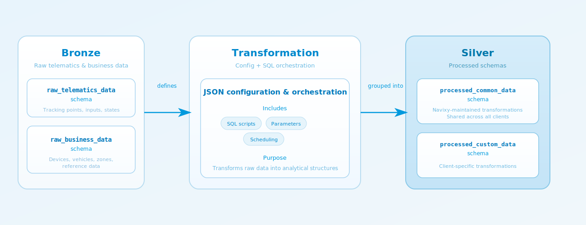
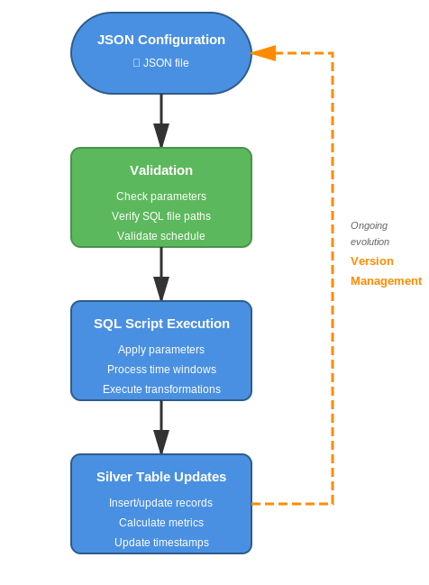
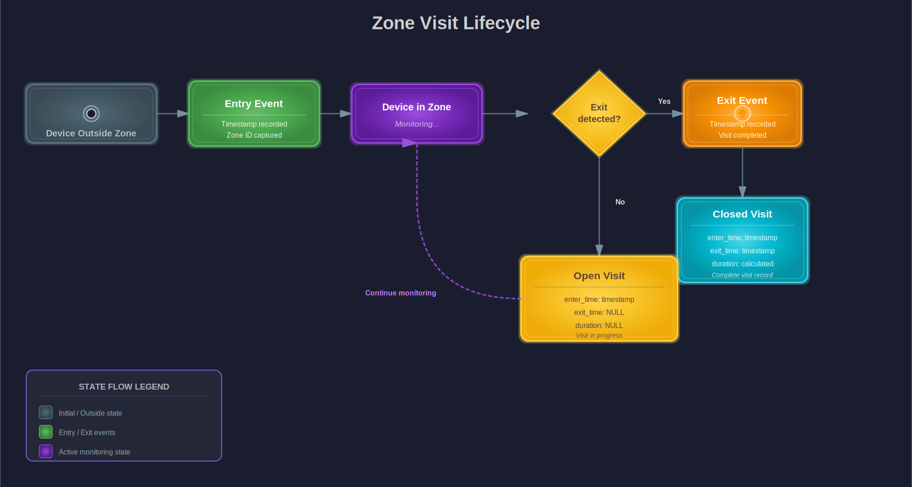
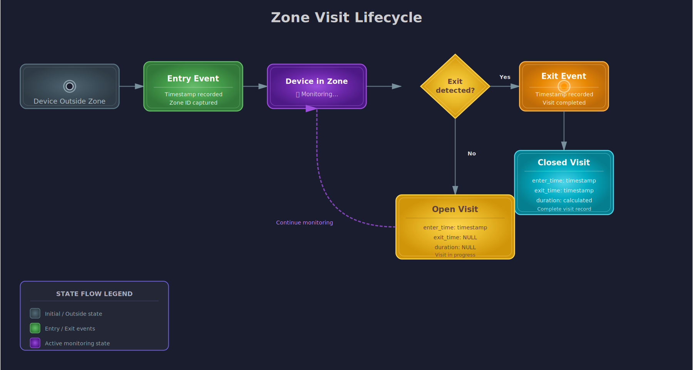

# Silver layer


### **Coming soon!**&#x20;

The Silver layer architecture described in this document is currently in development. While the core transformation capabilities are operational, the configuration system and its implementation details may evolve before final release. \
If you're interested in early access or have questions about this functionality, please contact [iotquery@navixy.com](mailto:iotquery@navixy.com).


The Silver layer transforms raw telematic data and business information into normalized, query-ready entities with predefined metrics and structures. The Bronze layer contains everything captured from devices and systems—individual points, events, and field values convenient for verification and troubleshooting. The Silver layer processes this raw data into meaningful entities like trips, zone visits, and operational states through configurable transformations that clean, standardize, and aggregate data into understandable analytical objects.

> :bulb: **Silver layer in brief**: Bronze is everything collected, Silver is what you can work with.

This intermediate layer eliminates repetitive manual ETL work and prepares data for practical analytics. Fleet operators get answers to common questions without extensive data processing, while integrators gain a stable foundation for building scalable functionality.

## Architecture and capabilities

The Silver layer organizes processed data into two distinct schemas that reflect different transformation sources and access patterns. Both schemas operate at the Silver layer level of the medallion architecture, positioned above Bronze layer schemas (`raw_business_data` and `raw_telematics_data`) and below the Gold layer.

#### Schema structure

The Silver layer uses a dynamic schema approach where database structures form automatically based on active transformations. Unlike the Bronze layer with its fixed schema definitions, Silver layer schemas contain only the tables that correspond to configured and deployed transformations. This means the available tables and their structures depend on which transformations are currently active in your **IoT Query** instance.

<figure><figcaption></figcaption></figure>

Silver layer data is organized into two PostgreSQL schemas:

* **processed\_common\_data**: Contains transformations developed and maintained by Navixy. This schema is shared across all clients, providing standardized analytical entities that address common telematics use cases. Tables appear in this schema as Navixy develops and deploys new transformations to address widely applicable analytical requirements.
* **processed\_custom\_data**: Contains client-specific transformations created to address unique business requirements. Each client has an isolated instance of this schema, enabling custom analytical entities without affecting other clients. Tables in this schema correspond to transformations configured specifically for your organization.

Both schemas operate through JSON-based transformation configurations. When a transformation is configured and activated, the system automatically creates the corresponding table structure within the appropriate schema. When transformations are removed or deactivated, their tables may be archived or removed based on data retention policies.


This dynamic formation is why Silver layer documentation does not provide fixed schema descriptions like the Bronze layer does. Instead, the available tables and their structures reflect the specific transformations configured for your IoT Query instance. To understand what data is available in your Silver layer, review the transformation documentation for entities that have been deployed to your instance.


### Processing architecture


{% column width="58.333333333333336%" %}
Silver layer transformations operate through a configuration-driven architecture that separates business logic from orchestration. Each transformation is defined by a JSON configuration that specifies the SQL processing logic, parameters, scheduling, and recalculation behavior. Apache Airflow manages the execution lifecycle, applying these configurations to process Bronze layer data into Silver layer entities.

The JSON configuration structure remains identical for both common and custom transformations, ensuring consistent processing patterns across all Silver layer entities. This unified configuration approach enables flexible transformation deployment while maintaining standardized execution and version control.&#x20;


{% column width="41.666666666666664%" %}
<figure><figcaption></figcaption></figure>



For detailed information about the JSON configuration system, see the [Configuration JSON](silver-layer.md#configuration-json) section.

### Data freshness

Silver layer entities are maintained automatically through scheduled processes defined in transformation configurations. When you query Silver layer data, consider these processing characteristics:

* **Scheduled updates**: Each transformation processes new Bronze layer data according to its configured schedule. Updates typically occur hourly or every few hours depending on transformation complexity.
* **Processing windows**: Transformations operate on time-based windows to efficiently process manageable data segments rather than entire datasets.
* **Recalculation impact**: When configuration changes trigger recalculation, recent data may show brief inconsistencies during processing windows.
* **Schema-specific behavior**: Transformations in `processed_common_data` update simultaneously for all clients sharing that schema. Transformations in `processed_custom_data` execute independently per client, allowing customized scheduling and processing logic.

## Configuration JSON


This section describes the configuration architecture currently under development. The JSON structure and parameter specifications shown here represent the planned implementation approach. Final implementation details may differ as development progresses.


The Silver layer operates on a configuration-driven architecture where transformations are defined by JSON specifications. Each configuration contains the processing logic, transformation parameters, scheduling rules, and recalculation policies that determine how Bronze layer data becomes Silver layer entities.

### JSON structure

A transformation configuration consists of four sections:

* **version** (string): Configuration version following semantic versioning
* **metadata** (object): Basic information including name, description, creation timestamp, and creator identifier
* **sql\_template** (object): Processing logic specification including SQL file paths, target table definitions, and transformation parameters
* **target** (object): Output location specifying schema and table
* **scheduler** (object): Execution control including cron schedule, enablement status, and backfill configuration

#### Configuration schema

```json
{
  "version": "<semantic_version>",
  "metadata": {
    "name": "<transformation_name>",
    "description": "<transformation_description>",
    "created_at": "<iso_8601_timestamp>",
    "created_by": "<creator_identifier>"
  },
  "sql_template": {
    "sql_file": "<path_to_primary_sql_script>",
    "sql_file_1": "<path_to_additional_sql_script>",
    "table_name": "<schema.table_for_source_data>",
    "parameters": {
      "<parameter_name_1>": "<parameter_value_1>",
      "<parameter_name_2>": "<parameter_value_2>"
    }
  },
  "target": {
    "schema": "<output_schema>",
    "table": "<output_table>"
  },
  "scheduler": {
    "cron_expression": "<cron_schedule>",
    "enabled": <boolean>,
    "backfill": {
      "backfill_allowed": <boolean>,
      "start_date": "<iso_8601_date>",
      "end_date": "<iso_8601_date>"
    }
  }
}
```

### SQL script parameterization

Transformation SQL scripts reference configuration parameters using colon-prefixed placeholders. The system substitutes actual values from the configuration when executing scripts and provides standard time window parameters automatically:

* **:window\_start** - Start of processing time window (ISO-8601 timestamp)&#x20;
* **:window\_end** - End of processing time window (ISO-8601 timestamp)

Custom parameters are defined in the `sql_template.parameters` section and control transformation-specific logic such as quality thresholds, business rules, and calculation methods.

Example SQL with parameters:

```sql
SELECT device_id, device_time, speed
FROM raw_telematics_data.tracking_data_core
WHERE device_time >= :window_start
  AND device_time < :window_end
  AND satellites >= :min_satellites
  AND speed >= :min_speed_kmh;
```

### Configuration versioning

When any configuration parameter changes, a new version is created. Each version represents a specific set of processing rules that were active during a time period, enabling tracking of how transformation logic evolved.

**Version creation triggers**:

* Any parameter in `sql_template.parameters` changes
* SQL script file paths are modified
* Target schema or table changes
* Scheduler or backfill settings are adjusted

**Version application**: When a new configuration version is created and applied, the system processes data based on the selected recalculation mode.

## Recalculation modes

The configuration system supports three recalculation modes that control how parameter changes affect historical and future data. These modes provide flexibility in balancing data consistency requirements with processing efficiency.

### Forward-only recalculation

Forward-only mode applies new configuration parameters only to data processed after the version change. Historical data remains unchanged, preserving values calculated with previous parameters.

**When to use**: Minor parameter adjustments that don't fundamentally change entity definitions, testing new parameters before full recalculation, or managing computation costs by avoiding historical reprocessing.

**Behavior**: If you change `min_speed_kmh` from 3 to 5 on December 8, only trips processed from December 8 onwards use the new threshold. Trips calculated before December 8 retain their original values.

### Full history recalculation

Full recalculation mode processes all historical data within the configured backfill date range using new parameters. The system replaces all existing entities with newly calculated values.

**When to use**: Fundamental changes to entity definitions or detection algorithms, correcting systematic errors in previous calculations, or standardizing all historical data with current business rules.

**Behavior**: Changing trip detection logic requires recalculating all trips to ensure consistent entity definitions across the entire time range.

### Partial recalculation

Partial recalculation mode processes a limited time window of historical data, typically recent days or weeks.

**When to use**: Correcting recent data quality issues, updating parameters that primarily affect recent operational patterns, or implementing changes with limited historical impact.

**Configuration**: Specify a `backfill_days` parameter (e.g., 7 for last week) either in the configuration or when manually triggering recalculation. The system updates existing records within the specified time window.

## Available transformations

The Silver layer currently provides two transformation groups that demonstrate the configuration-driven approach and serve as templates for developing custom entities.

### Trips

It is a movement tracking transformation that identifies continuous movement segments from raw tracking data and calculates comprehensive trip metrics.

**Quick reference**:

* **Purpose**: Convert point-level location data into trip-level analytics
* **Main table**: `business_data.tracks`
* **Key metrics**: Distance, duration, speed statistics, geographic boundaries
* **Source data**: `raw_telematics_data.tracking_data_core`, `raw_telematics_data.states`

**Table: business\_data.tracks**

The tracks table stores aggregated information about continuous movement segments with pre-calculated metrics and geographic context.

**Primary key**: `track_id` (auto-increment unique identifier)

**Field descriptions**:

The `track_id` field uniquely identifies each trip segment. The `device_id` field references the tracking device from Bronze layer. The `track_start_time` and `track_end_time` fields define trip temporal boundaries. The `track_duration` field provides human-readable duration format while `track_duration_seconds` enables numeric calculations. The `track_distance_meters` field contains total distance traveled. Speed fields (`avg_speed`, `max_speed`, `min_speed`) provide statistical summary in kilometers per hour. Starting coordinates (`latitude_start`, `longitude_start`, `altitude_start`) and ending coordinates (`latitude_end`, `longitude_end`, `altitude_end`) define geographic boundaries. The `points_in_track` field indicates data quality through point count. The `start_zone` and `end_zone` fields link to zone reference data when trips begin or end within defined zones.

**Data relationships**:

```sql
-- Join with device information
FROM business_data.tracks AS t
JOIN raw_business_data.devices AS d
  ON t.device_id = d.device_id

-- Join with vehicle details
FROM business_data.tracks AS t
JOIN raw_business_data.devices AS d
  ON t.device_id = d.device_id
JOIN raw_business_data.vehicles AS v
  ON d.object_id = v.object_id
```

**Trip detection algorithm**

The transformation identifies trips using movement detection that analyzes speed, distance, and temporal patterns. A trip represents a continuous segment of movement separated from other trips by parking periods or data gaps.

<figure><figcaption></figcaption></figure>

The system starts a new trip when the first tracking point appears for a device, when movement begins after parking duration exceeding the configured threshold, when movement resumes after a data gap exceeding the configured timeout, or when a single LBS (cell tower) location point is recorded. The system ends a trip when movement stops and parking duration reaches the configured threshold, or when a data gap exceeding the timeout occurs.

**Movement classification**:

* **Moving**: Speed ≥ configured threshold
* **Parking**: Speed < threshold AND duration ≥ configured parking duration
* **Data gap**: Time between points ≥ configured split timeout

**Quality validation**: \
Generated trips must meet configurable quality thresholds to be included—minimum 2 tracking points, maximum speed ≥ configured threshold, total distance ≥ configured threshold, and defined start and end times. The system filters anomalous data including unrealistic speeds for LBS points, zero coordinates, and insufficient satellite coverage.

**Metric calculation**: \
Trip metrics are computed from validated tracking points. Distance represents total geometric length. Speed statistics include average, maximum, and minimum values from point velocities. Duration is the time difference between end and start times. Geographic boundaries capture first and last point coordinates. Zone association matches start and end zones from reference data when trips begin or end within defined zones.

**Configuration parameters**

| Parameter                       | Description                                       | Unit    |
| ------------------------------- | ------------------------------------------------- | ------- |
| min\_parking\_seconds           | Duration threshold for parking detection          | seconds |
| tracks\_split\_timeout\_seconds | Maximum gap between points before splitting trips | seconds |
| min\_distance\_meters           | Minimum trip distance for quality validation      | meters  |
| min\_speed\_kmh                 | Minimum speed threshold for movement detection    | km/h    |
| max\_lbs\_speed\_kmh            | Maximum realistic speed for LBS points            | km/h    |
| min\_satellites                 | Minimum satellite count for GPS quality           | count   |

**Configuration example**

```json
{
  "version": "1.0.0",
  "metadata": {
    "name": "Movement Tracking Transformation",
    "description": "Processes raw tracking data into trip entities with quality validation and metric calculation",
    "created_at": "2025-01-15T00:00:00Z",
    "created_by": "system"
  },
  "sql_template": {
    "sql_file": "/opt/airflow/dags/repo/sql-file/tracks.sql",
    "table_name": "business_data.tracks",
    "parameters": {
      "min_parking_seconds": 300,
      "tracks_split_timeout_seconds": 1200,
      "min_distance_meters": 100,
      "min_speed_kmh": 3,
      "max_lbs_speed_kmh": 200,
      "min_satellites": 4
    }
  },
  "target": {
    "schema": "business_data",
    "table": "tracks"
  },
  "scheduler": {
    "cron_expression": "0 */8 * * *",
    "enabled": true,
    "backfill": {
      "backfill_allowed": true,
      "start_date": "2024-01-01",
      "end_date": "2025-12-31"
    }
  }
}
```

**SQL script example**

The following simplified SQL demonstrates parameter usage in transformation logic:

```sql
-- Trip detection with configurable parameters
WITH tracking_with_gaps AS (
    SELECT 
        device_id,
        device_time,
        latitude,
        longitude,
        speed,
        satellites,
        LAG(device_time) OVER (PARTITION BY device_id ORDER BY device_time) as prev_time,
        LAG(speed) OVER (PARTITION BY device_id ORDER BY device_time) as prev_speed
    FROM raw_telematics_data.tracking_data_core
    WHERE device_time >= :window_start
      AND device_time < :window_end
      AND satellites >= :min_satellites
      AND latitude != 0 AND longitude != 0
),
trip_boundaries AS (
    SELECT *,
        CASE 
            WHEN prev_speed < :min_speed_kmh 
                 AND EXTRACT(EPOCH FROM (device_time - prev_time)) >= :min_parking_seconds
                 AND speed >= :min_speed_kmh
            THEN true
            WHEN EXTRACT(EPOCH FROM (device_time - prev_time)) >= :tracks_split_timeout_seconds
            THEN true
            ELSE false
        END as is_trip_start
    FROM tracking_with_gaps
)
INSERT INTO business_data.tracks (device_id, track_start_time, track_end_time)
SELECT device_id, MIN(device_time), MAX(device_time)
FROM trip_boundaries
WHERE speed >= :min_speed_kmh
GROUP BY device_id, SUM(is_trip_start::int) OVER (PARTITION BY device_id ORDER BY device_time);
```

<details>

<summary><strong>Example queries</strong></summary>

Get all trips for a specific device:

```sql
SELECT 
    track_id,
    track_start_time,
    track_end_time,
    track_duration,
    track_distance_meters,
    avg_speed,
    start_zone,
    end_zone
FROM business_data.tracks
WHERE device_id = 12345
ORDER BY track_start_time DESC;
```

Calculate daily distance summary:

```sql
SELECT 
    DATE(track_start_time) as trip_date,
    COUNT(*) as total_trips,
    SUM(track_distance_meters) / 1000.0 as total_km,
    AVG(avg_speed) as avg_speed_kmh,
    SUM(track_duration_seconds) / 3600.0 as total_hours
FROM business_data.tracks
WHERE device_id = 12345
  AND track_start_time >= CURRENT_DATE - INTERVAL '30 days'
GROUP BY DATE(track_start_time)
ORDER BY trip_date DESC;
```

Find trips between specific zones:

```sql
SELECT 
    t.track_id,
    t.track_start_time,
    t.track_duration,
    t.track_distance_meters / 1000.0 as distance_km,
    t.start_zone,
    t.end_zone,
    v.license_plate
FROM business_data.tracks AS t
JOIN raw_business_data.devices AS d
  ON t.device_id = d.device_id
JOIN raw_business_data.vehicles AS v
  ON d.object_id = v.object_id
WHERE t.start_zone = 'Distribution Center'
  AND t.end_zone = 'Customer Site A'
  AND t.track_start_time >= CURRENT_DATE - INTERVAL '7 days'
ORDER BY t.track_start_time DESC;
```

</details>

### Geofences

The Geofences transformation pre-computes geographic boundaries as PostGIS geometries and tracks when devices enter, remain within, and exit these defined areas. This processing eliminates the need for real-time spatial calculations during queries, significantly improving performance for location-based analytics.

This transformation demonstrates spatial data processing and event detection from continuous location streams.

**Quick reference**:

* **Purpose**: Pre-compute geofence geometries and track device presence in geographic areas
* **Main tables**: `business_data.geofence_geometries`, `business_data.geofence_visits`
* **Key metrics**: Visit duration, entry/exit times, geofence utilization
* **Performance benefit**: 10-100x faster spatial queries vs. on-the-fly geometry computation
* **Source data**: `raw_business_data.zones`, `raw_business_data.geofence_points`, `raw_telematics_data.tracking_data_core`

#### **Table: `business_data.geofence_geometries`**

The geofence\_geometries table stores optimized geometric representations of geofences for efficient spatial queries.

**Primary key**: `geofence_id`

**Field descriptions**:

The `geofence_id` field uniquely identifies each geofence and references `raw_business_data.zones.zone_id`. The `geofence_type` field indicates geofence shape (circle, polygon, or route). The `geofence_label` field contains the geofence name for display and reference. The `address` field stores the geofence location description. The `color` field holds the HEX color code for visualization. The `geofence_geom` field contains the geographic representation for spatial operations. The `created_at` and `updated_at` fields track temporal changes.

**Geofence type specifications**:

* **Circle**: Defined by center point and radius
* **Polygon**: Ordered points forming closed shape
* **Route**: Line path with buffer radius

**Synchronization behavior**: The table automatically synchronizes when source geofence data changes in Bronze layer.

#### **Table: `business_data.geofence_visits`**

The geofence\_visits table records historical device presence within geofences including entry time, exit time, and visit duration.

**Primary key**: Composite key on (`device_id`, `geofence_id`, `enter_time`)

**Field descriptions**:

The `device_id` field references the tracking device. The `geofence_id` field references the geofence from geofence\_geometries. The `enter_time` field marks when the device entered the geofence. The `exit_time` field marks when the device exited (NULL for ongoing visits). The `duration` field contains the calculated visit length.

#### **Data relationships**:

```sql
-- Join with geofence details
FROM business_data.geofence_visits AS gv
JOIN business_data.geofence_geometries AS gg
  ON gv.geofence_id = gg.geofence_id

-- Join with device and vehicle information
FROM business_data.geofence_visits AS gv
JOIN raw_business_data.devices AS d
  ON gv.device_id = d.device_id
JOIN raw_business_data.vehicles AS v
  ON d.object_id = v.object_id
```

**Visit detection algorithm**

The transformation tracks device presence within geofences by comparing tracking points against geofence geometries. Visit records capture when devices enter, remain within, and exit defined geofences.

<figure><figcaption></figcaption></figure>

**Entry detection**: The system detects entry when a device tracking point falls within geofence geometry and the previous point was outside this geofence or no previous point exists.

**Exit detection**: The system detects exit when a device tracking point falls outside geofence geometry and the previous point was inside the geofence.

**Visit grouping**: Consecutive entry-exit pairs form a single visit record. Open visits (no exit detected) show NULL in exit\_time and are updated when exit occurs in subsequent processing cycles.

**Duration calculation**: Visit duration is computed as the time difference between entry and exit events. Open visits show NULL duration until an exit is detected.

**Configuration parameters**

| Parameter                     | Description                                     | Unit    |
| ----------------------------- | ----------------------------------------------- | ------- |
| spatial\_buffer\_meters       | Buffer distance for geofence boundary detection | meters  |
| min\_visit\_duration\_seconds | Minimum visit duration to record                | seconds |
| max\_visit\_gap\_seconds      | Maximum time gap before considering visit ended | seconds |

**Configuration example**

```json
{
  "version": "1.0.0",
  "metadata": {
    "name": "Geofences Transformation",
    "description": "Pre-computes geofence geometries and tracks device presence within defined geographic areas",
    "created_at": "2025-01-15T00:00:00Z",
    "created_by": "system"
  },
  "sql_template": {
    "sql_file": "/opt/airflow/dags/repo/sql-file/geofence_visits.sql",
    "table_name": "business_data.geofence_visits",
    "parameters": {
      "spatial_buffer_meters": 50,
      "min_visit_duration_seconds": 60,
      "max_visit_gap_seconds": 1800
    }
  },
  "target": {
    "schema": "business_data",
    "table": "geofence_visits"
  },
  "scheduler": {
    "cron_expression": "0 * * * *",
    "enabled": true,
    "backfill": {
      "backfill_allowed": true,
      "start_date": "2024-01-01",
      "end_date": "2025-12-31"
    }
  }
}
```

<details>

<summary><strong>Example queries</strong></summary>

Get all visits to a specific geofence:

```sql
SELECT 
    gv.device_id,
    gv.enter_time,
    gv.exit_time,
    gv.duration,
    v.license_plate,
    gg.geofence_label
FROM business_data.geofence_visits AS gv
JOIN business_data.geofence_geometries AS gg
  ON gv.geofence_id = gg.geofence_id
JOIN raw_business_data.devices AS d
  ON gv.device_id = d.device_id
JOIN raw_business_data.vehicles AS v
  ON d.object_id = v.object_id
WHERE gg.geofence_label = 'Main Warehouse'
  AND gv.enter_time >= CURRENT_DATE - INTERVAL '7 days'
ORDER BY gv.enter_time DESC;
```

Calculate geofence utilization statistics:

```sql
SELECT 
    gg.geofence_label,
    COUNT(*) as total_visits,
    COUNT(DISTINCT gv.device_id) as unique_devices,
    AVG(EXTRACT(EPOCH FROM gv.duration) / 60) as avg_duration_minutes,
    MAX(EXTRACT(EPOCH FROM gv.duration) / 60) as max_duration_minutes
FROM business_data.geofence_visits AS gv
JOIN business_data.geofence_geometries AS gg
  ON gv.geofence_id = gg.geofence_id
WHERE gv.enter_time >= CURRENT_DATE - INTERVAL '30 days'
  AND gv.exit_time IS NOT NULL
GROUP BY gg.geofence_label
ORDER BY total_visits DESC;
```

Find currently present devices:

```sql
SELECT 
    gg.geofence_label,
    gv.device_id,
    v.license_plate,
    gv.enter_time,
    NOW() - gv.enter_time as time_in_geofence
FROM business_data.geofence_visits AS gv
JOIN business_data.geofence_geometries AS gg
  ON gv.geofence_id = gg.geofence_id
JOIN raw_business_data.devices AS d
  ON gv.device_id = d.device_id
JOIN raw_business_data.vehicles AS v
  ON d.object_id = v.object_id
WHERE gv.exit_time IS NULL
ORDER BY gg.geofence_label, gv.enter_time;
```

Analyze geofence entry/exit patterns by hour:

```sql
SELECT 
    gg.geofence_label,
    EXTRACT(HOUR FROM gv.enter_time) as entry_hour,
    COUNT(*) as entries,
    AVG(EXTRACT(EPOCH FROM gv.duration) / 60) as avg_visit_minutes
FROM business_data.geofence_visits AS gv
JOIN business_data.geofence_geometries AS gg
  ON gv.geofence_id = gg.geofence_id
WHERE gv.enter_time >= CURRENT_DATE - INTERVAL '30 days'
  AND gv.exit_time IS NOT NULL
GROUP BY gg.geofence_label, EXTRACT(HOUR FROM gv.enter_time)
ORDER BY gg.geofence_label, entry_hour;
```

Identify devices with longest dwell times:

```sql
SELECT 
    gg.geofence_label,
    v.license_plate,
    gv.enter_time,
    gv.exit_time,
    gv.duration,
    EXTRACT(EPOCH FROM gv.duration) / 3600 as duration_hours
FROM business_data.geofence_visits AS gv
JOIN business_data.geofence_geometries AS gg
  ON gv.geofence_id = gg.geofence_id
JOIN raw_business_data.devices AS d
  ON gv.device_id = d.device_id
JOIN raw_business_data.vehicles AS v
  ON d.object_id = v.object_id
WHERE gv.exit_time IS NOT NULL
  AND gv.enter_time >= CURRENT_DATE - INTERVAL '7 days'
ORDER BY gv.duration DESC
LIMIT 20;
```

</details>

## Custom entity development

The Silver layer demonstrates transformation patterns through its available transformations, which serve as templates for developing custom analytical entities. Using Bronze layer data, SQL capabilities, and the configuration architecture, custom entities can be developed to address specific business requirements.

#### Development approach

Custom Silver layer entities follow the configuration-driven architecture described in this document. The approach involves defining transformation logic in SQL scripts and creating JSON configurations that specify parameters and schedules for automated execution.

**Key capabilities**: Aggregate multiple raw data points into single analytical objects, apply business logic and validation rules, pre-calculate metrics to accelerate queries, maintain temporal accuracy through scheduled processing, and integrate spatial operations with business context.

#### Potential custom entity types

* **Operational entities**: Company-specific operational states and work modes, shift patterns and duty cycle tracking, asset utilization metrics, maintenance window detection
* **Behavioral entities**: Custom risk scoring based on multiple factors, driving pattern analysis and classification, compliance monitoring with configurable thresholds, safety indicator aggregation
* **Performance entities**: Industry-specific metrics and KPIs, efficiency calculations using custom formulas, resource optimization indicators, service level achievement tracking
* **Event-based entities**: Custom event detection with complex conditions, alert aggregation and pattern recognition, anomaly identification using statistical methods, threshold violation tracking

#### Configuration template

```json
{
  "version": "1.0.0",
  "metadata": {
    "name": "<custom_entity_name>",
    "description": "<transformation_purpose_and_business_value>",
    "created_at": "<iso_8601_timestamp>",
    "created_by": "<developer_identifier>"
  },
  "sql_template": {
    "sql_file": "/opt/airflow/dags/repo/sql-file/<custom_entity>.sql",
    "table_name": "business_data.<custom_entity>",
    "parameters": {
      "<threshold_parameter>": <numeric_value>,
      "<time_window_parameter>": <numeric_value>,
      "<filter_enabled_parameter>": <boolean_value>
    }
  },
  "target": {
    "schema": "business_data",
    "table": "<custom_entity>"
  },
  "scheduler": {
    "cron_expression": "<cron_schedule>",
    "enabled": true,
    "backfill": {
      "backfill_allowed": true,
      "start_date": "<iso_8601_date>",
      "end_date": "<iso_8601_date>"
    }
  }
}
```

#### SQL script guidelines

Use parameterized values:

```sql
WHERE value >= :custom_threshold
  AND duration_seconds <= :time_window_seconds
  AND (:quality_filter_enabled = false OR quality_score >= 0.8)
```

Leverage standard time windows:

```sql
FROM raw_telematics_data.tracking_data_core
WHERE device_time >= :window_start
  AND device_time < :window_end
```

Structure processing in stages:

```sql
WITH raw_data AS (
    -- Extract and filter source data
),
enriched_data AS (
    -- Join with reference data and calculate intermediate values
),
aggregated_entities AS (
    -- Aggregate into final entity structure
)
INSERT INTO business_data.custom_entity (...)
SELECT ... FROM aggregated_entities;
```

## Additional resources

For detailed query patterns and working with Silver layer data, refer to the [IoT Query SQL Recipe Book](https://www.navixy.com/docs/analytics/example-queries).

If you're interested in early access or have questions about this functionality, please contact [iotquery@navixy.com](mailto:iotquery@navixy.com).
