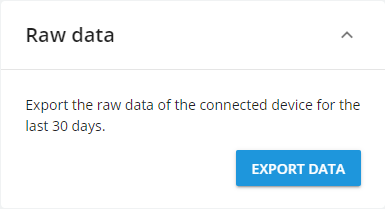
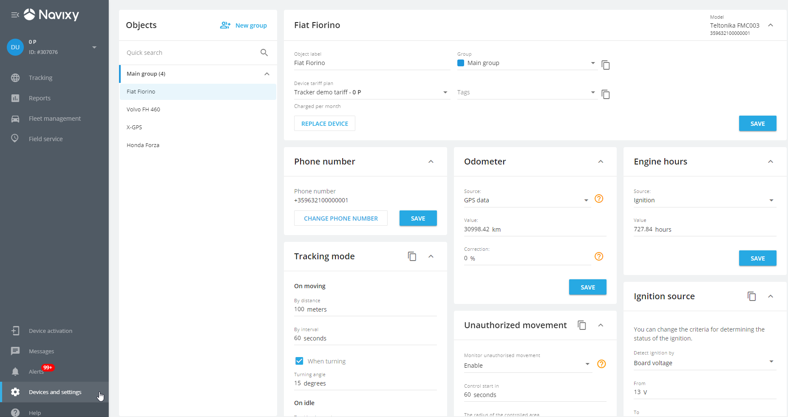
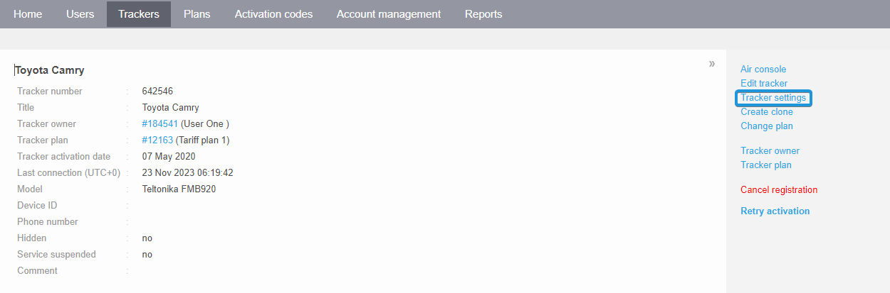
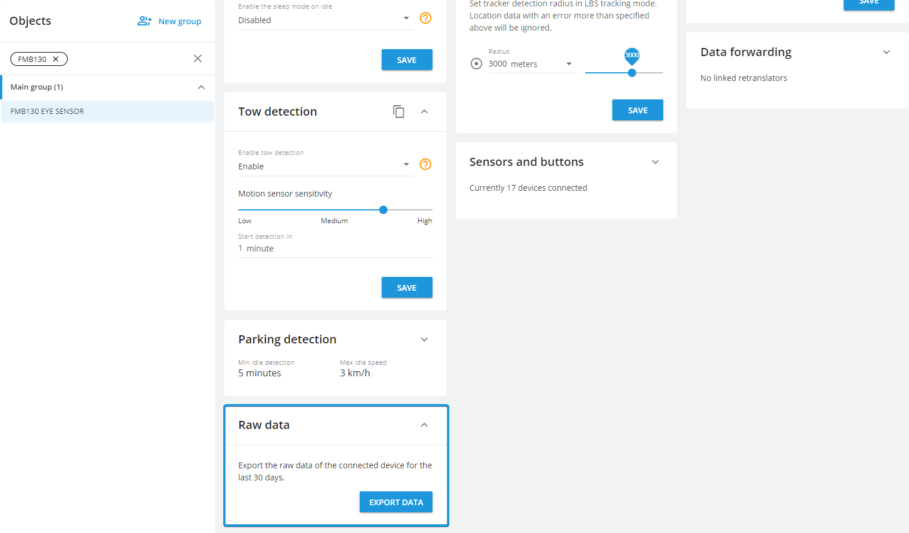
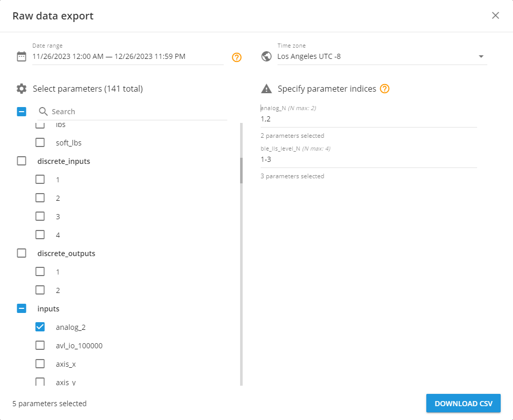
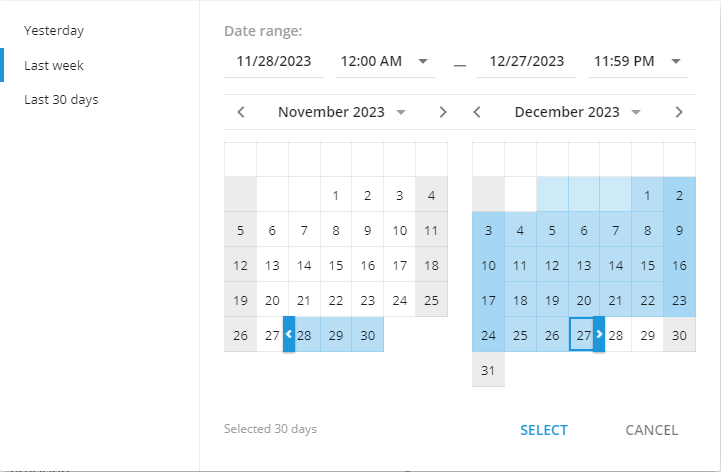
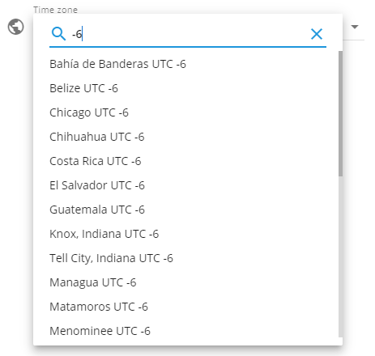
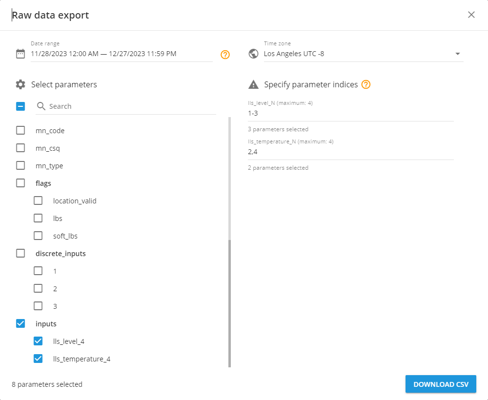
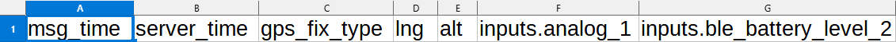

# Save IoT data to CSV file

- [Raw data export](#raw-data-export)
  - [Raw data export features](#raw-data-export-features)
- [Typical use cases for raw data export](#typical-use-cases-for-raw-data-export)
  - [Analytics, Machine Learning, and AI](#analytics-machine-learning-and-ai)
  - [GPS tracker configuration checks](#gps-tracker-configuration-checks)
  - [Sensor data diagnostics](#sensor-data-diagnostics)
  - [Diagnostics for rules triggering](#diagnostics-for-rules-triggering)
  - [Device offline diagnostics](#device-offline-diagnostics)
  - [Custom solutions for customers](#custom-solutions-for-customers)
- [How to use raw data export](#how-to-use-raw-data-export)
  - [Choosing the date range](#choosing-the-date-range)
  - [Choosing a time zone](#choosing-a-time-zone)
  - [Selecting parameters](#selecting-parameters)
- [Downloading the raw data file](#downloading-the-raw-data-file)

In certain instances TSPs, integrators, and developers, need to see the original, unaltered data from their GPS trackers. This unadulterated data is frequently referred to as "raw data". Checking out raw data allows them to gain a deeper understanding of the collected data and obtain a clearer perspective on its characteristics.

Examining raw data can also decrease the time is taking to figure out why devices aren't working properly. This means you can help users fix problems faster, which can make them trust your product more. Plus, it lets you spend more time on creating new solutions for your customers.

Furthermore, recent advancements in technology, artificial intelligence, and machine learning are creating fresh ways to use this data. You can grab this raw data and use it in other systems (i.e. CRM, ERP, etc) for more analysis or in different parts of your business. This way helps you to retrieve raw data in one step, instead of collecting data from devices and sensors via different API calls.

Let's dive deeper into the "raw data". Drawing from the valuable feedback provided by our partners, as well as conducting experiments in Navixy Lab, we have crafted a concise definition below.

> [!INFO]
> Parsed raw data is the outcome following the decoding (parsing) of incoming data packets, considering the protocol and specificities of the originating device model. Post-decoding, the packet is stored as universal platform parameters such as latitude, longitude, can\_fuel\_liters, etc.

## Raw data export

From our research and development, we've made a new tool. This tool lets TSPs, integrators, developers, and even advanced users get parsed raw data from any of their devices. They can collect data on any parameters from the past 30 days in a CSV format. To make this easy to use, we've added a raw data export section to the user interface under 'Devices and Settings.'

We picked the CSV file format for its simplicity and common use. It's easy to turn into tables or give to programs that use artificial intelligence or machine learning.

### Raw data export features

Let's dive into the features of this new tool:

- It lets you upload parsed raw data for any GPS tracker on our platform.
- You can choose any parameters from all available device models to include in your file. Plus, you can select only the parameters that are useful for your specific task. To pick parameters, you can easily search in the list of available options for your chosen GPS tracker.
- There's no need to turn data saving before you wish to obtain the data. All data for all devices are automatically recorded. You can download this data whenever you want.
- You can access up to 30 days of parsed raw data for any GPS tracker.
- For large clients operating in different countries and time zones, we've made it easier to work with information. The tool can adjust the timestamps of packets to match your selected time zone.

## Typical use cases for raw data export

Like we mentioned before, this new tool is handy for anyone who uses GPS trackers. Now, let's talk about some of the ways you might use this tool.

### Analytics, Machine Learning, and AI

You can use the incoming data from GPS trackers in a form that machines can read. This data can be given to artificial intelligence or machine learning to process. There are endless ways to use this data. For example, AI could check for and point out when vehicles, their resources, and fuel are being used improperly, or it could create heatmaps.

### GPS tracker configuration checks

You can check how your trackers is set up by looking at the data on parameters. You can see if a parameter is set to send data to the platform and whether its data is received in the device packets. For instance, if there's no data, that means the parameter isn't set to send or the sensor has been disconnected from the GPS device and is sending an error code or no information at all.

### Sensor data diagnostics

You can check how the sensor is working by reading information without multipliers or calibration tables. For example, if the fuel sensor contacts have rusted, the platform might get distorted fuel level readings. It's much harder to spot these changes using calibrated data and fuel level change reports than raw data. So, the downloaded data will be really helpful for fine-tuning and fixing incorrect operation. The data can also be used to recalibrate the sensor if it's showing incorrect data.

### Diagnostics for rules triggering

You can check how devices process events by tracking event IDs. You can try to manually trigger an event and test if the platform triggers it and if the device sent data about it.

### Device offline diagnostics

You can more accurately figure out why a device is offline. Like the others, this is a common situation. For example, if the device stopped showing up on the platform, exporting raw data lets you see what data about signal strength, internal and external battery level was being sent to the platform before it disconnected. There might have been some disconnection events, but no rule was made. Without this tool, you could only gather information about the external battery through a report, and for events without a rule, you'd have to check with support. Now, you can track historical readings for all parameters at once to find possible reasons for the device disconnecting or not getting data from the device.

### Custom solutions for customers

You can create custom solutions for your customers. For instance, a customer often needs data for analytics on different device readings in one report. Now, you can do this using raw device data. You can also use this data in Grafana or PowerBi to build advanced analytics.

## How to use raw data export

First, you need to go to the 'devices and settings' section and look for the device you're interested in on the user interface:

Or, find the tracker settings for a specific device in the admin panel:

Next, click the 'Export data' button in the 'Raw data' portlet:

This will open the 'Raw data export' tool. Here, you need to choose the date range, timezone, and parameters that you want to include in a csv file.

We've made sure that you won't accidentally close the window by clicking outside the 'Raw data export' tool. You can only close it by clicking the 'X' in the top right corner. Also, if you haven't chosen another device or refreshed the page, the 'Raw data export' tool will remember all the settings you previously selected. This makes it easy to check any GPS tracker or sensor settings, go back, and keep working.

### Choosing the date range

This process is just like when you're creating a travel history. You can pick a maximum of the last 30 days.

Select a date range either by clicking on the calendar or by entering the dates manually. You can also set a specific time. Here are some handy options to quickly choose a period:

- Yesterday
- Last week
- Last 30 days

When you click on these, the platform will automatically pick the right range.

To make it easier for you, we added a counter on how many days you've selected. If you try to pick a date that's more than 30 days ago, you'll get a message. The selection button won't be available.

### Choosing a time zone

You can pick any time zone you need. For instance, if you need to give data for AI or ML, which needs one same time zone for all messages, even if you're providing services in different countries and time zones.

Here's how you can choose the time zone you want:

- Pick one from a list of all the possible time zones.
- Enter the name of the time zone.
- Enter the time zone, for example -8, +2, etc.

### Selecting parameters

The list of parameters you can choose from may vary depending on the model. It includes all possible parameters that have been integrated into the platform for each model. You can select up to 1000 parameters in total.

Here's what you can do:

- Select all parameters by clicking the checkbox on the left of the search.
- Pick only the parameters you need by clicking the checkbox on the left of every parameter on the list.
- Find the parameters you need by entering their name or part of their name.

If there is more than one input of the same type, they are numbered (2, 3, 4...). In this case, only the input with the highest indice is returned. For example, if AVL IOs from 1 to 100000 are available for a device, only avl\_io\_100000 is returned, even though AVL IOs with smaller indices also exist.

Once you select such an indice parameter on the right side, the platform will ask you to specify which indices should be added to the file. Enter a list of numbers separated by commas, or define a range of numbers with a dash. For example, 1-2, 4, 7.

For all parameters and each indice parameter, you will see a count showing how many you've already chosen.

Each parameter you choose will add an extra column to the file.

## Downloading the raw data file

Once you've chosen all the parameters, click the 'Download CSV' button to start the download. You can open the file with any text editor or table viewer. This CSV file uses a comma to separate the data.

The file name includes the device ID, tracker label, and the date and time range within the timezone.

Each row, starting from the second one, is a message from the device sent to the platform. The first row always shows the message time in the selected time zone and the rest are the parameters you selected.

For more information about reading and understanding the raw data file [follow our next article](save-iot-data-to-csv-file/columns-in-csv-file.md).

We hope this new tool will prove helpful for your business and your customers. It should allow you to create many new solutions using raw data files. Remember, even the smallest details can lead to big discoveries. Happy exploring!