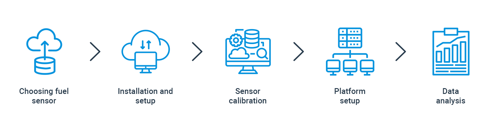

# Fundamentals of fuel management

- [Introduction](#introduction)
- [Quality of sensors](#quality-of-sensors)
- [Proper installation](#proper-installation)
- [Tare (calibration)](#tare-calibration)
- [System customization](#system-customization)
- [Data checking](#data-checking)
- [Conclusion](#conclusion)

### Introduction

Effective fuel management in vehicle fleets is a pressing and significant issue. Fuel costs alone can account for up to 40% of fleet expenses. To address this, a well-functioning fuel consumption control system is vital for efficiently managing the availability and usage of fleet vehicles. As the fleet size grows, the financial impact of fuel losses becomes more pronounced. Consider that each object experiences an average monthly fuel loss of 50 liters. By employing simple calculations, we can estimate that a fleet of 1000 vehicles would incur 600,000 liters of lost fuel annually. With an average fuel price of US$1.5 per liter, the resulting loss would amount to US$900,000.

Effective fuel management begins with clearly defining the desired outcomes and requirements. Choosing the appropriate calculation methods and tools to achieve these objectives is crucial. These initial stages pose the greatest challenges throughout the customer journey. The accuracy and quality of the information generated by the platform heavily rely on the precise execution of these fundamental steps.

This article aims to guide you in achieving high-quality results through effective fuel management. Discover the key starting points and important considerations to ensure optimal outcomes in this area.

In the upcoming articles of this series, we will explore various challenges encountered throughout the customer journey. These include selecting the ideal fuel management device tailored to your unique requirements, refining the platform, and visualizing information for in-depth analysis. By doing so, you will gain a holistic understanding of organizing, planning, controlling, and optimizing fuel usage. Stay tuned for valuable insights on this intricate process.

Drawing from our extensive experience, we emphasize several crucial factors to grasp in order to ensure optimal decision-making and achieve exceptional outcomes from the very beginning. When it comes to dealing with fuel, all calculations revolve around two fundamental aspects:

1. Precisely defining key events involving filling, draining, and consumption.
2. Ensuring accuracy in volume unit calculations.

By comprehending these nuances, one can pave the way for effective fuel management and streamlined operations.

Considering these two aspects, it is evident that the term "accuracy" is a fairly important point to discuss. Therefore, let us begin by exploring the factors that influence the level of accuracy.

Accurate determination of drains and refills relies on the technologies, methods, and quality of equipment employed. Consider the following factors that can impact measurement accuracy:

### Quality of sensors

Fuel level in the tank is measured using sensor connected to a tracking device. Opting for high-quality sensors ensures more accurate readings, whereas low-quality ones may produce erroneous or irrelevant data. These substandard sensors may exhibit erratic value fluctuations or deliberately provide false fuel volume information.

> [!INFO]
> We strongly discourage the use of fuel level sensors that have visible damage such as cracks, broken or damaged wires, etc.
> It should also be remembered that low-quality fuel, such as gasoline or diesel with increased levels of sulfur or impurities, can adversely affect the operation of the sensor and lead to its malfunction.
> Use only sensors from trusted manufacturers that have proven themselves in the market, such as Technoton, Omnicomm, Escort, Ultrasonic Fuel Sensor, Mielta, etc.

### Proper installation

Proper installation of fuel level sensors is crucial to ensure accurate readings. Even minor fluctuations in fuel levels can result in errors in consumption calculations, making it essential to have correctly installed sensors. In some cases, vehicles with irregularly shaped tanks or those with dual tanks may require two sensors in order to take an average of the two in order to have a more accurate fuel level reading.

> [!INFO]
> To mitigate risks associated with the installation of fuel sensors, it is highly recommended to engage the services of professional installers for the installation of your equipment.
> When performing the installation yourself, it is crucial to thoroughly review the installation manual provided by the fuel level sensor manufacturer.
> To ensure proper installation of the fuel level sensor, it is imperative to strictly adhere to the manufacturer's instructions, which entail selecting the appropriate location within the tank, establishing a secure connection, and diligently examining for any potential leaks.

### Tare (calibration)

Calibration of a sensor is one of the most important steps in the fuel management process. Further calculations depend on how well the sensor is calibrated. The calibration must meet certain requirements to ensure accurate and reliable measurements. 

> [!INFO]
> When conducting calibrations, it is crucial to follow the fuel level gauge manufacturer's standards and recommendations.
> Additionally, it is recommended to perform a minimum of 20 spills.
> It's important to remember that taring should not be a one-time event; instead, it should be carried out annually to uphold quality standards.
> Furthermore, one should take into account environmental and external factors that may impact the functioning of fuel level sensors, including ambient temperature, vibrations, pollution, and more.

### System customization

Achieve greater precision in fuel level readings by utilizing a tailored system. Customizing the system involves considering additional sensor parameters and defining events. Depending on your chosen model, supplementary sensor or device settings may also contribute to the fuel calculation process.

> [!INFO]
> When considering fuel data, it is crucial to pay attention not only to the sensor's settings and parameters but also to the parameters and settings that define events.
> It is important to keep in mind that the accuracy of calculation results in reports depends on additional parameters in the report settings. These parameters help minimize data "noise" and account for small volume fluctuations caused by external factors.

### Data checking

Examine, analyze, and consider supplementary factors. Generate essential reports and utilize additional tools for meticulous data analysis. Reports have the potential to uncover errors, including those made by the panel administrator during data entry, that may compromise measurement accuracy. These errors could include incorrect billing or irrelevant parameters in the settings.

> [!INFO]
> We highly recommend conducting comprehensive testing of the installed equipment and system settings once all work is finished. It is also advisable to perform these tests annually to ensure optimal performance.
> Any anomalies detected during testing should undergo further analysis using raw data to identify the root cause and mitigate their impact on the calculations.

### Conclusion

Extensive laboratory studies conducted by the Navixy team have revealed that the utilization of a high-quality digital fuel level sensor, expertly installed following the manufacturer's guidelines, along with accurate calibration and meticulous system settings, enables an accurate detection of drain volume and fuel consumption with an impressive error rate of less than 0.5%.

However, it's important to anticipate the possibility of errors in event detection and calculations, which can potentially reach up to 20%. This likelihood arises when using a standard fuel control sensor with data transmission via OBD/CAN, and when installation of a fuel level sensor may not be feasible due to concerns regarding potential voiding of the manufacturer's warranty.

At the outset, fleet managers have the opportunity to make a crucial decision - whether to embrace digital remote control and tailor the system accordingly (including billing, event detection, and additional parameters for reporting) to achieve utmost precision and calculation quality. Alternatively, they can opt for conventional vehicle means and compromise on the accuracy of calculations.