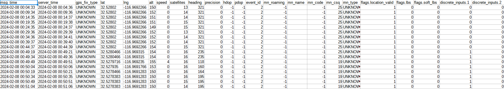

# Columns in CSV File

* [Opening a file](columns-in-csv-file.md#opening-a-file)
* [Raw data parameters](columns-in-csv-file.md#raw-data-parameters)
  * [Simple columns](columns-in-csv-file.md#simple-columns)
  * [Complex parameters](columns-in-csv-file.md#complex-parameters)

The data warehouse tool enables you to export a raw data file containing all packets received from your device, without any filtering or calculations made on the platform side. These parameters represent information initially decoded from your device's packet in protocol related format, presented in a human-readable way. You don’t need to know the protocol to read and check the information in these packets.

> \[!INFO] To learn how to download this information, you can refer to our [previous article](./). Here, we aim to explore further how to read this file and interpret various columns within it.

## Opening a file

The filename always contains the following:

* Device ID: The device ID number, often representing its IMEI.
* Device’s label on the platform: A label to facilitate file searching.
* From and to time: Representing the start and end of the file in the format day\_month\_year\_hours\_minutes\_AM/PM.
* Timezone in UTC format.

You can open the raw data file with any text editor, such as WordPad, Notepad++, or Sublime Text. This format is easily understood by programs and machines but may not be as clear for people. To simplify file reading, we recommend using a table editor. Simply open the CSV file with Excel, Google Sheets, or any other table editor. In the table editor, all parameters will be in their own columns. Additionally, you can freeze the first row to see the column names throughout the file.

## Raw data parameters

The file will include selected parameters in columns, along with one consistent entry - msg\_time.

These parameters can be categorized as simple or complex.

### Simple columns

Simple parameters provide full names and mainly represent specific tracking information.

* `msg_time`: Time when the tracker recorded a point. Always included in CSV output. Indicated according to the chosen time zone.
* `server_time`: Time of message receipt by the server. Indicated according to the chosen time zone.
* `gps_fix_type`
  * NO\_FIX: GPS tracker marked location as not valid.
  * HAS\_FIX: GPS tracker marked location as valid.
  * LAST\_KNOWN\_POSITION: In case the tracker provides current input and other states within the last known location.
  * UNKNOWN: If a device can't provide such information or didn't determine GPS fix type for this packet.
* `lat`: Location latitude.
* `lng`: Location longitude.
* `speed`: Speed determined by the tracker in km/h. In most cases, it is speed determined by device’s GPS.
* `alt`: Location altitude in meters.
* `satellites`: Number of connected satellites at that moment; `-1` means unknown and, in most cases, represents an LBS location point.
* `heading`: Object heading in degrees where 0 represent North.
* `precision`: Location precision in meters.
* `hdop`: Horizontal dilution of precision - represents the accuracy of GPS tracker’s horizontal position estimates. Values range from 1 (excellent) to above 20 (poor). Values between 1 and 2 are considered good for most navigational purposes. `-1` means unknown.
* `pdop`: Position dilution of precision - indicates the accuracy of a GPS tracker's position based on the geometry of the satellites in relation to the tracker. Lower PDOP values mean better satellite positioning, leading to more accurate location data, but `-1` means unknown.
* `mn_name`: Mobile network name. Determined by the device.
* `mn_roaming`: Roaming status. Is determined by the device.
  * `0` means no roaming,
  * `1` means this point was generated by a device in roaming,
  * If the device can't provide such data or couldn't do it for this particular message, it will be `-1` (unknown).
* `mn_code`: Mobile network operator code. Determined by the device.
* `mn_csq`: Mobile network signal strength, CSQ, values from 0 to 31. Determined by the device. If the device can't provide such data or couldn't do it for this particular message, it will be `99` (unknown).
* `mn_type`: Mobile network type. Is determined by the device.
  * If the device can't provide such data or couldn't do it for this particular message, it will be `UNKNOWN`
  * `GSM`: If the device determined GSM type.
  * `CDMA`: If the device determined CDMA type.
  * `WCDMA`: If the device determined WCDMA type.
  * `LTE`: If the device determined LTE type.
  * `NR`: If the device determined NR type.
* `event_id`: The platform’s event ID. Find the list of all event ID codes below.

Platform's event code IDs and their definitions

In the device packets, various event codes can be defined, each signifying a specific occurrence.

| **Event ID** | **Definition**                                       |
| ------------ | ---------------------------------------------------- |
| 2            | Track. No specific event, just a track point         |
| 4            | Emergency contact number called                      |
| 5            | Unauthorized movement event determined by the device |
| 11           | Input 1 state change                                 |
| 12           | Input 2 state change                                 |
| 13           | Input 3 state change                                 |
| 14           | Input 4 state change                                 |
| 15           | Input 5 state change                                 |
| 16           | Input 6 state change                                 |
| 17           | Input 7 state change                                 |
| 18           | Input 8 state change                                 |
| 34           | Device wakes up from a sleep mode                    |
| 37           | Sleep mode start                                     |
| 40           | Main power low                                       |
| 41           | Power lost or external power cut                     |
| 42           | Power On button pressed                              |
| 43           | Power recovered or external power connected          |
| 44           | OBD Unplug from the car’s connector                  |
| 45           | OBD Plug in                                          |
| 46           | Backup device’s battery low                          |
| 50           | Idle end (hardware related)                          |
| 51           | Idle start (hardware-related)                        |
| 71           | Idle sleep start                                     |
| 72           | Low backup battery sleep start                       |
| 73           | Timer wakeup                                         |
| 74           | Motion wakeup                                        |
| 75           | External power wakeup                                |
| 76           | Timer sleep alert                                    |
| 81           | Security mode on                                     |
| 82           | User event                                           |
| 83           | SOS button pressed event                             |
| 84           | Security mode off                                    |
| 90           | Antenna disconnection                                |
| 100          | Device detached from the object                      |
| 111          | Output 1 state change                                |
| 112          | Output 2 state change                                |
| 113          | Output 3 state change                                |
| 114          | Output 4 state change                                |
| 115          | Output 5 state change                                |
| 116          | Output 6 state change                                |
| 117          | Output 7 state change                                |
| 118          | Output 8 state change                                |
| 797          | Check-in sent from the mobile app                    |
| 798          | Task form submission                                 |
| 799          | Working status changing                              |
| 800          | GSM LBS point determined by a device                 |
| 802          | Track point by time                                  |
| 803          | Track point by distance                              |
| 804          | Track point by angle                                 |
| 811          | Track movement start                                 |
| 812          | Track movement end                                   |
| 813          | Unauthorized movement end                            |
| 814          | Non-track message                                    |
| 900          | Harsh driving quick lane change                      |
| 901          | GPS jamming                                          |
| 928          | Unplug from the tracked object                       |
| 929          | Frequent lane change                                 |
| 930          | Device can't detect human face                       |
| 931          | Seat belt unbuckled                                  |
| 932          | Drinking                                             |
| 933          | Eyes closed                                          |
| 934          | Attach device to the tracked object                  |
| 935          | MDSM 7 disconnected                                  |
| 936          | MDSM 7 connected                                     |
| 937          | Report new driver                                    |
| 938          | Driver enters cabin                                  |
| 939          | Start driver absence                                 |
| 940          | Driver stopped smoking (Driver distraction)          |
| 941          | Power off button pressed                             |
| 942          | Driver started smoking (Driver distraction)          |
| 943          | Driver finished using the phone (Driver distraction) |
| 944          | Driver started using the phone (Driver distraction)  |
| 945          | Yawning (Fatigue driving)                            |
| 946          | Driver stopped distraction (Driver distraction)      |
| 947          | Driver started distraction (Driver distraction)      |
| 948          | Driver stop drowsiness (Fatigue driving)             |
| 949          | Driver start drowsiness (Fatigue driving)            |
| 950          | Over speeding by hardware event                      |
| 951          | Cruise control switched on                           |
| 952          | Cruise control switched off                          |
| 953          | Unexpected movement start                            |
| 954          | Unexpected movement end                              |
| 955          | Car alarm                                            |
| 956          | Peds in danger zone (ADAS)                           |
| 957          | Traffic sign recognition (ADAS)                      |
| 958          | Peds collision warning (ADAS)                        |
| 959          | Check engine light                                   |
| 960          | Fatigue driving                                      |
| 961          | Headway warning (ADAS)                               |
| 962          | Right lane departure (ADAS)                          |
| 963          | Left lane departure (ADAS)                           |
| 964          | Lane departure (ADAS)                                |
| 965          | Forward collision warning (ADAS)                     |
| 966          | Tracker entered auto geofence                        |
| 967          | Tracker exited auto geofence                         |
| 968          | Force location response by SMS from UI               |
| 969          | Door alarm                                           |
| 970          | Ignition Off                                         |
| 971          | Ignition On                                          |
| 972          | Driver not identified                                |
| 973          | Driver identified                                    |
| 974          | Lock closed                                          |
| 975          | Lock opened                                          |
| 976          | Device power Off                                     |
| 977          | Device power On                                      |
| 978          | Case closed                                          |
| 979          | Case opened                                          |
| 980          | Call button pressed                                  |
| 981          | Light sensor determined dark                         |
| 982          | Light Sensor determined bright                       |
| 983          | Vibration end                                        |
| 984          | Vibration start                                      |
| 985          | Strap bolt Inserted                                  |
| 986          | Strap bolt cut                                       |
| 987          | Harsh driving acceleration and turn                  |
| 988          | Harsh driving braking and turn                       |
| 989          | Harsh driving turn                                   |
| 990          | Harsh driving acceleration                           |
| 991          | Harsh driving braking                                |
| 992          | GPS signal recovered                                 |
| 993          | GPS signal lost                                      |
| 994          | Crash alarm                                          |
| 995          | GSM signal damp alarm                                |
| 996          | Harsh driving                                        |
| 997          | Bracelet open                                        |
| 998          | Bracelet close                                       |
| 999          | G sensor alert                                       |

### Complex parameters

Complex parameters include both the group name and specific name. They are categorized as follows:

* `flags`: A bitmap of flags representing location validity and LBS:
  * Bit 0 (location\_valid): Indicates the validity status of the location. It is `0` if the location is invalid, and `1` if the location is valid.
  * Bit 1 (lbs): Indicates the LBS status of the point. If `0`, the point is received by GPS; if `1`, the point is received by LBS.
  * Bit 2 (soft\_lbs): Indicates the source of the LBS point. If `0`, the point is determined by device LBS; if `1`, by the platform's LBS.
* `discrete_inputs`: Represents information from every discrete input. Each discrete input is presented in a separate column, enumerated from 1. The possible values are 1 and 0, where 0 signifies switched off, and 1 signifies switched on.
* `discrete_outputs` : Shows the same as discrete inputs but for discrete outputs. Each discrete output is in a separate column, enumerated from 1.
* `inputs`: Represents data from different sensors, such as fuel or various measuring sensors. Each input is in a separate column, and the list of inputs depends on the device model.
* `states`: Displays values from state parameters. Most of them can be 1 or 0, but some have specific text values like DTC codes.

With these definitions, we hope you'll find it easy to read information in raw data files and utilize them in device troubleshooting and in programs for your customers.
