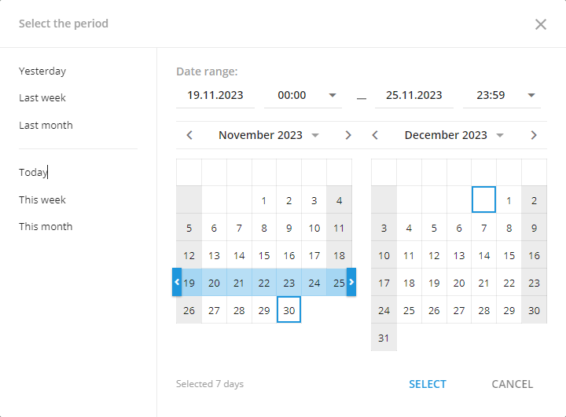
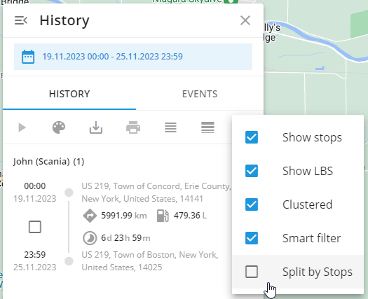

# View tracks recorded in interval tracking mode

There are a large number of trackers that work in interval mode - they send points once in a certain period of time.

To save the device battery and traffic, this period can be large (some devices can transmit data once a day, for example, asset trackers for cargo transportation).  
However, such data does not allow for building accurate tracks on the map, and if the data transmission interval will exceed the idle time of the "parking" state, tracks will not be displayed at all and the device will always have the "Parked" status.

If you need to show the movement of the device as a line on the map in any case, then generate a track

And disable the option "Split by stops" in the Tracks settings.

In this case, all points transmitted by the tracker during the specified time period will be shown as one trip.