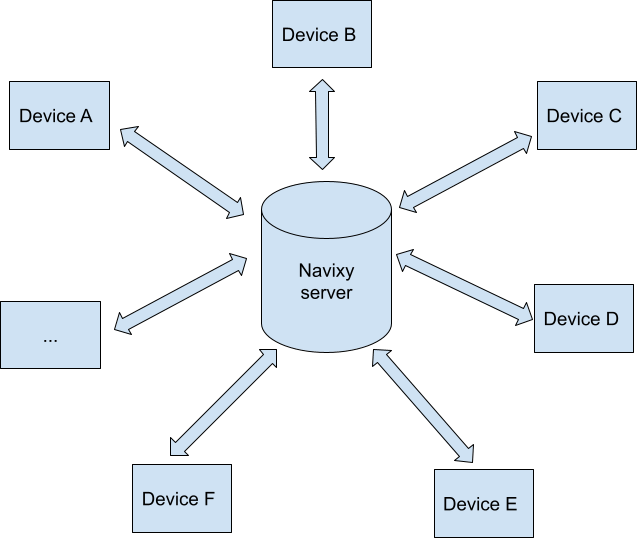
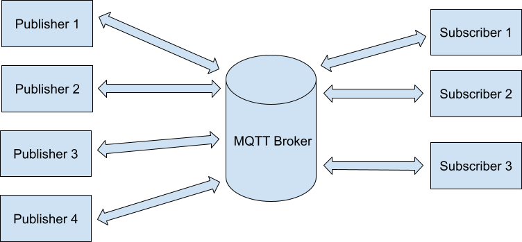
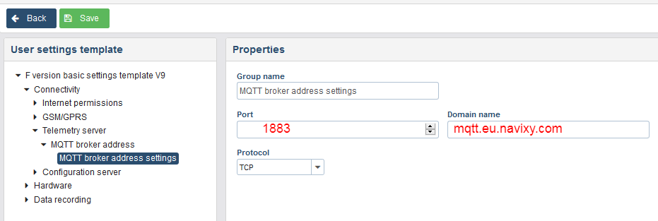
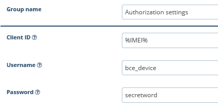
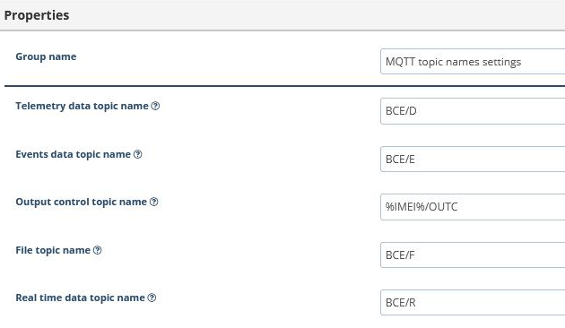
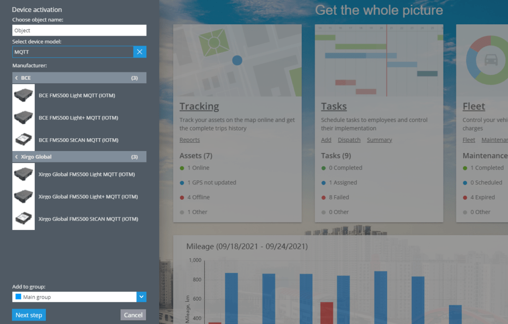
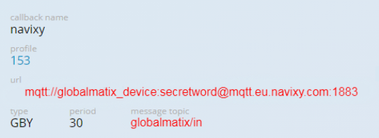
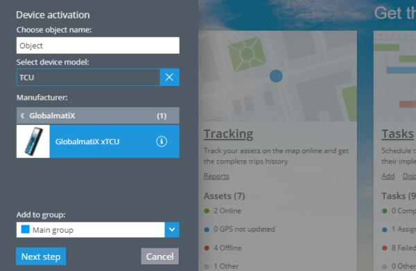

# Activate Your MQTT Device on Navixy

MQTT is a lightweight messaging protocol designed for efficient communication between remote devices with minimal network bandwidth. It is an excellent choice for Machine-to-Machine (M2M) communication, making it ideal for vehicle telematics projects. This document describes how you can connect a GPS device to Navixy using MQTT.

## How MQTT Works

MQTT operates on the ‘client and broker’ principle and uses a Publish/Subscribe architecture:

* **Client**: Any Internet of Thing (IoT) device that runs an MQTT library, such as a dedicated server, microcontroller, application, or sensor.
* **Broker**: A passive server that mediates communication between clients. It handles authentication, manages connections, sessions, and subscriptions.

In this setup, clients connect to the broker, which then facilitates communication between the publishing clients (devices sending data) and subscribing clients (devices or servers receiving data).

## Activating Your MQTT Device on Navixy

MQTT devices are becoming increasingly prevalent in GPS tracking and telematics due to their high flexibility and ability to meet diverse business needs. However, they require a unique configuration process compared to traditional devices.

**Key points:**

* MQTT devices cannot be registered automatically and must be configured manually.
* These devices operate using the Publisher/Subscriber model, which is different from the traditional client-server model.

**Publisher/Subscriber Model vs. Client-Server Model**

In the traditional client-server model, the device (client) sends data packets directly to the server, which then processes the data and sends responses back to the device. This model is straightforward but limited to one-to-one communication.

In contrast, the Publisher/Subscriber model used by MQTT devices allows for more flexible and scalable communication. Here’s how it works:

* **Publisher**: The device sends data packets to an MQTT broker.
* **Broker**: The broker stores these data packets.
* **Subscriber**: The Navixy server subscribes to the data packets from specific devices using their IMEI numbers and the broker’s address.

## MQTT Device Configuration Steps

We’ll demonstrate how to configure your MQTT device on the Navixy platform through a few examples.

### Example 1. Xirgo Global (ex BCE) Devices

#### Configure Device in FMSET

* Log into your FMSET account.
* Go to Connectivity → Telemetry Server → MQTT Broker Address Settings.
* Enter the following parameters:\
  US platform: `mqtt.us.navixy.com` port `1883`\
  EU platform: `mqtt.eu.navixy.com` port `1883`

In MQTT Security → Authorization, add a user with the following settings:

* **Client ID**: `%IMEI%`
* **Username**: `bce_device`
* **Password**: `secretword`

Ensure your topic configuration is correct:

* All topics except for Output Control Topic Name are set to default values.
* Output Control Topic Name: `%IMEI%/OUTC`

Save your configuration.

Each topic beginning with “BCE” indicates that the device operates as a publisher in these instances. For telemetry data, events, files, and real-time data, the device acts as a publisher, sending these packets to the broker. The Navixy server can then extract these data packets from the broker. Communication between subscribers and publishers is managed through topics, with each topic corresponding to a specific type of message.

For commands that switch the device’s output, the device functions as a subscriber. It expects to receive commands from the Navixy server, sent through the broker using the device’s IMEI. In this case, the device understands that it should switch the output.

When configuring an MQTT-compatible device, the user must specify the username and password expected by the server. These settings are shown in the screenshots provided above.

#### Add the Device to the Navixy platform

1. **Enter Your User Account**: Log in to your Navixy user account.
2. **Select the Device**: Choose the Xirgo Global (BCE) MQTT-compatible device (marked as IOTM).
3. **Proceed to the Next Step**: Click the “Next Step” button.
4. **Specify the IMEI**: Enter the IMEI of the device.
5. **Activate the Device**: Click the “Activate” button.

### Example 2. Globalmatix xTCU Devices

#### Configure the Device

* Enter the following settings:\
  US platform: `mqtt.us.navixy.com:1883`\
  EU platform: `mqtt.eu.navixy.com:1883`
* **Topic**: `globalmatix/in`
* **Login/Password**: `globalmatix_device/secretword`
* Save the configuration.

#### Add Device on the Navixy Platform

* Enter your user account.
* Select the Globalmatix device in the list.
* Click the “Next Step” button.
* Specify the IMEI of the device.
* Click the “Activate” button.

