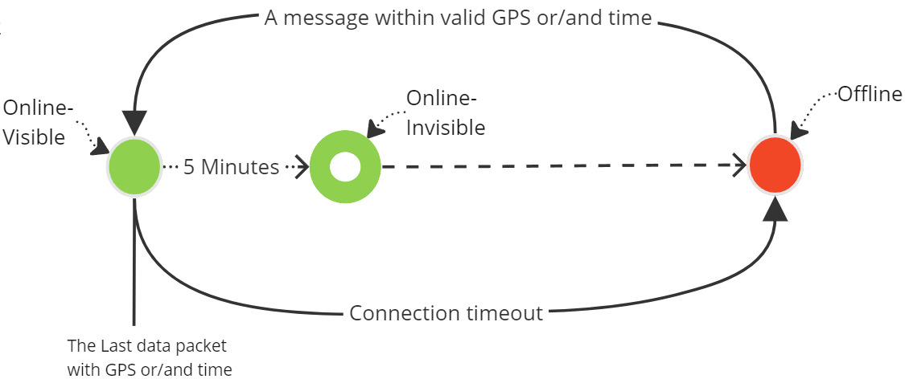
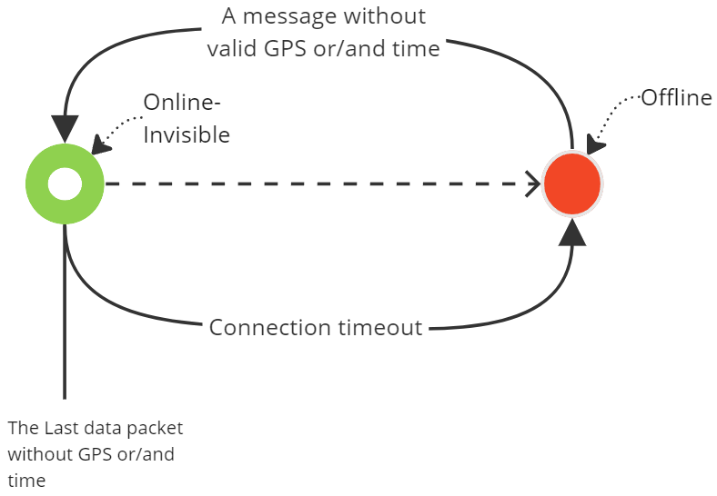
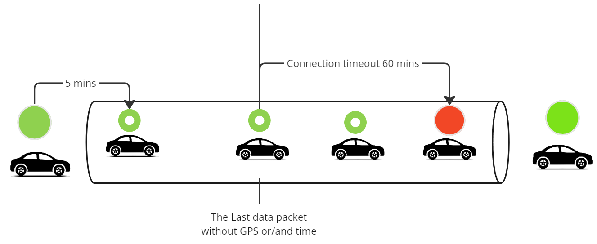
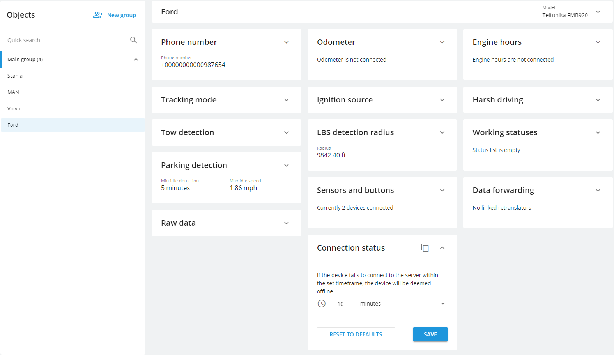
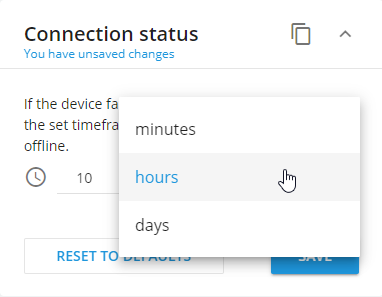
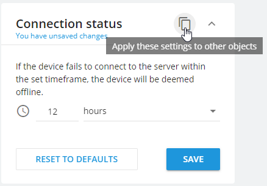

# Device Connection Status

Each device registered on the Navixy platform has a status indicating its current connection state to the server. These statuses are color-coded to enable users to quickly determine the device's current state. The statuses can be broadly categorized into two types: activated or not activated.

<table><thead><tr><th width="204.9091796875" align="center">Icon</th><th>Description</th></tr></thead><tbody><tr><td align="center"><h3>Activated devices</h3></td><td></td></tr><tr><td align="center"></td><td>Connected visible, GPS coordinates updated.  The tracker is connected to the server and has transmitted the current coordinates and time. Everything is ok, no action is required.</td></tr><tr><td align="center"></td><td>Connected invisible, but GPS coordinates are outdated. The tracker is connected to the server, but has not transmitted the current coordinates for more than 5 minutes.  This can happen for a number of reasons:  - 5 minutes have passed after the last GPS coordinates update. - Data is being received from the device's memory, so the packet timestamps differ from the current time. For example, it lost GSM signal for some time and then reconnected and started sending all saved GPS points from its memory to the platform. Once the tracker provide all data from its memory, it will start sending data with current timestamps and back to green again. - The tracker is not sending GPS coordinates in data packets. This can happen due to protocol specifics, loss of satellite connection (under a roof, in a tunnel, in an underground parking, etc.), due to GPS signal jamming, or due to firmware failure. - The device is in power saving mode or sleep mode. For example, the device is parked and sends the last known coordinates with the time they were received, or it sends heartbeat packets to maintain connection with the server. - The tracker transmits data with a time zone that differs from UTC+0. If the tracker has a time zone setting, it should be set to UTC+0.</td></tr><tr><td align="center"></td><td>Not connected. The tracker has not sent any data to the platform for the user-specified time in the connection status settings. By default, it is 10 minutes after the last received package.  The tracker may stop sending data for the following reasons:  - Moved to an area with weak GPRS signal. - Entered deep sleep mode. This can be disabled in the device configurator or using SMS commands. - Located in a roaming area, but this service is not enabled on its SIM card. - The GPRS traffic limit or balance on its SIM card has been exhausted. Check this in the personal account of your mobile operator. - If the device has broken connection from the platform on its own.</td></tr><tr><td align="center"></td><td>The tracker is blocked due to the tariff plan. During the blocking period, no data from the device is accepted by the platform. Even after unblocking, the data for this period will not become available. Top up your balance in your personal account or contact the support team to unblock.  The device will be automatically unblocked within 15 minutes after the necessary amount for extending the services under the tariff plan has been paid.</td></tr><tr><td align="center">## Non-activated devices</td><td></td></tr><tr><td align="center"></td><td>The tracker has not sent data to the platform a long time after registration or replacement. It is mostly the welcome screen's status. It counts all devices with registered, not activated and from blocked status.</td></tr><tr><td align="center"></td><td>The light green status with clocks indicates that the device has just been registered and is in the process of activation. It is normal to see this status for newly registered devices and it may take a time for the activation process to complete. This status will always be displayed for unactivated <a href="https://docs.navixy.com/expert-center/x-tracker-mobile-app">X-GPS Trackers</a> as well.</td></tr><tr><td align="center"></td><td>The light orange status indicates that a significant amount of time has passed since the device was registered, but it has not been activated yet. In this case, it is recommended to refer to the document that describes common causes of <a href="https://docs.navixy.com/expert-center/possible-issues-during-the-device-activation">activation problems</a>. This can help identify and resolve any issues preventing the device from being activated.</td></tr><tr><td align="center"></td><td>The light gray status with clocks indicates that the device does not support automatic activation, and therefore, it must be manually configured using the configurator that came with the device. If you do not have the configurator, please contact the manufacturer's support or visit their official website. You can find the server address and port <a href="https://www.navixy.com/devices/">on our website</a> or in the widget.</td></tr></tbody></table>

## Status logic

The sequence of connection statuses is as follows:

* The transition from offline to online occurs after the platform receives a packet from the device.
  * When the device sends a packet containing accurate coordinates and time, it is considered to be in an Online Visible status, indicated by a green light (bottom line on the scheme).
  * If the device transmits a packet containing incorrect coordinates or time, it remains online but is marked with an Invisible status, indicated by a green & white light (upper line on the scheme).
* The transition from online visible status to offline, if the last packet had valid GPS and time and no more packets were received during the connection timeout, follows this logic:
  * After obtaining a visible online status, if 5 minutes pass without further updates, the device's status changes to invisible online. This accounts for the uncertainty of the device's current location (represented by a line between the green and green & white statuses on the scheme).
  * After the time frame specified by the user in the "Connection Status" widget minus 5 minutes, the device's status changes from invisible online to offline (bottom line from the green & white status).

* The transition from online status, if the last packet lacked valid GPS and/or time, to offline follows this logic:
  * After receiving a packet without valid GPS and/or time, the device remains online but in the invisible status.
  * The device will become offline if no further packets are received within the time frame specified by the user in the "Connection Status" widget.

When a vehicle goes into a tunnel with a GSM connection, your device will have sent messages with valid GPS coordinates and time before entering the tunnel and becoming online and visible. Inside the tunnel, the device will continue sending messages **without** valid GPS coordinates because it cannot connect to satellites.\
Additionally, if the tracker also loses its GSM connection, it won't be able to send data to the platform. If connection timeout is set (e.g., 60 minutes) and 60 minutes have passed since the last device packet, the device will be marked offline. Once the vehicle exits the tunnel and reconnects to GSM and satellites, it will send a new packet with valid coordinates and again become online and visible.

## How to customize connection timeout on devices

Configuring connection timeout settings for devices is a straightforward process, designed for ease of use. Follow these simple steps to adjust the connection timeout according to your preferences:

1. Navigate to the user interface's "Devices and Settings" section.
2. Select the specific device for which you want to customize the timeout settings.

3. In the "Connection status" portlet, input your desired timeout interval. This can range from a minute up to 3000 days, depending on your operational requirements.

4. The platform will notify you about unsaved settings. Save the changes. The updated timeout settings will take effect immediately.

Furthermore, if you wish to apply the same settings across other devices of the user, you can easily achieve this by copying the settings, mirroring the approach used with other portlets.

For those who prefer to set default timeout settings, a convenient one-click option is available with the "Default" button.
