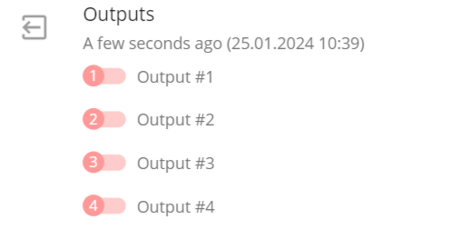
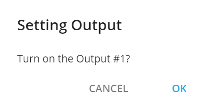

# Outputs Control

Several device models come equipped with the capability to control the state of connected devices or engines. This feature can be applied to a variety of components, including locks, buzzers, immobilizers, oil/engine cutoff systems, and automatic engine warming systems like Webasto. It can even extend to smart home applications, such as smart sockets and smart bulbs, among others. It may be used, for instance, in your mobile home that is better to track and control via GPS tracker. The primary concept here is the ability to turn on or off a specific function or device remotely through a command transmitted over the air. Of course, the actual scope of this control depends on what is connected to the device’s output.

## How the output control works

Output control on Navixy platform functions as follows:

The user opens the device’s widget in the UI or the X-GPS monitor application. There are three distinct ways in which output control widgets are displayed:

* If a device model can relay its output state information back to the platform, the last received output state from the device is displayed. For example, if the output was 'on', the user will only have the option to send an 'output switch off' command and vice versa. On the next screenshot all 4 outputs are disabled and user can only enable them.

* If the device model doesn’t provide a response to the platform or doesn’t include the output state in its messages, the platform can send any command, either to switch on or off the output state. The user can click the red zone to send an 'output off' command, and the green zone to send an 'output on' command.

* If the device is offline and SMS control of the outputs is not available for the model, the widget displays the last known states of the output in a faded mode, indicating that output control is not possible.

Then the customer selects the desired output and alters its state. For instance, if the user decides to switch off output 1, the platform will request confirmation to prevent accidental activation.

Confirming is equivalent to sending an API request:

* It will be an API call [/tracker/output/set\_all](https://www.navixy.com/docs/navixy-api/user-api/backend-api/resources/tracking/tracker/output#set_all) if the device supports commands listing all states simultaneously. For example, enabling output 1 on a Teltonika device with 3 outputs where all outputs are off at the moment, would use a command like 'setdigout 1,0,0'.
* It will be an API call [/tracker/output/set](https://www.navixy.com/docs/navixy-api/user-api/backend-api/resources/tracking/tracker/output#set) if the device supports sending commands to each output individually.

By using APIs, you can [automate output control on your device](https://www.navixy.com/blog/cloud-functions-for-tailored-vehicle-telematics-solutions/?utm-source=slack), linking it to specific event types or received values.

After initiating the command, the platform sends the output control command to the device. This can be verified through the [Air Console](https://app.gitbook.com/s/KdgeXg71LpaDrwexQYwp/devices/air-console) which is available for all partners in the Admin panel.

In the case of output widget with known states, the platform temporarily blocks the output control widget until a new output state is received or 15 minutes have elapsed. This is to prevent command spamming, which could cause errors or device malfunctions.

Once a new state is received, the platform updates the widget to reflect the new state, and output control becomes available again.

## How output control works on different device models

### Ways to send commands

Commands to manage outputs can be sent in a few different ways, depending on the device and its capabilities:

* SMS: This method is used if the device is offline or only supports SMS messages for managing outputs.
* Mobile Internet: This is applicable for standard devices that can operate output controls using an internet connection.

Device models might support both SMS and internet control commands. However, the method used depends on the device's integration. Typically, for devices with internet control, this method is exclusively used, even if the device itself supports SMS as well. It is connected with different output control safety logic.

### Different output control safety logic

Various device models incorporate safety logic for output control. These are designed to prevent actions like turning off the engine while the vehicle is in motion. The safety features are built into the devices themselves, as the platform does not include these safety options.

Safety logic might be implemented in several ways:

* Speed limit omission: The device might ignore output control commands if the vehicle’s speed exceeds a certain threshold, such as 5 km/h.
* Movement sensor (accelerometer): Some devices may bypass output control commands if movement is detected by an accelerometer.
* Scenario-based omission: For instance, Teltonika devices allow DOUTs to be linked to different scenarios for automatic switching, and output control commands might be omitted based on these scenarios.
* Password protection: Commands might be ignored if they don’t include a specific password. Our platform supports standard commands and default passwords.
* Trusted sender verification: Some devices only accept commands from trusted senders. If our platform isn't listed as a trusted sender, the commands might be ignored.
* Configuration of internet commands: Devices may ignore internet commands until they are properly configured to receive them.

It’s important to note that some devices implement safety logic only for internet commands but may still possess a specific emergency command to stop the engine via SMS. However, we do not support such commands due to safety concerns. For instance, this is the case with some Coban devices.

## Why output control may not work

There are several potential reasons why output control might not function as expected.

* Device offline, SMS unsupported: The device could be offline, and for this particular model, SMS management may not be supported. Wait when your device will become online and try again.
* Device online, only SMS supported, but panel doesn’t have SMS gateway connected: The device might be online, but it only supports SMS for output control, and the SMS gateway is not connected to the panel. In this case, you can request your SMS gateway installation. Check [requirements for SMS gateway installation](https://app.gitbook.com/s/KdgeXg71LpaDrwexQYwp/settings/messaging-gateways#sms-gateway).
* Insufficient funds for SMS: The user may not have enough credit to send SMS messages, as required by the tracker plan. Please check the user’s balance and the [tracker plan options](https://app.gitbook.com/s/KdgeXg71LpaDrwexQYwp/plans).
* Specific output control logic: The device may have specialized output control logic that affects its operation. For example, safety or scenario logic described above.
* Non-default password for output control: The device might be set up with a password for output control that is not the default. In this case, check the device’s settings and enable the default password.
* Device not configured for internet output control: The device might not be properly set up to receive internet-based output control commands. Check the device’s settings and enable output control.
* Platform not trusted for commands: The platform might not be listed as a trusted sender of commands by the device. In this case, add the platform into the list of trusted senders.
* Incorrect wiring: There could be an issue with the wiring, such as incorrect polarity of the wires or improper connection. Recheck how the output is connected. The fastest way is to use SMS commands. If it works with SMS, then everything is connected correctly.
* Firmware incompatibility: The device may be running a firmware version that does not support the commands used by the platform, as per the device's protocol and integration. It is possible if the protocol and commands have been changed or some other logic has been added by the manufacturer.

If the platform sends the command in the AirConsole and it aligns with the device’s protocol, then the issue likely does not originate from the platform. In such cases, it is advisable to check the list above and contact the device’s manufacturer to determine the cause of the output control malfunction.

In case, the command is not correct, please contact our [support team](mailto:support@navixy.com).
