# Configuring Sensors on Teltonika Trackers

This is a common guide for setting up sensors and fields for Teltonika devices. Using this guide, you can set up almost any sensor for Teltonika devices in Navixy.

Here we provide instructions for Teltonika FMB920, where we configure Board Voltage as an example.

### 1. Download configurator

If you already have the configurator downloaded, you can skip this and proceed to the 2nd step.

Here you can find all configurators for all models of Teltonika:

[https://wiki.teltonika-gps.com/view/Teltonika\_Configurator\_versions](https://wiki.teltonika-gps.com/view/Teltonika_Configurator_versions)

Visit the page → Press CTRL+F → Enter the model you need (in our case, it is “FMB920”) → Download the latest version

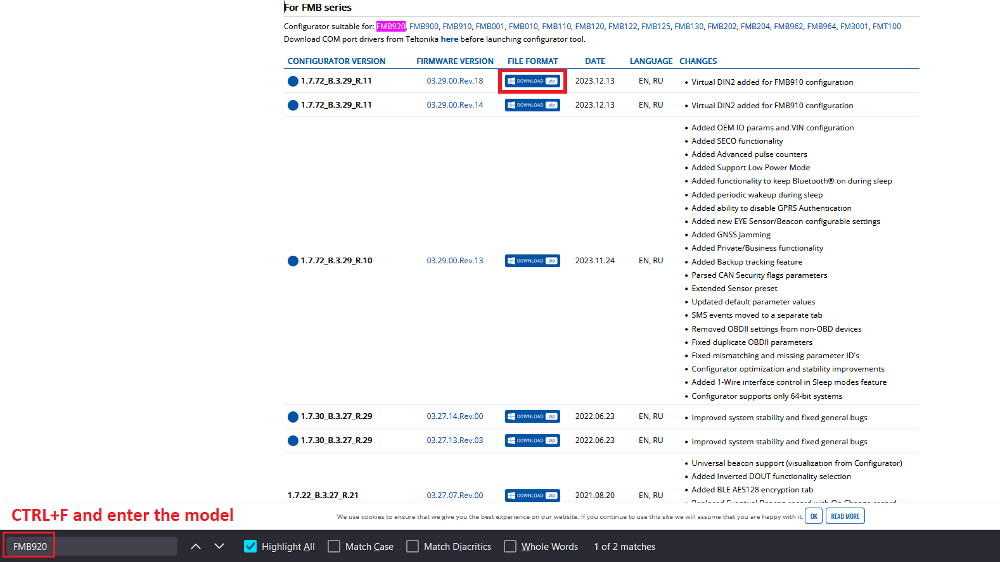

If it is your first time ever downloading and using a Teltonika configurator, unzip the archive, install additional software that comes with the configurator, and only then open the configurator.

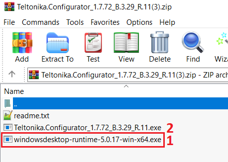

### 2. Open configurator

If you are already familiar with using a Teltonika configurator, you can skip this and proceed to the 3d step.

Before you open the configurator, you can connect the device to the PC or create an empty preset (configuration) without connecting the device to the configurator. If you don't have the device on hand, you can use FOTA and upload the configuration later using FOTA, or in a few steps, you will see how to configure the device remotely using Navixy [AirConsole](https://docs.navixy.com/admin-panel/air-console). Either way, you can create a new configuration or open an existing one. The main step at this point is to open the configurator interface as it is needed for whatever plan you have regarding updating the device configuration.

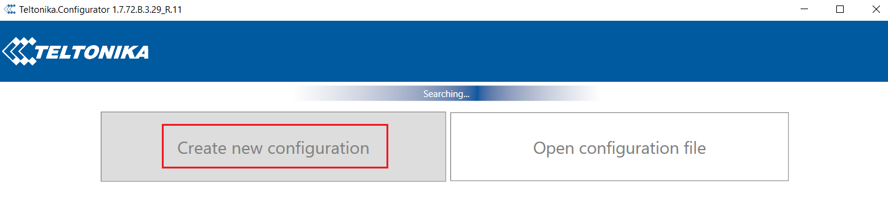

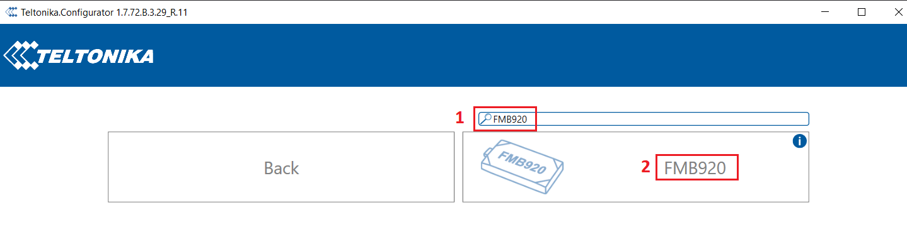

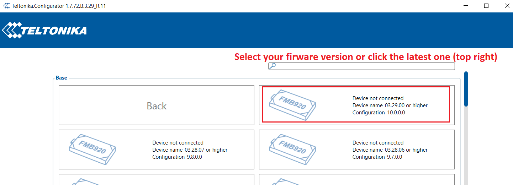

### 3. Choose the parameter

As we have already discussed Board Voltage will be the example sensor. You can choose whichever sensor you need and simply follow the guidance in the same way.

Let's find our parameter in the configurator.

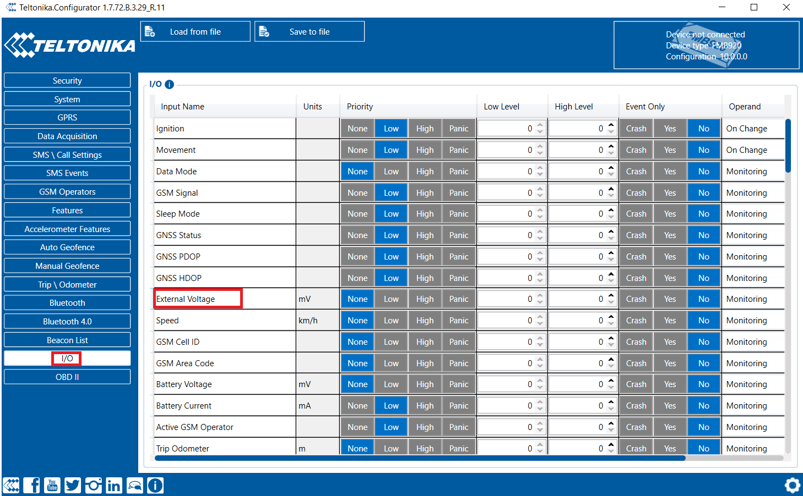

As you can see, the parameters may be named slightly differently. The main idea is to find it by the meaning of the chosen parameter, in our case Board Voltage = External Voltage as there is no “Board Voltage” parameter in the configurator of this version.

### 4. Configure the parameter

Using Navixy, the following options have to be set for the parameter to work correctly in the Navixy system:

Priority: Set the value of the Priority parameter to “Low”. Do not set it to “High” or “Panic” even if you think you need it. Navixy platform works best with “Low” Priority.

Event Only: Select “No”.

Operand: Select “Monitoring”.

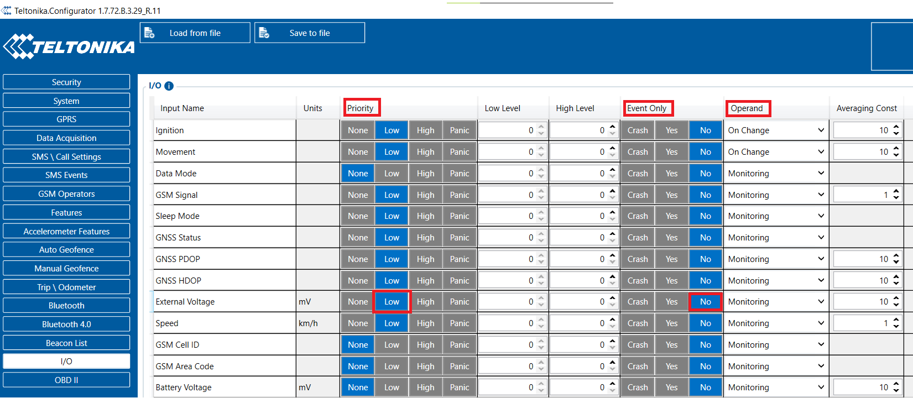

Save the configuration to the device.

In case the device is not nearby, you can update the configuration online via AirConsole.

### 4.1 Updating/reading parameters using AirConsole and GPRS commands, or SMS

If the device can be configured via the configurator or FOTA, you can skip this step, however, there may be a case where you don’t have the device at the office and you need to configure it using SMS or GPRS commands in the AirConsole. Here is how you can do it.

Look up the Parameter ID (not to be confused with the AVL ID!) using the configurator. Just hover your mouse over the parameter and see the parameter ID pop up. As the first step, we will look up the Priority of the parameter, so hover your mouse over the Priority column next to the External Voltage field:

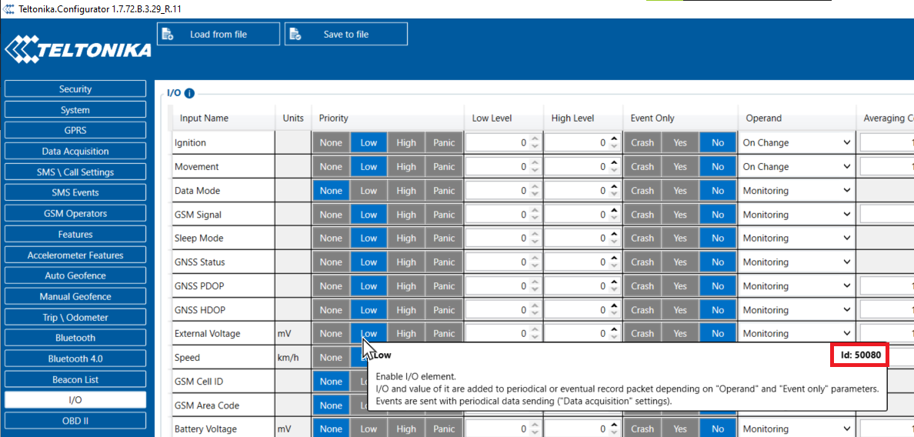

As you can see, 50080 is the ID of the Parameter “External Voltage - Priority”. Values can be looked up using the following table:

[https://wiki.teltonika-gps.com/view/FMB920\_Parameter\_list](https://wiki.teltonika-gps.com/view/FMB920_Parameter_list)

To find a “Parameter list” table for your model, just search in Google: “FMB920 Parameter List”. Of course, substitute the model with yours.

Let’s find the parameter possible values.

CTRL+F, enter Priority and see the following table:

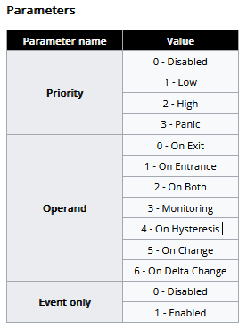

For Priority, there are 4 possible values: 0 - Disabled, 1 - Low, 2 - High, and 3 - Panic. As you remember, we set only “Low” for our all parameters as Navixy requires it.

So the GPRS command will look like this:

```
setparam 50080:1
```

Where 50080 is the parameter ID we just looked up, and 1 is the value for this parameter, 1 = Low.

Send it via AirConsole:

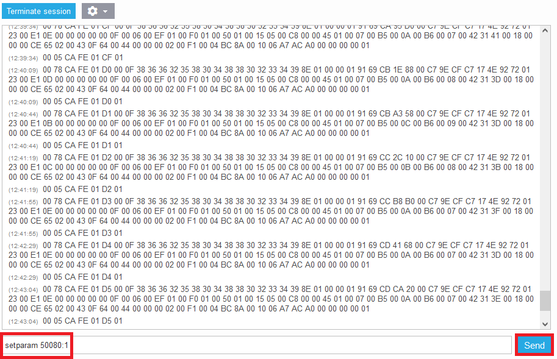

or using SMS

```
  setparam 50080:1
```

Note how we add two space symbols for the SMS command. It is mandatory to add these symbols when sending via SMS!

Here is the reply we should receive from the device:

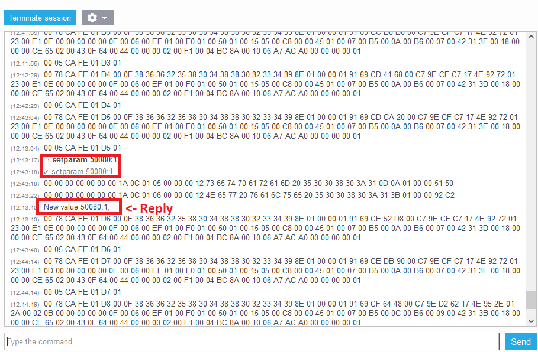

The same way set up Event Only:

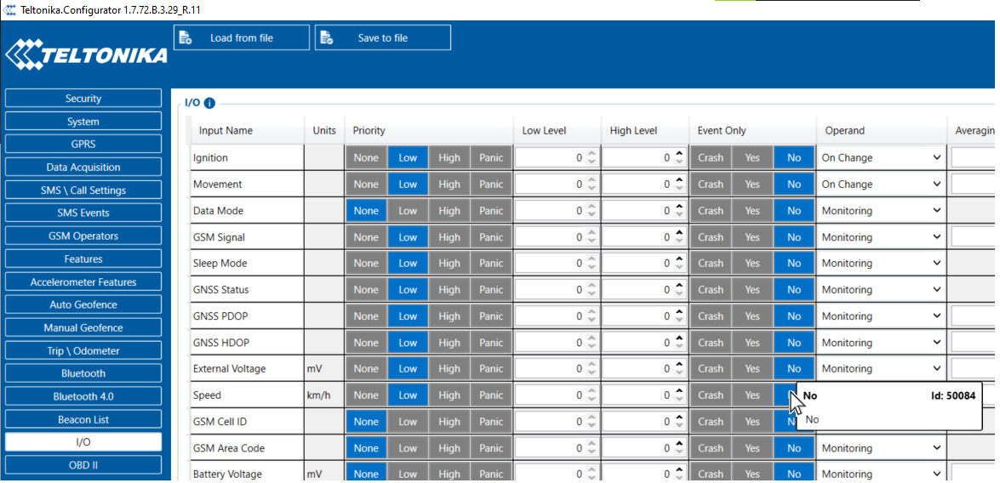

Parameter ID is 50084. The value we need according to the table is 0.

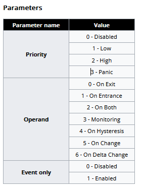

Via the AirConsole:

```
setparam 50084:0
```

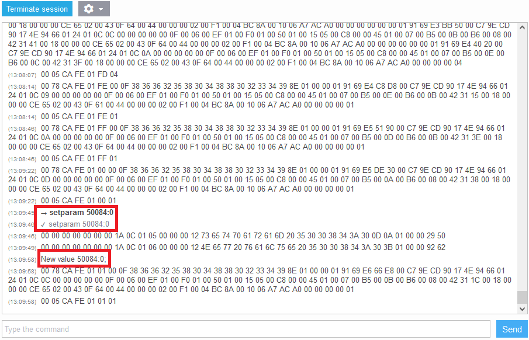

Through SMS:

```
  setparam 50084:0
```

(don’t forget two space symbols at the beginning)

Let’s find the last parameter ID for Operand and set up it the same way.

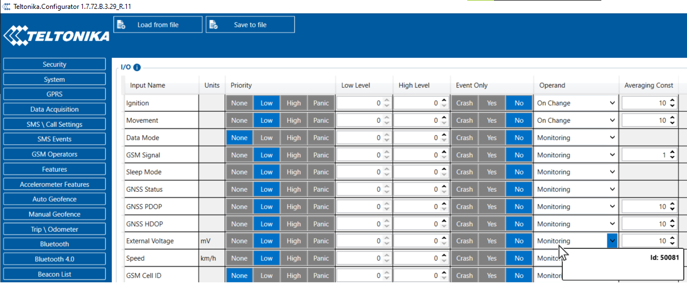

Operand Parameter ID 50081, values - see the following table:


As we mentioned earlier, you need to set the Operand field to “Monitoring”, thus, the value should be equal to 3.

Via the AirConsole:

```
setparam 50081:3
```

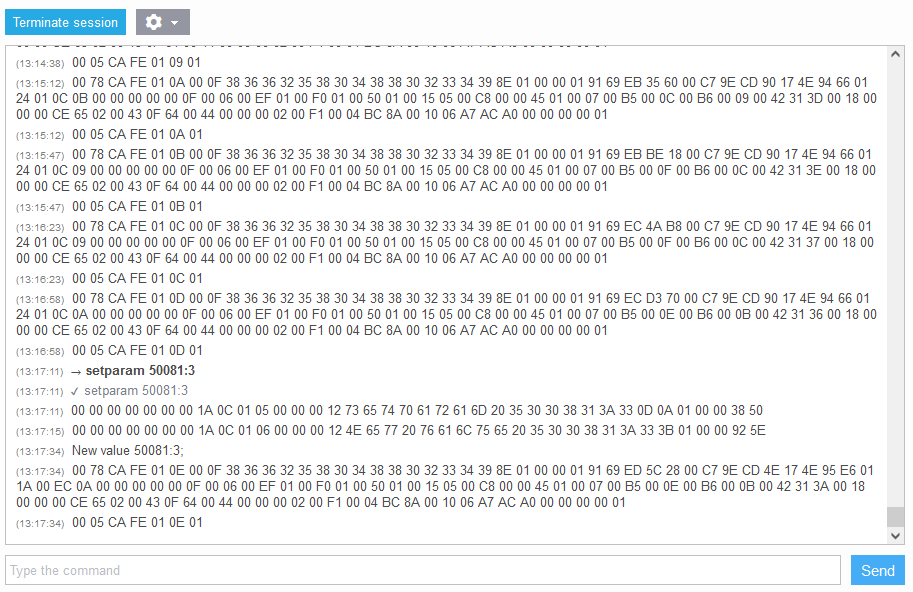

Through SMS:

```
  setparam 50081:3
```

This is all you need to set up a single parameter from the device side. Now let’s switch to the platform configuration.

### 5. Verify the parameter is coming into the platform

Using the AirConsole connect to the device and check whether the parameter is coming in.

How to find the parameter? The answer is: You need to know the avl\_io number of the parameter.

Each Teltonika tracker model has its own AVL ID list where you can look up the parameter IDs.

In Google perform a search: “FMB920 AVL ID”. The first link should indicate: “FMB920 Teltonika Data Sending Parameters ID”. Of course, you can substitute the model with the model you need.

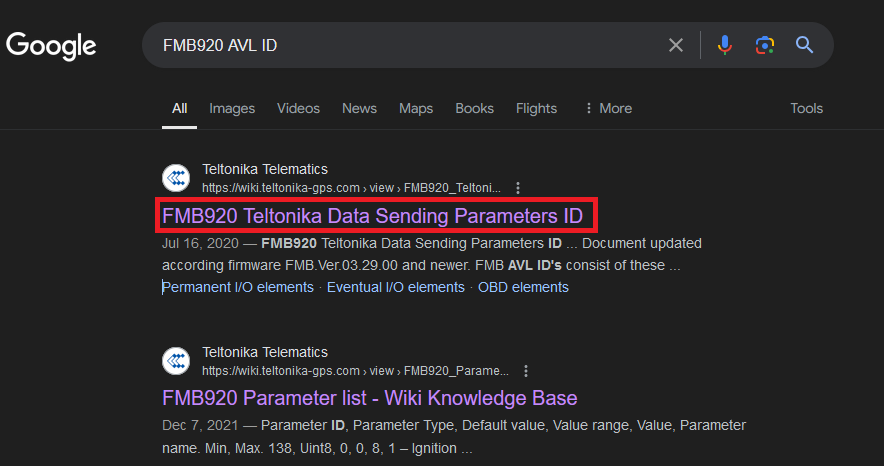

The following list contains all AVL IDs (the same as avl\_io in the AirConsole). You need to look up the number of the parameter using the table:

[https://wiki.teltonika-gps.com/view/FMB920\_Teltonika\_Data\_Sending\_Parameters\_ID](https://wiki.teltonika-gps.com/view/FMB920_Teltonika_Data_Sending_Parameters_ID)

As in the “[1. Download configurator](https://squaregps.atlassian.net/wiki/spaces/SS/pages/edit-v2/2787377154?draftShareId=7cf81cc3-e828-457b-bf02-97e50a45e68d#1.-Download-configurator)” section, press CTRL+F and search through the page using the part of the configuration parameter name - “External” (External Voltage).

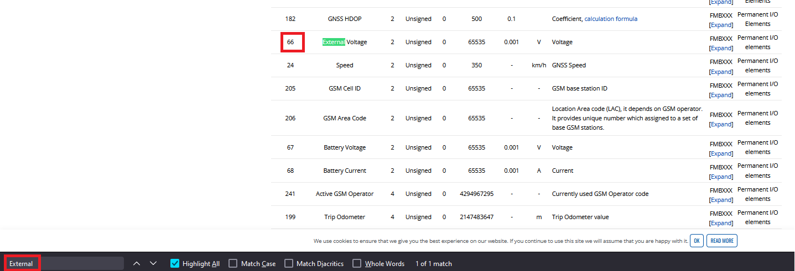

The AVL ID is 66 for “External Voltage”. Let’s find this avl\_io in the AirConsole:

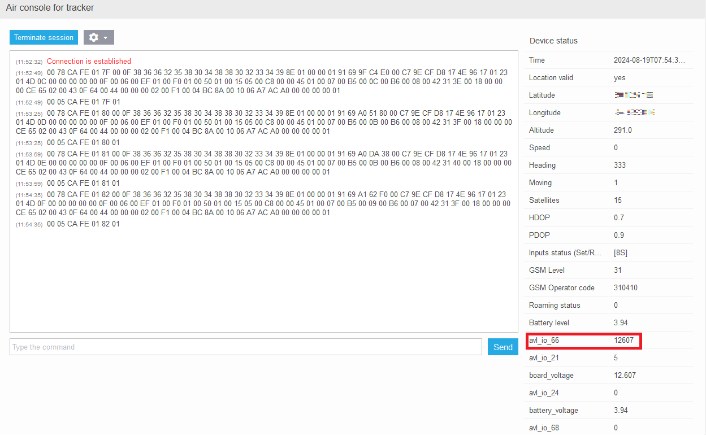

Here is our “External Voltage” coming into the platform as “avl\_io 66” with the current value = 12607 (in mV).

As we confirmed the field is arriving, we can proceed with the configuration of the sensor in the user interface.

### 6. Configure the sensor in the user interface

Open the user interface → Go to “Devices & Settings” menu ->

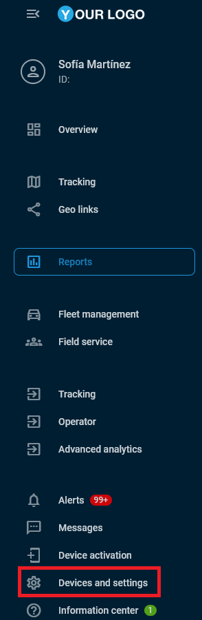

→ Select the tracker in the list → Scroll down to the “Sensors and buttons” Portlet.

Add a new measurement sensor.

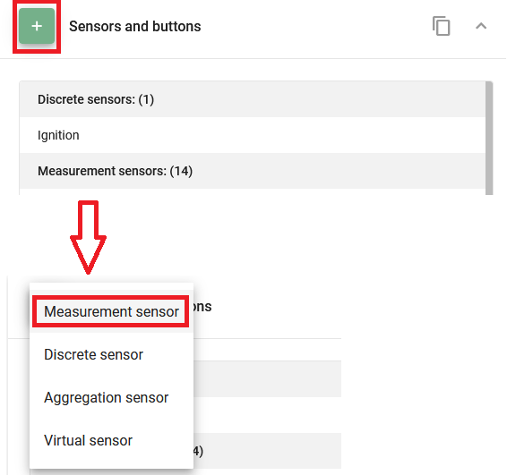

Specify the Input type as “AVL OI \[N]” and enter the avl\_io ID from the previous section which is equal to 66 based on the list of AVL IDs.

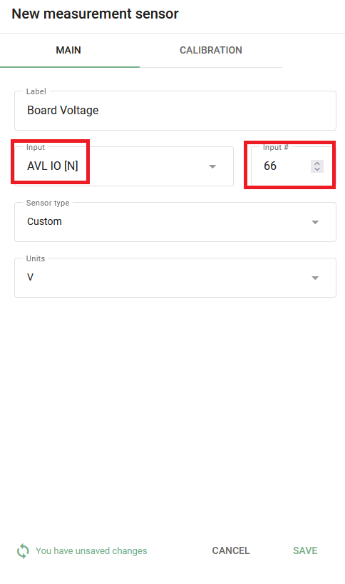

Press “Save”.

That's it, the setup is complete, now once the next data packet arrives on the platform with the specified AVL ID, you will be able to see the updated information in the tracker widget.

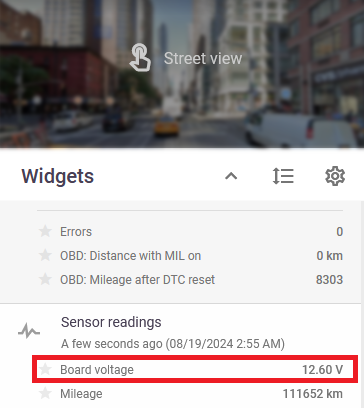
