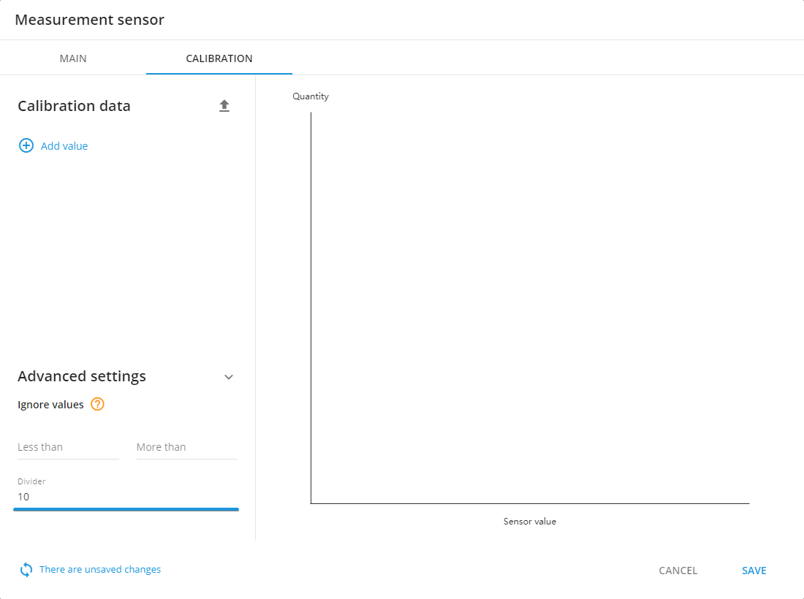
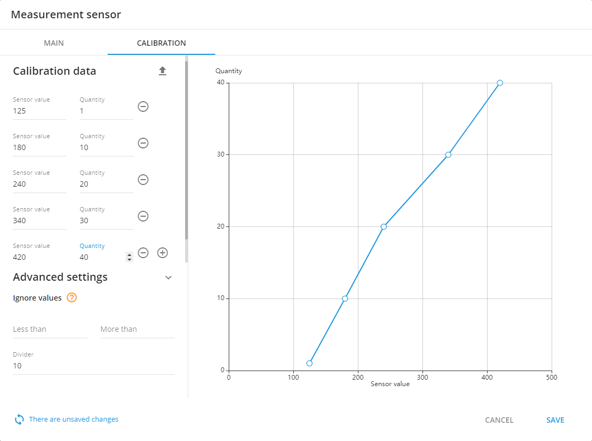
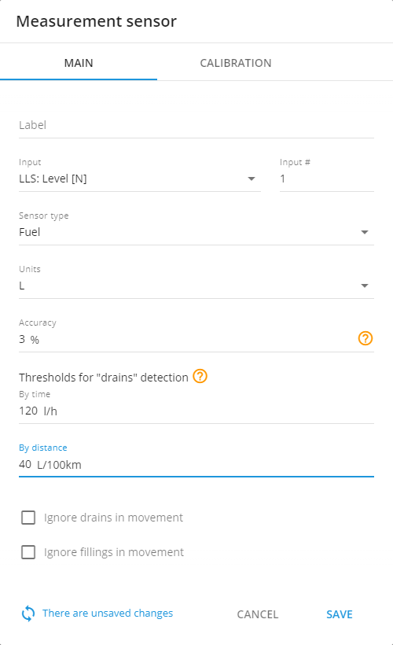
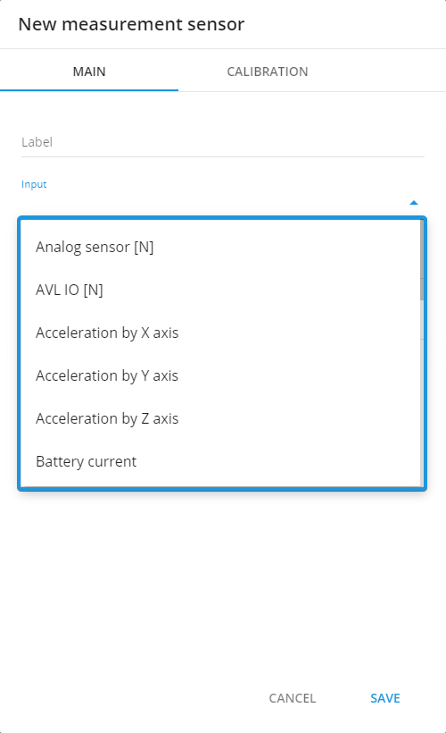
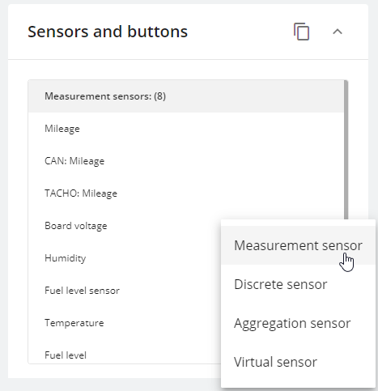
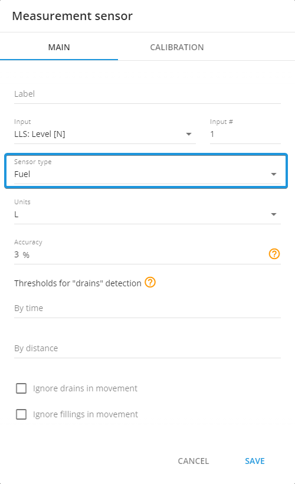
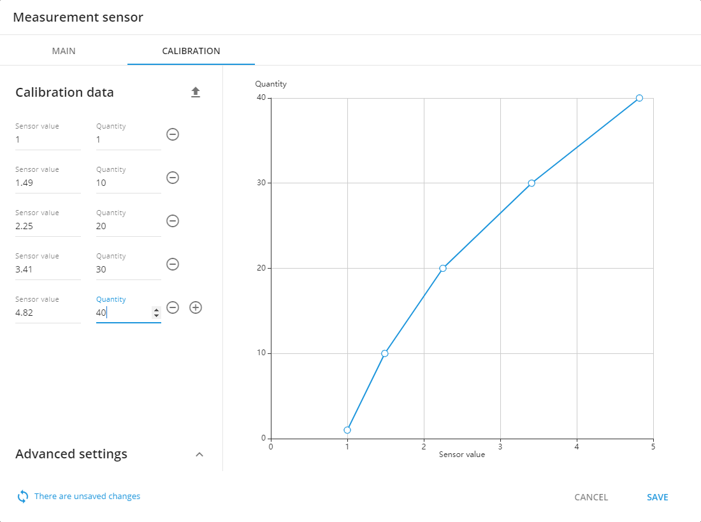
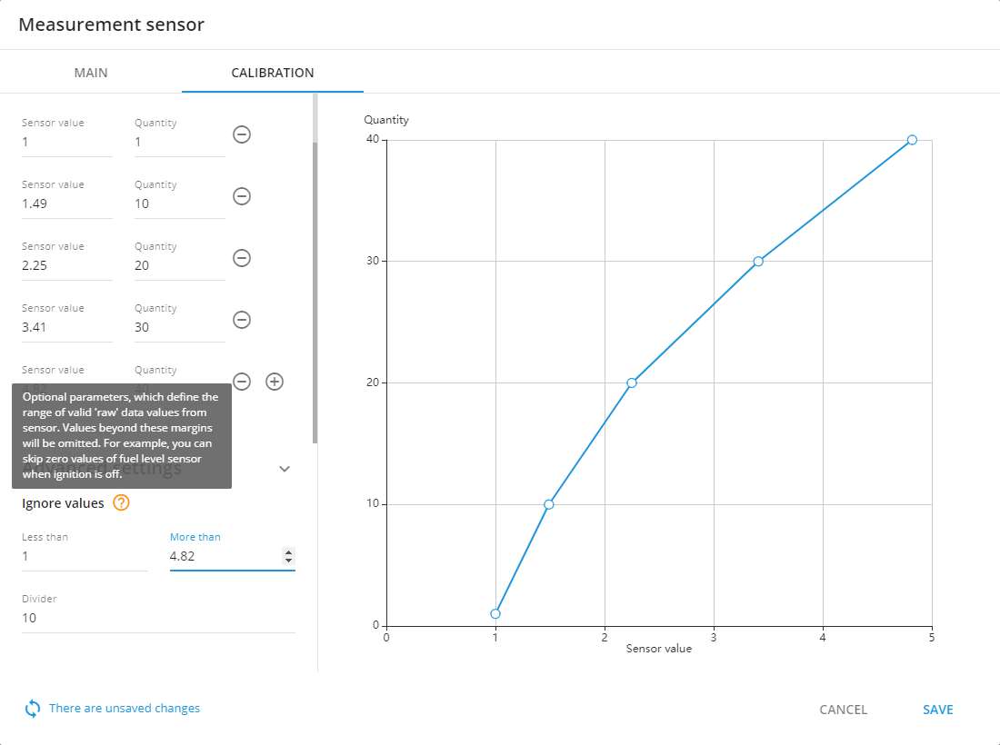

# Manage Sensors

First of all please be advised, that there is no possibility to affect the sensor from the platform. The sensor just sends data to the tracker, then this data is just parsed on the server.

Also if you have done the following recommendations, and the issue has not been resolved, please contact our support team. We are doing our best to make the platform more comfortable for you.

#### No data from the sensor

If there is no data received from the sensor on the platform, please follow next steps.

1. First of all please make sure, that sensor has enough power supply and works correctly
2. Sensor is connected to the device according to the user manuals
3. Sensor is added and [configured](https://app.gitbook.com/s/446mKak1zDrGv70ahuYZ/guide/devices-and-settings) in the device settings section on the platform
4. Please check, that data is parsed and shown in the [air console](https://app.gitbook.com/s/KdgeXg71LpaDrwexQYwp/devices/air-console), if there is no data from the device in the gprs-terminal, it means that currently device is not sending any data
5. Input number in the device settings and the device’s input number, which is used for this sensor, should be same

#### No data from the OBDII/CAN interface

This section is for the cases, when your device uses OBDII/CAN interface for the vehicle data transmitting

1. Please check that device supports OBDII/CAN data transmitting and your vehicle model is supported too. You can get this information from the manufacturer support team.
2. OBDII/CAN sensors should be added in the device settings section on the platform
3. OBDII/CAN data transmitting should be enabled in the device settings. You can check it in the device configurator

#### Incorrect units of measure

This section is for the cases, when the real units of measure and the units received from the sensor data are different

1. Make sure, that sensor is configured correctly and [calibration table is filled](https://app.gitbook.com/s/446mKak1zDrGv70ahuYZ/guide/devices-and-settings/vehicle-sensors/measurement-sensors) (if needed)
2. Follow through the all recommendations from the user manuals, please be advised, that in some cases it is necessary to use dividers

#### Discrepancies between the real values and the values received from the sensor

This sections is for the cases, when the values received from the sensor does not match to the real values. Please be informed, that when fuel tank is inclined, fuel sensor might send incorrect values

1. Please check, that data is parsed and shown in the [air console](https://app.gitbook.com/s/KdgeXg71LpaDrwexQYwp/devices/air-console), if there is no data from the device in the gprs-terminal, it means that currently device is not sending any data
2. [Calibration table](https://app.gitbook.com/s/446mKak1zDrGv70ahuYZ/guide/devices-and-settings/vehicle-sensors/measurement-sensors) should be filled correctly according to the sensor user manual (if needed), also “drains” detection parameters should be specified correctly

#### There is no sensor in sensor list for your device

If the data, which was received from the sensor, appears in the [air console](https://app.gitbook.com/s/KdgeXg71LpaDrwexQYwp/devices/air-console), but the appropriate sensor itself is not available for selection in the sensor list, please contact our support team.

#### Add a fuel sensor

In order to add a fuel sensor, first, please make sure it is properly connected and tracker itself is online.

On the platform, go to the “Devices and settings” menu and pick a tracker that you want to add the fuel sensor to. Select the “Sensors and buttons” widget, press the plus button and pick “Measurement sensor”:

A window will pop up where you will be able to set all required parameters. Pick the input to which your fuel sensor is connected, “Sensor type” should be set to “Fuel”. Do not forget to specify units.

#### Calibrate a fuel sensor

Different trackers process and report fuel sensor data in different ways. For example, CAN sensors typically require a simpler calibration. If tracker reports percentages you and you need to see the amount of fuel in liters – you just need to record fuel volume at 0 and 100 percent and input those values into the table. The rest of calculation will be done automatically.

Other sensors might return voltage instead of percents or direct volume. In such cases, more detailed calibration will be required. In order to fill out a calibration table – you will need to measure sensor’s values at different fuel levels in the tank and then input results into the table. In case, some unrelevant values may be received by the sensor, you’re able to set Ignore values parameter to get them filtered.

