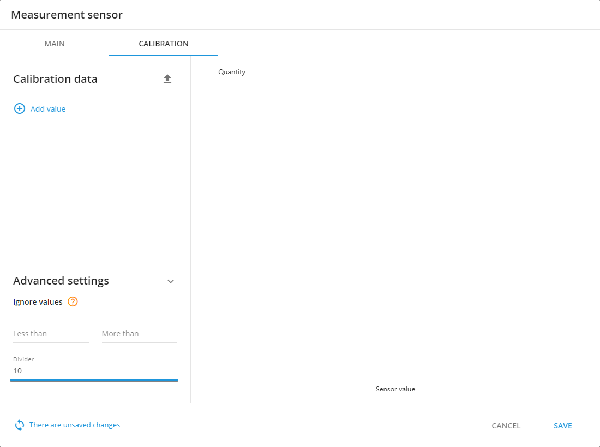
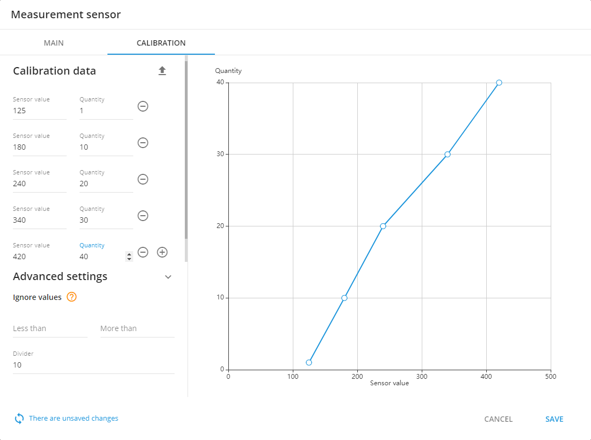
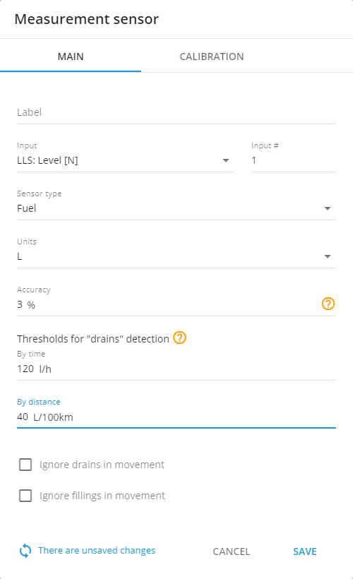
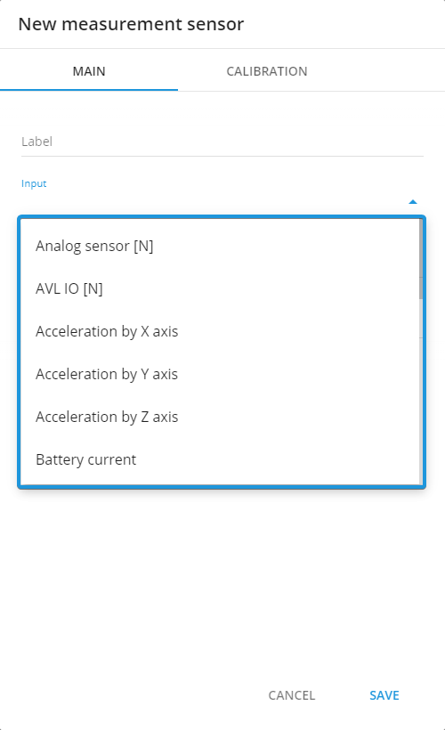
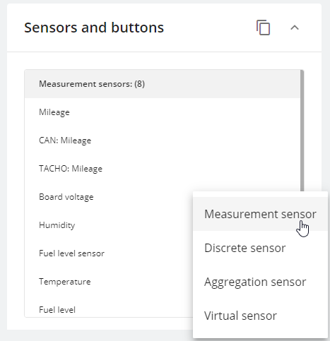
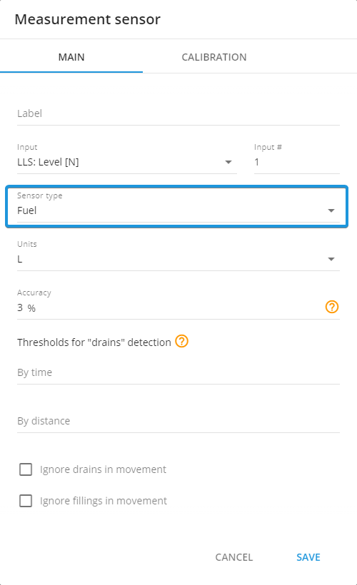
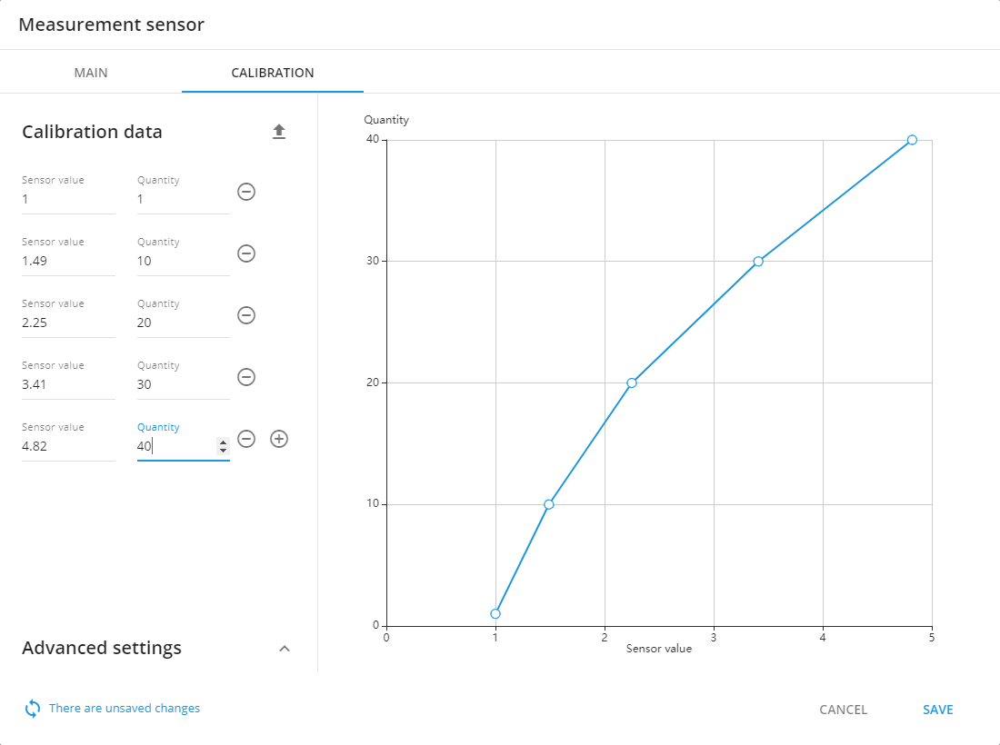
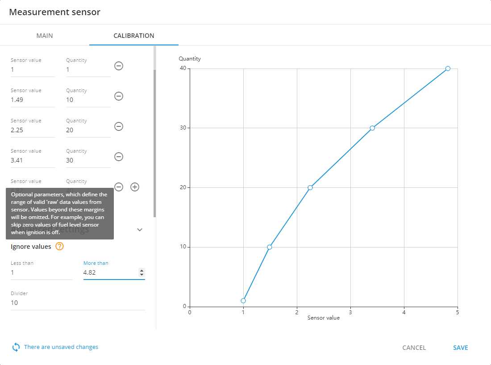

# Manage sensors

First of all, be advised that there is no possibility to affect the sensor from the Navixy platform. The sensor just sends data to the GPS device, then this data is just parsed on the server.

Also if you have done the following recommendations, and the issue has not been resolved, contact our support team. Navixy is doing its best to make the platform more comfortable for you.

## No data from the sensor

If there is no data received from the sensor on the platform, follow next steps.

1. First of all, make sure that sensor has enough power supply and works correctly
2. Sensor is connected to the device according to the user manuals
3. Sensor is added and [configured](https://app.gitbook.com/s/446mKak1zDrGv70ahuYZ/guide/devices-and-settings) in the device settings section on the platform
4. Check that data is parsed and shown in the [air console](https://app.gitbook.com/s/KdgeXg71LpaDrwexQYwp/devices/air-console), if there is no data from the device in the gprs-terminal, it means that currently device is not sending any data
5. Input number in the device settings and the device's input number, which is used for this sensor, should be same

## No data from the OBDII/CAN interface

This section is for the cases when your device uses OBDII/CAN interface for the vehicle data transmitting

1. Check that device supports OBDII/CAN data transmitting and your vehicle model is supported too. You can get this information from the manufacturer support team.
2. OBDII/CAN sensors should be added in the device settings section on the platform
3. OBDII/CAN data transmitting should be enabled in the device settings. You can check it in the device configurator

## Incorrect units of measure

This section is for the cases, when the real units of measure and the units received from the sensor data are different

1. Make sure that sensor is configured correctly and [calibration table is filled](https://app.gitbook.com/s/446mKak1zDrGv70ahuYZ/guide/devices-and-settings/vehicle-sensors/measurement-sensors) (if needed)
2. Follow through the all recommendations from the user manuals. Be advised that some cases require using dividers.

## Discrepancies between the real values and sensor values

This sections is for the cases, when the values received from the sensor does not match to the real values. Be informed that when fuel tank is inclined, fuel sensor might send incorrect values

1. Check that data is parsed and shown in the [air console](https://app.gitbook.com/s/KdgeXg71LpaDrwexQYwp/devices/air-console), if there is no data from the device in the gprs-terminal, it means that currently device is not sending any data
2. [Calibration table](https://app.gitbook.com/s/446mKak1zDrGv70ahuYZ/guide/devices-and-settings/vehicle-sensors/measurement-sensors) should be filled correctly according to the sensor user manual (if needed), also "drains" detection parameters should be specified correctly

## There is no sensor in sensor list for your device

If the data that was received from the sensor appears in [Air Console](https://app.gitbook.com/s/KdgeXg71LpaDrwexQYwp/devices/air-console), but the appropriate sensor itself isn't available for selection in the sensor list, contact our support team.

## Add a fuel sensor

To add a fuel sensor, first make sure it is properly connected and GPS device itself is online.

In the Navixy platform, go to the **Devices and settings** module and pick a GPS device that you want to add the fuel sensor to. Select **Sensors and buttons** block, click the plus button, and pick **Measurement sensor**:

A window will pop up where you will be able to set all required parameters. Pick the input to which your fuel sensor is connected: **Sensor type** should be set to **Fuel**. Don't forget to specify units.

## Calibrate a fuel sensor

Different GPS devices process and report fuel sensor data in different ways. For example, CAN sensors typically require a simpler calibration. If GPS device reports in percentages and you need to see the amount of fuel in liters, record the fuel volume at 0 and 100 percent and enter those values into the table. The rest of calculation will be done automatically.

Other sensors might return voltage instead of percents or direct volume. In such cases, more detailed calibration is required. To fill out a calibration table, you will need to measure sensor's values at different fuel levels in the tank and then input results into the table. In case some unrelevant values may be received by the sensor, you're able to set Ignore values parameter to get them filtered.

