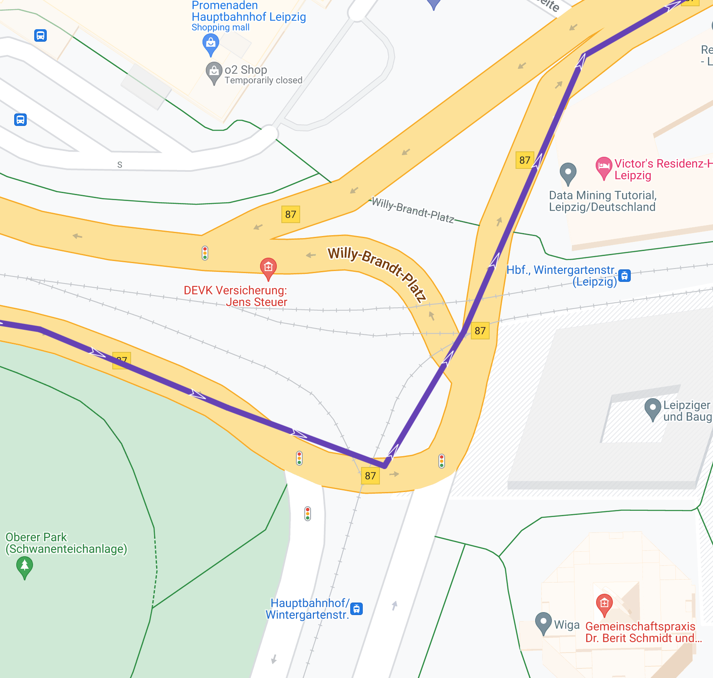
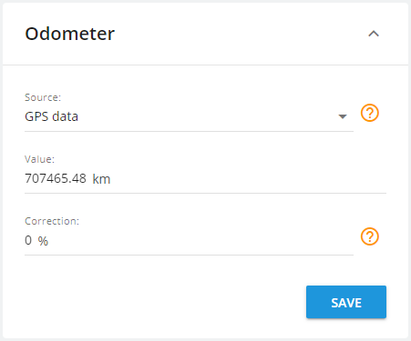

# Mileage and odometer

Most likely, sooner or later you will encounter such a problem that the odometer and mileage values ​​that you see in the reports on the platform do not converge match the expected ones.

What is more accurate? Odometer in the car or counter in the widget in your account? Distance between cities calculated from a map or data from a trip report? Unfortunately, there is no definite answer to this question. There are many factors to consider and specific cases to be dealt with. This article will help you better understand how the system calculates distance.

Please note that by default, all distances that you see in the program are calculated based on GPS data received from the tracker. If you use a high-quality and properly configured tracker, then such data will be more accurate than any other source.

### Odometer reading

The odometer counter and the sum of trip lengths in the report are different indicators that are calculated according to different logic. Usually they are not the same.

The odometer takes into account absolutely all GPS points that the device sends. If the car is parked in an area of poor GPS signal, the coordinates will start to drift and the tracker will start to jump a little on the map around the parking spot. The platform will most likely filter this data and you will not see it in your travel history. But they will be counted in the odometer counter.

> [!INFO]
> Modern GPS devices have settings to freeze coordinates while parking. If you set up this function correctly, it will negate coordinate drift.

If the odometer readings on the platform are lower than the physical odometer readings in the car, then the problem is most likely in the "Tracking mode" settings.

If the tracker transmits data infrequently, corners will be cut and part of the distance will not be taken into account, and the virtual odometer will slowly lag behind the vehicle's readings.

Configure the tracker to transmit your location as often as possible (including angle and distance conditions) to minimize possible impact.

> [!INFO]
> In addition, the odometer readings in a car are not always 100% accurate. Manufacturers allow an error of up to 10%, but usually it fluctuates somewhere around 5%. Usually, upwards.

> [!INFO]
> Also, worn tires and non-standard disks can affect, since mileage is calculated from the speed of the wheels rotation.

If it is important to you that the readings on the platform match the data of the physical odometer, you can set up automatic correction.

But first, you need to collect some statistics in order to understand what value of the adjustment to set. Collect data for at least 200 kilometers and calculate the difference as a percentage.

1. Open Device Management and find the Odometer widget.
2. Adjust the correction up or down, and also specify the current value.

Now all readings will be automatically corrected according to your settings. Most likely, a small difference will still be observed, but it will not be critical and you can simply check the data and update the counter every few months.

> [!INFO]
> If your tracker is connected to the car via CAN bus, then you can set up the synchronization of the odometer on the platform with the real car odometer. Just create the corresponding CAN sensor and select it as the odometer source in the settings panel.
> Note that you will still need to manually enter the current mileage first.

### Trips in reports

As mentioned above, the trip reports are different from the odometer readings. If you create a daily report, the sum of the trip lengths may be different.

First of all, because it is only trips that are taken into account, and not all movements. For example, with certain settings, the platform may not include towing by a tow truck in the report.

But most often, this happens due to incorrect settings for "Parking detection". The easiest way to check this is to display all trips for the day on the map and see if there are large gaps between them and if each trip is a continuation of the previous one.

> [!INFO]
> If necessary, read the [Parking detection](https://www.navixy.com/docs/user/web-interface-docs/devices-doc/parking-detection/) instructions in order to correct possible problems.