# Monitor Sensor Values

- [Use cases](#use-cases)
- [Parameter in range](#parameter-in-range)
  - [How to configure your device on sending BLE data](#how-to-configure-your-device-on-sending-ble-data)
  - [Sensors creation on the platform](#sensors-creation-on-the-platform)
  - [Parameter in range multiconditional rule creation](#parameter-in-range-multiconditional-rule-creation)
    - [Rule settings](#rule-settings)
    - [Rule notifications](#rule-notifications)
    - [Rule schedule](#rule-schedule)

In our swiftly digitizing world, the need to monitor an expanding array of parameters is more crucial than ever. Moreover, just observing current values or analyzing incoming data isn't enough anymore. Many situations demand immediate action for resolution.

That's why we've developed a feature on our platform that allows you to receive alerts based on these parameters. This enables you and your team to quickly step in and tackle the issue, all while keeping an eye on it from various perspectives. We refer to these as "multi-conditional alerts" because they allow you to set different ranges or specific values for multiple - or even single - parameters. This way, you're always the first to know and can act promptly when needed.

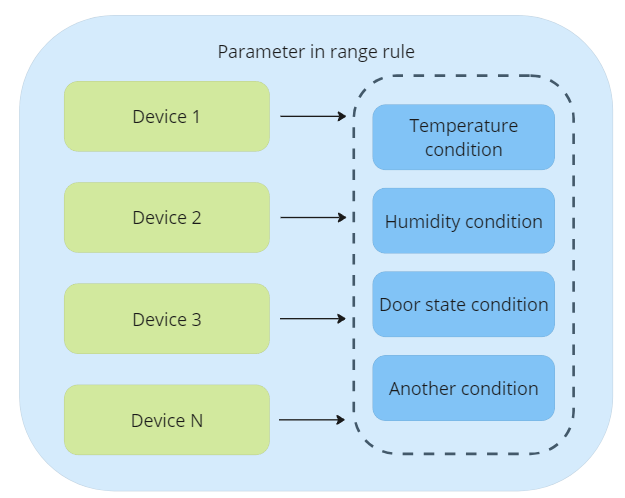

These rules are designed to oversee scenarios including but not limited to cold chain monitoring, specific transportation, comprehensive vehicle tracking, and other highly specific situations like receiving notifications about unique parameters on your intricate systems.

We've categorized these rules into different types for your convenience:

- General:
  - Rules that trigger when a parameter enters or exits a certain range.
  - Rules that activate when a desired parameter value is received.
- Specific:
  - Rules specifically designed for monitoring drains and refills.

To effectively track any data, each rule necessitates specific types of sensors. The data from these sensors is then relayed to the platform via GPS trackers. As such, the initial step for implementing multi-conditional rules involves connecting the sensors to the device and configuring them to transmit their data to the platform.

## Use cases

Let's delve into various use cases where our multi-conditional alerts can assist you and your clientele in meeting their specific needs.

| **Case** | **Issue** | **How Navixy helps** |
| --- | --- | --- |
| Reducing downtime and averting of expensive failures | Many clients who manage vehicle fleets - from taxi services, public and private passenger transport firms, to logistics and car rental companies - frequently face the challenge of maintaining their vehicles in optimal working condition. Their goal is to minimize the risk of expensive malfunctions that can lead to significant downtime. | Navixy provides you with the ability to keep a close eye on various unit statuses, encompassing aspects like intake air temperature, engine RPM, engine load, DTC codes, barometric pressure, and even hybrid vehicle system voltage. It offers a valuable alert system for critical or near-critical readings of these systems. This way, the relevant parties can be notified promptly, granting them the chance to step in and address the issue before it escalates into a severe, expensive breakdown requiring extensive repairs. |
| Reducing heavy machinery idling time | Сompanies that operate heavy machinery and aggregates in construction sites and quarries, as well as conveyor belts in manufacturing facilities, have a vested interest in their efficient operation. The goal is to minimize downtime, which in turn boosts productivity and optimizes operational costs. | The application of multi-conditional alerts, in synergy with sensors linked to the operational components of heavy machinery. When these sensors detect anomalies that suggest a potential shutdown or malfunction, they trigger alerts. This sophisticated system is not only designed to provide real-time warnings, but also to analyze multiple sensors simultaneously. |
| Fuel theft and refuelling monitoring | All businesses operating vehicles, heavy machinery, and equipment reliant on fuel have a vested interest in minimizing fuel consumption and, more importantly, curbing fuel theft. Fuel theft can significantly undercut a company's profits, and neglecting to address this issue could have substantial repercussions on the organization's financial health. | By installing precise fuel sensors and properly configuring them, coupled with multi-conditional fuel level alerts for identifying unanticipated drains and refills on the platform, companies can effectively curb unexpected fuel wastage. |
| Transportation compliance control | Logistics and trucking companies are perpetually juggling orders that demand adherence to specific conditions. Swift intervention is critical if these conditions are breached, as any delay can lead to the loss of the order and potentially incur penalties. It's a delicate balancing act that requires meticulous attention to detail and rapid response capabilities to ensure optimal operational efficiency and customer satisfaction. | The integration of diverse sensors within cargo compartments and shipping containers can provide invaluable data for monitoring purposes. These sensors can track a range of conditions, with rules programmed to process these readings and alert operators or drivers when immediate action is necessary. This real-time feedback mechanism facilitates prompt intervention, thereby enhancing the efficiency and reliability of the logistics process. |
| Street cleaning equipment monitoring | Utility companies tasked with street cleaning operations using specialized equipment must ensure seamless communication with drivers and foremen. For instance, when dealing with street vacuum cleaners, operators need to be alerted promptly if the suction power diminishes or if the container reaches capacity and requires emptying. Substandard cleaning practices can result in penalties and may even jeopardize the company's reputation, leading to a potential loss of contracts. Therefore, maintaining an efficient alert system is crucial for these utility companies to deliver consistent and high-quality services. | In order to circumvent these issues, link your vehicle's sensors to a GPS device. By setting up specific rules for sensors, create an alert that notifies responsible persons promptly when any situation arises that requires their attention. This proactive approach allows you to address potential problems swiftly, enhancing overall operational efficiency. |
| Track activity and flow rate information | Companies engaged in the rental of various fluid handling equipment need to keep a vigilant eye on flow rates and activity levels. Should there be a decline in performance or an unexpected shutdown, it's imperative to swiftly take corrective measures to prevent any onsite or production mishaps. Failing to intervene in a timely manner can have severe repercussions, potentially leading to significant operational disruptions. | It's crucial to keep a vigilant eye on key metrics, setting up rules and alerts for when parameters hit critical levels or deviate unexpectedly. In such instances, promptly dispatching responders to address the issue is paramount. Swift troubleshooting and repairs not only circumvent potential complications but also contribute to enhanced system performance. |
| Transformer monitoring | Companies utilizing portable transformers and generators place a high value on their seamless operation. These pieces of equipment don't function in isolation, but rather provide power to various appliances or entire buildings. Consequently, the act of monitoring key parameters of such equipment has a direct impact on the operational efficiency of the devices and potentially entire structures that are connected to them. | By adopting a strategic approach and incorporating a range of sensors, along with multi-conditional alerts, you can receive timely notifications regarding the charging, maintenance, and repair needs of your power generation equipment. The platform will alert the designated individuals about required upkeep and provide the exact location of the equipment. This allows engineers to swiftly address minor issues before they escalate into major problems, potentially damaging the equipment and the structures relying on its power. |

The range of possible use cases is vast and only limited by your imagination and your customers needs.

## Parameter in range

Let’s study the full solving and configuration of a rule for triggering when parameter comes in/out range using cold chain monitoring story as an example. Other multi-conditional rules are working similar way.

The transportation of perishable goods, such as food products, necessitates strict adherence to specific storage conditions, particularly regarding temperature and humidity. If, for instance, a driver inadvertently leaves the door open, causing the storage area's temperature and humidity to rise or exceed acceptable limits, a significant volume of goods may spoil, becoming unfit for consumption.

Such an incident can result in substantial losses for the carrier company and disrupt supply chains, forcing retailers or restaurants to seek alternative suppliers to ensure timely delivery of fresh products.

For this scenario, we'll use the [Teltonika FMB 920 model](https://www.navixy.com/devices/teltonika/teltonika-fmb920/) and Eye sensor. These devices are equipped to monitor and report on various parameters, including temperature, humidity, and door status without wires.  
You can take any device supported on the platform with reading of Humidity, Temperature and other measurement sensors.

Consider the use of a Bluetooth sensor with the capability to transmit data about temperature and humidity. This sensor can be installed within the refrigeration unit, ensuring constant monitoring of crucial environmental factors. Additionally, installing a magnetic Bluetooth sensor on the door provides real-time information about the door's status, alerting you when the refrigeration unit's door is opened or closed.

### How to configure your device on sending BLE data

Follow these steps to configure your device on sending BLE beacon data to the platform:

1. Download [Teltonika Configurator](https://wiki.teltonika-gps.com/view/Teltonika_Configurator_versions) [https://wiki.teltonika-gps.com/view/Teltonika\_Configurator\_versions](https://wiki.teltonika-gps.com/view/Teltonika_Configurator_versions) . This application streamlines many settings at once. You can save the preset and use it on the [FOTA Web](https://fota.teltonika.lt/devices) [https://fota.teltonika.lt/devices](https://fota.teltonika.lt/devices) to configure other devices, making the process more convenient.
2. In the System tab, set the Data Protocol to Codec 8 Extended. This enables the device to work with BLE tags.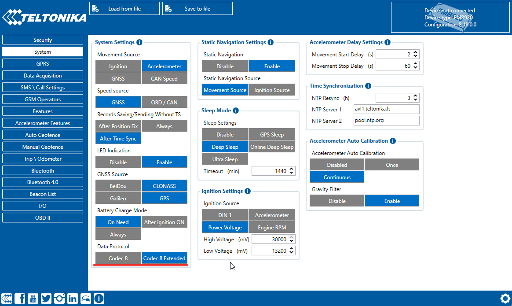
3. Enable Bluetooth in the Bluetooth settings and choose either "Enable (hidden)" or "Enable (visible)". Otherwise, Bluetooth will be disabled.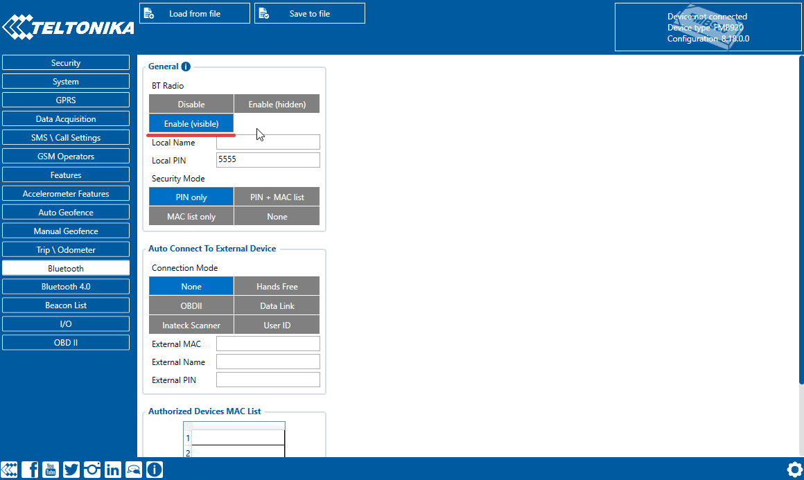
4. In Bluetooth 4.0 settings, disable Non-Stop Scan and configure Update Frequency and Scan Duration as 30 seconds. These settings optimize BLE scanning with the device.
5. In Bluetooth 4.0 settings Advanced Mode Settings, load the EYE Sensor preset according to packet settings in the EYE app.
6. Configure the MAC address of the sensor.
7. Enable BLE temperature and BLE humidity in I/O settings. Set low priority, event only - no and monitoring operand.

The device is now ready to transmit data from this sensor. Make almost the same for the magnetic sensor.

### Sensors creation on the platform

Now, let's dive into the process of establishing the necessary sensors on the platform. Our first priority is the temperature sensor. We'll set this up on the platform side, designating it as a BLE temperature sensor with the corresponding input number that aligns with your Bluetooth sensor configuration.

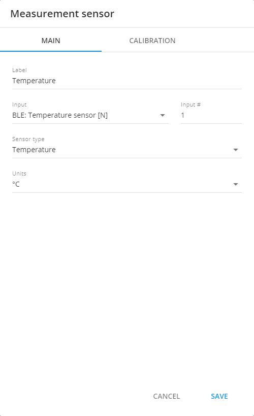

Next, we'll mirror this setup for the humidity sensor.

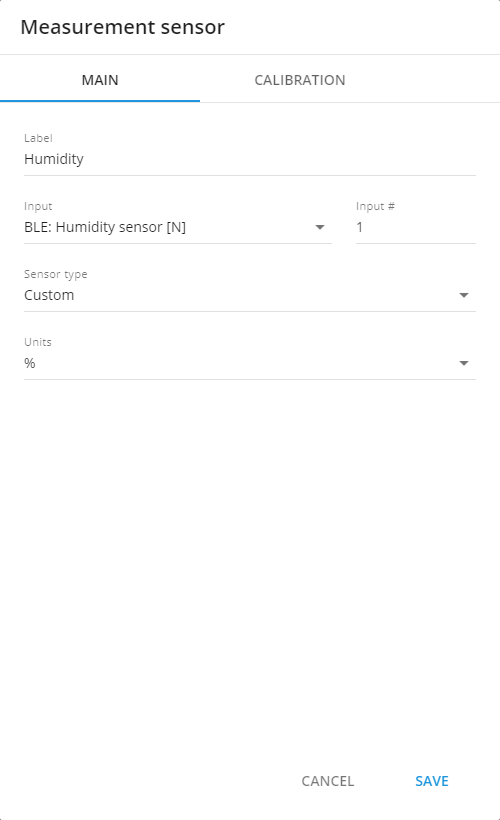

Excellent, we now have a pair of measurement sensors actively collecting data.

For the door sensor, we recommend establishing [a virtual sensor](https://squaregps.atlassian.net/wiki/spaces/SC/pages/2346942466). This sensor can be configured to use the 'source value' calculation method. You can determine its state and value based on the provided table. This sensor has just two states - indicating whether the doors are open or closed.

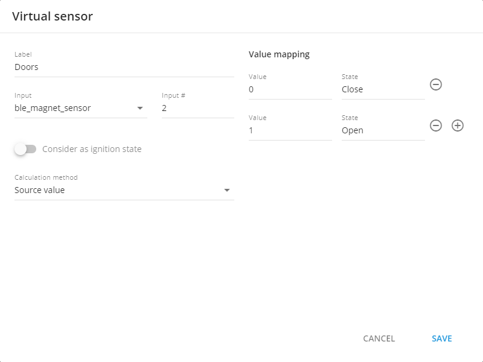

Given the likelihood of tracking multiple devices, it's crucial to streamline the process. Once we've established a reference device equipped with the sensors relevant to our needs, we can replicate these settings across other devices. Simply click the 'Copy Sensors' button on the platform. The system will automatically identify devices that can adopt the created sensor settings and present them for selection. From this list, choose the devices you wish to configure.

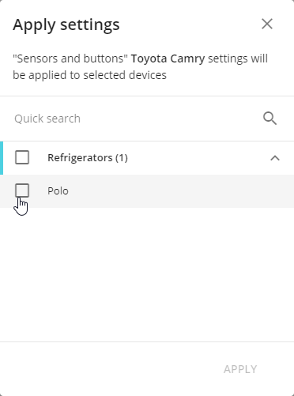

At this point, all necessary devices are set up, complete with their respective sensors. Now, let's move on to rule creation.

For future convenience, consider creating a new group for your devices. This allows for collective management of the devices within the group. For instance, you can generate rules and reports for the entire group simultaneously. Let's name this group 'Refrigerators' and include all devices installed on trucks equipped with these types of trailers.

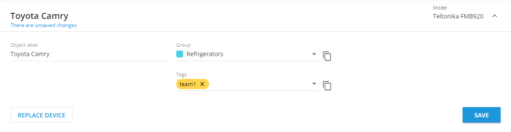

### Parameter in range multiconditional rule creation

In the context of our cold chain monitoring scenario, the 'Parameter in Range' rule is most suitable. This rule enables us to define an acceptable range of values for transporting frozen goods. If any parameter veers outside this predefined range, the designated individuals will be alerted. Here, we consider dispatchers as the primary point of contact, as notifying drivers—especially while they're on the road—may not always be effective. A dispatcher can communicate with the driver in a suitable manner, alerting them to potential issues with the refrigeration unit and the potential risk to the products. The problem needs to be addressed before the journey can resume.

This rule requires uniformity amongst devices in terms of inputs and their corresponding names. If you're using a variety of devices or did not employ sensor cloning, ensure all settings align.

To initiate this process, open the rules menu and create a new rule by clicking on the plus sign.

In the ensuing menu, select the 'Parameter in Range' rule type. This filters your device list, leaving only those compatible with this rule type. You can also begin by selecting the required devices.

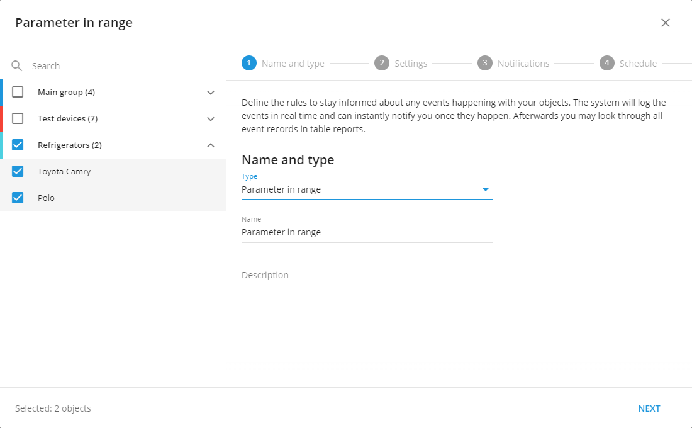

#### Rule settings

The initial device you select for the rule serves as the reference device. The sensors on this device, along with their respective names, will be utilized to choose sensors for the remaining devices. In other words, when you select a sensor on this reference device, the platform will cross-reference this selection with other devices. If these devices possess a sensor with matching input and name, it will then be available in the list for the rule.

Click on the sensor selection field and choose the temperature sensor from the dropdown list. This list encompasses both measurement and virtual sensors.

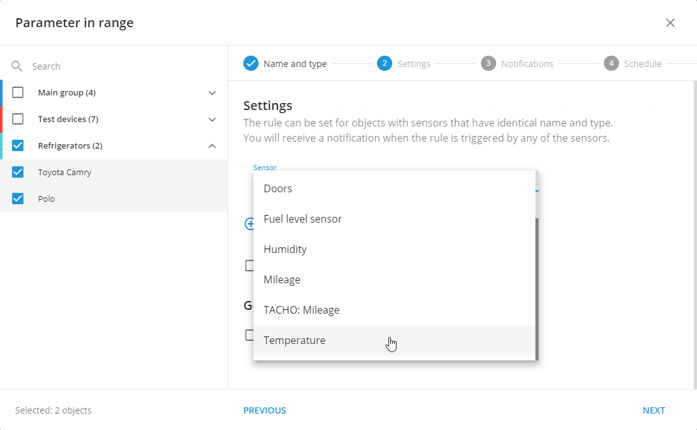

Upon selecting the sensor, a 'Threshold' field will appear to its right. This field serves as a buffer, which is applied on either side of the 'More or equal' and 'Less or equal' boundaries for each parameter. The purpose of this value is to help the platform discern between IN and OUT range states, even when dealing with inconsistent data (such as sensor noise or inaccuracies). It accomplishes this by creating a larger range around the set values, thereby permitting more tolerance and minimizing the chance of false alerts. If the 'Value Threshold' parameter is left unspecified, it defaults to 0.03 (absolute value).

If your sensor is highly accurate, you can set this value to 0. For less accurate sensors, select appropriate threshold values.

Next, we'll establish the permissible temperature limits, defined by the following parameters:

- 'More or equal': This parameter sets the minimum boundary of the range.
- 'Less or equal': This parameter sets the maximum boundary of the range.

For our frozen food transportation, we know that temperatures below -25 degrees and above -18 degrees can cause damage. Therefore, these are our designated temperature limits for transport. Set the 'More or equal' field to -25 and the 'Less or equal' field to -18. If the temperature drops below or exceeds these values, the quality of the transported products may be compromised, indicating a need to inspect the refrigerator.

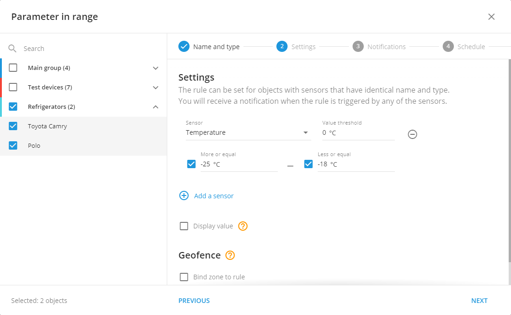

Next, add another sensor to your rule by clicking 'Add a sensor', and select the humidity sensor from the dropdown list. You'll notice an 'OR' operator between the sensors; this indicates that the rule will be triggered if any one of the sensors detects values outside their respective ranges. This way, we can ensure that we receive notifications for each sensor, enabling the person in charge to take necessary corrective actions. This is crucial to achieving our ultimate goal of delivering fresh food.

Just like the temperature sensor, the humidity level also needs to be maintained within a certain range. For our purposes, the acceptable humidity range is between 95% to 100%.

To set these values:

- Fill in 'More or equal' field with 95 (representing the minimum boundary of the range).
- Fill in 'Less or equal' field with 100 (representing the maximum boundary of the range).

If the humidity falls below 95% or rises above 100%, it could indicate a problem, triggering an alert.

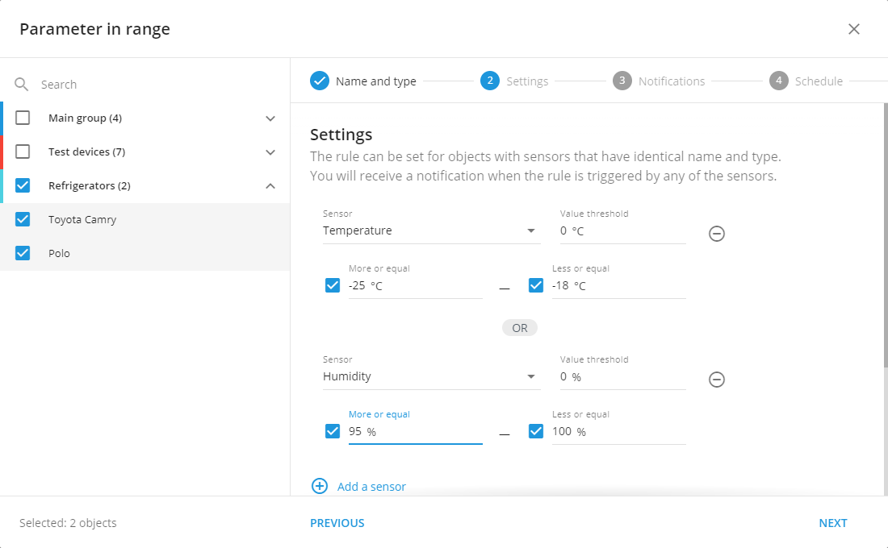

The final sensor to add to our rule is the door status sensor. This sensor sends a value of 1 when the doors are open. In this case, we only need to set one value for the range - 'More or equal' to 1. Click on 'Add a sensor', select the door status sensor from the dropdown list, and specify the range as 'More or equal' to 1.

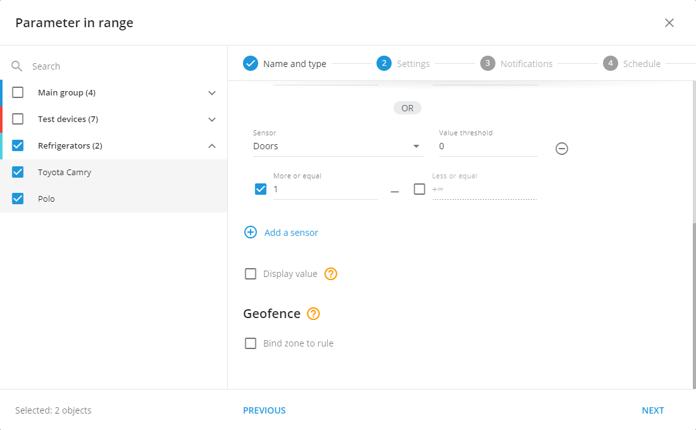

There are also additional parameters that can be customized:

- 'Display value': Enabling this parameter will include the values of each sensor at the time the alert is triggered in the notification. This can provide valuable insight into the conditions present at the time of the alert.
- 'Bind zone to rule': This parameter allows you to specify whether the rule should trigger inside certain geo-fences or only outside. In our case, it would be useful to create geo-fences at the loading and unloading locations. By enabling this parameter and selecting the 'outside' option, we can avoid receiving notifications when the doors are opened or other sensor values change within these zones. This helps to prevent unnecessary alerts and focuses attention on potential issues occurring during transit.

#### Rule notifications

After you've set up the rule settings, the next step is to customize your notifications.

Let's start with the notification text. It's important to use clear and concise language to ensure that alerts are easily understood. The names of devices as well as the range limits, will be automatically inserted into the alert text.

Firstly, specify the necessary text for when any sensor values go out of range. An example could be: "Urgently check the refrigerator." Then, specify the text for when sensor values fall within the normal range, like: "Sensor shows normal values."

Notifications also have two additional settings:

- 'Emergency notification': This is used for critical alerts. Unlike standard alerts, emergency notifications are highlighted in yellow, accompanied by a loud sound, and can only be dismissed by the operator clicking on it. This ensures that the operator has acknowledged the alert. Please note that in some browsers, the alert sound might not play if the user hasn't interacted with the tab. This can be checked in your browser's settings.
- 'Push notifications': These are alerts that appear in the X GPS Monitor mobile app and on your computer via the browser. They can be received even if the browser is minimized or if the tab is inactive.

Once you've set up your preferred notification settings, the final step is to designate the recipients of these notifications. Notifications in the web version of the app will always be enabled; however, if you need to send additional notifications to a phone number or email address, you can specify those details here. This way, the relevant individuals will be immediately alerted to any potential issues, ensuring swift and effective action.

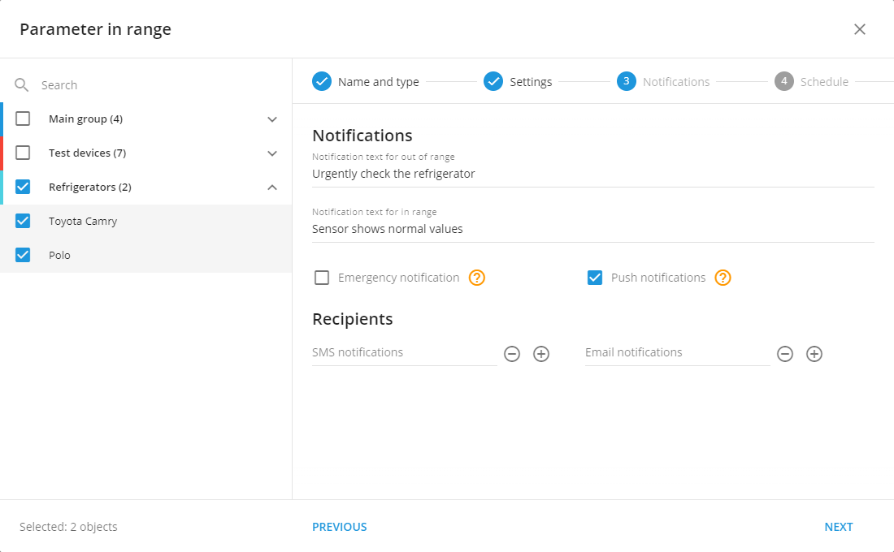

#### Rule schedule

After setting up the rule and notification settings, there's another crucial feature to consider - the operational hours of the alert. If, for instance, your drivers operate from Monday to Friday between 7 AM and 4 PM, it's unnecessary to receive alerts outside these hours. This can be particularly helpful in preventing false alarms, such as when refrigerator doors are opened for servicing in the garage. By disabling the rule outside of your drivers' shifts, you can focus on alerts that occur during operation hours.

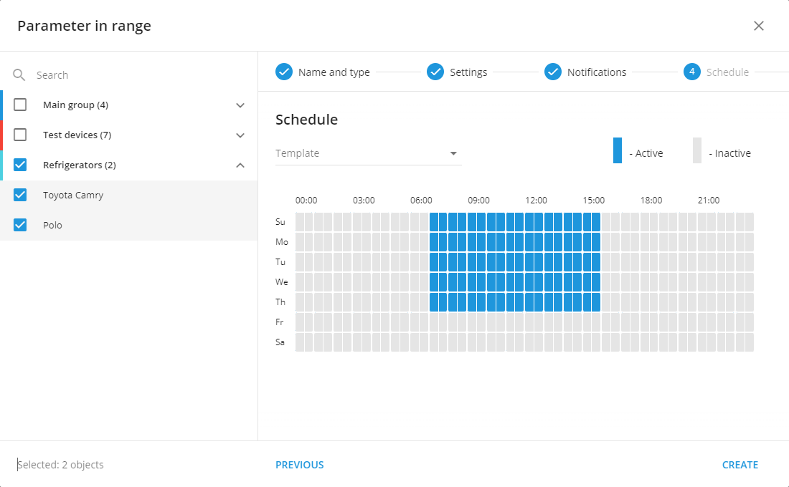

Congratulations! You've successfully set up your first rule for tracking multiconditional alerts. This comprehensive rule will help you manage an entire case without needing to create additional rules.