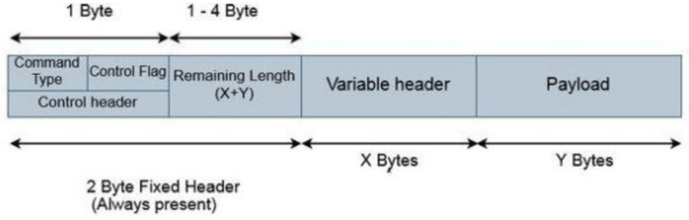
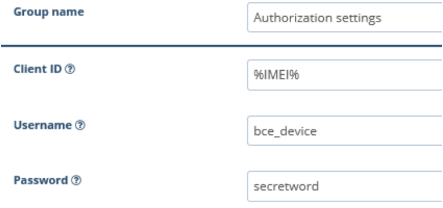

# MQTT fundamentals

Message Queuing Telemetry Transport (MQTT) protocol has been used for many years, but now it is especially relevant due to the explosive growth of IoT: both customer and industrial devices are implementing distributed networks and edge computing, and devices with constant data transmission are becoming part of everyday life. Such intensive growth forces people to look for ways to transfer data efficiently.

## What is MQTT

Andy Stanford-Clark (IBM) and Arlen Nipper (then working for Eurotech, Inc.) authored the first version of the protocol in 1999. It was used to monitor oil pipelines within the SCADA framework. The goal was to have a protocol that is bandwidth-efficient, lightweight, and uses little battery power, because the devices were connected via satellite link which, at that time, was extremely expensive. At the moment, most devices use version 5.0.

The Message Queuing Telemetry Transport (MQTT) is a lightweight, publish-subscribe network protocol that transports messages between devices. The protocol usually runs over TCP/IP; however, any network protocol that provides ordered, lossless, bi-directional connections can support MQTT. It is designed for connections with remote locations where a "small code footprint" is required or the network bandwidth is limited. The protocol is an open OASIS standard and an ISO recommendation (ISO/IEC 20922).

Given the operating conditions, the protocol is made small and light. It is ideal for devices with low power consumption and limited battery life. Now, these include smartphones, as well as an ever-growing number of sensors and connected devices.

Thus, MQTT has become a protocol for streaming data between devices with limited CPU power and/or battery life, as well as for networks with expensive or low bandwidth, unpredictable stability, or high latency. That is why MQTT is known as the ideal protocol for IoT. It is built on the TCP/IP protocol, but there is a branch of MQTT-SN for working over Bluetooth, UDP, ZigBee, and in other IoT networks other than TCP/IP.

## How it works

### The publish and subscribe model

There are 2 main definitions in the MQTT: MQTT Broker and MQTT client.&#x20;

An MQTT broker is a server that receives all messages from the clients and then routes the messages to the appropriate destination clients.  In simple words, the broker acts as a post office, MQTT doesn't use the address of the intended recipient but uses the subject line called “Topic”, and anyone who wants a copy of that message will subscribe to that topic. Multiple clients can receive the message from a single broker (one to many capabilities). Similarly, multiple publishers can publish topics to a single subscriber (many to one).

An MQTT client is any device (from a microcontroller up to a fully-fledged server) that runs an MQTT library and connects to an MQTT broker over a network.

* The client connects to the broker. It can subscribe to any message “topic” in the broker. This connection can be a plain TCP/IP connection or an encrypted TLS connection for sensitive messages.
* The client publishes messages under a topic by sending the message and topic to the broker.
* The broker then forwards the message to all clients that subscribe to that topic.

Since MQTT messages are organized by topics, the application developer has the flexibility to specify that certain clients can only interact with certain messages. For example, sensors will publish their readings under the “sensor\_data” topic and subscribe to the “config\_change” topic. Data processing applications that save sensor data into a backend database will subscribe to the “sensor\_data” topic. An admin console application could receive system admin’s commands to adjust the sensors’ configurations, such as sensitivity and sample frequency, and publish those changes to the “config\_change” topic.

### Types of MQTT messages

An MQTT session is divided into four stages: connection, authentication, communication, and termination. A client starts by creating a Transmission Control Protocol/Internet Protocol (TCP/IP) connection to the broker by using either a standard port or a custom port defined by the broker's operators. When creating the connection, it is important to recognize that the server might continue an old session if it is provided with a reused client identity.

The standard ports are 1883 for nonencrypted communication and 8883 for encrypted communication -- using Secure Sockets Layer (SSL)/Transport Layer Security (TLS). During the SSL/TLS handshake, the client validates the server certificate and authenticates the server. The client may also provide a client certificate to the broker during the handshake. The broker can use this to authenticate the client. While not specifically part of the MQTT specification, it has become customary for brokers to support client authentication with SSL/TLS client-side certificates.

Because the MQTT protocol aims to be a protocol for resource-constrained and IoT devices, SSL/TLS might not always be an option and, in some cases, might not be desired. On such occasions, authentication is presented as a cleartext username and password, which are sent by the client to the server - this, as part of the CONNECT/CONNACK packet sequence. In addition, some brokers, especially open brokers published on the internet, will accept anonymous clients. In such cases, the username and password are simply left blank.

### MQTT message format

MQTT is considered a lightweight protocol because all its messages have a small code footprint. The packet consists of a 2-byte fixed header + a variable header and a payload. In this first 2-byte, the fixed header will be always present in all the packets and the other two, variable header and payload are not always present.

Out of the two-byte fixed header, the first byte is the control field. This 8-bit control field Is divided into two 4 bit fields. The first 4 MSB bits are the command type field. This type determines the action that will be performed: the client wants to subscribe to the topic, a new message is published for subscribers and others.

The next 4 bits are the control flag bits and they are used by the publish command for the rest of the commands they are reserved and the value will be 0.

The second byte of the fixed header contains the remaining length which is, length of the variable header + the length of the payload.

A variable header is not present in all the MQTT packets. Some MQTT commands or messages use this field to provide additional information or flags and they vary depending on the packet type. A packet identifier is common in most of the packet types.

In the end, the packet may contain a payload. Even the payload is optional and varies with the type of packet. This field usually contains the data which is being sent. E.g. For CONNECT packets, the payload is client ID and ‘username and password’ if they are present. And for the PUBLISH packet, it is the message to be published.

### Quality of Service

QoS refers to an agreement between the sender of a message and the message's recipient. It acts as a key feature in MQTT, giving the client the ability to choose between three levels of service.

The three different QoS levels determine how the content is managed by the MQTT protocol. Although higher levels of QoS are more reliable, they have more latency and bandwidth requirements, so subscribing clients can specify the highest QoS level they would like to receive.

* The simplest QoS level is an unacknowledged service. This QoS level uses a PUBLISH packet sequence; the publisher sends a message to the broker one time, and the broker passes the message to subscribers one time. There is no mechanism in place to make sure the message has been received correctly, and the broker does not save the message. This QoS level may also be referred to as at most once, QoS0 or fire and forget.
* The second QoS level is acknowledged service. This QoS level uses a PUBLISH/PUBACK packet sequence between the publisher and its broker, as well as between the broker and subscribers. An acknowledgment packet verifies that content has been received, and a retry mechanism will send the original content again if an acknowledgment is not received in a timely manner. This may result in the subscriber receiving multiple copies of the same message. This QoS level may also be referred to as at least once or QoS1.
* The third QoS level is assured service. This QoS level delivers the message with two pairs of packets. The first pair is called PUBLISH/PUBREC, and the second pair is called PUBREL/PUBCOMP. The two pairs ensure that, regardless of the number of retries, the message will only be delivered once. This QoS level may also be referred to as exactly once or QoS2.

## Advantages and disadvantages

### Advantages:

* MQTT is packet agnostic. The MQTT protocol payload can carry any type of data such as binary, ASCII text, etc. The receiver needs to interpret and decode as per the format used by the transmitter.
* It uses a packet of a low size and can be used for low bandwidth applications.
* It offers lower battery power consumption.
* It is a reliable protocol as it uses QoS options to provide guaranteed delivery.
* Due to its publish/subscribe model, It is scalable.
* It offers a de-coupled design as it is easy to decouple the device and server. Ideal for distributed one-to-many communications and separated applications.
* A publishing device can send data to the server at any time regardless of its state.
* Equipped with the function LWT (Last Will and Testament) to notify the parties of an abnormal disconnection of the client.
* Relies on TCP/IP for basic communication tasks.
* Designed to deliver messages according to the templates "maximum once", "minimum once" and "exactly once".

### Disadvantages:

* MQTT can’t support video streaming.
* Issues with Latency.
* Security is not built-in. MQTT is unencrypted. Instead, it uses TLS/SSL (Transport Layer Security/Secure Sockets Layer) for security encryption.
* A centralized broker can be the point to failure as client connections with brokers are open all the time.
* It does not support advanced features such as flow control.

## Where MQTT can be used

As IoT applications are now being implemented on a huge scale, MQTT has come into the spotlight as an open, simple, and scalable way to deploy distributed computing and IoT functionality to a wider user base — both in the consumer and industrial markets.

* Fleet management. Organizations are using MQTT to build smarter fleet management systems that improve fleet optimization, driver safety, and lower fuel costs. New modes of transportation using drones are also changing the way we move goods. Connectivity between a mobile device used by the operator, telemetry information direct from the vehicle, and integration into back-end scheduling and routing systems provides the visibility required to improve the overall fleet operation.
* Environmental sensor data. MQTT supports the "no more than once" message delivery model. In networks with partial coverage of the territory or high latency, this means that information may be lost or duplicated. In areas where remote sensors record and transmit data at specified intervals, this is not a problem, since new readings are received on a regular basis. Sensors in remote environments are usually low-power devices, which makes MQTT an ideal solution for IoT sensors with a relatively low data transfer priority.
* Machine health data: to quickly respond to emerging problems and prevent downtime. For example, for a wind power plant, you need guaranteed delivery of current performance indicators to local teams even before this information gets to the data processing center. In such situations, the delivery of messages "at least once" guarantees that the appropriate flags will be noticed by the necessary specialists in a timely manner, even if they arrive as duplicates. This is important for machine-to-machine communication with a higher priority.
* Billing systems: There are even more priority and accurate messages that need to be handled correctly. In business situations where duplication of records is unacceptable, including in billing systems, the "exactly once" transmission QoS flag is useful. This eliminates duplication or loss of packages in billing or billing systems, reduces the number of anomalies and unnecessary contradictions in the agreement.
* Text-based messaging applications for real-time communication that capitalizes on MQTT's low data and energy usage. For example, Facebook uses MQTT for its Messenger app, not only because the protocol conserves battery power during mobile phone-to-phone messaging, but also because the protocol enables messages to be delivered efficiently in milliseconds, despite inconsistent internet connections across the globe.

## MQTT devices supported by Navixy

* Xirgo Global FMS500 Light MQTT (IOTM
* Xirgo Global FMS500 Light+ MQTT (IOTM)
* Xirgo Global FMS500 StCAN MQTT (IOTM)
* BCE FMS500 Light MQTT (IOTM)
* BCE FMS500 Light+ MQTT (IOTM)
* BCE FMS500 StCAN MQTT (IOTM)
* GlobalmatiX xTCU

## How to configure MQTT devices to work with Navixy

### Xirgo & BCE MQTT device configuration

To configure the Xirgo & BCE device on working with MQTT:

* Inside FMSET: Choose connectivity → Telemetry server → MQTT broker address settings) specify host: [mqtt.eu.navixy.com](http://mqtt.eu.navixy.com/) for EU server and [mqtt.us.navixy.com](http://mqtt.eu.navixy.com/) for US server, port 1883.
* And  add the default user in MQTT Security -> Authorization\
  

### Globalmatix MQTT device configuration

To configure the Globalmatix device on working with MQTT:

* Specify server [http://mqtt.navixy.com](http://mqtt.navixy.com) port 1883 for EU and [http://mqtt.us.navixy.com](http://mqtt.us.navixy.com) port 1883  for US
* User/password - globalmatix/secretword
* Topic globalmatix/in

To configure the Globalmatix device on working with MQTTS:

* Specify server [http://mqtt.navixy.com](http://mqtt.navixy.com) port 8883 for EU and [http://mqtt.us.navixy.com](http://mqtt.us.navixy.com) port 8883  for US
* User/password - globalmatix/secretword
* Topic globalmatix/in
