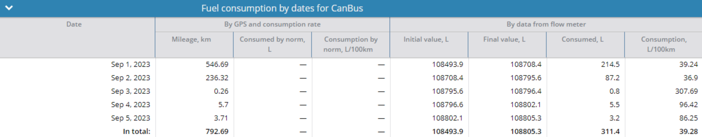
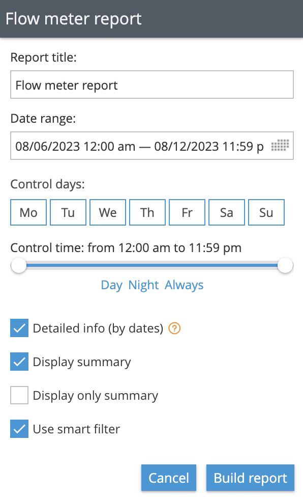
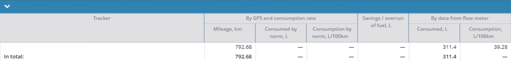

# Fuel consumption report

* [Report Parameters](fuel-consumption-report.md#report-parameters)
* [Table fuel consumption by date for the sensor](fuel-consumption-report.md#table-fuel-consumption-by-date-for-the-sensor)
* [Tab total for the period](fuel-consumption-report.md#tab-total-for-the-period)

The report displays statistics on fuel consumption for a certain period, based on data from the flow meters installed in the vehicle. Unlike the previous report, it does not show the fuel level at a certain point in time from conventional fuel sensors, but only the consumption from flow meters. For example, CAN: fuel consumption.

This report provides similar information as the fuel report in the consumption section, but works using data from a different type of sensor and solves the following problems&#x20;

* To record the actual fuel consumption of vehicles and compare it with the manufacturer's stated fuel consumption.
* To calculate depreciation on transportation of goods and cargo, which will be useful for logistics companies and any business to calculate the cost price of goods.
* To calculate employee payments for fuel and lubricants if they operate their own vehicles.
* To record the fuel consumption of units. For example, generator sets.
* To account for the dispensing of fuel to vehicles on the base.

> \[!INFO] To create a comprehensive report, utilize Navixy API and leverage the capabilities of plugin 78.

In order to get the information in the report you need to:

* The device for which the reading of the flow meter sensor on the platform is supported. You can specify whether reading of fuel level from a particular type of sensor is supported in the [list of supported inputs for any model.](https://www.navixy.ru/devices/)
* Data from the device and the flow meter sensor. In order to provide the most accurate fuel consumption information, data must flow without interruption.

## Report Parameters

The following parameters are used in the report:

* Detail by dates - show fuel movement totals by dates.
* Show General Report - allows you to enable or disable the page with general information on all devices.
* Show only total report - will display only one page with summary information about fuel consumption for the period.
* Use a smart filter - short trips under 300 meters and less than 4 points will not be counted to calculate total mileage.

Only devices with a sensor with the flow meter type installed will be available for selection.

## Table fuel consumption by date for the sensor

The table contains all information about fuel consumption by sensor. If there are several sensors, there will be several tables in the report.

**Columns**

The information is organized in the following columns:

* Date
* GPS and flow rate data
  * Mileage, km - total mileage for the day or for the whole period for the total.
  * Normal consumption, l - how many liters the vehicle would consume if it consumed fuel as specified by the factory.
  * consumption rate, l/100 km - vehicle consumption rate specified by the factory. It is taken by the platform from the [vehicle](https://www.navixy.ru/docs/user/web-interface-docs/fleet/) card.
* Flow meter data
  * Initial reading, l - total fuel consumption according to the sensor at the beginning of the day.
  * End reading, l - total fuel consumption according to the sensor at the end of the day.
  * Consumption, l - actual consumption for the day, based on the difference between the final and initial readings.
  * Consumption, l/100km - actual fuel consumption of the vehicle per 100 km.
  * `(initial fuel level - final fuel level)/mileage * 100`

**Raws**

The information from the first line can be read like this:

* On September 1, 2023, the vehicle was driven 546.69 km. Total fuel consumption at the beginning of the day was 108493.9 liters and at the end of the day the reading was 108708.4 liters. Actual fuel consumption was 214.5 liters and the fuel consumption rate was 39.24 liters.

**Total**

Totals displays the total data for the period for the beacon. The initial reading is taken from the first day's data and the final reading from the last day's data. The total consumption is the sum of all expenses for the period, and the consumption per 100 km is calculated from the total mileage and total consumption.

The total mileage for the period was 792.68 km. The actual fuel consumption for the period was 311.4 liters and the fuel consumption rate for the period was kept at 39.28 l/100 km.

## Tab total for the period

The tab displays general information on all devices.There is only one column in this tab, which should be noted separately:\
Fuel saving/overconsumption, l - displays information about the difference between the standard and actual fuel consumption. If the actual consumption is higher, the values will be negative.

The Total for Period tab displays fuel data only for beacons that have fuel consumption measured in liters or gallons. To add a beacon to the report, change the fuel gauge units to liters or gallons.
