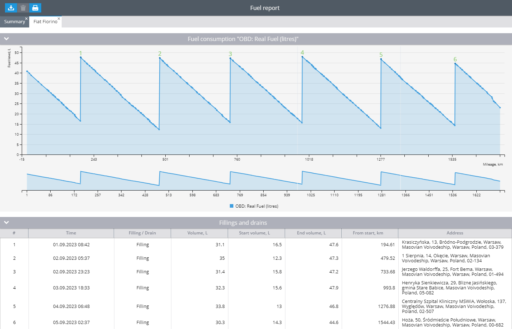
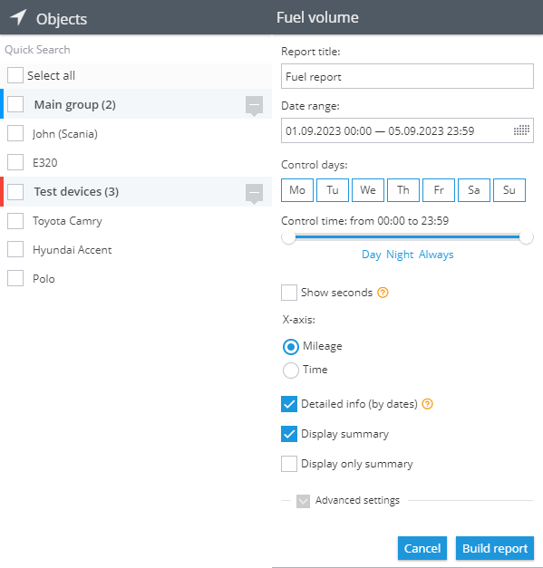
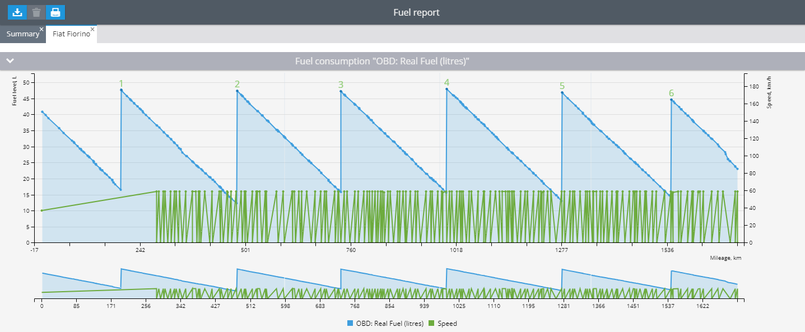
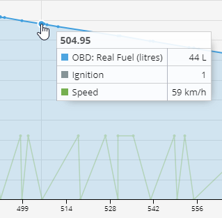
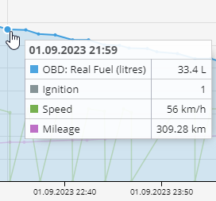
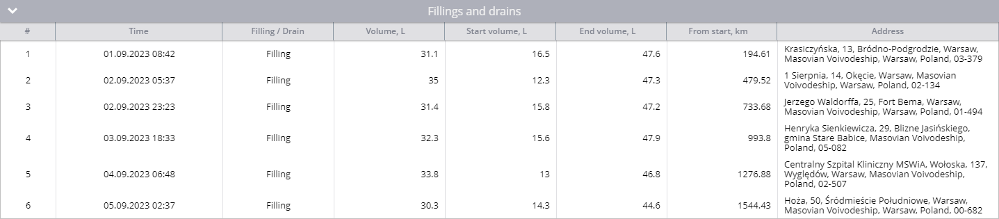
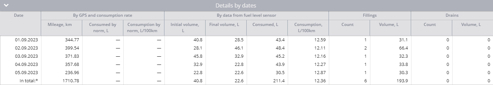
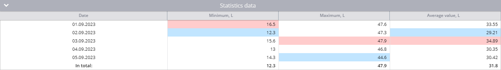

# Fuel volume report

## Before you start


Please make sure the platform is configured properly before you create a fuel report, so events could be recognized properly:

* Check [sensor settings](../sensors-setup-and-configuration.md)
* Check [parking detection settings](https://app.gitbook.com/s/446mKak1zDrGv70ahuYZ/guide/devices-and-settings/location-and-movement/parking-detection-widget)


### Refills and drains in reports

The reporting system offers a more sophisticated approach to analysis by leveraging a vast reservoir of saved data. It takes all parameters into account during the analysis process.

To identify and record fuel drains, the platform utilizes the rate of fuel level decrease and absolute error. A "drain" occurs when the fuel level decreases more than the absolute error, faster than one of specified thresholds for drains by time or mileage.

In the report, a "filling" event is documented when the fuel level increases by more than the absolute error. The platform groups consecutive filling or draining events together, meaning that if the same condition is triggered repeatedly, it will be consolidated into a single extensive filling or draining event.

### Ignoring refills and drains in motion

Once you have enabled one or both options for ignoring - the next algorithm will be used for reports and alerts in addition to standard:

* If refueling begins during the [parking time](https://app.gitbook.com/s/446mKak1zDrGv70ahuYZ/guide/events-and-notifications/movement-monitoring/parking-state-detection), it will be displayed in the report and logged by the rule. Additionally, if refueling starts within X minutes of the filter timeout before parking or within X minutes of the filter timeout after the trip starts, it will also be logged by the rule and shown in the report.
* However, if refueling starts earlier than X minutes from the filter timeout before parking or later than X minutes from the filter timeout since the beginning of the trip, it will be filtered out.
* In cases where no filter timeout is specified, all refills that start during trips will be filtered.

## Creating a fuel volume report in Navixy

Fuel level report displays detailed information on all fuel sensors installed in the vehicle and connected to the GPS tracker. The report will contain data on drains, refueling, initial and final fuel volume for a certain period and days, total fuel consumption and fuel consumption per 100 km or per hour.

Tasks that the report addresses:

* To record the actual fuel consumption of vehicles and compare it with the manufacturer's stated fuel consumption.
* To calculate depreciation on transportation of goods and cargo, which will be useful for logistics companies and any business to calculate the cost price of goods.
* To calculate employee payments for fuel and lubricants if they operate their own vehicles.
* To identify unscrupulous drivers who may be dumping your fuel for resale.
* To record the fuel consumption of units. For example, generator sets.
* To account for the dispensing of fuel to vehicles on the base.
* To determine which machines need repair if their fuel consumption is consistently high.


You can also build the report using Navixy API. More information could be obtained in [Developers Hub](https://www.navixy.com/docs/developers)


## What affects the readings in the report

The report displays graphs based on the sensor readings sent by the unit. From the received data, the set settings of the fuel sensors and the parameters of the report itself, it performs calculations of drains, refills and fuel consumption. In order for the platform to perform calculations and display information correctly, the following must be configured:

* For the platform to support reading a particular fuel sensor, it's important to verify if the list of supported inputs of any model includes the capability to read fuel levels from that specific sensor.
* Continuous transmission of fuel level data between the device and platform is crucial. If the data is not consistently received or is inaccurate, it may lead to graph display issues or incorrect calculations on the platform.
* The recorded values in the report are influenced by the fuel level sensor settings, which are vital for calculating drains and refills. You have the flexibility to modify the sensor settings at any given point and generate a fresh report. Additionally, the results obtained are directly impacted by the report parameters, making them a crucial factor to consider.


Once you modify the sensor settings, you have the option to regenerate the report for that specific time frame using different settings. This enables the changes to be implemented into the recorded data seamlessly.


## How the fuel reading and report works

To provide information in the report, the platform does the following:

1. Collects and stores raw data from devices and fuel sensors.\
   Depending on the ignored values set in the sensor settings, it may filter out raw sensor readings when outputting information. It can also apply a factor to raw sensor data. All parameters are manually configured by you. The platform does not make changes on its own and records the data as is.
2. The raw data is then converted to the values you specified in the calibration table to generate the report. If the calibration table is not filled in, the platform will not perform any conversions and will display the stored values as received.
3. Based on the report parameters you select, the platform plots the saved values.
4. Then, the fuel sensor settings - error and threshold values - are applied to this graph. This is how the platform calculates drains and refuelings for the report.
5. Calculations are made on drains, refuelings and fuel consumption for the period.

### How the definition of refueling stations in the report works

The report uses the sensor parameter - error and the calibration table to determine the refills.\
The last value in the calibration table is the maximum tank capacity for the sensor. If the calibration table is not filled in, the platform considers the maximum tank capacity to be 100 liters. So, if your fuel tank has a maximum capacity of 100 liters, then all fuel level changes between adjacent readings from this sensor will be compared to an error level of 5% of 100 liters. The platform compares readings in segments of two consecutive points. If the fuel level has increased by more than 5 liters, the refueling will be marked in the report.

### How the definition of drains in the report works

The platform uses the drain thresholds sensor parameters to identify drains in reports. Drain thresholds are used in reports because they are more complex and compare time and distance information. Both thresholds are used in fuel level report simultaneously and if the fuel level changes more than absolute error faster than at least one of thresholds - the drain will be determined.

Let’s consider an example. The following values are specified for the fuel level sensor:

* The tank is 370 liters;
* The error is 2%, so the absolute error is 370 \* 0.02 = 7.4 L;
* The time threshold for drains is 100 liters per hour or 16.6 in 10 minutes;
* The mileage threshold for drains is 60 liters per 100 km or 6 liters per 10 km;
* Drain starts: at 1:20, with fuel level 333.85 L, and mileage 73.4
* Drain ends: at 1:30, with fuel level 324.98 L, and mileage 79.77

Difference:

* Time: 10 minutes
* Fuel level: 8.88 - more than absolute error, so if at least one of thresholds exceeded, the drain will be determined.
* Mileage 6.37

The platform starts checking the speed of fuel level change:

For time: 8.88 L / 10 minutes = 0.888 per minute or 8.88 in 10 minutes - below the threshold, drain is not determined.\
For mileage: 8.88 L / 6.37 km = 1.39 per kilometer or 139 per 100 kilometers, which is above the threshold, that's why the drain is determined.

## Report Parameters

The following parameters are used in the report:

* The x-axis on the graph
  * Mileage - the report is built on the basis of the received mileage data, and drains are taken into account based on the mileage thresholds. Average consumption will be calculated in l/100km.
  * Time - the report is built on the basis of received time data, and drains are counted based on time thresholds. The average flow rate will be calculated in l/h.
* Detail by dates - display summary data on fuel movement for each day of the selected period.
* Show General Report - allows you to enable or disable the page with general information on all devices.
* Show only total report - display fuel movement totals for the period for all selected devices.
* Consumption by ignition data - ignition sensor readings will be used to calculate average fuel consumption, not travel time. Use for equipment that often stands still with the engine running for long periods of time - excavators, tractors, etc.
* Show mileage is only available for the time report. When enabled, the mileage will additionally be displayed on the graph.
* Use smart filter - short trips up to 300m and up to 4 points will not be considered in the report. The length and time of such trips will not be included in the statistics.
* Show speed - adds a speed reading to the graph in the report. It will help you when diagnosing fuel consumption, as well as to determine whether there was a false drain (for example, a real drain is unlikely to occur at a speed of 90 km/h).
* Smooth graph - this option is recommended for devices without built-in averaging mechanism. If the graph is uneven and the fuel level is constantly jumping up and down by 5-10% - try to enable this function. Please note that smoothing reduces the accuracy of fueling and draining, but allows to get an acceptable picture for inaccurate sensors.
* Filter emissions - if you observe strong short-term changes in fuel level on the graph - turn this option on. If you want to filter only the largest emissions - move the slider to the left. If on the contrary, weak ones - to the right.

After changing the sensor settings, you can build the report for the same period again with different settings and the changes will be applied to the recorded data.

## Fuel consumption graph by sensor

The graphical presentation showcases fuel sensor readings, displayed individually for each sensor. If a composite fuel sensor is configured with physical sensors, only the data from the composite sensor will be visible, while the individual sensor readings within the composite sensor will not be displayed.

Additionally, the chart provides numerical data for drains and refills, following the order in the Fills and Drains table. The numeric display appears at the completion of refueling or draining, rather than at the starting point, ensuring clarity in representation.

* When refueling, the number will be displayed in green,
* When draining, the number will be displayed in red.

If the platform did not receive any data from the sensor, it will be highlighted on the graph as a shaded area. Additionally, a notification will be displayed when hovering over the area. This indicates that the fuel sensor did not transmit any data during the specified timeframe to the platform.


There are various factors that may contribute to this phenomenon:

* The device did not send data from the fuel sensor during this period. For example, the sensor wire is not securely fastened or data from the sensor was not sent according to the beacon setting.
* The device did not send any data at all during this period. For example, it was turned off or removed from the monitored object.


If any values have been filtered according to the fuel level sensor setting, the platform will display the last unfiltered data here.

When you move the cursor over any of the report points, the exact information recorded at that point will be displayed. Depending on which parameters the report is built with, you will see different information on the report:

**X-axis = mileage**

If mileage is used for the X-axis, the graph will show the change in fuel level by vehicle mileage. You can also display speed readings when you hover over any of the report points.

The dot from the example below reads like this:

At 504.95 km from the start of the report period, the fuel level in the tank was 44 liters. The ignition was on and the speed was 59 km/h.

_example of a point on a fuel consumption by mileage graph_

**X-axis = time**

If time is used for the X axis, the graph will show the change in fuel level over time. You can also display speed and mileage readings at a point.

The point from the example below can be read like this:

On September 1, 2023 at 21:59, the fuel level was 33.4 liters. The ignition was on and the speed was 56 km/h. The mileage from the beginning of the report period was 309.28 km.

_example of a point on a graph of fuel consumption over time_

## Table Fillings and drains

This table will display information about the recorded drains and refills for the period.

_example of a refueling and draining table_

**Columns**

In this table, the information is presented in the following columns:

* Number - a serial number, which will also be displayed on the chart.
* Time - when the draining or refueling was recorded.
* Filling/draining
* Volume, l - number of liters by the defined event.
* Initial volume, l - fuel level at the beginning of the event.
* End volume, l - fuel level at the end of the event.
* From the beginning, km - how many km the device has traveled since the beginning of the report period.
* Address. Clicking on the address will open the map to display where the event occurred. Geofences may be listed before the address if the address is within them.

**Raws**

The lines can be read as follows:

Number 1 on the graph is a gas station. The event occurred on September 1, 2023 at 08:42 . The initial volume was 16.5 liters and the final volume was 47.6 liters. The refueling volume was 31.1 liters. It occurred 194.61 km after the beginning of the reporting period in Warsaw, Poland.

## Table details by dates

A date-detailed table will display the calculated information by day, according to the readings and report settings.

_example of a table detailing fuel consumption by date_

**Columns**

The information in the table is organized in the following columns:

* Date - reporting day
* GPS and flow rate data
  * Mileage, km - information about the mileage calculated by GPS on the beacon side.
  * Normal consumption, l - how many liters the vehicle would consume if it consumed fuel as specified by the factory.
  * consumption rate, l/100 km - vehicle consumption rate specified by the factory. It is taken by the platform from the [vehicle](https://app.gitbook.com/s/446mKak1zDrGv70ahuYZ/guide/fleet-management/vehicles) card.
* Fuel level sensor data - data that the platform has received from the fuel level sensor.
  * Initial volume, l - initial fuel level for the day.
  * Final volume, l - final fuel level for the day.
  * Consumption, l - actual fuel level consumption for the day. Calculated by the formula
  * `((initial fuel level + (refueling volume - draining volume)) - final fuel level`
  * Consumption l/100km - actual fuel level consumption per 100 km. Calculated by the formula
  * `((initial fuel level + (refueling volume - drain volume)) - final fuel level)/mileage * 100`
* Gas stations - information on the number and total volume of registered gas stations.
* Drains - information on the number and total volume of registered drains.

**Raws**

The information in the first row can be analyzed as follows:

On September 1, 2023, the mileage of the car was 344.77 km. According to the sensor, the initial fuel volume was 40.8 liters and the final volume was 28.5 liters. At the same time the vehicle was refueled once for 31.1 liters. No drains were recorded. The total fuel consumption for the day was 43.4 liters, and the actual consumption according to the sensor was 12.59 liters per 100 km.

**Total**

To calculate the total consumption, the report takes the initial volume on the first day of the period and the final volume on the last day of the period, the total mileage, and the total amount of refueling and draining. Total consumption is the sum of fuel consumption by day. After that it uses a formula to calculate the average consumption per 100 km.

The bottom line can be read like this:

The total mileage for the period was 1710.78 km. According to the sensor fuel level at the beginning of the period 40.8 liters, at the end of the period 22.6 liters. The total number of refuelings is 6 with a volume of 193 liters. The real fuel consumption was 211.4 liters and the real average consumption was 12.36 l/100 km.

If the sensor data is missing in the report, the platform will indicate it with the period. If the fuel level has changed during the period of absence of data from the sensor, the platform will not be able to predict real changes correctly.

## Table statistical data

This table provides statistical information on fuel levels by day and for the period.

**Columns**

The data are categorized into the following columns:

* Date
* Minimum, l - minimum fuel level for the period.
* Maximum, l - maximum fuel level for the period.
* Average, l - average value of fuel level for the period. It is based on all received sensor values.

**Raws**

The data from the string can be read like this:

On September 1, 2023, the minimum fuel level in the tank was 16.5 liters, which was also the highest minimum value for the entire period. And the maximum that day was 47.6 liters. The average value of fuel level in the tank was 33.55 liters.

## Quality of fuel level sensor readings \[LAB]

This section provides information on fuel level sensor reading quality assessment for the sensor raw data and calibration table.

**Fuel sensor quality index (FSQI)** is calculated by analyzing the noise of raw data from all types of fuel level sensors including OEM and standalone fuel level sensors.

This information may be useful to customers who are analyzing fuel calculations and graphs and would like to better understand the nature of fuel data, for example, why the graph is jagged.

If there is enough data to calculate a quality score for the sensor indicators, the algorithm will output a quantitative and a qualitative result:

* The quantitative result will be represented as a score from 1.0 to 10.0, where 1 means low quality of sensor indicators, 10 means high quality of fuel level sensor indicators.
* The qualitative indicator is expressed in one of three characteristics: **low**, for sensors with a quality score from 1.0 to 3.9, **medium** for sensors with a score of 4.0 to 7.9 and **high**, with a score of 8.0 to 10.0 respectively.

If there is insufficient data for calculation, for example, if the sensor has been used recently, the system will display the following message: "Insufficient data to assess the quality of fuel sensor readings. The most probable reasons are: insufficient number of car journeys during the selected period, too infrequent interval of fuel data acquisition or poor quality of sensor calibration on the platform. The minimum recommended period to assess the quality of readings is from 14 days of active vehicle operation."

Also, the fuel level sensor data quality report provides recommendations. This information allows the customer to carry out the initial analysis of the equipment performance. The information provided will be useful to customers when making decisions, especially if the results of calculations do not meet their expectations.

Another section is reated to the **Quality of the calibration table.**

A calibration table is a tabular representation that provides information regarding the correlation between the unprocessed sensor data obtained from a fuel level sensor and the genuine fuel level present in the tank.

The primary purpose of the calibration table is to rectify any potential inaccuracies or biases within the sensor data. This is crucial due to the susceptibility of fuel level sensors to external factors like temperature fluctuations, pressure variations, and mechanical vibrations. By utilizing the calibration table, precise and reliable fuel level calculations can be achieved, even under less than optimal sensor performance.

The fulfillment of a high-quality calibration table holds significant importance in the realm of fuel calculations as it guarantees accuracy, consistency, and dependability in the calibration table's outputs.

For more information on how to fulfill calibration table please refer to the special section [Fuel level sensor calibration (tare)](../../fundamentals-of-fuel-management/fuel-level-sensor-calibration-tare.md)

\*LAB means experimental function.
