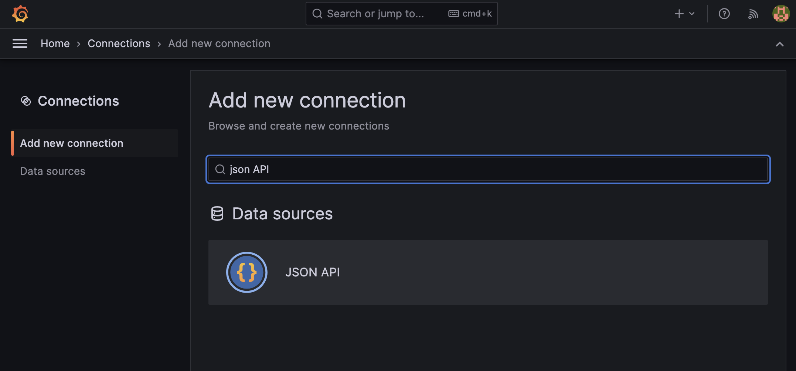
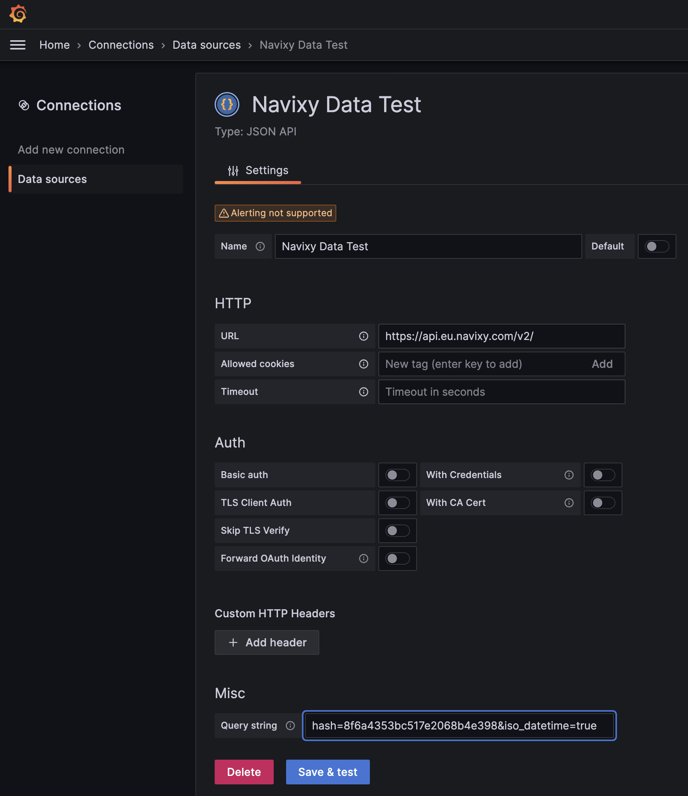
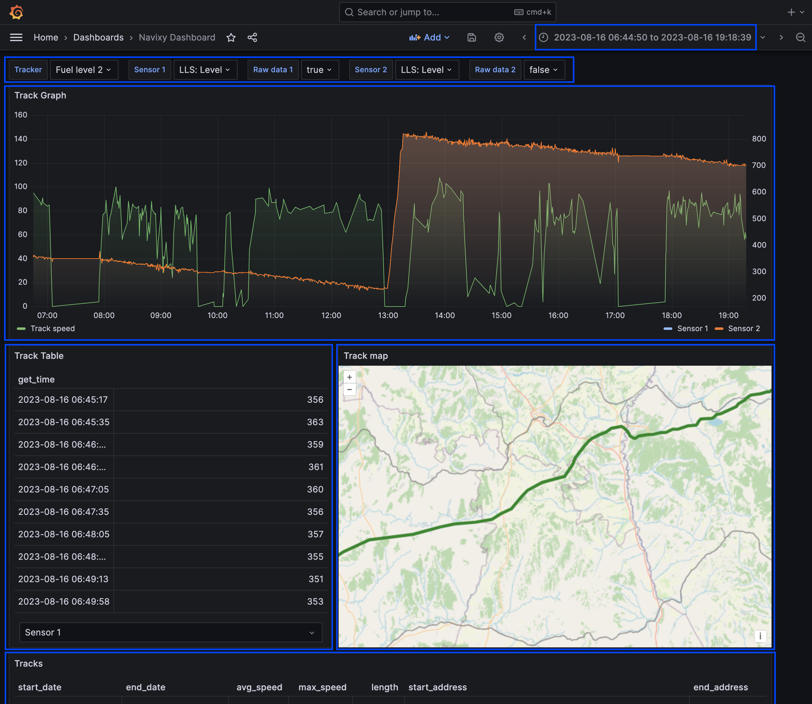

# Fuel data analysis with Grafana via Navixy API integration

## Introduction

Sometimes our partners and integrators encounter situations where they require a more in-depth analysis of fuel raw data and related parameters. This analysis may involve examining fuel level, speed, voltage, or ignition status over specific timeframes and areas on the map to identify any abnormal events. It can also provide insights into sensor configurations, diagnose issues, and monitor real-time performance. In this article, we will explore how to integrate Grafana and Navixy APIs to retrieve and visualize fuel control data effortlessly.

Grafana is an open-source data visualization tool that offers a wide range of customizable visualization options. It can be easily installed and configured even on your PC or laptop. The installation process typically takes about 30 minutes.

## Connecting Navixy with Grafana

By following this step-by-step guide, you can seamlessly integrate Navixy with Grafana, enabling you to visualize and analyze your telematics data effectively.

### Step 1: Obtaining the Navixy API key

Start by logging into your Navixy account and navigating to the Account settings. Within the settings, locate the section for API keys and generate a unique API key. This key, such as `"8f6a4353bc5114d97e2068b4e398"`, will be used to authenticate the connection between Navixy and Grafana.

### Step 2: Launching Grafana

Grafana provides 2 types of access: cloud or deployed. Cloud access could be obtained on their official website [https://grafana.com/](https://grafana.com/). Below we are going to explore how to install the package on your own server or local computer.&#x20;

To deploy Grafana on a local Windows machine, follow these simple steps:

1. Download the latest Grafana installer for Windows from the official download page.
2. Run the downloaded installer (e.g., grafana-xx.x.x.windows-amd64.msi, where xx.x.x is the version number) and complete the installation by following the prompts.
3. Once the installation is complete, start Grafana by running the grafana-server.exe file located in the bin folder of the installation directory (e.g., C:\Program Files\GrafanaLabs\grafana\bin).
4. Open a web browser and navigate to [http://localhost:3000](http://localhost:3000/). Use the default login credentials "admin" for both the username and password.
5. After logging in, you can immediately begin creating and customizing dashboards, utilizing various data sources to visualize and analyze your data.

For Linux/Mac installations or if you prefer to use the Docker version of Grafana, refer to the official Grafana documentation for detailed instructions tailored to your specific setup.

### Step 3: Installing the JSON API data source plugin

Once Grafana is launched, proceed to the "Connections" or "Plugins" menu in the Grafana interface. Search for the "JSON API" data source plugin and select it. Install the plugin following the provided instructions. This plugin is crucial for establishing communication between Grafana and the Navixy API.

### Step 4: Setting up the JSON API data source connection

After installing the "JSON API" plugin, your Grafana instance is ready to connect with the Navixy API using the API key.&#x20;

Follow these steps to set up the connection:

1. Go to "Connections" menu on the left-hand side
2. Search for "JSON API" and choose this source
3. Click on "Create a JSON API data source"
4. Fill in the following fields:

* Name: Choose a preferred name for the data source
* URL: Enter the URL for the Navixy API. Depending on your platform's location, use one of the following URLs:
  * `https://api.eu.navixy.com/v2/` for Europe
  * `https://api.us.navixy.com/v2/` for North America
  * `<your_configured_domain_api_url>` for self-hosted (On-Premise) installations. The default format is usually `http(s)://your_configured_domain/api/`
* Query string: Use a query string in the format `hash=[YOUR_API_KEY]&iso_datetime=true`. For example: `hash=8f6a4353bc5114d977e2068b4e398&iso_datetime=true`.

5. Customize any additional settings as required, and then click "Save & Test" to verify the connection.

### Step 5: Importing the Navixy dashboard template

To expedite the setup process, import the Navixy [dashboard template](https://github.com/SquareGPS/bi-intergrations/blob/main/grafana/navixy_fuel_dashboard_demo.json) into Grafana. Access the Grafana dashboard management section, create a new dashboard, and select the option to import the dashboard. Upload the provided Navixy dashboard template file. Review the import settings, including the assigned data source, and complete the import process.

## Analyzing telematics data with Grafana

Grafana provides a complete set of visualization objects and tools, enabling telematics professionals to effortlessly analyze and interpret complex telematics data. Let's delve into the main elements of the demo dashboard offered by Navixy which are marked in blue.

### Trackers and sensors to analyze

To begin, on the demo dashboard, select the desired device using the "Tracker" selector. Once selected, you can create multiple line charts on the same canvas by choosing the desired sensors in the "Sensor 1" and "Sensor 2" selectors. Select “True” in “Raw Data 1” / “Raw data 2” drop-down menus if you want to analyze sensors raw data.

### Time range

In the top right corner, you will find the option to select the date range for your analysis. This gives you flexibility in choosing between quick ranges, which provide predefined time intervals, or an absolute time range, where you can specify specific start and end dates.

### Line charts

Grafana offers a range of powerful visualization options, and among them, the line chart stands out. This chart allows for a comprehensive analysis of sensor readings over time, which proves invaluable for telematics professionals. By plotting telematics data like fuel level, vehicle speed, etc on a line chart, users gain the ability to identify patterns, trends, and anomalies that might impact fleet performance. The interactive features, such as zooming and panning, enable professionals to delve into specific time periods, thereby extracting deeper insights from the data.

### Tables

The dashboard tables provide a structured and user-friendly format for exploring raw sensor data. Each value is accompanied by a timestamp, allowing users to easily track when data was generated. This organized presentation facilitates a comprehensive analysis of individual data points, enabling detailed examination and insights. Navixy demo dashboard has 2 tables: Sensor raw data by timestamps and completed Tracks with details.

### Map view

The Grafana map displays facilitate the monitoring of objects and events on a map, delivering valuable insights into vehicle locations and trips within a selected time range. This powerful feature provides a comprehensive visualization of previous vehicle movements, empowering users to analyze historical data and develop a deeper understanding of fleet operations. Complementing the visual representation, an accompanying table presents precise metrics like trip length and average speed, enhancing the overall analysis.

## Outcome and further steps

The integration of Grafana and Navixy APIs offers a powerful solution for visualizing and analyzing telematics data related to fuel control. By leveraging Grafana's open-source data visualization capabilities and Navixy's extensive API, users can gain valuable insights into their fleet's fuel consumption, monitor abnormal events, and troubleshoot issues effectively.

### Dashboard customization

As an integrator, you have the flexibility to customize the dashboard elements to suit your specific requirements. Grafana provides various visualization objects that can be configured to access a comprehensive set of telematics data from Navixy APIs. This includes selecting and configuring diverse [Grafana visualizations](https://grafana.com/docs/grafana/latest/panels-visualizations/visualizations/) for analyzing time-series and other types of data, allowing you to explore the data in a more meaningful way. By utilizing customizable dashboards, users can create personalized visualizations that cater to their specific analysis needs. This empowers fleet managers and stakeholders to monitor real-time performance, diagnose issues, and make informed decisions based on the analyzed data. Dashboard customization necessitates experience in using Navixy APIs and working with the JSON format.

### Sharing Grafana dashboards

Sharing your customized dashboard with others in Grafana is a seamless process. By sharing customized dashboards with team members, clients, or stakeholders, collaboration and knowledge-sharing are enhanced. To begin, you can export your dashboard as a JSON file, which includes all the essential information required to replicate the dashboard on another Grafana instance. This streamlined sharing feature ensures that everyone involved can access and benefit from the dashboard's insights and analysis.
