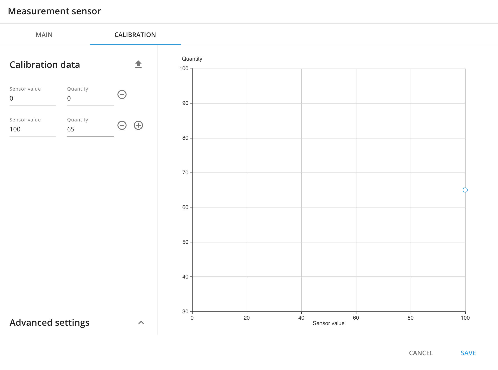
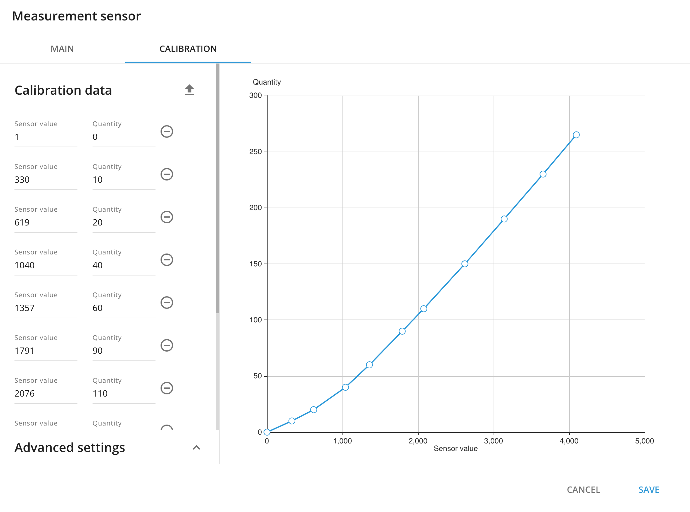

# Fuel sensor readings analysis and assessment

Effective fuel calculations are one of the most important aspects in fleet management. They allow partners and users for close monitoring of fuel expenses, detection of unauthorized consumption, and implementation of measures to minimize it. However, ensuring accurate fuel calculations necessitates a thorough evaluation of the quality of data sources used for these calculations.

The accuracy of fuel level readings depends on the type of sensor used and its [proper installation](../installation-and-initial-configuration-of-fuel-control-devices/fuel-level-sensors/fuel-level-sensor-installation.md) and other aspects i.e external factors such as temperature changes or vibrations from driving can affect fuel level readings. Hence, it is crucial to consistently monitor and ensure the proper functioning of the fuel level sensor.

Navixy offers insights into these factors through the [Fuel Volume report](analyzing-fuel-data/fuel-volume-report.md). By providing this information, Navixy enables you to understand why the report results may not align with your expectations. Additionally, it offers recommendations on improving the accuracy of fuel data calculations.

The outcome of calculations depends on two key factors:

* **Quality of fuel level sensor readings**
* **Quality of the calibration table.**

We'll explore these factors and provide expert guidance on effectively leveraging the fuel volume report to enhance its quality.

## Quality of fuel level readings

Accurate fuel calculations require reliable data from fuel sensors. This includes information on the actual fuel level in the tank, which goes to the platform in different format. The specific data format used by a sensor will depend on the manufacturer and the application.:

* [**OEM fuel level sensors**](../installation-and-initial-configuration-of-fuel-control-devices/oem-fuel-level-sensors.md) are typically calibrated to report the fuel level in liters or percents. This data is sent to the platform in a digital format, usually using CAN. The data could be also retrieved via OBD.
* [**Analog Sensors**](../installation-and-initial-configuration-of-fuel-control-devices/fuel-level-sensors/fuel-level-sensor-installation.md#analogue-signal) send data in a continuous stream of electrical signals. The voltage of the signal is proportional to the level of fuel in the tank.
* [**Digital Sensors**](../installation-and-initial-configuration-of-fuel-control-devices/fuel-level-sensors/) send raw data in discrete packets, usually using a serial communication protocol such as RS-485 or RS-232.

Fuel level sensors differ in terms of accuracy. When choosing a fuel level for data analysis, it's important to take into account factors such as price, installation process, and the desired level of accuracy. Below is a concise comparison of various sensor types.

| **Feature**  | **OEM Fuel Level Sensors** | **Analog Fuel Level Sensors** | **Digital Fuel Level Sensors** |
| ------------ | -------------------------- | ----------------------------- | ------------------------------ |
| Accuracy     | Fair to Good               | Good                          | Good to excellent              |
| Cost         | Free                       | Moderate to high              | High                           |
| Installation | Already installed          | Moderate to difficult         | Moderate to difficult          |

**Accuracy** is the ability of a sensor to measure a quantity correctly. In the case of fuel level sensors, accuracy is determined by how closely the sensor's readings correspond to the actual amount of fuel in the tank. A high-accuracy sensor will provide readings that are very close to the true value.

In addition to accuracy, it is important to consider various aspects related to the physical characteristics and features that can influence the readings transmitted from the fuel level sensor to the platform for further calculations.

Besides of that its very important to give the platform understanding how to interpret fuel level sensor readings. As we understand some OEM

**Quality** is a measure of the sensor readings, including its accuracy, precision, and stability. A high-quality sensor will provide consistent and reliable readings, even in challenging conditions.

Through comprehensive analysis of readings from hundreds of fuel level sensors, we have developed a classification system to categorize the data based on noise with rating points:

* **Low Quality (High noise level) - 1.0 .. 3.9**. Can make it difficult to distinguish between real changes in fuel level and noise. This can lead to inaccurate readings, especially when the fuel level is low.
* **Medium Quality (Medium noise level)** **- 4.0 .. 7.9**. Can also affect accuracy, but to a lesser degree. Sensors with medium noise levels may be acceptable for some applications, but it is important to monitor them closely.
* **High Quality (Low noise level)** **- 8.0 .. 10**.are generally very accurate. Sensors with low noise levels are suitable for applications where high accuracy is required, such as fleet management systems.

By examining quality assessments, you can discover descriptions and recommendations that help you to make well-informed decisions regarding the source of fuel data you choose to utilize.

## Quality of the calibration table

A calibration table is a table that contains data about the relationship between the raw sensor data from a fuel level sensor and the actual fuel level in the tank.

The calibration table is used to correct for any errors or biases in the sensor data. This is important because fuel level sensors can be affected by a variety of factors, such as temperature, pressure, and vibration. The calibration table helps to ensure that the fuel level calculations are accurate, even when the sensor is not functioning perfectly.

**Quality of calibration table fulfillment** is important for fuel calculations, as it ensures that the calibration table is accurate, consistent and reliable.

What is important to know about calibration table fulfillment - **the number of entries** in a calibration table depends on the type of fuel level sensors:

* **For the OEM fuel level sensors** with data in percentage you have to enter 2 entries: for the lowest level of fuel and for the full tank (100%). Here is an example of calibration

* **For the additional fuel level sensors** (Analog and Digital) calibration table should be fulfilled according to the manufacturer recommendation. The number of entries depends on the fuel tank capacity, but we strongly recommend to have at least 10 entries for the tanks with capacity less than 500 litres (see details in the table below):

| **Fuel tank capacity** | **Stepped litres** | **Number of entries in calibration table** |
| ---------------------- | ------------------ | ------------------------------------------ |
| 0-100                  | 5-10               | 10-20                                      |
| 101-500                | 10                 | 10-50                                      |
| 501-1000               | 20                 | 20-50                                      |

Here is the example of the good calibration table

> \[!INFO] There is no need to calibrate OEM sensors that transmit data in liters.

Please refer to the specialized resource for more information on the [calibration process.](../fundamentals-of-fuel-management/fuel-level-sensor-calibration-tare.md)
