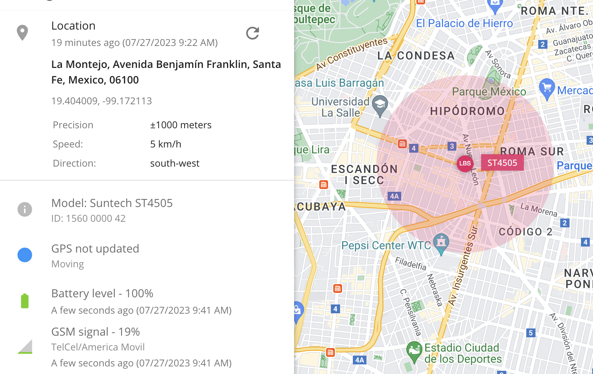
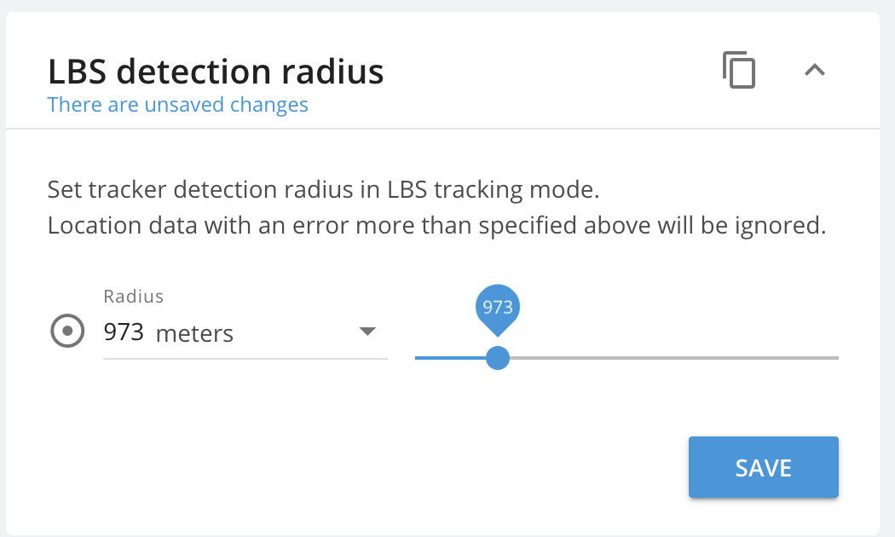

# What is LBS tracking: Cell ID and WPS

LBS (Location-based services) technology allows to determine location of an object without using standard services such as GPS, GLONASS, Galileo or Beidou.

LBS tracking is a wide term that includes a variety of different methods. Here we will only look at GSM and Wi-Fi based positioning.

## GPS and LBS tracking: main differences

GSM and Wi-Fi based positioning is usually less accurate than GPS but it can work in worse conditions, no clear sky view needed. GSM signal is harder to block and is easier to establish, even if the device is underground or in a building. Wi-Fi signals provide more precision for tracking indoors.

Requiring less battery power than GPS, LBS allows you to trade precision for extended life of the device. This is great for cases where you need to track an object over long distances. LBS can also be used as a backup option for when the GPS antenna or module breaks, still allowing you to know where the object is.

## How LBS tracking works

#### GSM based tracking

GPS trackers and mobile phones most commonly use a GSM network to transmit the data. Because of that, service provider’s network infrastructure can be used to determine the device’s location.

This tracking method operates on the principle that any powered GMS module always communicates wirelessly with one of the closest base stations, switching between them as the device moves. If the device can transmit data of the base station it is connected to (Cell ID, MCC, MNC, LAC), this data can be looked up in external databases to obtain the location of the base station.

This method is called **Cell of Origin**. It is the cheapest and simplest method as it requires no modification of deployed hardware.

Cell of Origin provides location of the Base station, not the location of the device itself.

This means that 2 devices connected to the same base station will show the same coordinates, even if they are not near each other.

The precision of location depends on the density of base stations. In cities and developed areas location accuracy can be down to 50-100m, while in rural and desolate areas error may reach multiple kilometers. Advanced systems may also attempt to calculate the distance between the GSM module and the station. These systems typically require modification of installed infrastructure and are quite costly. A common search method is called **E-OTD (Enhanced Observed Time Difference)**.

It is based on measuring and comparing time difference of arrival of bursts from nearby base stations. Delays and known placements of base stations can be used to triangulate the GSM module’s location. This search method provides a much better precision even in remote areas \~125 meters but it requires base stations to have Location Measurement Units installed.

#### **Wi-Fi positioning system (WPS)**

WPS uses wireless access points to determine location. It is more commonly deployed on mobile phones and is frequently used to provide a better solution for indoor tracking purposes. There are several approaches to determining location with WPS.

**Received Signal Strength Indicator**

The first is based on Received Signal Strength Indicator. Device measures signal strength between itself and several access points. Then measured data is combined into a propagation model to determine distances between the device and access points.

A calculation can be done by the device itself or data can be sent to an external service.

**Fingerprinting**

The second method is called **Fingerprinting** and it uses RSSI in its base. Fingerprinting works by collecting location and all RSSIs of the available access points. If in the future an object visits the same location, it should provide the same fingerprint, enabling the system to localize the object when there is no connection available.

The precision of this method can be fairly high (\~1.3-2 meters), however, it is difficult to deploy, as it requires the storage of data. It is also very sensitive to environmental changes: construction or simple rearrangement of furniture affects signal strength and changes fingerprint.

**Time of Flight**

The third method is called **Time of Flight.** ToF uses timestamps recorded by both wireless interfaces to estimate the distance and relative position of the object to access points. This method has an accuracy of 2-4 meters and is typically used for indoor tracking.

The time measurements taken at the wireless interfaces are based on the fact that RF waves travel close to the speed of light, which remains nearly constant in most propagation media in indoor environments. Therefore, the time of flight is not affected as much by the environment (furniture, buildings, etc) as RSSI measurements.

The principle is similar to RADAR systems, except regular data and acknowledgment packets are used to measure ToF.

_The diagram shows an access point sending a DATA frame to a client device and waiting until receiving the acknowledgment packet (ACK). d is the scheduling delay (offset) originated at a client device, and it depends on how much time it takes for the ACK to be generated by the device. t\_p is the signal propagation time between transmitter and receiver and is usually assumed to be the same on the way to the target and back. t\_ack is the time needed to transmit the ACK frame. The time of flight corresponds to the t\_measured._

WPS works well for indoor purposes but it’s not always as easily deployable as GSM tracking.

## Data availability for LBS tracking systems

Wi-Fi network data can be hard to obtain as major database providers do not allow free database downloads.

However, base tower locations can be downloaded and there is a variety of open source databases to choose from. One of the best-known services are [Mozilla Location Services](https://location.services.mozilla.com/) and [OpenCell ID](https://www.opencellid.org/), which together contain data on over 50 million base stations.

Mozilla's coverage of both base stations and Wi-Fi points is shown on the map.

## LBS support in hardware devices

LBS features can be implemented a bit differently, depending on the manufacturer. Some allow continuous reporting of GSM data (MCC, MNC, LAC, CID), some only allow reporting on request once an SMS or GPRS command has been received.

If you are not sure whether your devices support LBS on Navixy - please check integration descriptions [on our website](https://www.navixy.com/devices/).

## GSM and Wi-Fi based tracking in X-GPS apps

Navixy provides our own [Mobile tracking solution](https://www.navixy.com/features/mobile-apps/) with LBS support included.

Unlike hardware trackers, Navixy mobile apps transmit already processed LBS data. Apps rely on native OS services like Apple Core Location or Google Fused Location depending on which OS is used.\
&#xNAN;_&#x50;lease note that a network connection is required for services to process data._

## Setting LBS in Navixy

The Navixy tracking platform seamlessly supports the native integration of GSM cell-based location and LBS for numerous tracking devices. In most scenarios, GPS and GSM technologies work together in tandem. When GPS data is unavailable, the system automatically switches to LBS as a reliable backup. For instance, if a car enters an underground parking lot, the observer can view both the last known accurate GPS location and the current GSM-based location (within a certain range of accuracy).

LBS detection radius depends on the area where the device is located and the number of base stations or Wi-Fi points. If the device is in a rural area and cannot locate, it is recommended to increase the LBS radius so that remote base stations also contribute to the device's location.

In a city where the cellular network has densely built base stations, the LBS range needs to be kept small, as nearby base stations will be sufficient for location and accuracy will be high.

Basically, this is how LBS tracking works. It's a great positioning tool and a valid alternative to GPS tracking when the latter is not available or unreasonable to use. We hope you found the article useful.

## My device sends only LBS points – why?

This could happen because of several reasons:

1. **The device can’t get a GPS signal because of its location** – perhaps your device stands in the garage, or in underground parking. Also, please check the device installation in the car.
2. **The GPS antenna of the device does not work** – please check its connection with the device, and its placement: the best place is under the windshield
3. **GPS module of the device is not working** – it could sometimes happen, in this case, we recommend contacting your local dealer to replace the device with the working one.
