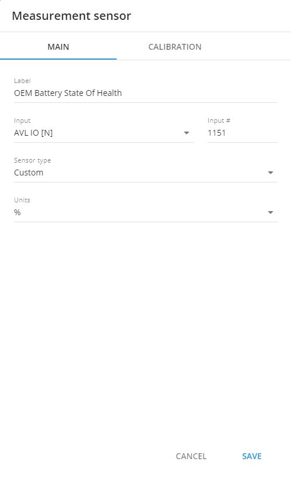

# EV fleets management

Electric vehicles (EVs) are gaining popularity, with over 100,000 EVs sold globally each month, amounting to more than 1,000,000 annually. People, both individuals and companies, are choosing EVs for their numerous benefits: economic, environmental, and social. However, it is important to acknowledge that the electric vehicle industry also faces certain challenges, such as high initial costs and a lack of charging stations.

Undoubtedly, the transition towards electric vehicles heralds a transformation in the machinery-related industries. It necessitates a fresh approach to fleet management, encompassing various factors such as the power and energy requirements of electric cars. This article aims to enhance your understanding of key aspects of electric vehicles. It highlights what businesses need to take into consideration and how Navixy utilizes technology advancements on the platform and transform the EV's data into the insights you need to manage your electric fleet effectively.&#x20;

## About electric vehicles

While Electric Vehicles are widely known, not everyone is aware of the various types available. This knowledge may help fleet managers consider different parameters when optimizing costs and managing their fleet. There are three primary types of electric vehicles:

* **Battery Electric Vehicles (BEVs)**: These are entirely electric with no gas engine. BEVs are charged from the electricity grid and store the power in large battery packs.
* **Plug-in Hybrid Electric Vehicles (PHEVs)**: These vehicles have both an electric motor and a conventional gasoline or diesel engine. They can be plugged into an electric outlet for charging, allowing them to drive short distances on electricity alone. For longer trips, they use the internal combustion engine.
* **Hybrid Electric Vehicles (HEVs)**: These vehicles also have both an electric motor and an internal combustion engine, but they cannot be plugged in to charge. Instead, they recharge their batteries through regenerative braking and by the internal combustion engine.

An EV fleet comprises electric vehicles owned or leased by businesses, governments, or organizations. Unlike traditional fleets fueled by gasoline or diesel, EV fleets rely on high-capacity, rechargeable batteries. The primary emphasis lies on batteries and their significance in this context.

## Practical Experience Matters

When transitioning from internal combustion engine (ICE) vehicles to electric vehicles for a fleet, careful consideration of the advantages and disadvantages is crucial. Online materials provide a comprehensive list of pros and cons, such as lower running costs versus higher initial costs, decreased maintenance time and costs versus longer recharging time or range limitations. However, it is crucial to highlight the practical aspects that need to be taken into account.

Managing an electric vehicle fleet encompasses various facets. In addition to standard fleet management tasks such as tracking, maintenance, and driver management, managing electric fleets presents unique challenges. Even maintenance, for instance, requires a different approach, considering the limited lifetime of batteries, particularly in regions with low temperature conditions. Effective vehicle charging management is also crucial to ensure each vehicle has sufficient charge for daily operations.&#x20;

### Electric vehicles charging

Charging is the fundamental starting point for all electric items. Let's delve into the various facets of EV charging to gain a comprehensive understanding. Charging infrastructure is a critical aspect of EV adoption. Charging stations, also known as Electric Vehicle Supply Equipment (EVSE), come in various forms, ranging from simple wall outlets to sophisticated public charging networks. The Connector Type denotes the plug used to connect the electric vehicle to a power source. Different models of electric vehicles may require different types of connectors.


The cost of a charging station typically ranges from $400 to $1000.


There are three primary levels of electric vehicle charging - Level 1, Level 2 (AC Chargers), and Level 3, commonly known as DC Fast Charger. These levels can be assessed based on three key parameters: voltage, charge duration, and range per hour of charging.

* **Level 1** Charging is the most basic form of charging and uses a standard household outlet (**110v in the U.S.**). It's convenient because it doesn't require any special equipment, but it's also the slowest method. Common charge duration is about **6-10 hours**, typically providing about **4-5 miles of range per hour of charging.**
* **Level 2** Charging steps up the game by using a **208-240v source**, similar to a large home appliance. This method can provide **10-60 miles of range per hour of charging,** depending on the car and charger. Many public charging stations and home installations use Level 2 charging.
* **Level 3** Charging, also known as DC Fast Charging, is the fastest charging method currently available. With a voltage of 480v, it bypasses the car's onboard charger and provides direct current to the battery, enabling rapid recharging. On average, it takes just **30-40 minutes** to achieve a full charge. This method can provide **75+ miles of range per hour of charging** However, not all EVs can handle this level of charging, and frequent use can degrade the battery over time.

### State of Charge (SoC)

The State of Charge (SoC) is a measure that represents the amount of energy currently stored in an electric vehicle's battery, expressed as a percentage. It serves a similar function to a fuel gauge in traditional vehicles with internal combustion engines, showing the available energy for driving.

The SoC holds significant importance when it comes to the performance, efficiency, and lifespan of EV batteries. Fleet managers rely on real-time monitoring while drivers plan journeys effectively due to limited range compared to internal combustion engines. Understanding the time required for a full charge is also valuable for planning.

A precise SoC reading allows drivers to reach their destinations confidently without the worry of unexpected battery drainage. Here is the list of parameters related to SoC:

* **Range Calculation**: The SoC is closely connected to the distance an EV can cover on a single charge. A higher SoC indicates more energy availability, thus enabling the vehicle to travel longer distances. On the other hand, a lower SoC limits the distance that can be covered.
* **Performance**: EV batteries typically exhibit optimal performance at certain SoC levels. Keeping the battery within this ideal SoC range ensures efficient power supply and acceleration, leading to a more enjoyable driving experience.
* **Battery Longevity**: Continually keeping a battery at extremely high or low SoC levels can cause it to degrade over time. Overcharging or discharging the battery excessively, especially under extreme temperature conditions, can speed up the battery’s aging process and decrease its overall capacity.
* **Safety**: It is vital to monitor the SoC for battery safety. Operating at very low SoC levels can result in complete discharge, potentially damaging the battery cells and even causing irreversible failure.

### State of Health (SoH)

The Battery State of Health (SoH) is a measure that indicates the current status of an electric vehicle's (EV) battery in comparison to its condition when it was fresh off the assembly line. The SoH offers insights into the battery's capacity, efficiency, and overall performance throughout its lifespan. Monitoring the SoH is crucial as it directly influences the EV's range, performance, and safety.

Battery SoH gradually declines due to multiple factors over time:

* **Cycling**: The number of charge and discharge cycles a battery goes through plays a significant role in its degradation. Lithium-ion batteries, which are widely used in EVs, have a finite number of cycles they can undergo before their capacity begins to diminish.
* **Temperature**: Extreme temperatures, both high and low, speed up the degradation of battery materials. High temperatures can lead to electrolyte breakdown and thermal runaway, while low temperatures increase internal resistance.
* **Depth of Discharge (DoD)**: Frequently draining a battery to very low levels can hasten its degradation. Batteries generally have a longer lifespan if they operate within a specified state of charge range.
* **Charging Rate**: Fast charging can induce heat within the battery, affecting its lifespan. It's essential to control the charging rate and have cooling mechanisms to maintain battery health.
* **Chemical Degradation**: The chemical reactions taking place within the battery during charge and discharge cycles can result in the creation of undesirable by-products impacting capacity and efficiency.
* **Age**: Regardless of how they are used, batteries degrade over time due to chemical reactions. This natural deterioration process is often termed "calendar aging."

## Electric vehicles tracking&#x20;

When it comes to tracking electric vehicles, you might wonder if there's a difference compared to tracking traditional internal combustion engine vehicles. There are indeed some variations in GPS trackers for each type.

For ICE vehicles, GPS trackers tend to focus on features like monitoring fuel consumption, diagnosing engine issues, and reminding you about maintenance schedules. These trackers help optimize fuel efficiency, keep track of mileage, and notify you when your vehicle needs servicing. On the other hand, GPS trackers for EVs are used for monitoring the battery charge and health status, and estimating the vehicle's range, etc. These trackers help EV owners keep an eye on their battery levels, find convenient charging spots, and plan routes accordingly.

Some GPS trackers designed specifically for EVs can even integrate with the vehicle's telematics system. This means they provide real-time information on energy usage, regenerative braking, and analyze driver behavior. Remember that the features and capabilities of GPS trackers can vary between brands and models. But the majority of the modern GPS Trackers supports EV having related fields and parameters.

GPS tracking for EVs offers benefits beyond vehicle security. It provides valuable features such as energy consumption analysis and maintenance optimization, which are crucial for sustainable transportation planning. Let's explore the key challenges faced in EV management and how Navixy can help address them effectively.

### Smart battery usage

The battery is a crucial component of every electric vehicle, and maintaining its strength is one of the challenges. In addition to the features offered by Navixy in this domain, here are some essential tips below to help you extend the battery life.


If the battery charge drops below 20%, it indicates that the battery is under significant strain and nearing depletion.


To make sure you're keeping an eye on your VE battery life you can utilize those Navixy features:&#x20;

* **Voltage alerts:** By setting up voltage alerts, EV owners or fleet managers can receive notifications when the battery voltage reaches certain thresholds. This helps identify situations where overcharging or undercharging may occur. For example, if a driver consistently receives voltage alerts at a specific location, it could indicate that they are overcharging the EV. The manager can then intervene and provide training to prevent overcharging, thus optimizing battery usage. Go to the Alerts menu and add a new rule for the voltage thresholds.&#x20;
* **SoC alerts:** Overcharging a car battery can potentially cause overheating or even a fire, as well as reduce its lifespan and discharge capacity. Although modern electric vehicles are equipped with Battery Management Systems (BMS) to prevent overcharging by automatically stopping the charge at maximum capacity, it's still important to take preventive measures. Consider using available apps that send alerts when your device's battery reaches a specific level. Access the Alerts menu and create a new rule for the SoC parameter thresholds (i.e 98%).
* **Sensor report:** To improve battery life and preserve its capacity, it is advisable to prevent the battery charge from dropping too low. By doing so, owners can minimize stress on the battery cells and extend its overall lifespan. This approach helps reduce the need for premature battery replacements. To gain insights into the battery level changes over a specific timeframe, users can generate a Sensor report. This report provides a visual representation of the minimum and maximum battery levels, aiding in tracking and monitoring the battery's health and usage patterns&

### Routes planning

Bearing in mind the potential limitations of vehicle range due to distance, tracking and monitoring information can assist in route planning to ensure uninterrupted travel without the risk of running out of battery power. By considering the available charging infrastructure and estimating the required battery capacity for the journey, drivers can plan their routes accordingly and avoid unnecessary stops.


The typical range for an electric vehicle is 100-300 miles. Waiting is more than 10 times longer for “refueling”.


* **Real Time monitoring:** Real-time monitoring technology offers valuable insights beyond just battery charge level for electric vehicle (EV) owners. One significant advantage is the displaying of remaining distance data. This crucial information allows fleet managers and EV owners to adopt a more strategic approach to route planning. By taking into account both the battery charge level and the remaining distance, owners can make informed decisions to avoid potential situations where the battery runs out of charge before reaching a charging point. This proactive approach significantly reduces the risk of getting stranded on the road.
* **POIs - Charging stations.** Adding and using points of interest (POI) with charging stations can greatly assist in route planning for electric vehicles  and ensure that the battery does not run out. By incorporating the locations of charging stations into route calculations, EV owners can strategically plan their journeys and avoid the risk of running out of battery power. Clients can choose routes that have charging stations conveniently located along the way or opt for shorter trips to conserve battery power.&#x20;

### Effective maintenance

Telematics parameters can play a significant role in facilitating effective maintenance of electric vehicles . These parameters provide valuable real-time data and insights about various aspects of the vehicle's performance, allowing for proactive maintenance. Here are some ways telematics parameters can aid in EV maintenance using sensor reports on the Navixy platform or by reviewing the raw data from the platform:

* **Battery Health Monitoring:** Telematics parameters can provide detailed information about the State of health (SoH) and overall performance. By monitoring these parameters, maintenance professionals can identify any anomalies or degradation in the battery's performance. This helps in scheduling timely maintenance, optimizing charging practices, and ensuring the longevity and efficiency of the battery.
* **Motor Performance Analysis**: Telematics parameters can provide comprehensive data on the motor's operating conditions, including temperature, voltage, current, and power consumption. By analyzing this data, maintenance professionals can assess the motor's performance and detect any potential issues or deviations. Proactive maintenance and troubleshooting can then be conducted to prevent motor failures and optimize its efficiency.

<figure><figcaption></figcaption></figure>

## Wrapping up

Navixy recognizes the growing significance of electric vehicles in fleet businesses. Despite challenges like battery energy consumption and aging, we are actively developing the Eco Fleet product. Our innovative transport technology and unique approach to energy monitoring address these concerns. Our goal is to transform EV tracking data into valuable insights that meet our partners' specific business needs. With existing features and more to come, trust Navixy to empower you with data-driven decisions for your fleet.
