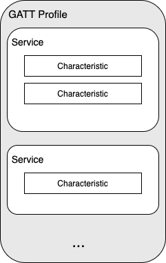
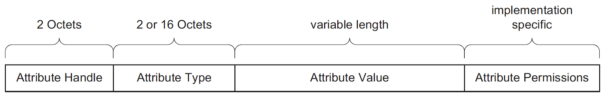
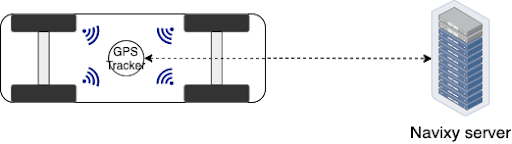
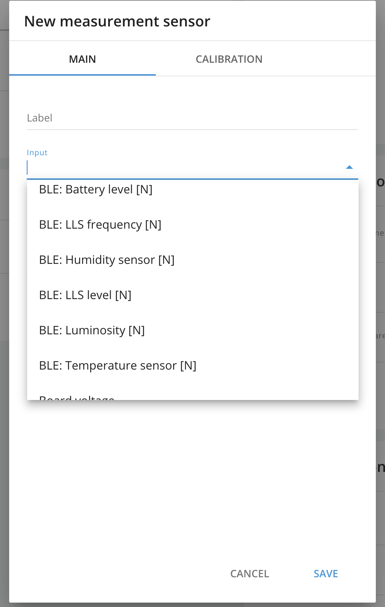

# Wireless Telematics Sensors

Wireless technologies allow the transmission of values from different sensors to GPS tracking units without wiring. There are 2 types of wireless technologies that use their own frequencies:

* Bluetooth Low Energy – 2.4 Hhz
* Ultra high frequency – 315/433 MHz

## What is BLE

Bluetooth Low Energy (BLE) is a low-power wireless communication technology that can be used over a short distance to [enable smart devices to communicate](https://www.centare.com/blog/what_is_bluetooth_low_energy/). BLE technology was integrated into Bluetooth 4.0 in December 2009.

Compared to classic Bluetooth, Bluetooth Low Energy offers a significant reduction in power consumption and cost while maintaining a similar range. This allowed device manufacturers to add a low-power communication interface to existing solutions. It has also been used to create new low-power devices, such as [beacons](https://www.navixy.com/blog/teltonika-ble-beacons/), that can run on a small battery for months or even years.

## How BLE works

Bluetooth Low Energy uses many protocols to transmit data, interact with all parts of the device, and organize the work of all layers. Below, we will list the most important ones and point them in the general hierarchy.

**Host Controller Interface (HCI)** is BLE layer-to-layer or chip-to-chip exchange protocol that provides access to the Bluetooth device configuration settings.

**Logical Link Control and Adaptation Protocol (L2CAP)** is responsible for packet generation, frame division, error control, and packet assembly.

**Security Manager Protocol (SMP) –** performs packet encryption.

**Generic Access Profile (GAP)** provides initial data exchange between devices, to determine «who is who».

Separately, we note the GATT and ATT protocols:

**GATT** is an acronym for Generic Attribute Profile, which defines the way data is transferred between two low-energy Bluetooth devices using concepts called services and characteristics.

It uses a common data protocol called the **attribute protocol (ATT)**, which is used to store services, characteristics, and related data in a simple lookup table using 16-bit identifiers for each record in the table.

Profile structure

* Attribute Handle – table index corresponding to the attribute;
* Attribute Type – UUID that describes the type;
* Attribute Value – the data itself;
* Attribute Permissions – part of an attribute, permissions that cannot be read or written using the ATT.

GATT profile contains services. Services are used to break data down into logic entities, and contain specific chunks of data called characteristics. A service can have one or more characteristics, and each service distinguishes itself from other services by means of a unique numeric ID called a UUID, which can be either 16-bit (for officially adopted BLE Services) or 128-bit (for custom services).

The most important thing to keep in mind with GATT and connections is that connections are exclusive. What is meant by that is that a BLE peripheral can only be connected to one central device (a mobile phone, GPS tracker, etc.) at a time.

As soon as a peripheral connects to a central device, it will stop advertising itself and other devices will no longer be able to see it or connect to it until the [existing connection is broken](https://learn.adafruit.com/introduction-to-bluetooth-low-energy/gatt).

Imagine that the profile is a bookcase. Each shelf is a Service where the book is a Characteristic. Each characteristic (book) has attributes (pages). Some attributes are obligatory, some are not.

### Client and server

To understand the distinction between GATT server and GATT client, imagine that you have a GPS tracker and a fuel sensor that is a BLE device. The GPS tracker supports the central role; the sensor supports the peripheral role (to establish a BLE connection _you need one of each_—two things that only support peripheral couldn't talk to each other, nor could two things that only support central).

Once the tracker and the sensor have established a connection, they start transferring GATT metadata to one another. If the sensor wants to report sensor data to the GPS device, it might make sense for the sensor to [act as the server.](https://developer.android.com/guide/topics/connectivity/bluetooth-le)

The GATT client sends requests to a server and receives responses (and server-initiated updates) from it. The GATT client does not know anything in advance about the server’s attributes, so it must first inquire about the presence and nature of those attributes by performing service discovery. After completing service discovery, it can then start reading attributes found in the server.

The GATT server receives requests from a client and sends responses back. It also sends server-initiated updates when configured to do so, and it is the role responsible for storing and making the data available to the client, organized in attributes.

## Wireless vs. wires

It's no secret that currently all technologies are switching to wireless communication. Below we have noted the main advantages of wireless sensors:

* Freedom from wires. It can be configured using any physical connection.
* Easy to set up. It is easy to expand and configure.
* Flexibility. Wire-free connections are more flexible and adaptable.
* Cost-effectiveness. Since wireless connections do not require cables, such networks are relatively cheaper.
* Mobile and portable. Easy to transfer and reinstall to another place.

As you can see, wireless connections have a large list of advantages. All these points make the installation and operation of sensors easier and more comfortable.

At the same time, it is worth noting that wired sensors have higher noise protection. This means that in places with a high noise level, these sensors will work more stably.

## Tire-pressure monitoring system (TPMS)

Separately, it is worth considering the [Tire-pressure monitoring system](https://en.wikipedia.org/wiki/Tire-pressure_monitoring_system) (TPMS). The majority of TPMS installations transmit their data via UHF (Ultra High Frequency) radio. TPMS data is typically transmitted in one of two frequency ranges, which depends on the geographical location of the TPMS. TPMS signals are transmitted at about 433MHz in Europe, and at 315MHz in most other parts of the world.

This TPMS sensor is called a “Direct TPMS” system. It provides more accurate tire pressure values instead of “Indirect TPMS” that does not use physical pressure sensors but measure air pressures using software-based systems, which by evaluating and combining existing sensor signals like wheel speeds, accelerometers, driveline data, etc. estimate and monitor the tire pressure without physical pressure sensors in the wheels.

Each TPMS sensor should be installed into the tire. This sensor establishes the connection with an antenna that is connected to a receiver. This system provides a stable monitoring of pressure in the tires.

## Types of BLE sensors

Navixy platform supports many types of wireless sensors which are used to make it easier for users to get actual and accurate telematics data. Below you can find the list of supported ones:

* Fuel
* Temperature
* Humidity
* Driver identification
* Magnetic sensors
* Tire pressure sensors

The sensors can also send an additional parameter "BLE: Battery Level", which shows how much charge the BLE sensor battery has. This parameter is very useful for understanding the remaining battery life.

## How to use BLE sensors on Navixy

[Creating a BLE sensor](https://www.navixy.com/docs/user/web-interface-docs/devices-doc/sensors-and-buttons/measurement-sensor/) is no different from creating a regular one.

1. Configure a sensor according to the user manual
2. Select needed sensor from the list. Usually BLE sensors have "BLE" in the label, e.g. BLE: Temperature #, BLE: Fuel etc.

1. Then specify other settings according to your needs.
2. That’s all! Now the platform will show data from the BLE sensor as soon as data is received on the server.

If you want to stay in the loop for Navixy Academy updates, don't hesitate to follow us on [Facebook](https://www.facebook.com/NavixyGPS/), [Linkedin](https://www.linkedin.com/company/navixy/) and [Twitter](https://twitter.com/NAVIXY). If you wish to share your comments, questions and future article ideas, please reach us on social networks as well.
