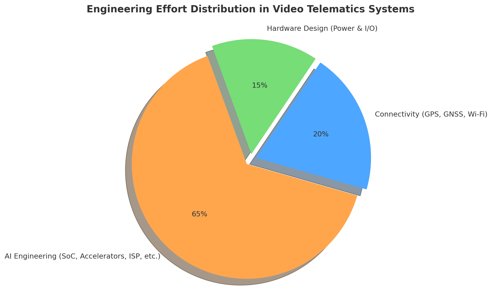

# Beyond the Spec Sheet: The Hidden Role of SoCs in Video Telematics

Not all video telematics cameras are created equal. While they may look similar from the outside, the internal design, choice of processor (SoC), image sensor, communication module, memory, and supporting electronics can vary dramatically between models and manufacturers. These differences are not just technical details — they directly shape the image quality, responsiveness, AI capabilities, network performance, and overall reliability of the device.

A camera built around a high-end SoC with a powerful ISP and dedicated AI accelerator can deliver advanced features such as real-time driver monitoring, object detection, or multi-channel recording, but it comes at a higher cost due to the complexity of the chipset and licensing of modern codecs like H.265. On the other hand, a device using a lower-tier SoC may be limited to basic video capture and transmission, making it more affordable but less suitable for demanding fleet applications. Similarly, the choice of LTE modem supplier (e.g., Cat-1 vs. Cat-4 vs. Cat-6 modules) impacts not only bandwidth and coverage but also the cost of the hardware.

In short, the performance/cost trade-off in video telematics cameras stems from design choices at the hardware level. Every component — from the Novatek or Ambarella SoC, to the MEIGLink or Quectel LTE module, to the type of RAM (LPDDR) and storage used (NAND/eMMc flash) — contributes to whether a camera is positioned as a budget, mid-range, or premium solution. Understanding these differences is crucial for fleet operators and integrators, as the right balance of performance and cost will depend on the specific operational needs and business goals.

### Image Processing: A Quick Overview

To understand why the SoC is important, we do need to understand how the camera processing works inside a camera. For this explanation, we will be using Novatek SoC connected to an actual camera. The image processing stages are:

<figure><figcaption></figcaption></figure>

#### Step 1: Image Capture (Sensor → ISP)

The process begins with the camera’s CMOS sensor, which captures light from the environment and outputs raw pixel data. This raw feed is then directed into the Image Signal Processor (ISP), a component usually integrated within the SoC, such as the Novatek. The ISP performs critical image processing tasks including debayering (converting RAW sensor data into RGB or YUV formats), white balance adjustments, exposure control, and color correction. Additional functions like noise reduction and high-dynamic-range (HDR) merging are also carried out at this stage. The result is a stream of uncompressed video frames that serve as the foundation for subsequent processing.

#### Step 2: AI Preprocessing

In modern telematics and smart cameras, an AI-driven preprocessing stage is often introduced before compression. This stage is typically handled by a DSP, NPU (Neural Processing Unit), or a dedicated AI accelerator integrated within the SoC. Here, the system can perform tasks such as event detection (for example, forward collision warnings, driver drowsiness monitoring, or object recognition), region-of-interest (ROI) extraction to optimize bandwidth usage, and metadata tagging that identifies key elements like faces or vehicles in the video. Because raw video data is too large for direct transmission, this AI preprocessing helps prioritize and optimize which frames or segments are passed on for compression and storage. On the Novatek SoC, AI and signal analysis are performed by internal DSP/NPU blocks, supported by RAM for temporary data storage. Vehicle inputs (from CAN bus, G-sensors, or driver monitoring cameras) are fed into the SoC through multipin connectors, providing the triggers that activate AI event detection.

#### Step 3: Compression (Video Codec)

Once the video frames are prepared, they enter the hardware video encoder located within the SoC. This encoder applies industry-standard compression algorithms, most commonly H.264/AVC or H.265/HEVC. Compression is a critical step, as it reduces raw frame data that flows at tens of megabytes per second into manageable bitstreams ranging from kilobytes to megabytes per second. Many systems implement dual-stream encoding, where one high-bitrate stream is saved locally on an SD card for archival purposes, while a second lower-bitrate stream is generated for real-time transmission over LTE networks.

The dedicated video encoding engine is part of the Novatek SoC. External NAND or eMMC flash chips store firmware and codec profiles, while RAM buffers the compressed bitstreams before they are written to storage or passed to the modem.

#### Step 4: Storage and Transmission

Following compression, the video bitstream can be managed in several ways depending on system design. It may be stored locally on an SD card or internal NAND memory in continuous loop recording mode, ensuring recent data is always available. The system can also buffer video, retaining several seconds before and after an event trigger to provide context. Additionally, the encoded stream may be transmitted via integrated communication modules sAlongside video, metadata including GPS coordinates, G-sensor readings, and AI-generated event markers is typically embedded or sent in parallel to provide situational context.

#### Step 5: Cloud and Server Handling

Once transmitted, the video reaches the cloud or a remote server for further handling. On this end, the data may be re-encoded or transcoded to standardize formats across different platforms. Videos are indexed by event type, such as collisions, motion alerts, or driver behavior anomalies, which simplifies retrieval and review. Telematics data collected alongside the video is paired with these recordings, enabling comprehensive fleet management dashboards that combine visual evidence with vehicle and driver performance insights.

### Why the Brain of the Camera Matters More Than You Think

In modern video telematics cameras, the majority of the hardware is dedicated to handling the demanding tasks of image capture and processing. Roughly 65% of the electronic design is built around the SoC and its supporting components, which manage picture acquisition, image signal processing, AI-based analysis, and video compression. This reflects how computationally intensive it is to transform raw sensor data into usable, encoded video streams. In contrast, about one-quarter of the hardware is allocated to cellular and internet connectivity modules. These LTE/GNSS subsystems ensure that the processed video and metadata can be transmitted in real time, but they are less complex compared to the processing pipeline itself. This balance highlights why the choice of SoC has such a large influence on both the performance and the cost of a telematics camera.

Today’s video telematics cameras come in a wide range of prices, and the difference is not always obvious when you look at the spec sheet. For example, you might find a $100 camera and a $200 camera that both advertise similar resolution and storage options. So why the price gap? The answer usually lies in embedded artificial intelligence.

A lower-cost camera may capture and store video reliably, but a higher-end model integrates ADAS features such as lane detection, forward collision alerts, or driver monitoring. That added value doesn’t come from dramatically different lenses or sensors—it comes from the data processing pipeline and the AI models running inside the SoC. These models are what make the camera smarter and more efficient, and developing and integrating them is a major driver of cost.

As the chart below shows, the largest share of effort and cost goes into AI and video processing. For businesses, this means that choosing a camera is less about megapixels and more about the intelligence packed into the SoC—and understanding that trade-off is key to making the right decision.

\

<figure><figcaption></figcaption></figure>

When evaluating cameras, remember: you’re not just buying hardware, you’re buying intelligence. The real investment goes into the AI and software that interpret the video, reduce false positives, and provide actionable insights for safety and efficiency. That’s why development efforts are more heavily concentrated on AI algorithms and software optimization than on the basic hardware parts.

### Novatek NT98321 vs. Ambarella CV2: A Comparative Analysis of SoCs in Video Telematics&#x20;

When it comes to video telematics cameras, there is no single “one-size-fits-all” solution. Manufacturers can choose from a variety of SoC providers and modules, each designed to meet different performance requirements, feature sets, and budget levels. This diversity allows products to be tailored for markets ranging from cost-sensitive fleet dashcams to high-end ADAS systems with advanced AI capabilities. To illustrate how these choices play out in practice, we not only compare specifications on paper but also analyze real hardware samples by disassembling cameras. By examining devices built around two representative SoC providers — Novatek, known for cost-effective, high-volume SoCs widely used in dashcams and mobile DVRs, and Ambarella, a premium supplier recognized for its CVflow® AI architecture in advanced automotive and surveillance systems, we can show how the internal design choices affect performance, features, and ultimately cost. Together, these companies illustrate the spectrum of solutions in the video telematics space: from Novatek’s accessible, high-volume designs to Ambarella’s premium, AI-focused processors, showing why SoC selection is a decisive factor in balancing performance and price.

In the following table, we can observe the comparison of two chips commonly used today by different video camera manufacturers. By making these comparisons, we can see what the SoCs capabilities are.

| Area                      | Novatek NT98321BG                                                                                                                                                                                                       | Ambarella CV2                                                                                                                                                                                                                                                                 |
| ------------------------- | ----------------------------------------------------------------------------------------------------------------------------------------------------------------------------------------------------------------------- | ----------------------------------------------------------------------------------------------------------------------------------------------------------------------------------------------------------------------------------------------------------------------------- |
| Sample                    | Howen Hero-MC40-02                                                                                                                                                                                                      | Rhonda Ambarella CV2 Camera ECU                                                                                                                                                                                                                                               |
| Target segment            | Mobile DVR / dashcam / multi-channel FHD recorders with basic–mid AI                                                                                                                                                    | Automotive ADAS, smart security, robotics; performance AI + 4K                                                                                                                                                                                                                |
| Process / CPU             | Novatek has not published the CPU use for processing.                                                                                                                                                                   | 10 nm; Arm Cortex-A53–based SoC family (CV2A variants) with Ambarella’s CVflow accelerator.                                               |
| ISP / input               | Designed for multi-channel 1080p: typical OEM configs show 4×1080p@15 fps or 2×1080p@30 fps; multi-sensor mobile DVR usage.                                                                                             | Advanced ISP with stereovision and multi-imager support; up to 4K60 (and 8 MP/8K15 for encoding on some CV2 modules).    |
| AI accelerator            | Built-in NPU / AI algorithm ability (ADAS, DMS, BSD, face). Depth/throughput not disclosed. | CVflow® DNN engine (CNN/DNN, dense optical flow), up to \~20× CV1’s DNN perf; designed for multi-DNN, stereo perception. |
| Video codecs              | H.265/HEVC + H.264/AVC                                                                                                                                                                                                  | H.265/HEVC + H.264/AVC, multi-stream; 4K60 encoding.                                                                                                                                                                                                                          |
| Typical use-case examples | 4-ch FHD MDVRs with optional 1–2 AI channels (ADAS/DMS).                                                                                 | ADAS/front cameras, multi-imager smart IP cams, stereo/3D perception; system modules support 6× GMSL2 camera inputs.                                          |
| Power                     | Marketed for low-power MDVR use.                                                                                                                                                                                        | Fabricated on 10 nm extremely low-power.                                                                                                                                                                                                                                      |
| Cost positioning          | Typically lower bill of materials (BOM) for multi-FHD recorders; value/volume segment.                                                                                                                                  | CV2 sits in the premium/performance tier; analyst notes place high-end CV chips (incl. CV2) at higher ASPs than mainstream SoCs.                                                                                                                                              |

\

The Novatek NT98321 is optimized for cost-effective mobile DVR and dashcam systems, supporting multiple 1080p inputs, H.264/H.265 encoding, and light AI functions such as ADAS or DMS through a modest built-in NPU. It excels in multi-channel FHD recording at low power and lower bill of materials, making it suitable for fleet recorders that need basic event detection and reliable video storage. In contrast, the Ambarella CV2 is a premium SoC built on a 10 nm process with the CVflow® AI engine, delivering far greater neural network throughput, stereovision and multi-imager support, and 4K60 video encoding. This makes it ideal for advanced ADAS, high-accuracy driver monitoring, or smart security applications where on-device perception and analytics are critical. The trade-off is higher silicon and system cost, but with significantly more performance headroom and AI capability.

In video telematics, AI capabilities are strictly related with AI deep neural networks (DNNs) which are central to enabling functions like ADAS and driver monitoring, but the size and complexity of these models vary greatly depending on the hardware. While chips with modest NPUs, such as Novatek’s NT98321, run lightweight convolutional networks of 2–15 million parameters in real time, more advanced platforms like Ambarella’s CV2 support larger CNNs and multi-DNN pipelines, unlocking more complex and scalable AI capabilities. In the following chart, a detailed breakdown of the two AI models used by these SoCs is presented.

| Feature            | Novatek NT98321                                         | Ambarella CV2                                     |
| ------------------ | ------------------------------------------------------- | ------------------------------------------------- |
| AI Accelerator     | Built-in NPU                                            | CVflow engine                                     |
| Supported Models   | Lightweight CNNs (2–15M parameters)                     | Larger CNNs (10–50M+ parameters)                  |
| Performance        | Real-time (15–30 FPS) on modest NPUs/DSPs               | Multi-DNN, stereovision, advanced analytics       |
| ADAS/DMS Functions | Basic: lane detection, collision alerts, driver fatigue | Advanced: multi-channel ADAS, higher accuracy DMS |
| Scalability        | Limited to smaller AI workloads                         | Scales to complex, multi-network pipelines        |
| Cost & BOM Impact  | Lower cost, efficient for mainstream telematics         | Higher cost, positioned for premium applications  |

\

In practical terms, imagine a low-performance camera entering a brightly lit city filled with building advertisements and multiple traffic signs. Due to its limited real-time recognition capacity, it may fail to properly identify traffic signs or road markings, as these are obscured by oversaturation and excessive background processing. Similarly, potholes on streets or highways may not be detected by the image sensor if the photo quality is low. When the vehicle passes over the pothole and causes a sudden jolt, the camera could incorrectly interpret this as a collision event, generating false alerts that negatively affect both the driver and the company by producing inaccurate events.

This means that choosing a more powerful SoC with stronger AI acceleration will give you a dashcam capable of handling higher frame rates, better image quality, and more accurate ADAS/DMS event detection, even in complex environments. It also allows the processing of multiple video channels simultaneously with fewer false alerts. However, these benefits come at the cost of higher hardware prices. Understanding this balance helps clients see why the choice of SoC is critical: it directly shapes both the reliability of alerts and the total cost of the device.

### **Beyond Hardware: Choosing Intelligence, Not Just a Camera**

It is essential to recognize the System-on-Chip (SoC) as the true brain of any video camera. Through closer analysis, it becomes clear that the SoC is the most critical component within these devices, occupying nearly 65% of the PCB’s functional space. This dominance reflects its role in image acquisition, decomposition, AI-based processing, analysis, and overall interpretation of video data.

New competitors in the field of video telematics are constantly emerging. Each one seeks to differentiate their products with added features — perhaps an additional plug-in camera channel or a small hardware upgrade. However, in many cases, the operating SoC is identical across multiple brands, meaning the fundamental processing power remains the same. As a result, price often becomes the decisive factor, rather than the true embedded technology driving performance.

For this reason, evaluating a telematics camera requires more than comparing costs or superficial features. Decision-makers should carefully consider four key factors that determine the real capabilities of these devices:

1. The SoC utilized – the central processor that defines image handling, video encoding, and system intelligence.\

2. AI accelerator availability – the presence of dedicated neural engines or DSPs capable of enabling ADAS (Advanced Driver Assistance Systems), DMS (Driver Monitoring Systems), and other smart functions. Ultra light, Lightweight or Mid-range AI convolutional neuronal network models.\

3. Supported codecs – whether the device encodes video using H.264, H.265, AV1, or newer standards, which directly affects storage efficiency and streaming performance.\

4. Image sensor – the foundation of video quality, low-light performance, and color accuracy.

Considering entry-level devices, you can expect reliable video capture at lower cost, but limited accuracy in ADAS/DMS events and reduced performance in complex traffic scenarios. Higher-end SoC designs, you can expect higher frame rates, better image quality, more precise event detection, multi-channel support, and fewer false alerts — but at a higher upfront cost per unit.\
Ultimately, selecting the right camera is not just about comparing resolution or hardware specs. It is about choosing the right balance of intelligence, accuracy, and cost to meet operational goals. In other words: when buying a camera, you’re not just buying hardware — you’re buying the embedded intelligence that keeps fleets safer, reduces false positives, and improves decision-making on the road.

\
