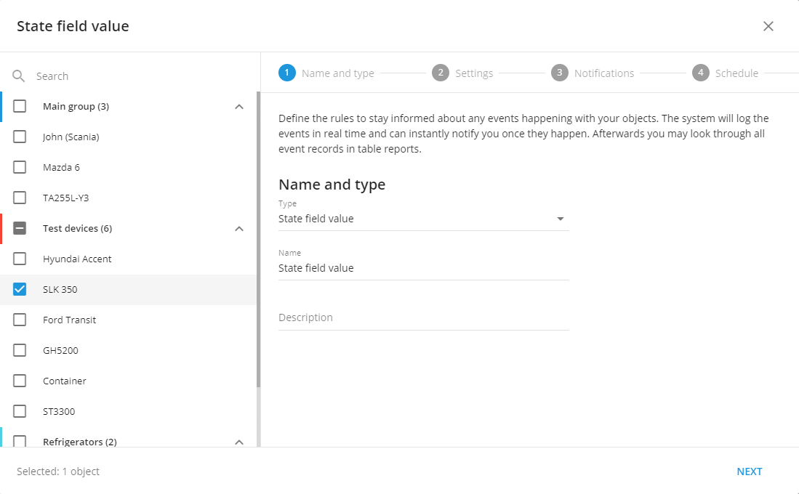
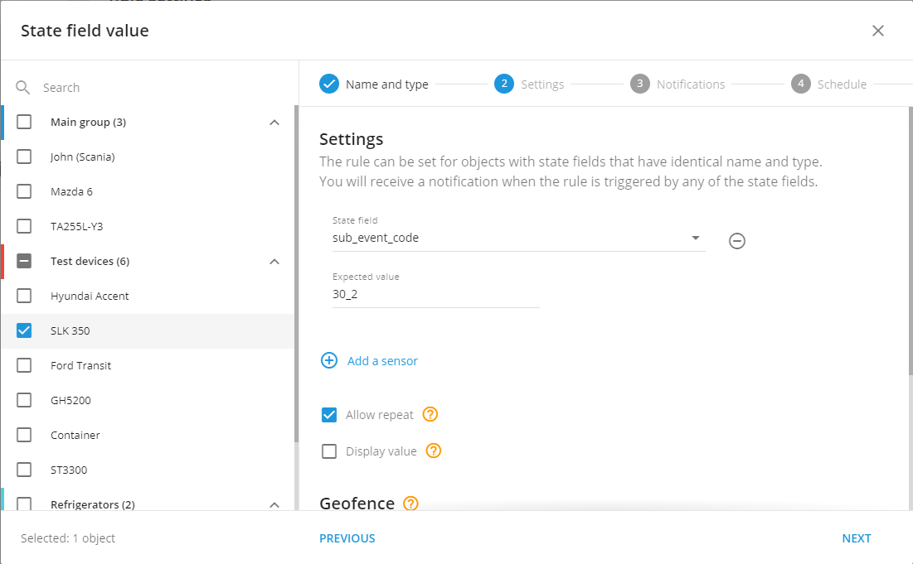

# Event configuration on Howen MDVR

Howen devices can provide various types of events to the platform, including ADAS (Advanced Driver Assistance Systems), DMS (Driver Monitoring System), and other alerts. While these events may not include video footage, you can configure custom notifications using the [state field values alert type](https://docs.navixy.com/user-guide/state-field-value). This feature is particularly useful when you need alerts for events where video recording is not necessary. For example, count how many particular events happen using the [report on all events](https://docs.navixy.com/user-guide/report-on-all-events).

## Event code types

Howen devices utilize two distinct state fields for different types of events:

1. **sub\_event\_code**

* ADAS alerts
* DMS alerts
* Input triggering events

2. **event\_code**

* Other device alerts and notifications

## How to set up event code alerts

1. Navigate to the alert configuration section
2. Select "State Field Value" as the alert type
3. In the settings:

* Choose the appropriate state field (`sub_event_code` or `event_code`)
* Enter the corresponding code as the expected value
* Configure additional notification preferences as needed

## Example use case: Lane departure warning

Let's walk through setting up an alert for lane departure warnings:

1. Create a new alert
2. Select "State Field Value" as the alert type\
   
3. In the settings tab:\
   

* State Field: `sub_event_code`
* Expected Value: `30_2` (lane departure warning code)

When the device sends a packet with sub\_event\_code 30\_2, the platform will trigger the alert and notify you or your driver.

## Event code tables

The following tables provide lists of supported event codes on Howen devices. All event codes align closely with original Howen documentation.

### Sub event codes

Input triggering codes

| 4\_0  | Close door                   |
| ----- | ---------------------------- |
| 4\_1  | Emergency/Panic              |
| 4\_2  | F-door opening               |
| 4\_3  | M- door opening              |
| 4\_4  | B-door opening               |
| 4\_5  | Low beam                     |
| 4\_6  | High beam                    |
| 4\_9  | Right turn                   |
| 4\_10 | Left turn                    |
| 4\_11 | Braking                      |
| 4\_12 | Reverse                      |
| 4\_13 | Reservered 1                 |
| 4\_14 | F-door close                 |
| 4\_15 | M-Door Close                 |
| 4\_16 | B-door close                 |
| 4\_17 | Talking (start the intercom) |
| 4\_18 | Raise up                     |
| 4\_19 | Sealed                       |
| 4\_20 | Load                         |
| 4\_22 | Custom define                |

ADAS alarm codes

| **Code** | **Event**                      |
| -------- | ------------------------------ |
| 30\_2    | Lane departure warning         |
| 30\_4    | Pedestrian collision alarm     |
| 30\_7    | FVS：Front vehicle start        |
| 30\_17   | FCW：Forward collision warning  |
| 30\_18   | HMW：Headway monitoring warning |

DMS alarm codes

| 30\_33 | Fatigue driving alarm             |
| ------ | --------------------------------- |
| 30\_34 | Phone call alarm                  |
| 30\_35 | Smoking alarm                     |
| 30\_65 | Eyes closed                       |
| 30\_66 | Yawning                           |
| 30\_67 | Camera cover                      |
| 30\_68 | Distracted Driving                |
| 30\_69 | Seat belt not fastened            |
| 30\_70 | No driver                         |
| 30\_72 | Driver shift                      |
| 30\_73 | Driver back                       |
| 30\_80 | Infrared sunglasses               |
| 30\_81 | Driver ID identified successfully |
| 30\_82 | Driver ID identification failed   |

### Event codes

General device alert codes

| 0   | Unknown                                                                                                                                                                                                             |
| --- | ------------------------------------------------------------------------------------------------------------------------------------------------------------------------------------------------------------------- |
| 1   | Video lost                                                                                                                                                                                                          |
| 2   | Motion detection                                                                                                                                                                                                    |
| 3   | Video blind                                                                                                                                                                                                         |
| 4   | Input trigger                                                                                                                                                                                                       |
| 5   | Emergency alarm                                                                                                                                                                                                     |
| 6   | Low speed alarm                                                                                                                                                                                                     |
| 7   | Over speed alarm                                                                                                                                                                                                    |
| 8   | Low temperature alarm                                                                                                                                                                                               |
| 9   | High temperature alarm                                                                                                                                                                                              |
| 10  | Humidity alarm                                                                                                                                                                                                      |
| 11  | Parking over time                                                                                                                                                                                                   |
| 12  | Acceleration alarm                                                                                                                                                                                                  |
| 13  | GEO fencing                                                                                                                                                                                                         |
| 14  | Electronic route                                                                                                                                                                                                    |
| 15  | Abnormal open/close the door                                                                                                                                                                                        |
| 16  | Storage abnormal                                                                                                                                                                                                    |
| 17  | fatigue driving                                                                                                                                                                                                     |
| 18  | Fuel consumption abnormal                                                                                                                                                                                           |
| 19  | ACC off. (compatible with old firwmares. In old firmwares: During ACC-off delay, if ignites (et > st), will report “accoff ends”; in new firmware: During ACC-off delay, if ignites (et > st), will report “accon”) |
| 20  | GPS module abnormal                                                                                                                                                                                                 |
| 21  | Front panel open                                                                                                                                                                                                    |
| 22  | Swipe card                                                                                                                                                                                                          |
| 23  | IButton                                                                                                                                                                                                             |
| 24  | Harsh acceleration                                                                                                                                                                                                  |
| 25  | Harsh braking                                                                                                                                                                                                       |
| 26  | Low speed warning                                                                                                                                                                                                   |
| 27  | High speed warning                                                                                                                                                                                                  |
| 28  | Voltage alarm                                                                                                                                                                                                       |
| 29  | People counting                                                                                                                                                                                                     |
| 30  | DMS and ADAS alarm ((Driver monitoring system, and Advanced Drivign Assistant System)                                                                                                                               |
| 31  | "Acc on". Report once at boot                                                                                                                                                                                       |
| 32  | Idle                                                                                                                                                                                                                |
| 33  | Gps antenna break                                                                                                                                                                                                   |
| 34  | Gps antenna short                                                                                                                                                                                                   |
| 35  | IO ouput                                                                                                                                                                                                            |
| 36  | CAN bus connection abnormal                                                                                                                                                                                         |
| 37  | Towing                                                                                                                                                                                                              |
| 38  | Free wheeling                                                                                                                                                                                                       |
| 39  | RPM exceeds                                                                                                                                                                                                         |
| 40  | Vehicle moves                                                                                                                                                                                                       |
| 41  | Trip start (st/et/dtu time same）                                                                                                                                                                                    |
| 42  | In trip                                                                                                                                                                                                             |
| 43  | Trip ends (periodical report after acc off)                                                                                                                                                                         |
| 44  | GPS location recover                                                                                                                                                                                                |
| 768 | Trip notification                                                                                                                                                                                                   |
| 769 | Upgrade notification                                                                                                                                                                                                |

### Live example

For example, if we want to get lane departure warning alerts, we should choose alert type State field value:

And in the settings tab we should use sub\_event\_code as the state field and 30\_2 as an expected value:

Once the device will provide a packet with sub event code 30\_2, the platform will trigger an alert and notify you or your driver.
