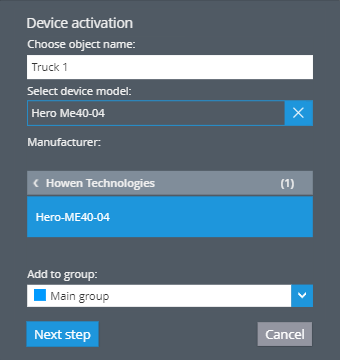
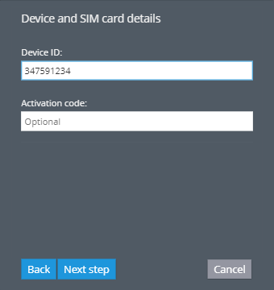
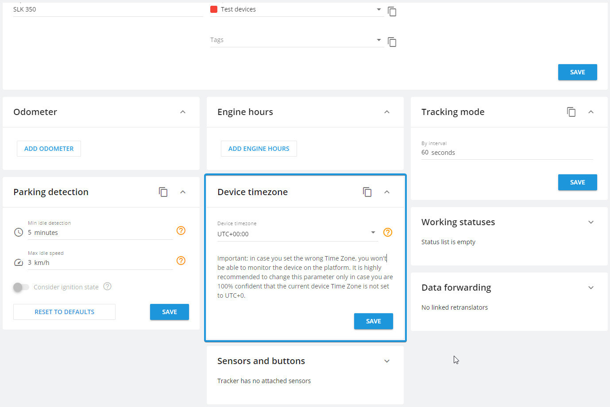

# Howen MDVR configuration

Howen devices are advanced Mobile Digital Video Recorder (MDVR) units with the capability to support up to 8 cameras. They are perfectly suited for comprehensive vehicle surveillance, offering multiple perspectives. Our platform provides seamless access to display live video streams and playbacks from Howen devices, enhancing monitoring capabilities. The list of compatible Howen devices can be found in our [devices section](https://www.navixy.com/devices/howen-technologies/). This document is intended to provide information on the configuration, registration, and specific operational aspects of Howen devices within our platform.


Purchase and install a SIM card with ample or cost-effective internet data and robust internet speed. The quality of video transmission largely depends on these factors.


## Configuration

All configurations are performed on the device side through a specific configuration monitor. These devices do not support SMS commands for server settings. Therefore, follow our step-by-step guide for their configuration and registration.

### Startup menu

The initial window is the Startup menu. Here, you can adjust power mode, select channels for recording, adjust sleep settings among other options. We will highlight a few key features:

* Power Mode. Howen devices draw power from the vehicle's battery. Set the power mode to ACC. This ensures the device turns on whenever your car's ignition is activated.
* Delay off. It determines the amount of time the device should remain active after the engine has been turned off. Setting a high 'Delay off' time may drain your vehicle's battery.
* Power on/Power off. This feature allows you to set specific times for the device to turn on or off, such as during your driver's shift.
* Record. Select channels for recording videos. When you open the playback menu of your device, the platform will request these videos channel by channel.

### Registration information

While there are several options like device ID, plate number, state, language, and position mode, we're primarily interested in two:

* Dev ID. This is the device ID. You can input any identifier you prefer, for instance, 123456. This ID is used during the activation process on Navixy, so remember this ID.
* Position Mode. Set it to GPS so your device can provide precise GPS information like other GPS trackers.

### 3G/4G Settings

As a GPS tracker installed in a vehicle, Wi-Fi operation is not possible. Therefore, configure the necessary options:

* Enable must be turned on to activate data transmission.
* NetType. Configure the type supported by your SIM
* APN, Username and Password are APN settings obtained from your device's SIM GSM provider. Enter them accordingly.

### Time

Here, you can set the date, time, and timezone. These settings affect the timestamps on video files and streams, so ensure they reflect your local timezone and current date/time.

Our platform operates best with timezone UTC+0. However, for certain devices like MDVR units, we have added a specific portlet on the platform. If you set UTC+0, the timestamps on recorded and streamed videos will be incorrect, which may render them inadmissible in court.

### Center Settings

Here, you can set server information, select the appropriate protocol, and set the GPS interval for sending points. Input our platform's information into Server 1.

* Choose H-protocol - H.264. The platform supports both H.264 and H.265 protocols. However, H.264 is universally compatible with all browsers, ensuring seamless user experience. H.265 is not universally supported, requiring users to find and learn how to use compatible browsers.
* IP address. This is where your device sends information:
  * &#x20;For EU server: IP 52.57.1.136
  * &#x20;For US server (your account ID starts with 1000): IP 13.52.37.2
* Port should be set to 47670.
* GPS interval. This determines how frequently the device sends GPS points to the platform. The default is 60 seconds.

## Activation of Howen devices on the platform

Once you've configured the device settings, start the registration process on the platform as usual.

1. Open the user account where you wish to register the device and click the device activation button.
2. Next, input the device's name, assign it to a group if necessary, and type your device's model into the search line. For example, Hero ME40-04.

3. Enter the device ID that you initially set in the Dev ID on your device. If the platform indicates that the given device ID is already being used, modify it in the device's settings and attempt using the new ID on the platform.

Once the device has been added to the platform, navigate to the devices and settings tab to adjust the device’s timezone. This should correspond with the timezone you selected in the Time options of the device's configurator.

The final step to get your device online involves sending its first packet, complete with a valid timestamp and coordinates, to the platform. As we've configured the power mode to be triggered by ignition, starting your vehicle's engine will prompt the device to begin sending packets to the platform.

## Video on the platform

For comprehensive instructions on accessing live video streams and playback, please refer to our user guides. In this section, we will specifically delve into the various aspects of utilizing Howen devices and video on our platform.

1. The platform supports the receipt and display of videos with h.265 and h.265 (HEVC) compression rates. h.265 format is faster and can potentially reduce mobile internet data usage. However, it is not universally supported by all browsers. Your customers may experience difficulties when trying to play videos on their usual browsers. We recommend using the h.264 protocol as it is universally supported, ensuring your users won't encounter any issues. If you opt for h.265, please ensure that your customer has a browser and the necessary codecs installed to play such videos.
2. Please note that the platform does not currently support event videos for Howen devices. You can utilize standard events and playback to access the desired video.
3. Since video files can be large and time-consuming to retrieve, the platform automatically requests the most recent 24 hours of videos available on your device during a playback request. If you need a video from a specific incident, simply open the playback window to retrieve it. If a significant amount of time has elapsed since the incident, you can reach out to our support team. We can attempt to manually upload it. Please provide the specific time you want to request from your device, the device ID, and which cameras' footage you need. If all files are saved on your device’s SD card and they are successfully sent by the device to the platform, these videos will appear in the playback window.

Now, you're well-versed in using Howen devices on the platform and can confidently offer video monitoring with these devices to your customers.
