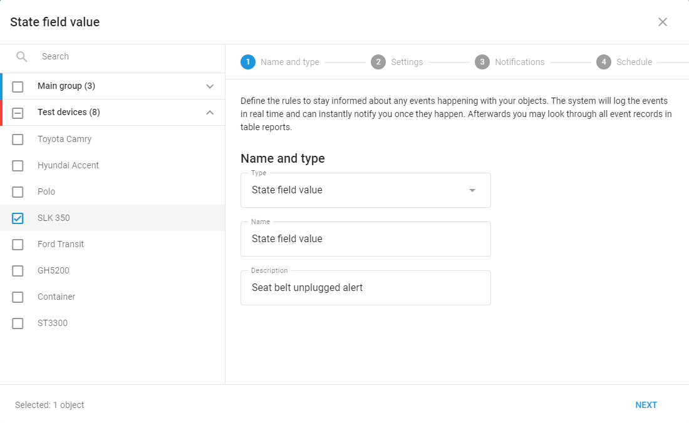
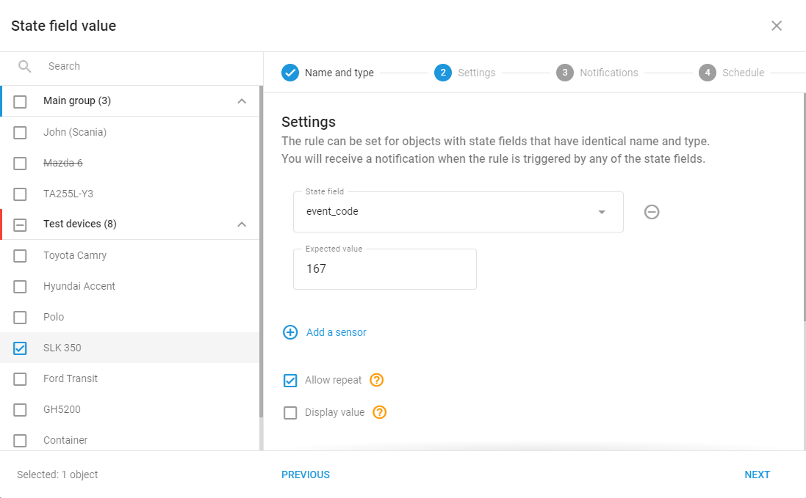

# Event configuration on Jimi JC series

Jimi JC devices can send various event codes to the platform. While the platform has its own notification system with already predefined alerts, you can set up additional custom alerts based on specific event codes from your devices using [state field alert type](https://squaregps.atlassian.net/wiki/spaces/USERDOCS/pages/2780561441/State+field+value). This feature is particularly useful when you need alerts for events where video recording is not necessary. For example, count how many particular events happen using the [report on all events](https://squaregps.atlassian.net/wiki/spaces/USERDOCS/pages/2783281385/Report+on+all+events).

## How to set up event code alerts

1. Navigate to the alert configuration section.
2. Select "State Field Value" as the alert type.
3. In the settings:

* Set "event\_code" as the state field;
* Enter the desired event code as the expected value;
* Configure additional notification preferences as needed.

## Example use case: Seat belt unplug alert

Let's walk through setting up an alert for when a seat belt is unplugged:

1. Create a new alert
2. Select "State Field Value" as the alert type 3. In the settings tab:

* State Field: `event_code`
* Expected Value: `167` (seat belt unplugged code)

When the device sends a packet with event code 167, the platform will trigger the alert and notify designated personnel.

Additionally, check our short video on event code 143 to find out - how to create such alerts:

!\[State field value event creation for Jimi JC.mp4]\(attachments/State field value event creation for Jimi JC.mp4)

## Event codes table

This table provides a list of event codes supported by Jimi JC devices.

For your convenience, we present both:

* Decimal codes (used in platform configuration).
* Hexadecimal (HEX) codes (as referenced in manufacturer documentation).

The definitions provided closely align with the original Jimi JC series documentation, ensuring consistency with manufacturer specifications. Use these codes when configuring state field value alerts in the platform.

| **HEX Code** | **Code** | **Event**                       |
| ------------ | -------- | ------------------------------- |
| 0x01         | 1        | SOS                             |
| 0x0E         | 14       | External battery low            |
| 0x47         | 71       | Fatigue driving                 |
| 0x50         | 80       | Door closed                     |
| 0x51         | 81       | Door opened                     |
| 0x53         | 83       | Fuel stolen                     |
| 0x69         | 105      | File uploading                  |
| 0x70         | 112      | SD card mount                   |
| 0x73         | 115      | Fuel data timeout               |
| 0x76         | 118      | Temperature data timeout        |
| 0x80         | 128      | Vibration                       |
| 0x86         | 134      | SD card cannot be recognized    |
| 0x87         | 135      | Over speed                      |
| 0x88         | 136      | Power removal                   |
| 0x8A         | 138      | Oil or electronics connected    |
| 0x8B         | 139      | Oil or electronics disconnected |
| 0x8C         | 140      | DMS – Eye closed                |
| 0x8F         | 143      | DMS - Distraction               |
| 0x90         | 144      | Harsh acceleration              |
| 0x91         | 145      | Harsh deceleration              |
| 0x92         | 146      | Harsh turning                   |
| 0x93         | 147      | Crash                           |
| 0x94         | 148      | DMS - Missing face              |
| 0x97         | 151      | DMS - Phone calling             |
| 0x9A         | 154      | DMS - Smoking                   |
| 0XA0         | 160      | DMS - Yawn                      |
| 0XA1         | 161      | DMS - Monitoring shelter        |
| 0xA2         | 162      | DMS – Calibration fail          |
| 0xA3         | 163      | DMS - Look down                 |
| 0xA4         | 164      | SD card capacity is not enough  |
| 0xA5         | 165      | RFID reading                    |
| 0xA6         | 166      | Seat belt plugged               |
| 0xA7         | 167      | Seat belt unplugged             |

For the device Jimi JC261 the events will be the following ones:

| **Code** | **Event**                |
| -------- | ------------------------ |
| 1        | SOS                      |
| 2        | Crash                    |
| 3        | Vibration                |
| 4        | Overspeed                |
| 5        | Harsh acceleration       |
| 6        | Rapid deceleration       |
| 7        | Sharp turn               |
| 8        | Overtime fatigue driving |
| 9        | Power off                |
| 10       | Low battery              |
| 11       | Close eyes               |
| 12       | Yawn                     |
| 13       | Distraction              |
| 14       | Smoking                  |
| 15       | Phone calling            |
| 16       | Cut off engine           |
| 17       | Recover engine           |
| 18       | No face detected         |
| 19       | SD card is removed       |
| 20       | SD card is inserted      |
| 21       | Stealing oil             |
| 22       | Oil Sensor timeout       |
| 23       | Temp sensor timeout      |
| 24       | UART SWITCH              |
| 25       | Lane departure           |
| 26       | Vehicle too close        |
| 27       | Forward collision        |
| 28       | Door detection           |
| 1        | SOS                      |
| 2        | Crash                    |
| 3        | Vibration                |
| 4        | Overspeed                |
| 5        | Harsh acceleration       |
