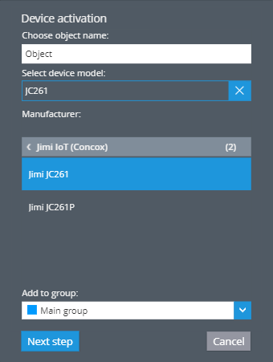
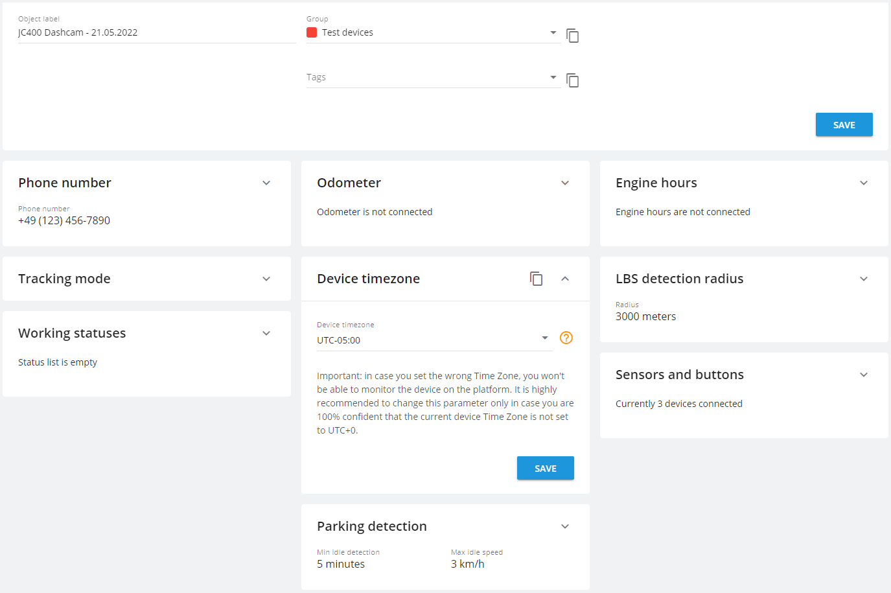

# Jimi IoT dashcam configuration

* [Configuration](jimi-iot-dashcam-configuration.md#configuration)
  * [Checking firmware version](jimi-iot-dashcam-configuration.md#checking-firmware-version)
  * [Device activation and configuration](jimi-iot-dashcam-configuration.md#device-activation-and-configuration)
* [Configuration Tips](jimi-iot-dashcam-configuration.md#configuration-tips)
  * [Optimizing traffic consumption](jimi-iot-dashcam-configuration.md#optimizing-traffic-consumption)
  * [Video on input triggering](jimi-iot-dashcam-configuration.md#video-on-input-triggering)
* [Differences between JC261 and JC400](jimi-iot-dashcam-configuration.md#differences-between-jc261-and-jc400)

This article provides a comprehensive guide on configuring your Jimi device, from checking the firmware version to optimizing traffic consumption. We'll also delve into the specifics of device activation, configuration, and provide useful tips to enhance your user experience.

We would like to emphasize that our platform is completely compatible with the Jimi JC400, as well as its upgraded model JC261 and all associated variants. These dashcam devices can be fitted into your vehicles and perform similarly to usual video recording devices. The added advantages include their ability to record video events, stream live footage, and playback videos directly on the platform. Furthermore, these devices are equipped to support a variety of **Advanced Driver-Assistance Systems (ADAS)** and **Driver Monitoring System (DMS)** alerts, delivering instant notifications regarding potential road issues to the driver or other designated individuals.

## Configuration

Before adding the device to our platform, a SIM card must be procured. This SIM card should support SMS functionality and have a sufficient or cost-efficient internet data plan with reliable internet speed. These factors significantly influence the quality of video transmission.

### Checking firmware version

This step is required for JC400 and JC400D devices. However, for JC261 and JC261P devices, compatibility isn't dependent on the version.\
To check the version, insert the SIM card into the device and send an SMS command with the word '`VERSION`' to your device's SIM card number. It's advisable to do this before installing the device in a vehicle to save time later. The device should respond with its current version.

For the JC400, the manufacturer recommends the following versions or any newer version:

* `[VERSION]JC400_WABA_STD_V4.3.5_220830.2208` - for JC400
* `[VERSION]JC400D_WAVA_DMS_V4.2.13_210716.2013_BUILD_2021-07-16` - for JC400D with DMS alerts.

If your device responds with an older version, you need to update the firmware, which involves three steps:

1. Download the update.zip file for [JC400](https://drive.google.com/file/d/1viKBJwFjbTH1RC5YeIIymCoUdp7QCPIZ/view?usp=sharing) or [JC261](https://drive.google.com/file/d/1cgxP4QhFkVFGpEjVeim0Ab_bRjh0vWQ7/view?usp=sharing) series and copy it onto the device's SD card (do not decompress the update.zip file).
2. Insert the SD card into the device and power it on.
3. The device will automatically update the firmware.

> \[!INFO] If you've already registered your device on the platform and then updated the firmware, you'll need to resend the activation commands, which are described later. If your panel includes an SMS gateway, you can utilize the 'Retry Activation' feature in the [Admin panel from the device card.](https://docs.navixy.com/admin-panel/basic-operations)

### Device activation and configuration

We have provided a detailed guide on dashcam device installation [here](../../dash-cam-installation.md). Let's focus on the activation and configuration process.

These devices support SMS configuration, enabling automatic configuration by the platform during the standard activation process. You only need to ensure the device's time zone matches the one set in the devices and settings tab.

Otherwise, here are step-by-step instructions for configuring your Jimi IoT device:

1. Find the device’s IMEI number. Then, log in to the platform and navigate to the user account where you want to add the new device. Click the 'Device Activation' button.
2. Enter the device's name, assign it to a group if necessary, and type your device's model into the search line (for example, Jimi JC261).

* Send the following SMS commands to your tracker (this is why we needed a SIM card with SMS functionality):
  * `COREKITSW,0#`
  * `SERVER,0,<server_IP>,47755#`
  * `APN,<apn_name>,<apn>,,,,,,<user>,,<password>,,,,#`

> \[!INFO] Note: APN settings depend on your device’s SIM card and should be entered without <> signs. You can obtain these settings from your GSM provider. For example, if your APN is “internet” and both the APN user and password are empty, input as follows: APN,internet,internet,,,,,,,,,,,,# - There are 12 commas after apn\_name and apn, which are identical in this case.

2. Check that the device is online several minutes after sending the SMS commands. If the device is not online, ensure the SIM card has sufficient credit and can receive SMS commands. You can also check the full list of [potential issues and solutions here](../../../../faq-and-troubleshooting/gps-devices/add-and-manage-devices/troubleshoot-device-activation.md).
3. The process is fully automated and doesn't require manual configuration. However, should you prefer to set up the device manually or if default commands sending is disabled in the Admin panel settings, you can use the following list of commands as a reference. These are sent to the device after it connects to the platform:

* `COREKITSW,0`  - allows setting a custom server for video,
* `UPLOAD,http://<server>:7514/upload/<IMEI>` - sets the server for uploading video like playback and event videos,
* `FILELIST,http://<server>:7514/filelist/<IMEI>` - sets the server where the platform can access a list of videos for playback requests,
* `RSERVICE,rtmp.x-gpsmail.com:1935/encoder` - sets the live stream server,
* `TIMER,ON,60` - sets data sending time interval,
* `ANGLEREP,ON,10` - sets angle for data sending,
* `SOSALM,ON,0` - sets SOS alarm,
* `UPLOADSW,SOS,ON` - activates sending videos on specific events to the platform,
* `UPLOADSW,CRASH,ON`
* `UPLOADSW,RAPIDACC,ON`
* `UPLOADSW,RAPIDDEC,ON`
* `UPLOADSW,RAPIDTURN,ON`
* `SERVER,0,<server>,47755#` - reboots and applies settings

> \[!INFO] Replace with your device’s IMEI and with the server IP, both without <> signs.
>
> * For EU server: 52.57.1.136
> * For US server (if your account ID starts with 1000): 13.52.37.2

4. Send command with timezone:

* `TIMEZONE,<+00:00>`\
  Replace <+00:00> with your local timezone. Our platform operates optimally with timezone UTC+0. For certain devices like Jimi IoT dashcam units, we have added a specific portlet on the platform. If you don't set your local timezones, timestamps on recorded and streamed videos will be incorrect, potentially making them inadmissible, for example, in court.

5. After setting the timezone, open the devices and settings tab and change the device’s timezone to match the one you've set on your device.

## Configuration Tips

Here are some tips that can enhance your experience and help you utilize these devices more effectively.

### Optimizing traffic consumption

To optimize traffic consumption, adjust different video settings. This will also influence the speed at which videos are uploaded to the platform.

* To alter the video quality that your devices record to the SD card (both playback and event video), thus reducing traffic load, use the following command:\
  `CAMERA,<A>,<B>`\
  In this command:
  * `<A>` refers to IN/OUT,
  * `<B>` can be 0/1/2/3,
    * When OUT, `0` equals 1080P 8Mb/minute; `1` is 720P 4Mb/minute; `2` is 720x480 2Mb/minute; and `3` is 640x360 0.5Mb/minute.
    * When `IN, 0` equals 1080P 6Mb/minute; `1` is 720P 3Mb/minute; `2` is 720x480 2Mb/minute; and `3` is 640x360 0.5Mb/minute.
* You can enable or disable video uploading for unnecessary alerts to save on data usage with the command:\
  `UPLOADSW,<A>,<B>`
  * `<A>` refers to the event type which you can find in the table, where we compare dashcam models (input the event code of an event type),
  * `<B>` can be ON/OFF/1/2,
    * `ON` will upload both front and inner camera video,
    * `OFF` will not upload video,
    * `1` will upload front camera video,
    * `2` will upload inner camera video.
* Sometimes it may be necessary to disable voice recording on devices to decrease traffic usage of security reasons. Enable or disable voice recording on your device with the command:\
  `RECORDAUDIO_SUB,<A>`
  * `A` can be 0/1 - when `0` is to disable, `1` is to enable.
* After you finish watching the live stream, close the video monitoring tab or browser tab and platform will then stop receiving video from your device.

### Video on input triggering

You can configure your device for input triggering using the following command:

`UART,<A>,<B>,<C>,<D>,<E>,<F>`

In this command:

* `A` can be 0/1/2 - defines the trigger condition, where `0` disables the function, `1` takes close as a trigger, and `2` takes open as a trigger;
* `B` can be 0/1/2 - defines the ACC state, where `0` detects in any state, `1` detects only in ACC ON, and `2` detects only in ACC OFF;
* `C` ranges from 1-3600 - defines the detection interval in seconds, which is the interval between 2 detections;
* `D` ranges from 1-120 - defines the speed condition by GPS speed, with 0 being unlimited;
* `E` can be 1/2 - defines the action after trigger, where `1` equals short video, and `2` equals photo;
* `F` can be 0/1/2 - defines whether to broadcast voice after trigger, where `0` means no broadcast (i.e., door sensor detection without voice prompt), `1` is the seatbelt version, and `2` is the door sensor detection version.

The recommended command is `UART,1,0,60,0,1,0`

## Differences between JC261 and JC400

When comparing the JC261 and JC400 models, there are several distinct features to consider.

The JC261 model is equipped with ADAS AI, a feature that provides alerts about various road conditions such as an impending front car collision, a vehicle getting too close in front, or lane deviation. Furthermore, the JC261 can alert the driver through audio notifications and send video alerts for ADAS and DMS events. For JC400D and JC400P there are only DMS alerts are available.

The platform supports video recording for certain events, which include:

| **Event Type**               | **JC400**                                                                                                                                            | 
<strong>JC400D</strong>  <strong>JC400P</strong>
                                                                                        | 
<strong>JC261</strong>  <strong>JC261P</strong>
                                                                                         | **Device Event Code** | **Platform’s alert rule type**            |
| ---------------------------- | ---------------------------------------------------------------------------------------------------------------------------------------------------- | ---------------------------------------------------------------------------------------------------------------------------------------------------- | ---------------------------------------------------------------------------------------------------------------------------------------------------- | --------------------- | ----------------------------------------- |
| SOS alarm                    |  |  |  | SOS                   | Pressing SOS button                       |
| Crash event                  |  |  |  | CRASH                 | Car crash                                 |
| Vibration                    |  |  |  | VIBRATE               | Vibration sensor                          |
| Speeding detected by tracker |  |  |  | OVERSPEED             | Speeding (by hardware event)              |
| Harsh acceleration           |  |  |  | RAPIDACC              | Harsh driving                             |
| Harsh braking                |  |  |  | RAPIDDEC              | Harsh driving                             |
| Harsh turning                |  |  |  | RAPIDTURN             | Harsh driving                             |
| Fatigue driving              |  |  |  | DRIVE                 | Fatigue driving                           |
| Yawning                      |  |  |  | YAWN                  | Fatigue driving                           |
| Eyes closed                  |  |  |  | CLOSEEYES             | Fatigue driving                           |
| Distracted/head low          |  |  |  | DISTRACTION           | Driver distraction                        |
| Smoking                      |  |  |  | SMOKING               | Driver distraction                        |
| Phone calling                |  |  |  | PHONECALLING          | Driver distraction                        |
| No face detected             |  |  |  | MISSINGFACE           | Driver distraction                        |
| Front car collision          |  |  |  | FORWARDCOLLISION      | Advanced Driver Assistance Systems (ADAS) |
| Vehicle too close            |  |  |  | VEHICLETOOCLOSE       | Advanced Driver Assistance Systems (ADAS) |
| Lane deviation               |  |  |  | LANEDEPARTURE         | Advanced Driver Assistance Systems (ADAS) |

An additional distinguishing feature of the JC261 model is its use of the .ts video format instead of the standard .mp4. This is an advantage because if a file upload is interrupted for any reason with the .mp4 format, the entire file becomes inaccessible. However, with the .ts format, even if the file upload is abruptly stopped, the video up to that point is saved. This allows for at least part of the video to be preserved in extreme situations, such as severe shocks and power surges.
