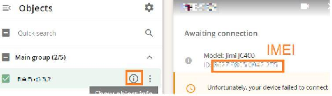
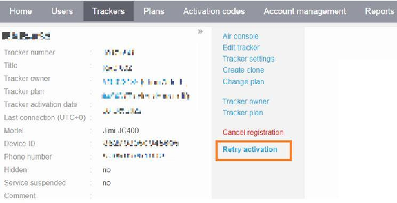

# Jimi JC400 troubleshooting

Navixy has prepared a step-by-step instruction to troubleshoot the JC400 issues regarding live streaming, registration, and incorrect functioning on the Navixy platform. Proceed with all the steps without skipping anything below:

1. Check the correctness of entered IMEI



2. Check the SIM card connectivity. It should have an option to receive an SMS, have GPRS/LTE traffic service available, and be covered by a GSM service provider with an acceptable speed in the current location of a device. RTMP traffic should be available too. Note that SMS service isn't likely to be available on M2M SIM cards.
3. Check the firmware version manually or by using the next command:

```
VERSION
```

To be able to provide live streaming it should have a version

- \[VERSION]KMC28_JC400_WABA_STD_V4.3.2_220328.1750,\[BUILD]2022-03-28 14:50 - for JC400 (JC400A)

If it is a JC400D device

- \[VERSION]JC400D_WAVA_DMS_V4.2.13_210716.2013_BUILD_2021-07-16

If the current version is older than supported, follow the next steps:

- [Download](https://drive.google.com/file/d/1Y56Tk5Xv3KGh-7J6XPdzs6tQUKqEglca/view?usp=sharing) and copy the update.zip to the device’s SD card (don't unpack it).
- Insert the SD card into the device and start it
- The device updates the firmware automatically

4. After the update, set the device with UTC+0 time zone and APN with server settings. You can do it by using the following commands which can be sent via SMS or through the

[AirConsole](https://app.gitbook.com/s/KdgeXg71LpaDrwexQYwp/devices/air-console), the latter is for already registered devices that are online.

Send the commands one by one and substitute {apn}, {apn_user}, {apn_pass} with your SIM-card provider APN settings using no braces.

For EU:

```
COREKITSW,0#

SERVER,0,52.57.1.136,47755#

APN,{apn},{apn},,,,,,{apn_user},,{apn_pass},,,,#
```

For the United States, Latin America:

```
COREKITSW,0#

SERVER,0,13.52.37.2,47755#

APN,{apn},{apn},,,,,,{apn_user},,{apn_pass},,,,#
```

In case the {apn_user} and {apn_pass} fields should be blank according to information from your SIM-card provider, leave the fields empty, e.g:

```
APN,{apn},{apn},,,,,,,,,,,,#
```

5. Regarding the offline status issues, check if the device is switched on and has a sufficient battery charge
6. When your device is online, click to **Retry activation** to automatically provide all necessary settings



If you have some issues with command sending, or sending of default commands is disabled in your **Admin Panel** settings, send the next commands one by one to set up your device and overwrite the settings, in case of failed delivery or device handling failure (note the EU/US different sets of commands and choose the relevant one according to your platform account region). Substitute the {IMEI} with your device IMEI without braces.

For EU:

```
COREKITSW,0

UPLOAD,http://52.57.1.136:7514/upload/{IMEI}

FILELIST,http://52.57.1.136:7514/filelist/{IMEI}

RSERVICE,rtmp.navixy.com:1935/encoder

TIMER,ON,60

ANGLEREP,ON,10

SOSALM,ON,0

UPLOADSW,SOS,ON

UPLOADSW,CRASH,ON

UPLOADSW,RAPIDACC,ON

UPLOADSW,RAPIDDEC,ON

UPLOADSW,RAPIDTURN,ON

SERVER,0,52.57.1.136,47755#
```

For the United States, Latin America:

```
COREKITSW,0

UPLOAD,http://13.52.37.2:7514/upload/{IMEI}

FILELIST,http://13.52.37.2:7514/filelist/{IMEI}

RSERVICE,rtmp.navixy.com:1935/encoder

TIMER,ON,60

ANGLEREP,ON,10

SOSALM,ON,0

UPLOADSW,SOS,ON

UPLOADSW,CRASH,ON

UPLOADSW,RAPIDACC,ON

UPLOADSW,RAPIDDEC,ON

UPLOADSW,RAPIDTURN,ON

SERVER,0,13.52.37.2,47755#
```
