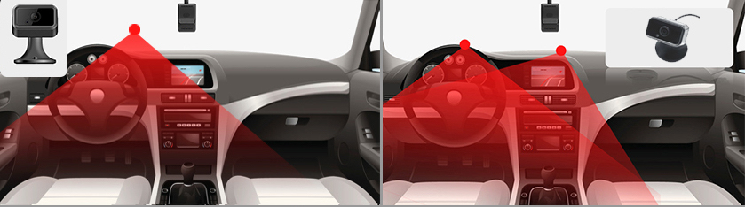

# Dash cam installation

Thanks to improvements in technology and an increasing demand for high-quality video of the road, dash cams have become increasingly popular in the last few years. Both individuals and businesses stand to benefit from having recordings at their disposal, so it’s vital to understand how to take advantage of this innovative technology.

To learn more about installation, powering a dash cam, and how to connect additional sensors, take a look at this guide from Navixy. After hearing about the basics, equipping a fleet with advanced driver and road monitoring will be a streamlined process.

## Placing and mounting

First, address where to place the dash cam. Most often, managers will choose to mount the device on the windshield since this generally allows for recording both the driver and the road ahead. In addition to the windshield, it’s also possible to secure cameras to the dashboard, hence the name. In most cases, adhesive tape will secure the device in place, although some manufacturers may instead use suction cups or another method. Just be sure to clean the surface before mounting to ensure it adheres properly.

It’s also crucial to choose a spot that won’t impair the driver’s view of the road. If the dash cam is obstructive, the person behind the wheel won’t just be putting themselves at risk of a collision, but also those around them. Moreover, a driver could face a traffic citation depending on local laws and regulations. If unsure what restrictions are in place, check with the division of motor vehicles for the applicable city, state, province, or precinct.

One final item to keep in mind when installing a dash cam is the risk of theft. Unfortunately, cargo, vehicle, and asset theft remains one of the most pressing concerns for the logistics industry in many countries. However, there are certain measures in place to prevent thieves, including lock-and-key designs to access the SD cards. And if a dash cam is removed or cut off from power, it will relay a message to the fleet manager to alert them of the problem.

## Connecting to the power supply

Once the dash cam has been mounted, it’s time to connect it to power. In most instances, this requires locating the vehicle’s fuse box, removing the cover, and plugging the camera into the proper terminal with ACC wire. This method has the added advantage of powering the camera even when the truck, van, bus, or car is turned off. Other devices, however, may plug into the OBDII input, so be sure to read the installation instructions thoroughly before proceeding.

## Installation: DIY or professional

Whether you’re handy with technology or prefer to place your trust in the hands of a professional, there are options when it comes to who installs the dash cam. Most providers will include a set of detailed instructions to follow, as well as online tutorials to reference in case people get stuck. As long as the responsible individual feels comfortable working with a vehicle’s fuse box, then setting up a dash cam without professional assistance shouldn’t be too challenging.

After locating the fuse box, it might be necessary to pull back the panel with a trim removal tool. Next, find a fuse slot that’s of the proper size and voltage for the device. This should be listed in the installation guide.

Along with connecting a wire to the ignition-based fuse to turn on the camera when the vehicle is turned on, it’s necessary to connect to a constant fuse for continuous power when the car is off, in addition to ground wire to prevent electric shocks.

Generally, it can take anywhere from 15 minutes to an hour to complete the aforementioned installation steps from start to finish. The specific timeframe will depend on the person’s experience with vehicle electronics, how many cameras need to be set up, and how many auxiliary accessories are utilized.

## Customization

Although dashcams primarily record and store video, they’re capable of even more when integrated with additional devices such as GPS trackers and sensors, as well as innovative tech like AI-enhanced ADAS (Advanced Driver Assist System). With so many options available, fleet managers will need to take the time to determine what sorts of functions are most crucial for their business to avoid either missing out on key features or overcomplicating their setup.

First, if the dash cam is compatible with ADAS technology, it will be required to calibrate these features for accuracy and performance. If this step is ignored, the system may emit alerts when no hazard is present or worse, fail to recognize and warn a driver of a dangerous scenario.

In order for these safety features to function properly, the camera must be positioned at the angle specified by the instructions. Once this is complete, check that any additional sensors are connected to the corresponding port in the fuse box.\
When it’s time to calibrate, consult the instructions once again. Jimi IoT’s JC400 dash cam, for example, has a QR code that will download a calibration tool on a mobile device. This should allow the installer to confirm that all ADAS-related functions are working properly.

Finally, businesses hoping to benefit from ancillary capabilities like engine cutoff, SOS buttons, fuel sensors, and more can proceed to install these devices according to the included instructions. Though some may need to be connected to the fuse box, others can simply be plugged into the dash cam itself. Along with detailed directions, the installation guide should also provide a wiring diagram or schematics to reference.

Ultimately, the best guide to installing a dash cam is the set of instructions provided by the manufacturer. However, this outline of the process, materials, and skills should give fleet managers a good understanding of what’s necessary.

For questions regarding mobile resource management, don’t hesitate to contact Navixy for assistance.
