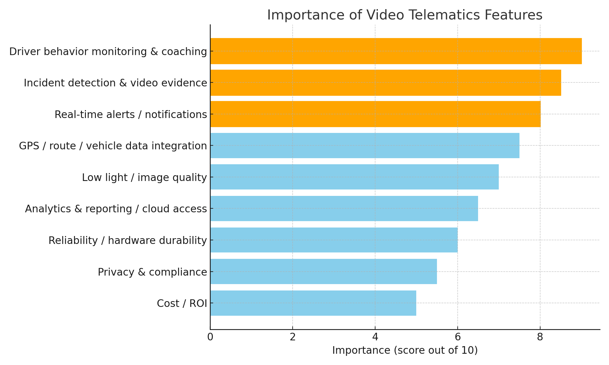

# Turning Feedback Into Benchmarks: Ranking Fleet Camera Priorities

Fleet managers today face mounting pressure to cut costs, improve safety, and keep operations running smoothly. Traditional GPS tracking tells you where your vehicles are, but it doesn’t explain how your drivers are behaving—or why accidents happen. That’s where video telematics is changing the game.

The numbers speak for themselves. Based on [Cambridge Mobile Telematic (CMT)](https://www.cmtelematics.com/research/new-research-from-cambridge-mobile-telematics-connects-telematics-program-engagement-to-crash-reductions/?utm_source=chatgpt.com) studies, fleets that adopt video telematics have seen accidents reduced by up to 60% and accident-related costs cut by over 80%. Insurance carriers reward this lower risk: many fleets report 15–60% savings on premiums, with nearly half achieving full ROI in less than a year. Driver performance also improves quickly—studies show distracted driving behaviors like mobile phone use can drop by 61% and food-and-drink distractions by 86% once video monitoring and coaching are in place.

With proven results in safety, cost savings, and operational visibility, video telematics isn’t just a nice-to-have technology—it’s becoming an essential tool for building safer, more efficient fleets.&#x20;

Identifying the most important features for fleet management is not a simple task, since requirements often vary by region, operating environment, and business context. To bring clarity, eleven recent online sources such as Nationwide, British Safety Council, BSJ technology, among others were reviewed —including industry blogs, solution providers, and case studies—that explored what fleet managers value most in video telematics cameras. From each source, features were highlighted and how prominently they were discussed. Features consistently described as core benefits, such as driver monitoring and incident detection, were assigned higher scores (9–10), while those mentioned less frequently or only in passing, such as cost or compliance, were given lower scores (5–6). The values were then normalized on a scale from 0 (non-essential) to 10 (critical) to create a comparative ranking. Scores were adjusted to fall roughly between 5 and 10, since even lower-priority features still come up, meaning they are not zero importance. This provides a synthesized view of recurring priorities emphasized across industry discussions, ensuring that even lower-ranked features retain weight given their continued relevance.

| Feature                                | Importance (score out of 10) |
| -------------------------------------- | ---------------------------- |
| Driver behavior monitoring & coaching  | 9.0                          |
| Incident detection & video evidence    | 8.5                          |
| Real-time alerts / notifications       | 8.0                          |
| GPS / route / vehicle data integration | 7.5                          |
| Low light / image quality              | 7.0                          |
| Analytics & reporting / cloud access   | 6.5                          |
| Reliability / hardware durability      | 6.0                          |
| Privacy & compliance                   | 5.5                          |
| Cost / ROI                             | 5.0                          |

<figure><figcaption></figcaption></figure>

As the results show, driver monitoring, incident detection, and real-time alerts rank as the three most critical factors for fleet managers. These three features are closely interconnected and play a critical role in meeting today’s fleet management needs—not only for documenting incidents but also for managing driver performance. When a camera falls short on any of these three characteristics, the result is often a surge in false alerts.

If a device fails to correctly capture and classify an event—whether due to hardware or software limitations—false alerts can directly undermine business operations. According to Lytx, 47% of alerts are false negatives, while Samsara estimates that nearly 20% of a fleet manager’s time is spent validating false alerts. This creates operational inefficiency and unreliable trust in the system. The implications extend beyond operations. Studies show that over 50% of drivers involved in crash litigation are exonerated. However, if a system generates false alerts, opposing lawyers could argue that the telematics data is unreliable, potentially weakening a company’s defense.

Fleet managers rely on accurate alerts to assess driver performance. Typically, drivers who trigger multiple alerts are sent for coaching sessions. But when those alerts are false positives, the ROI is severely impacted. The estimated cost of pulling a driver from the field for unnecessary training ranges between $16–$25 per hour. Across an entire fleet, this can result in $5,000–$10,000 of avoidable expenses—all due to inaccurate alerts.\
Interestingly, cloud services are not at the top of fleet managers’ needs. Cloud platforms often add extra costs, connectivity requirements, and technical barriers that not all companies are ready to adopt. Still, global adoption of connected dashcams is expected to grow by 15% between 2025 and 2033, reflecting a clear trend toward increased connectivity.&#x20;

Perhaps surprisingly, camera cost is rarely the main concern in telematics projects. Instead, the focus is on reliability and performance. A dependable in-vehicle camera can reduce accidents by up to 60%, lower insurance premiums by 15–30%, save fleets between $150,000 and $300,000 per year\
With these savings, the return on investment (ROI) of a reliable camera is typically achieved within 6 to 12 months. For this reason, camera cost often becomes secondary when compared to the efficiency and field performance that high-quality devices deliver. The camera performance will affect in the long term rather than the cost itself.&#x20;

For fleet managers, the true value of video telematics lies not in the promise of features, but in their proven accuracy and reliability in real-world conditions. These features are not just software-driven—they rely heavily on the hardware quality of the device, which ultimately determines how actionable the data and events will be.

A well-structured benchmarking process goes further: it measures critical factors such as driver monitoring accuracy, real-time alert responsiveness, resolution, frame rate, low-light sensitivity, compression efficiency and dynamic range. By testing against real operational environments, decision-makers gain a clear understanding of how a device will actually perform, ensuring results that go beyond marketing promises and truly support safer, more efficient fleet operations.

 
