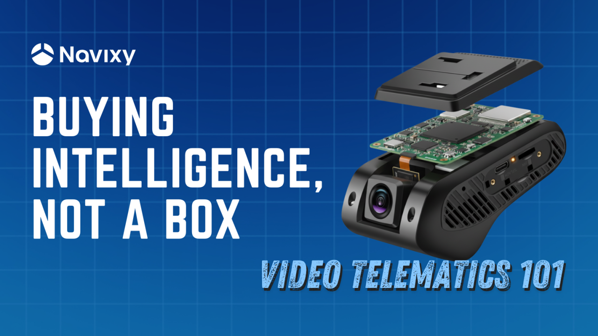

# Inside the dashcam: What really powers video telematics

<figure><figcaption></figcaption></figure>

Imagine you’re comparing two dashcams for your fleet. Both advertise similar video resolution (say 1080p) and storage capacity, yet one costs $100 and the other $200. At first glance they look alike – same size, same basic features – so why the big price gap? The answer lies in the _intelligence_ inside the device, specifically the **System-on-Chip (SoC)** that acts as the camera’s brain. The more expensive camera isn’t just a better box – it’s a smarter box, packed with on-board processing and AI capabilities. In modern fleet cameras, it’s the SoC and its software that make all the difference in performance, not just the lens or memory card.

Fleet managers and telematics professionals often focus on specs like resolution or storage, but what really separates a basic dashcam from a smart video telematics camera is the SoC. This tiny processor (and its supporting components) handles everything from capturing clear images to analyzing driving events in real time. In fact, roughly 65% of a typical telematics camera’s electronics are dedicated to image capture, processing, and AI – all tasks handled by the SoC. By contrast, only about 25% of the hardware is for communications modules (like LTE modems and GPS). This is why the choice of SoC has such a huge impact on both performance _and_ cost of the device. A high-end processor enables advanced features like driver assistance alerts, but it also raises the price due to greater complexity and licensing fees (for things like H.265/HEVC video compression).

To put it simply: not all fleet cameras are created equal, even if they look similar on the outside. Differences in internal design – the SoC, image sensor, modem, memory, etc. – directly affect the camera’s image quality, responsiveness, AI capabilities, network performance, and overall reliability. A lower-cost camera might do the basics (recording video and uploading it), but a higher-end model with a more powerful SoC can do a lot more: think real-time driver monitoring, lane departure warnings, forward collision alerts, and other ADAS features. A device-agnostic platform like Navixy lets mixed vendors and SoC families live in one environment, normalizing video and metadata so ops teams pick the right hardware for each route or role without locking into a single roadmap.

#### Inside a smart dashcam: How video gets from lens to cloud 

To appreciate the role of the SoC (the camera’s “brain”), it helps to know how a fleet camera processes video step by step. From the moment light hits the camera’s sensor to the moment an alert shows up on your dashboard, a lot happens behind the scenes. Below is a simplified walk-through of the video processing pipeline inside a typical telematics camera – and most of these steps are orchestrated by the SoC:

<figure><figcaption>
From CMOS capture to cloud dashboards, each stage shapes how video becomes actionable fleet insight
</figcaption></figure>

1. **Image Capture and Signal Processing (ISP).** It all begins with the camera’s image sensor (usually a CMOS sensor) capturing light and converting it into raw pixel data. This raw feed is immediately handed off to the SoC’s Image Signal Processor (ISP), a specialized component on the chip that cleans up and optimizes the image. The ISP performs critical processing tasks like debayering (converting the sensor’s raw mosaic of color data into full RGB video frames), adjusting white balance and exposure, correcting colors, and reducing noise. It may also do things like high-dynamic-range (HDR) merging to handle difficult lighting. The output of this stage is a stream of high-quality, uncompressed video frames – the foundation for everything that comes next.
2. **AI preprocessing and analysis.** In a smart camera, before the video is even compressed or saved, the SoC might run it through an AI analysis stage. This is handled by dedicated hardware on the SoC, such as a _DSP_ or an _NPU (Neural Processing Unit)_ designed for AI tasks. Here the camera can start being _smart_: it looks for events or objects of interest in the video in real time. For example, the AI might detect a forward collision warning, notice if the driver is drowsy or distracted, or recognize a stop sign or a pedestrian. The system could also do region-of-interest (ROI) extraction – essentially focusing on the important parts of the scene (like the road ahead or the driver’s face) – to optimize what needs to be transmitted or saved. It may tag frames with metadata (e.g. “vehicle detected” or “driver yawning”) so that later on, specific events are easy to find. This AI preprocessing is especially important because raw video data is huge; analyzing it at the source helps prioritize and reduce the data before the next steps. (On a basic camera with a weak SoC, this step might be very limited or skipped entirely – the device would just capture and send video without “understanding” it.)
3. **Video compression (Encoding).** Next, the prepared video frames go to the _video encoder_, another engine inside the SoC. Here, the camera compresses the video using standard codecs – most commonly H.264 (AVC) or the newer H.265 (HEVC). Raw video is extremely data-heavy (uncompressed HD video can be tens of megabytes _per second_), so compression is critical. The encoder shrinks the video into a manageable stream of data (often a few hundred kilobytes per second, depending on quality and resolution). Many fleet cameras actually produce dual video streams: one high-quality stream stored locally (for example, on an SD card) and a lower-bitrate stream for uploading over cellular networks. The SoC’s hardware encoder handles both simultaneously. For instance, a Novatek SoC’s video engine might save a full-resolution feed to the memory card while also sending a compressed feed to the cloud in real time. All of this happens on-the-fly thanks to the SoC. (It’s worth noting that licensing for advanced codecs like H.265 can add to the cost of high-end SoCs, which is one reason premium cameras support HEVC while cheaper ones might stick to older codecs.)
4. **Storage and transmission.** Once encoded, the video data is either stored, transmitted, or both. In a typical fleet camera, the SoC will manage saving video to local storage (like an SD card or eMMC flash memory) in a rolling buffer. It continuously overwrites the oldest footage so that, say, the last 30-60 minutes are always saved – ensuring recent events are on hand. When a significant event is detected (hard brake, crash, AI-triggered alert, etc.), the system can flag and preserve that clip. Many systems also buffer a few seconds of video before and after an event trigger to give context leading up to the incident. At the same time, the SoC passes the encoded video stream to the camera’s communication module (e.g. an LTE modem) for upload. Alongside the video, the device will send metadata like GPS coordinates, speed, G-sensor data, and any AI-generated event tags. This metadata can be embedded in the video stream or sent in parallel, providing rich context (e.g. the exact location of a harsh braking event, the speed at the time, or the fact that “driver is yawning” was detected). The cellular modem (4G/3G, etc.) then transmits the data to the cloud. While the modem and antenna are separate components, the SoC coordinates with them to efficiently send the data over the air (often using protocols to handle intermittent connectivity, limited bandwidth, etc.).
5. **Cloud and server processing.** Once the video and data reach the cloud, the heavy lifting moves server-side. In Navixy, footage is transcoded for reliable playback, indexed by event tags, and shown on a unified timeline alongside GPS/IMU. When cameras forward auxiliary data — CAN frames, BLE sensor packets, or RS-485 bytes — IoT Logic decodes those on ingest, so ADAS/DMS alerts, driver behavior, and engine or cargo signals all stay queryable together. The result is less time stitching systems and more time acting on what matters.

In this whole pipeline, the SoC is the star of the show for steps 1 through 4. It’s coordinating the sensor, running the ISP, executing AI algorithms, encoding the video, and managing data flow to storage and modem. Little wonder that the majority of a dashcam’s design (and cost) is centered on these processing tasks. Meanwhile, other components like the LTE/GPS module, while important, play a supporting role.

If we think of a telematics camera as a mini-computer: the SoC is the CPU/GPU/NPU that does the heavy computation, the image sensor is like the eyes, the modem is the communication link, and storage is the memory. A balanced system is important, but without a capable SoC “brain,” even the best sensor or modem won’t make a smart camera.

#### Basic vs. Advanced cameras: How SoC choice shapes features 

Now that we’ve seen what happens inside a camera, let’s talk about the differences between a basic fleet camera and an advanced one. In many cases, the _biggest_ difference is how powerful the SoC is, especially in terms of AI capability. A simpler (and cheaper) dashcam might perform all the same basic pipeline steps – capture, encode, store, transmit – but it might not have the on-board smarts to do Step 2 (AI analysis) in any meaningful way. It essentially acts as an electronic eye, recording what it sees and sending it along, but leaving the “thinking” to either the cloud or to not being done at all. In contrast, a high-end camera with a beefy SoC will do a lot of “thinking” on the device: it can detect events, filter footage, and even make real-time decisions (like alerting the driver) without waiting for the cloud.

Consider **ADAS and DMS features**. ADAS (Advanced Driver Assistance Systems) functions include things like lane departure warnings, forward collision alerts, or pedestrian detection. DMS (Driver Monitoring System) features include detecting if the driver is distracted or drowsy. A budget-friendly camera might advertise “ADAS-capable” but in reality it could be very limited – perhaps only able to handle one simple algorithm at modest accuracy (for example, a lane departure warning that works only at highway speeds and in clear daylight). This is often because the SoC inside has a very modest AI processor, if any. As noted earlier, lower-cost SoCs with basic NPUs can only run **lightweight neural network models** (on the order of a few million parameters) in real time. That might be enough for simple pattern recognition (like detecting a lane marking or a vehicle directly ahead). But it _won’t_ be enough for more complex tasks like simultaneously tracking multiple objects, identifying driver face landmarks (eyes closed, head turned), and recognizing traffic signs – those require larger, more complex AI models.

<figure><figcaption>
Single SoC ingests main + aux feeds, runs per-channel AI, encodes in parallel
</figcaption></figure>

High-end SoCs, on the other hand, come with much more potent AI engines. For example, Ambarella (a leading SoC provider in this space) includes their CVflow® neural network accelerator on their chips, which can run larger CNNs (tens of millions of parameters) and even multiple AI models at once. In practical terms, this means a single premium dashcam can do multi-task AI: analyze the road for ADAS _and_ watch the driver for DMS simultaneously, with accuracy, at high frame rates. The camera can issue real-time alerts (buzzers or spoken warnings for the driver) for a variety of safety issues. It also means fewer false alarms or missed events, because the models can be more sophisticated. Of course, all this requires more processing power, which is why high-end SoCs often use more advanced chip technology (for instance, 10nm semiconductor fabrication, as opposed to older 28nm or 14nm processes) to deliver high performance without overheating or draining the vehicle’s battery.

Another aspect to consider is how many video channels the SoC can handle. Fleet setups sometimes use dual-facing cameras (road and driver), or even multi-camera systems (side, rear views, etc.). An entry-level SoC might only handle one or two video streams at full resolution. Try to add more cameras or higher resolution, and it could choke (low frame rates, or it simply doesn’t support additional inputs). A more capable SoC can ingest and process multiple feeds. For example, some SoCs targeted at mobile DVRs can take four 1080p camera inputs (common for 360° vehicle coverage), whereas an automotive ADAS-focused SoC might support a combination of, say, a 4K front camera plus a 1080p driver camera, or even multiple high-res cameras for surround view. Again, these differences come down to internal design: the high-end chip will have a more advanced ISP that can handle higher data rates and maybe even a second ISP for dual-camera input, more encoder instances, and so on.

That’s also why many fleets standardize on a single pane of glass in the cloud: Navixy keeps AI tags, video, and telematics aligned regardless of which SoC is in the vehicle. In summary, the SoC choice directly dictates what features a camera can offer:

* A basic SoC = basic camera. It will reliably record video, compress it, and send it, but any “smarts” are minimal. You might get simple G-sensor-based event tagging (e.g. detect a crash via an accelerometer) or very rudimentary driver alerts, but not much in terms of real advanced warning or analysis.
* An advanced SoC = smart camera. It can serve as an on-board co-pilot, watching both the road and the driver. It filters important footage (so your cellular plan isn’t overwhelmed by trivial clips), and it provides richer data to the fleet management platform (like identifying specific behaviors or risks). This camera essentially has an integrated computer vision system.

The trade-off, of course, is cost. The high-end camera with the AI powerhouse chip will cost more – not only because the silicon itself is pricier, but also due to the development of the AI software that runs on it. Meanwhile, the simpler camera might be very affordable but could end up _costing_ more in indirect ways – perhaps it misses critical events or doesn’t provide the preventative warnings that could avoid an accident. The key is finding the right match between your operational needs and the camera’s capabilities.

Whichever tier you deploy, outcomes stay consistent when the back end is device-agnostic. Navixy shows basic MDVRs and premium ADAS/DMS cameras side-by-side in the same dashboards, reports, and APIs — so upgrades don’t force workflow changes.

#### Under the hood: Comparing two SoC examples (Budget vs. Premium) 

To make this all more concrete, let’s compare two real-world SoC platforms often found in dashcams and fleet cameras. On the budget side, we have the **Novatek NT98321**, a chip commonly used in cost-effective mobile DVRs and dashcams. On the high-end side, there’s the **Ambarella CV2**, part of Ambarella’s CVflow series, used in premium automotive cameras. These two are good representatives of their tiers: Novatek is known for affordable, high-volume processors (many off-the-shelf dashcams use Novatek SoCs), while Ambarella is renowned for higher-end, AI-centric chips used in advanced driver-assist cameras and even autonomous vehicle systems.

* **Novatek NT98321** is optimized for multi-channel Full HD recording at low cost. It can handle multiple 1080p video streams (for example, a 4-camera setup at 1080p each) and perform basic AI tasks with its built-in NPU. This is ideal for a standard fleet DVR that maybe records the front, sides, and interior, and does basic event detections like forward collision warnings or driver drowsiness alerts on one or two of the channels. It’s designed to be power-efficient for mobile use and to keep the overall device bill-of-materials low.
* **Ambarella CV2**, on the other hand, is a more powerful beast. Fabricated on a 10 nm process technology, it integrates Ambarella’s specialized CVflow AI engine, giving it vastly more AI processing headroom (on the order of 20× the neural network performance of Ambarella’s previous generation). It supports higher resolution input (up to 4K at 60 fps), multiple imagers (it can take feeds from several cameras, including stereoscopic setups), and can run advanced multi-model neural networks for features like lane detection, object recognition, and driver monitoring all at once.

This makes it ideal for **ADAS-centric cameras** – for instance, an intelligent front camera that not only records in ultra-clear 4K but also identifies lane departures, measures headway distance to the vehicle in front, reads speed limit signs, and monitors if the driver’s eyes are on the road. The trade-off is higher cost: the CV2 sits in a premium price tier (analysts note that these high-end AI chips command significantly higher prices than mainstream SoCs). But with that cost comes a significant leap in capability.

For a side-by-side comparison, see the table below, which highlights some key differences between a Novatek NT98321-based solution and an Ambarella CV2-based solution:

<figure><figcaption>
Comparing a cost-focused SoC vs. a high-performance SoC
</figcaption></figure>

_Table: Comparing a cost-focused SoC (Novatek NT98321) vs. a high-performance SoC (Ambarella CV2) in video telematics cameras. The Ambarella excels in AI and 4K capabilities, whereas the Novatek prioritizes multiple 1080p channels at low cost. Features and data summarized from manufacturer information and device teardowns._

As the table illustrates, an Ambarella CV2 offers far more headroom than a Novatek NT98321 – but not every truck needs the same tier. Many fleets pair an affordable NT98321-based MDVR for coverage with a CV2-based front unit for coaching and prevention. With Navixy as the device-agnostic back end, you don’t have to make a one-SoC decision for the entire fleet; you standardize on the platform and let the use case dictate the camera.

When proactive safety is the priority – fatigue detection, lane/forward collision warnings, or plate-level detail – a CV2-class unit shines and Navixy carries its richer events into the same workflows you use for the rest of the fleet.

#### Making the right choice for your fleet 

When choosing a video telematics camera, it’s tempting to compare obvious specs like megapixels, field of view, storage size, etc. Those are certainly important, but as we’ve discussed, the less-obvious specs – the **SoC and its capabilities** – are what truly differentiate a “smart” camera from a basic one. Here are some key considerations and takeaways for fleet managers and telematics solution providers:

* **Match the camera’s intelligence to your needs.** If you simply need reliable video recording (for evidence after incidents) and maybe automatic uploads of harsh braking events, a mid-range or basic camera may suffice. But if you want preventative safety features (lane departure warnings, driver state monitoring, collision avoidance alerts), look for cameras with an AI-capable SoC that explicitly supports ADAS and DMS features. The extra upfront cost can pay off in avoided accidents and improved driver behavior. Remember, that extra intelligence isn’t from the camera’s housing or sensor – it’s from the processor and software inside.
* **Don’t rely only on resolution.** A 1080p or 4K label doesn’t tell the whole story. A lower-end camera might have the same sensor resolution as a higher-end one, but the image processing quality could differ. High-end SoCs have more advanced ISPs, meaning sharper images, better low-light performance, and more accurate color and exposure. That can be crucial for getting usable footage (e.g. capturing plate numbers at night). So, consider the image processor – not just the image sensor – especially if video evidence quality is important for you.
* **Consider multi-channel, expansion – and platform headroom.** Choose a device-agnostic back end (e.g., Navixy) that supports both MDVR-class and ADAS/DMS-class cameras, so adding driver-facing views or moving to higher resolutions doesn’t force a platform switch.
* **Check for stated AI features and updates.** Manufacturers will often list ADAS features (lane departure, forward collision warning, etc.) if the camera supports them. Be aware, however, that there’s a difference between basic implementations and advanced ones. Try to find out _how_ the camera achieves those features. Does it have a dedicated AI chip (NPU)? How “smart” is it claimed to be? Also, consider if the device supports firmware updates for its AI models – a good platform might improve over time with software, whereas a really low-end one may never get updates or new features.
* **Plan for auxiliary data (beyond video).** If cameras forward CAN, BLE, or RS-485 sensor data, use a platform with cloud-side decoding such as Navixy IoT Logic. It keeps AI tags and sensor state aligned, enabling policies on combinations (e.g., drowsiness + speeding or over-temp + harsh cornering).
* **Balance budget vs. benefit.** Ultimately, it comes down to ROI. A camera with a cutting-edge SoC will cost more, but if it prevents a major accident or provides clear evidence that saves an insurance claim, it can easily pay for itself. On the other hand, if your fleet operations are relatively low-risk and you mainly want cameras for documentation, you might opt for the simpler solution and save budget. The key is to understand what you are paying for – you’re _“buying intelligence, not a box.”_ The box by itself doesn’t do much; it’s the intelligence (the SoC and the integrated software) that delivers the value.

The world of video telematics proves the rule: you get what you pay for. Outward specs rarely reveal how much the SoC (the silicon brain) actually enables. Look past pixels and storage, and you’ll see why choosing the right chip matters.

From basic eyewitness units to advanced ADAS cameras, the real test is how they perform together. A mixed-camera pilot on a device-agnostic back end like Navixy shows the difference instantly – coaching, claims, and bandwidth managed in one place without vendor lock-in.

In today’s market, the intelligence inside the camera is what drives safety and ROI. The smartest fleets buy the brains, not just the box.
