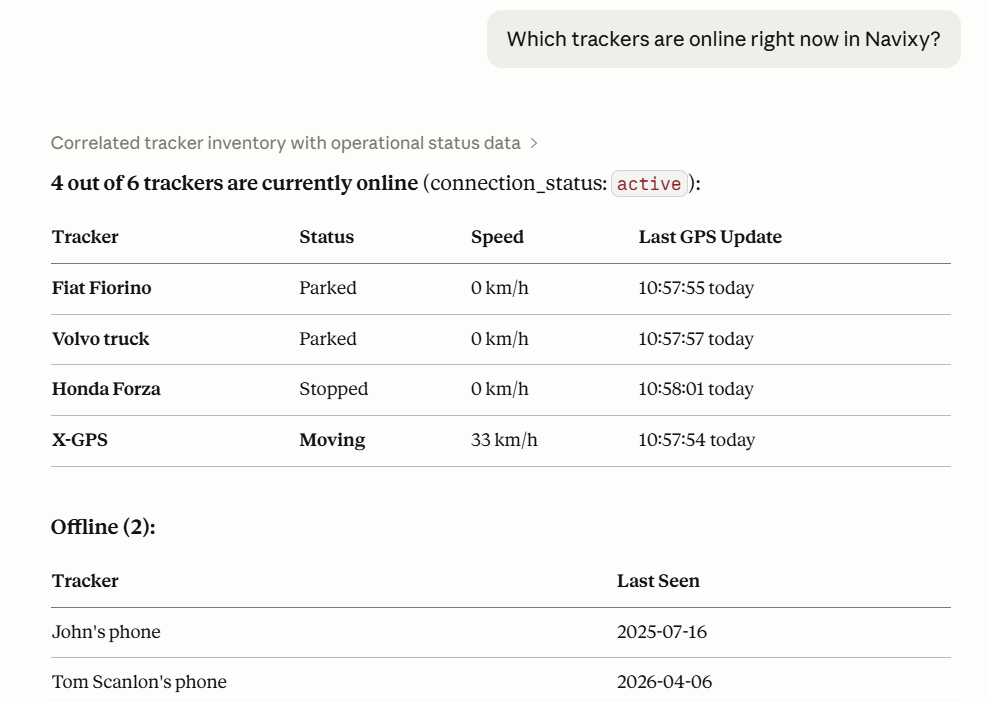

# Overview

Navixy MCP Server connects your AI client to your Navixy account. Once connected, you can ask questions about your fleet or your business in plain language and get live answers pulled directly from your data, without opening Navixy or switching between tools.

Depending on which endpoint you connect, you can ask questions like:

* "Which vehicles haven't reported in the last two hours?"
* "Show me the route Truck 12 took yesterday afternoon."
* "What are the sensor readings for Vehicle 7 right now?"
* "List all users with a negative balance."
* "Which tariff plan has the most active devices?"

Your AI client looks up the answer from your Navixy account on the spot.

<figure><figcaption>
Navixy MCP in Claude Desktop
</figcaption></figure>

## How MCP works

AI clients are powerful, but they can't see your data. By default, if you ask Claude or any other AI about your fleet, it doesn't know your vehicles exist.

Navixy MCP Server changes that. It gives your AI client a direct, secure connection to your Navixy account. Once connected, your tool can look up live fleet data on your behalf, just as Navixy AI Assistant does from the website or the platform.

[MCP (Model Context Protocol)](https://modelcontextprotocol.io/) is the open standard that makes this possible. It's supported by Claude Desktop, Cursor, and a growing number of other AI tools. You don't need to understand the protocol to use it.

## Navixy AI tools

<table><thead><tr><th width="176.20001220703125">Tool</th><th width="341">What it does</th><th>Setup required</th></tr></thead><tbody><tr><td><a href="navixy-ai-assistant.md">Navixy AI Assistant</a></td><td>Chat interface built into Navixy. Ask questions about the platform or your account without leaving the interface.</td><td>None</td></tr><tr><td><a href="https://app.gitbook.com/s/gh5cGQ23uFYTcp7Fj7Yd/navixy-mcp-server">Navixy MCP Server</a></td><td>Connects Claude Desktop, Cursor, or another AI client to your live Navixy account data.</td><td>Connect your MCP client to the Navixy MCP Server endpoint</td></tr><tr><td><a href="./#navixy-documentation-mcp">Navixy Documentation MCP Server</a></td><td>Gives your AI client access to the full Navixy documentation so it can find answers across any page on demand.</td><td>Connect your AI client to the documentation MCP endpoint</td></tr></tbody></table>

You can use all three at the same time. They are independent and complement each other.

## Navixy AI Assistant

[Navixy AI Assistant](navixy-ai-assistant.md) is a chat interface built into the Navixy platform. It answers questions about platform features, device specifications, and your live account data in the same conversation. No setup is required.

You can also use it without signing in at [assistant.navixy.com](https://assistant.navixy.com).

## Navixy MCP

**Navixy MCP Server** connects your own AI client to Navixy. Once connected, your AI client can access your live account data, including tracker states, sensor readings, vehicle lists, and billing information, without you switching to the Navixy interface.

Two endpoints are available:

* [User MCP](navixy-mcp-server/navixy-user-mcp.md): For [Navixy platform](https://app.gitbook.com/s/446mKak1zDrGv70ahuYZ/) users. Covers devices, vehicles, groups, tags, track history, sensor readings, IoT Logic flows, and geocoding.
* [Admin Panel MCP](navixy-mcp-server/navixy-panel-mcp.md): For telematics providers managing a dealer account. Connects to [Navixy Admin Panel](https://app.gitbook.com/s/KdgeXg71LpaDrwexQYwp/) and covers users, trackers, tariff plans, and billing data.

## Navixy Documentation MCP

[Navixy Documentation MCP](using-navixy-documentation-with-ai.md) gives your AI client access to the full Navixy documentation. It can search and retrieve any page on demand, which is useful when you are working across multiple API references or integration guides in a single session. No authentication is required.

## How to choose the right AI tool

Select the tool that matches your workflow:

<table><thead><tr><th width="500.39996337890625">If you want to...</th><th>Use this tool</th></tr></thead><tbody><tr><td>Ask questions about Navixy without any setup</td><td>Navixy AI Assistant</td></tr><tr><td>Check your fleet or account data from inside Navixy</td><td>Navixy AI Assistant</td></tr><tr><td>Use the AI client you already work in every day</td><td>Navixy MCP Server</td></tr><tr><td>Access fleet data without opening Navixy</td><td>Navixy MCP Server</td></tr><tr><td>Give your AI client access to Navixy documentation</td><td>Navixy Documentation MCP</td></tr></tbody></table>

